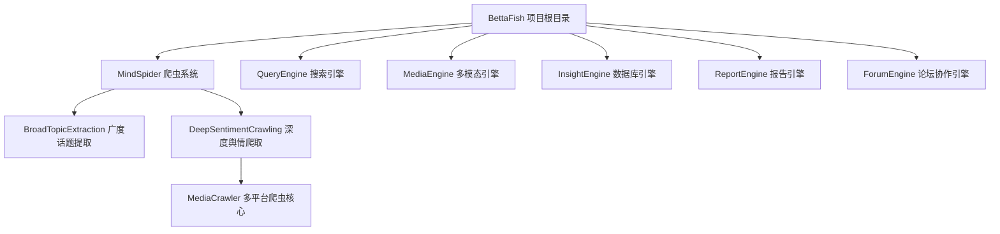
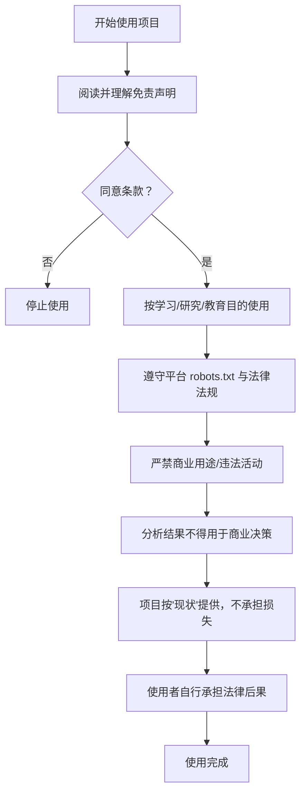
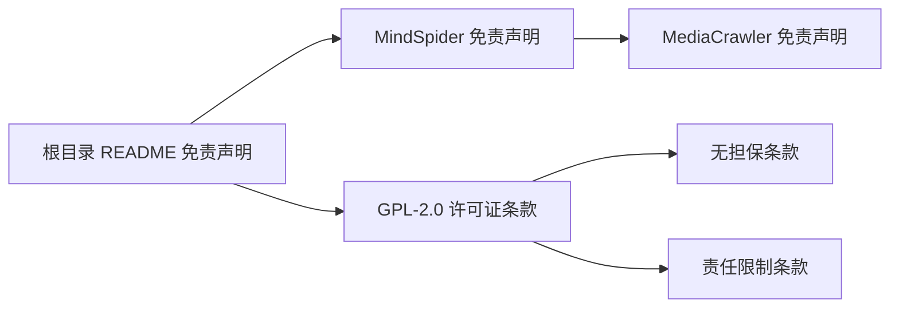

# 免责声明

<cite>
**本文引用的文件**
- [README.md](file://README.md)
- [MindSpider/README.md](file://MindSpider/README.md)
- [MindSpider/DeepSentimentCrawling/MediaCrawler/README.md](file://MindSpider/DeepSentimentCrawling/MediaCrawler/README.md)
- [LICENSE](file://LICENSE)
</cite>

## 目录
1. [引言](#引言)
2. [项目结构](#项目结构)
3. [核心组件](#核心组件)
4. [架构总览](#架构总览)
5. [详细组件分析](#详细组件分析)
6. [依赖分析](#依赖分析)
7. [性能考虑](#性能考虑)
8. [故障排查指南](#故障排查指南)
9. [结论](#结论)
10. [附录](#附录)

## 引言
本文件为“BettaFish”项目的免责声明文档，旨在明确项目使用范围、合规要求与责任边界，帮助使用者在充分理解条款的基础上合理、合法地使用本项目。根据项目文档与相关文件，本项目仅供学习、学术研究和教育目的使用，严禁用于任何商业用途或违法活动。项目包含爬虫功能，使用者必须遵守目标网站的 robots.txt 协议与法律法规；数据分析结果仅供学术研究使用，严禁用于商业决策；项目按“现状”提供，作者不承担任何损失；使用者须自行承担因使用本项目而产生的全部法律后果。使用即表示同意并接受上述所有条款。

## 项目结构
- 项目主体位于根目录，包含多个引擎模块（QueryEngine、MediaEngine、InsightEngine、ReportEngine、ForumEngine、MindSpider 等），以及爬虫系统 MindSpider 及其子模块 MediaCrawler。
- MindSpider 为舆情分析专用爬虫系统，包含“广度话题提取”和“深度舆情爬取”两大模块，覆盖多平台社交媒体内容采集。
- 项目在根目录 README 中明确列出“免责声明”章节，涵盖合规性声明、爬虫免责、数据使用免责、技术免责与责任限制等要点。

图表来源
- [README.md](file://README.md#L120-L200)
- [MindSpider/README.md](file://MindSpider/README.md#L1-L120)

章节来源
- [README.md](file://README.md#L120-L200)
- [MindSpider/README.md](file://MindSpider/README.md#L1-L120)

## 核心组件
- MindSpider 爬虫系统：包含“广度话题提取”和“深度舆情爬取”两大模块，支持多平台社交媒体内容采集，强调“仅供学习研究使用”“遵守平台使用规则”“遵守法律法规”等原则。
- MediaCrawler（MindSpider 子模块）：明确声明“仅供学习目的使用”“禁止商业用途”“不得用于大规模爬取或其他非法行为”，并提供详细免责声明。
- 项目根目录 README 的“免责声明”章节：明确“仅供学习、学术研究和教育目的使用”“严禁商业用途或违法活动”“爬虫功能免责”“数据使用免责”“技术免责”“责任限制”等。

章节来源
- [MindSpider/README.md](file://MindSpider/README.md#L1-L60)
- [MindSpider/README.md](file://MindSpider/README.md#L460-L470)
- [MindSpider/DeepSentimentCrawling/MediaCrawler/README.md](file://MindSpider/DeepSentimentCrawling/MediaCrawler/README.md#L34-L42)
- [MindSpider/DeepSentimentCrawling/MediaCrawler/README.md](file://MindSpider/DeepSentimentCrawling/MediaCrawler/README.md#L322-L343)
- [README.md](file://README.md#L716-L747)

## 架构总览
本项目在“免责声明”层面形成统一约束：所有模块（尤其是 MindSpider/MediaCrawler 爬虫模块）均需遵守“学习/研究/教育目的”“不得商业/违法”“遵守平台协议与法律法规”“分析结果不得用于商业决策”“按现状提供、不承担损失”“使用者自行承担法律后果”等原则。

图表来源
- [README.md](file://README.md#L716-L747)
- [MindSpider/README.md](file://MindSpider/README.md#L460-L470)
- [MindSpider/DeepSentimentCrawling/MediaCrawler/README.md](file://MindSpider/DeepSentimentCrawling/MediaCrawler/README.md#L34-L42)

## 详细组件分析

### MindSpider 爬虫系统免责声明要点
- 使用目的限制：仅供学习研究使用，不得用于商业或非法目的。
- 平台合规：必须遵守目标平台的使用条款与 robots.txt 协议。
- 法律责任：因使用爬虫功能产生的任何法律后果由使用者自行承担。
- 数据使用：分析结果仅供学术研究，严禁用于商业决策或盈利目的。

章节来源
- [MindSpider/README.md](file://MindSpider/README.md#L1-L60)
- [MindSpider/README.md](file://MindSpider/README.md#L460-L470)

### MediaCrawler（MindSpider 子模块）免责声明要点
- 项目性质：技术研究与学习工具，专注自媒体平台数据爬取技术研究。
- 法律合规：严格遵守中国相关法律法规，用户自行承担使用本项目引发的法律责任。
- 使用限制：严禁用于非法目的或非学习、非研究的商业行为；不得侵犯他人知识产权或其他合法权益。
- 免责声明：开发者已尽最大努力确保项目合法性与安全性，但不对使用本项目可能引起的直接或间接损失承担责任。
- 知识产权与解释权：项目知识产权归开发者所有；最终解释权归开发者所有。

章节来源
- [MindSpider/DeepSentimentCrawling/MediaCrawler/README.md](file://MindSpider/DeepSentimentCrawling/MediaCrawler/README.md#L34-L42)
- [MindSpider/DeepSentimentCrawling/MediaCrawler/README.md](file://MindSpider/DeepSentimentCrawling/MediaCrawler/README.md#L322-L343)

### 项目根目录 README 的免责声明要点
- 使用目的：仅供学习、学术研究和教育目的使用，严禁商业用途或违法活动。
- 爬虫功能免责：爬虫功能仅用于技术学习和研究目的；使用者必须遵守目标网站 robots.txt 协议和使用条款；必须遵守相关法律法规，不得进行恶意爬取或数据滥用；因使用爬虫功能产生的任何法律后果由使用者自行承担。
- 数据使用免责：数据分析功能仅供学术研究使用；严禁将分析结果用于商业决策或盈利目的；使用者应确保所分析数据的合法性和合规性。
- 技术免责：项目按“现状”提供，不提供任何明示或暗示的保证；作者不对使用本项目造成的任何直接或间接损失承担责任；使用者应自行评估项目的适用性和风险。
- 责任限制：使用者在使用本项目前应充分了解相关法律法规；使用者应确保其使用行为符合当地法律法规要求；因违反法律法规使用本项目而产生的任何后果由使用者自行承担。
- 使用即表示同意：请在使用本项目前仔细阅读并理解上述免责声明；使用本项目即表示您已同意并接受上述所有条款。

章节来源
- [README.md](file://README.md#L716-L747)

### 许可证与免责声明的关系
- 项目采用 GPL-2.0 许可证，其中包含“无担保”“损害赔偿限制”等条款，与免责声明中的“技术免责”“责任限制”相呼应。
- 许可证第 11 条强调“程序按现状提供，不提供任何担保”，第 12 条规定“在任何情况下，除非法律另有规定或双方另有书面约定，版权人不对使用程序造成的损害承担责任”。

章节来源
- [LICENSE](file://LICENSE#L258-L279)

## 依赖分析
- MindSpider 与 MediaCrawler 的免责声明共同构成项目爬虫功能的法律与合规边界，确保使用者在学习与研究范围内使用，避免商业与违法风险。
- 项目根目录 README 的免责声明对所有模块形成统一约束，与 MindSpider/MediaCrawler 的免责声明在“学习/研究/教育目的”“不得商业/违法”“遵守平台协议与法律法规”“分析结果不得用于商业决策”“按现状提供、不承担损失”“使用者自行承担法律后果”等方面保持一致。

图表来源
- [README.md](file://README.md#L716-L747)
- [MindSpider/README.md](file://MindSpider/README.md#L1-L60)
- [MindSpider/DeepSentimentCrawling/MediaCrawler/README.md](file://MindSpider/DeepSentimentCrawling/MediaCrawler/README.md#L322-L343)
- [LICENSE](file://LICENSE#L258-L279)

## 性能考虑
- 本文件为免责声明文档，不涉及具体性能指标或优化建议。请在遵守免责声明的前提下，结合自身需求合理使用项目功能。

## 故障排查指南
- 若在使用 MindSpider/MediaCrawler 时遇到登录失败、平台限制等问题，请首先确认是否遵守平台使用规则与 robots.txt 协议；若仍存在问题，建议在测试模式下小规模验证，或调整爬取参数与代理策略。
- 若对免责声明条款存在疑问，建议在使用前再次阅读根目录 README 的“免责声明”章节与 MindSpider/MediaCrawler 的免责声明文档。

章节来源
- [MindSpider/README.md](file://MindSpider/README.md#L350-L370)
- [MindSpider/README.md](file://MindSpider/README.md#L460-L470)
- [README.md](file://README.md#L716-L747)

## 结论
- BettaFish 项目及其子模块（MindSpider、MediaCrawler）在“学习/研究/教育目的”“不得商业/违法”“遵守平台协议与法律法规”“分析结果不得用于商业决策”“按现状提供、不承担损失”“使用者自行承担法律后果”等方面形成统一的免责声明约束。
- 使用者在使用前应充分阅读并理解上述条款，使用即表示同意并接受所有条款。

## 附录
- 重要提示：请在使用本项目前务必阅读并理解免责声明全文，使用即表示同意并接受上述所有条款。