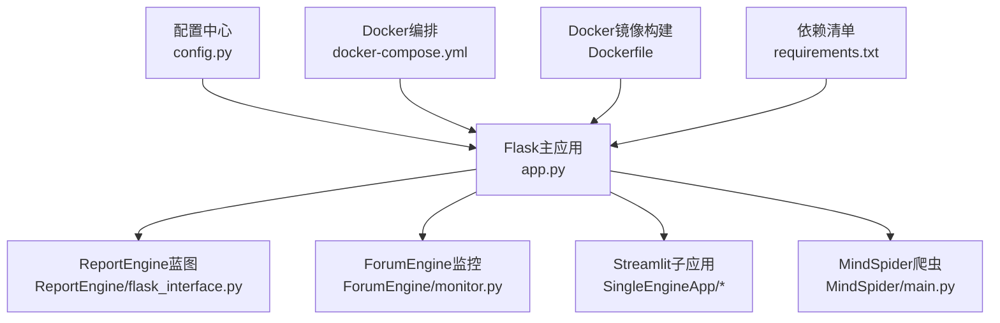
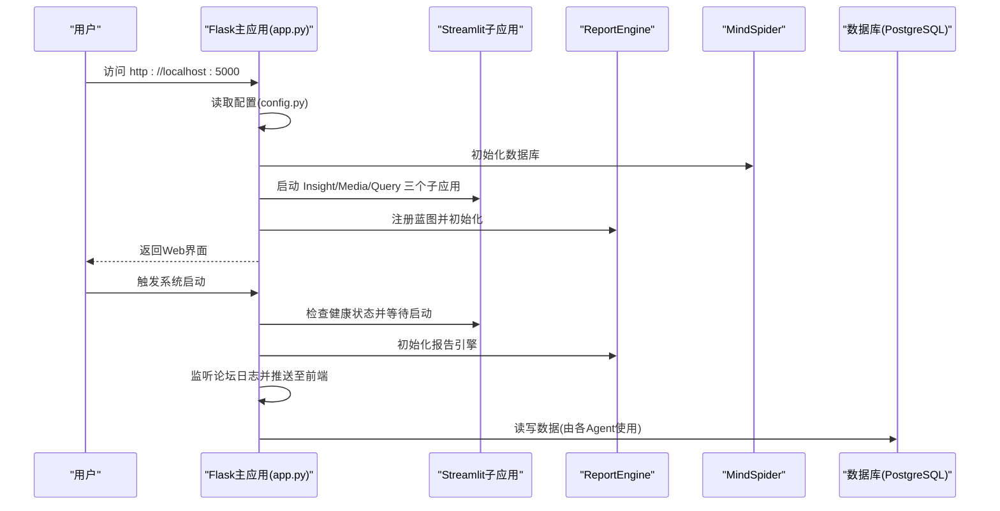
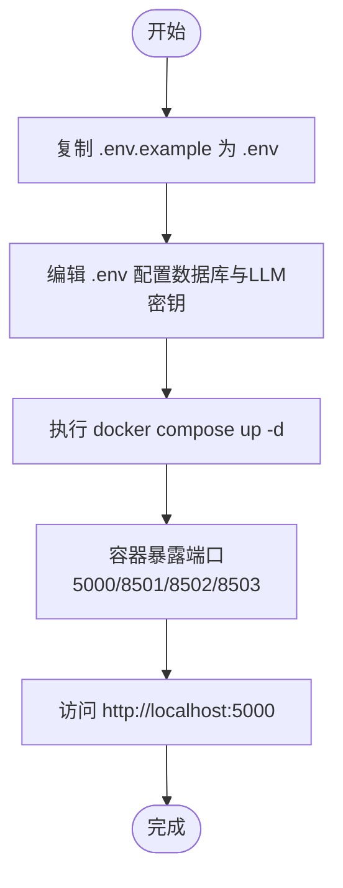
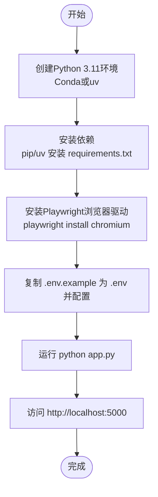

# 快速开始

<cite>
**本文引用的文件**
- [README.md](file://README.md)
- [app.py](file://app.py)
- [config.py](file://config.py)
- [docker-compose.yml](file://docker-compose.yml)
- [Dockerfile](file://Dockerfile)
- [requirements.txt](file://requirements.txt)
- [MindSpider/README.md](file://MindSpider/README.md)
</cite>

## 目录
1. [简介](#简介)
2. [项目结构](#项目结构)
3. [核心组件](#核心组件)
4. [架构总览](#架构总览)
5. [详细组件分析](#详细组件分析)
6. [依赖分析](#依赖分析)
7. [性能考虑](#性能考虑)
8. [故障排查指南](#故障排查指南)
9. [结论](#结论)
10. [附录](#附录)

## 简介
本指南旨在帮助新用户在最短时间内运行 BettaFish 系统。内容覆盖两种启动方式：
- Docker 启动：复制并配置 .env 示例文件，配置数据库与 LLM API 密钥，使用 docker compose 在后台启动全部服务。
- 源码启动：使用 Conda 或 uv 创建 Python 3.11 环境，安装依赖与 Playwright 浏览器驱动，配置 .env，运行主应用并通过 http://localhost:5000 访问。

同时提供常见问题的解决方案，如端口占用、依赖安装失败等。

## 项目结构
BettaFish 采用多智能体架构，包含多个引擎模块与爬虫系统，主应用通过 Flask + SocketIO 统一编排三个 Streamlit Agent 子应用，并提供 Web 界面与报告生成能力。

图表来源
- [app.py](file://app.py#L1-L120)
- [config.py](file://config.py#L1-L126)
- [docker-compose.yml](file://docker-compose.yml#L1-L40)
- [Dockerfile](file://Dockerfile#L1-L78)
- [requirements.txt](file://requirements.txt#L1-L87)

章节来源
- [README.md](file://README.md#L120-L200)
- [app.py](file://app.py#L1-L120)
- [config.py](file://config.py#L1-L126)

## 核心组件
- Flask 主应用：负责统一启动与编排三个 Streamlit Agent 子应用，提供 Web 界面与 SocketIO 实时通信。
- ReportEngine：报告生成与渲染，提供 Flask 蓝图接口。
- ForumEngine：论坛协作监控，记录 Agent 间的对话日志。
- MindSpider：社交媒体爬虫系统，负责热点话题提取与深度内容爬取。
- 配置中心：使用 Pydantic Settings 管理 .env 与环境变量，集中提供数据库与 LLM 参数。

章节来源
- [app.py](file://app.py#L1-L120)
- [config.py](file://config.py#L1-L126)
- [README.md](file://README.md#L200-L260)

## 架构总览
系统启动流程概览如下：

图表来源
- [app.py](file://app.py#L780-L860)
- [app.py](file://app.py#L1080-L1157)
- [config.py](file://config.py#L1-L126)
- [docker-compose.yml](file://docker-compose.yml#L1-L40)

章节来源
- [app.py](file://app.py#L780-L860)
- [app.py](file://app.py#L1080-L1157)
- [README.md](file://README.md#L296-L332)

## 详细组件分析

### Docker 启动步骤
- 复制 .env 示例文件并配置数据库与 LLM API 密钥
- 使用 docker compose 在后台启动所有服务
- 访问 http://localhost:5000

图表来源
- [README.md](file://README.md#L296-L332)
- [docker-compose.yml](file://docker-compose.yml#L1-L40)

章节来源
- [README.md](file://README.md#L296-L332)
- [docker-compose.yml](file://docker-compose.yml#L1-L40)

### 源码启动步骤
- 创建 Python 3.11 环境（Conda 或 uv）
- 安装依赖与 Playwright 浏览器驱动
- 配置 .env（数据库与 LLM API 密钥）
- 运行主应用并通过 http://localhost:5000 访问

图表来源
- [README.md](file://README.md#L333-L449)
- [requirements.txt](file://requirements.txt#L1-L87)
- [app.py](file://app.py#L1142-L1157)

章节来源
- [README.md](file://README.md#L333-L449)
- [requirements.txt](file://requirements.txt#L1-L87)
- [app.py](file://app.py#L1142-L1157)

### 配置 .env 与数据库
- 数据库配置（PostgreSQL/MySQL）：DB_HOST、DB_PORT、DB_USER、DB_PASSWORD、DB_NAME、DB_CHARSET、DB_DIALECT
- LLM 配置：Insight/Media/Query/Report/Forum Host 等各 Agent 的 API_KEY、BASE_URL、MODEL_NAME
- 其他网络工具：Tavily、Bocha 等 API 密钥

章节来源
- [README.md](file://README.md#L312-L422)
- [config.py](file://config.py#L1-L126)

### MindSpider 爬虫（可选）
- 独立使用 MindSpider 运行话题提取与深度爬取流程
- 首次使用需在各平台扫码登录
- 可通过命令行参数控制测试模式、平台与日期

章节来源
- [MindSpider/README.md](file://MindSpider/README.md#L286-L312)
- [MindSpider/README.md](file://MindSpider/README.md#L313-L349)

## 依赖分析
- 核心框架：Flask、Flask-SocketIO、Streamlit、Eventlet
- LLM 接口：OpenAI 兼容客户端
- 搜索与网络：Tavily、Bocha
- 数据处理：pandas、numpy、jieba
- 数据库：pymysql、aiomysql、aiosqlite、SQLAlchemy、asyncpg、cryptography
- 爬虫与可视化：Playwright、Pillow、opencv-python、beautifulsoup4、lxml、plotly、matplotlib、wordcloud
- PDF 导出：WeasyPrint
- 机器学习（可选）：torch、transformers、scikit-learn、xgboost
- 工具库：python-dotenv、python-dateutil、pytz、tqdm、tenacity、loguru、pydantic、pydantic-settings、json-repair
- Web 服务器：FastAPI、Uvicorn

章节来源
- [requirements.txt](file://requirements.txt#L1-L87)

## 性能考虑
- 使用 uv 进行依赖安装可显著提升速度
- Docker 镜像预装 Playwright 浏览器二进制，减少运行时下载时间
- 合理设置 LLM 请求超时与并发，避免阻塞
- PDF 导出依赖系统库，提前安装可避免运行时报错

[本节为通用建议，无需引用具体文件]

## 故障排查指南
- 端口占用
  - 现象：启动失败或端口冲突
  - 处理：确认 5000、8501、8502、8503 端口未被占用，必要时修改 docker-compose.yml 中的映射或宿主机端口
- 依赖安装失败
  - 现象：pip/uv 安装失败或 WeasyPrint 无法安装
  - 处理：参考 README 中“安装 PDF 导出所需系统依赖”的说明，确保系统依赖已安装后再尝试安装依赖
- LLM API 密钥无效
  - 现象：调用 LLM 失败
  - 处理：检查 .env 中各 Agent 的 API_KEY、BASE_URL、MODEL_NAME 是否正确
- 数据库连接失败
  - 现象：数据库无法连接
  - 处理：检查 .env 中 DB_HOST、DB_PORT、DB_USER、DB_PASSWORD、DB_NAME、DB_DIALECT 是否与实际一致
- Streamlit 子应用端口占用
  - 现象：Streamlit 应用启动异常或端口被占用
  - 处理：确认 8501/8502/8503 端口未被占用，或在 app.py 中调整端口配置
- Playwright 浏览器驱动问题
  - 现象：浏览器驱动安装失败
  - 处理：使用 playwright install chromium 重新安装，或参考 MindSpider 文档中的安装步骤

章节来源
- [README.md](file://README.md#L362-L449)
- [app.py](file://app.py#L608-L704)
- [docker-compose.yml](file://docker-compose.yml#L1-L40)

## 结论
通过本指南，您可以快速完成 BettaFish 的 Docker 或源码启动，并在本地访问 Web 界面进行多智能体分析与报告生成。遇到问题时，可依据故障排查指南逐项定位并解决。

[本节为总结性内容，无需引用具体文件]

## 附录
- Docker 镜像构建要点：预装系统依赖、使用 uv 安装 Python 依赖、预装 Playwright 浏览器二进制、暴露端口并默认运行 app.py
- 源码环境建议：Python 3.11、Conda 或 uv、安装 requirements.txt、安装 Playwright 浏览器驱动

章节来源
- [Dockerfile](file://Dockerfile#L1-L78)
- [requirements.txt](file://requirements.txt#L1-L87)