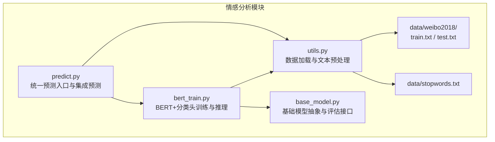
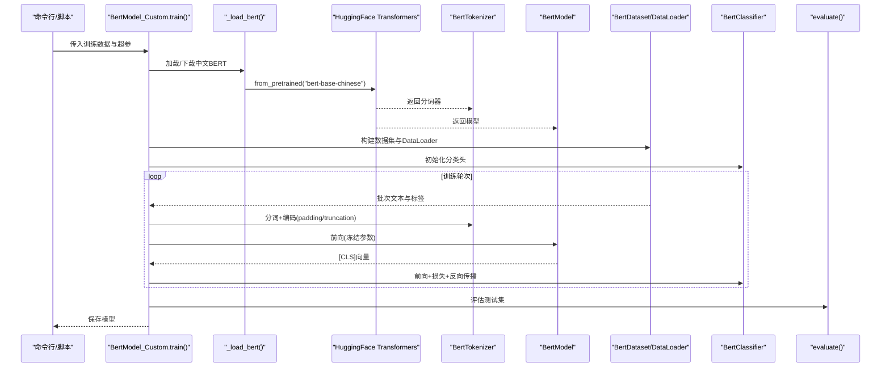
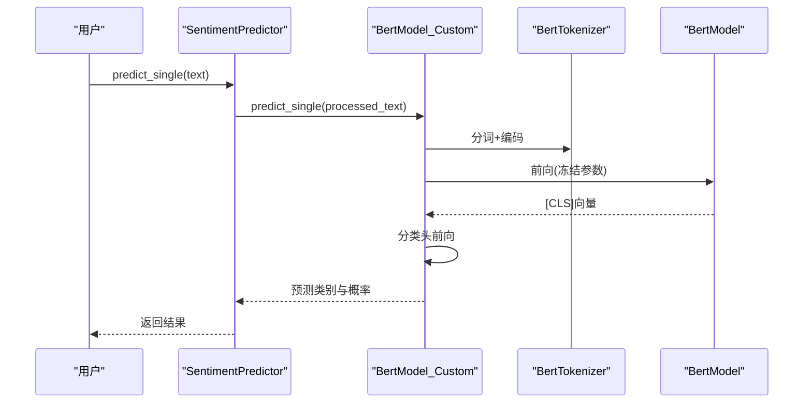
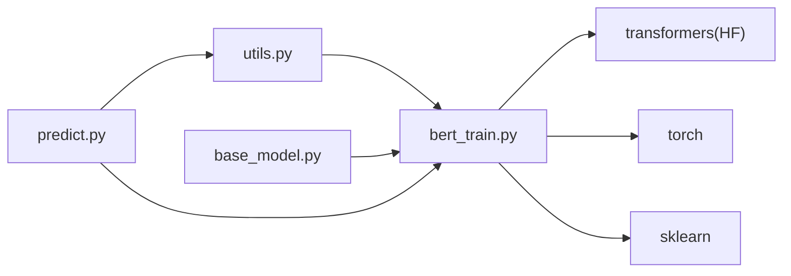

# BERT+分类头情感分析

<cite>
**本文引用的文件**
- [bert_train.py](file://SentimentAnalysisModel/WeiboSentiment_MachineLearning/bert_train.py)
- [predict.py](file://SentimentAnalysisModel/WeiboSentiment_MachineLearning/predict.py)
- [utils.py](file://SentimentAnalysisModel/WeiboSentiment_MachineLearning/utils.py)
- [base_model.py](file://SentimentAnalysisModel/WeiboSentiment_MachineLearning/base_model.py)
- [README.md](file://SentimentAnalysisModel/WeiboSentiment_MachineLearning/README.md)
- [requirements.txt](file://requirements.txt)
- [train.txt](file://SentimentAnalysisModel/WeiboSentiment_MachineLearning/data/weibo2018/train.txt)
- [test.txt](file://SentimentAnalysisModel/WeiboSentiment_MachineLearning/data/weibo2018/test.txt)
- [stopwords.txt](file://SentimentAnalysisModel/WeiboSentiment_MachineLearning/data/stopwords.txt)
</cite>

## 目录
1. [引言](#引言)
2. [项目结构](#项目结构)
3. [核心组件](#核心组件)
4. [架构总览](#架构总览)
5. [详细组件分析](#详细组件分析)
6. [依赖关系分析](#依赖关系分析)
7. [性能考量](#性能考量)
8. [故障排查指南](#故障排查指南)
9. [结论](#结论)
10. [附录](#附录)

## 引言
本技术文档围绕 BERT+分类头情感分析在仓库中的实现，系统阐述 bert_train.py 中预训练语言模型微调流程，包括中文 BERT（bert-base-chinese）的加载机制、分类头结构设计、训练参数配置（学习率、batch_size）、首次运行自动下载提示（约 400MB）、以及通过 predict.py 实现高效推理与集成预测。同时，结合 README 中的性能对比与资源占用说明，给出准确率与资源消耗之间的权衡建议，并提供模型部署优化思路（如量化压缩）。

## 项目结构
情感分析模块位于 SentimentAnalysisModel/WeiboSentiment_MachineLearning 目录，包含训练脚本、预测入口、通用工具与基础模型抽象。数据采用 weibo2018 格式，包含训练集与测试集，停用词表用于文本预处理。

图表来源
- [bert_train.py](file://SentimentAnalysisModel/WeiboSentiment_MachineLearning/bert_train.py#L1-L413)
- [predict.py](file://SentimentAnalysisModel/WeiboSentiment_MachineLearning/predict.py#L1-L310)
- [utils.py](file://SentimentAnalysisModel/WeiboSentiment_MachineLearning/utils.py#L1-L138)
- [base_model.py](file://SentimentAnalysisModel/WeiboSentiment_MachineLearning/base_model.py#L1-L120)

章节来源
- [README.md](file://SentimentAnalysisModel/WeiboSentiment_MachineLearning/README.md#L1-L108)

## 核心组件
- BertModel_Custom：封装 BERT 预训练模型加载、冻结参数、分类头构建、训练与推理逻辑。
- BertClassifier：线性分类器 + Sigmoid 输出，将 BERT 的 [CLS] 向量映射到情感概率。
- BertDataset：将文本与标签封装为 PyTorch Dataset。
- SentimentPredictor：统一预测入口，支持加载多种模型并进行单条/批量/集成预测。
- utils：提供数据加载（BERT格式）、文本清洗与分词、停用词加载等工具。
- BaseModel：统一的训练/评估/保存/加载接口，便于扩展其他模型。

章节来源
- [bert_train.py](file://SentimentAnalysisModel/WeiboSentiment_MachineLearning/bert_train.py#L1-L413)
- [predict.py](file://SentimentAnalysisModel/WeiboSentiment_MachineLearning/predict.py#L1-L310)
- [utils.py](file://SentimentAnalysisModel/WeiboSentiment_MachineLearning/utils.py#L1-L138)
- [base_model.py](file://SentimentAnalysisModel/WeiboSentiment_MachineLearning/base_model.py#L1-L120)

## 架构总览
BERT+分类头情感分析的训练与推理流程如下：

图表来源
- [bert_train.py](file://SentimentAnalysisModel/WeiboSentiment_MachineLearning/bert_train.py#L139-L217)
- [bert_train.py](file://SentimentAnalysisModel/WeiboSentiment_MachineLearning/bert_train.py#L221-L283)
- [base_model.py](file://SentimentAnalysisModel/WeiboSentiment_MachineLearning/base_model.py#L45-L68)

## 详细组件分析

### BERT 预训练模型加载机制
- 自动下载与本地缓存：首次运行若检测到模型目录为空，将自动从 Hugging Face 下载 bert-base-chinese 的分词器与模型权重，并保存到本地路径（默认 ./model/chinese_wwm_pytorch）。若下载失败，提供手动下载指引。
- 在线回退：本地加载失败时，尝试直接从在线源加载，仍失败则抛出异常。
- 参数冻结：加载完成后冻结 BERT 参数，仅训练分类头，降低显存与计算开销。

章节来源
- [bert_train.py](file://SentimentAnalysisModel/WeiboSentiment_MachineLearning/bert_train.py#L65-L138)

### 分类头结构设计
- 输入维度：固定为 768（中文 BERT 的隐藏维度）。
- 结构：线性层 + Sigmoid，输出为情感概率（正面/负面）。
- 设计动机：将 BERT 的语义表示映射到二分类任务，保持轻量与高效。

章节来源
- [bert_train.py](file://SentimentAnalysisModel/WeiboSentiment_MachineLearning/bert_train.py#L40-L52)

### 训练参数配置
- 关键超参（可通过关键字传入）：
  - learning_rate：学习率，默认 1e-3
  - num_epochs：训练轮数，默认 10
  - batch_size：批次大小，默认 100
  - input_size：分类头输入维度，默认 768
  - decay_rate：指数学习率衰减系数，默认 0.9
- 数据加载：使用 BertDataset + DataLoader，支持 padding 与截断（最大长度 512），返回 input_ids 与 attention_mask。
- 损失函数与优化器：二元交叉熵损失 + Adam 优化器 + 指数学习率调度器。
- 训练细节：BERT 固定参数，仅训练分类头；每 10 步打印平均损失；可选保存每个 epoch 的分类头权重。

章节来源
- [bert_train.py](file://SentimentAnalysisModel/WeiboSentiment_MachineLearning/bert_train.py#L139-L217)

### 首次运行自动下载（约 400MB）
- README 明确提示：BERT 首次运行会自动下载中文预训练模型（约 400MB），请确保网络可用或提前手动下载至本地路径。
- 若网络受限，可参考脚本中的手动下载指引，将模型文件放置到指定目录后继续使用。

章节来源
- [README.md](file://SentimentAnalysisModel/WeiboSentiment_MachineLearning/README.md#L102-L108)
- [bert_train.py](file://SentimentAnalysisModel/WeiboSentiment_MachineLearning/bert_train.py#L65-L98)

### 推理与预测流程（predict.py）
- 统一预测器：SentimentPredictor 支持加载多种模型（含 BERT），并提供单条/批量/集成预测。
- BERT 推理：内部复用 BertModel_Custom 的 predict/predict_single，使用本地/在线 BERT 模型，分批推理，输出类别与置信度。
- 集成预测：对多模型输出进行加权融合，提升稳定性与鲁棒性。

图表来源
- [predict.py](file://SentimentAnalysisModel/WeiboSentiment_MachineLearning/predict.py#L88-L151)
- [bert_train.py](file://SentimentAnalysisModel/WeiboSentiment_MachineLearning/bert_train.py#L221-L283)

章节来源
- [predict.py](file://SentimentAnalysisModel/WeiboSentiment_MachineLearning/predict.py#L1-L310)
- [bert_train.py](file://SentimentAnalysisModel/WeiboSentiment_MachineLearning/bert_train.py#L221-L283)

### 数据与预处理
- 数据格式：weibo2018 的 train.txt/test.txt 采用“ID,标签,正文”的 CSV 风格，标签为 0/1。
- 加载函数：load_corpus_bert 读取数据并对正文进行清洗与预处理（去除特定模式、@用户名、话题等），保留中文字符，便于 BERT 直接处理。
- 停用词：从 stopwords.txt 加载停用词列表，用于后续文本处理（当前 BERT 流程主要依赖分词器）。

章节来源
- [utils.py](file://SentimentAnalysisModel/WeiboSentiment_MachineLearning/utils.py#L20-L78)
- [train.txt](file://SentimentAnalysisModel/WeiboSentiment_MachineLearning/data/weibo2018/train.txt#L1-L200)
- [test.txt](file://SentimentAnalysisModel/WeiboSentiment_MachineLearning/data/weibo2018/test.txt#L1-L200)
- [stopwords.txt](file://SentimentAnalysisModel/WeiboSentiment_MachineLearning/data/stopwords.txt#L1-L28)

### 评估与指标
- BaseModel 提供 evaluate 接口，基于测试集计算准确率与加权 F1 分数，并输出详细分类报告。
- README 中给出 BERT+分类头在该数据集上的性能参考（准确率、AUC 等），便于与其他模型横向对比。

章节来源
- [base_model.py](file://SentimentAnalysisModel/WeiboSentiment_MachineLearning/base_model.py#L45-L68)
- [README.md](file://SentimentAnalysisModel/WeiboSentiment_MachineLearning/README.md#L15-L24)

## 依赖关系分析
- 运行时依赖：torch、transformers、scikit-learn、pandas、numpy、jieba 等。
- 模块间耦合：
  - bert_train.py 依赖 utils（数据加载与预处理）、base_model（评估接口）。
  - predict.py 依赖 bert_train.py（BERT 模型类）与 utils（文本预处理）。
- 外部依赖：Hugging Face Transformers 提供中文 BERT 模型与分词器。

图表来源
- [bert_train.py](file://SentimentAnalysisModel/WeiboSentiment_MachineLearning/bert_train.py#L1-L40)
- [predict.py](file://SentimentAnalysisModel/WeiboSentiment_MachineLearning/predict.py#L1-L21)
- [requirements.txt](file://requirements.txt#L61-L66)

章节来源
- [requirements.txt](file://requirements.txt#L61-L66)

## 性能考量
- 准确率与资源消耗权衡：
  - README 明确指出内存需求排序：BERT > LSTM > XGBoost > SVM > 朴素贝叶斯。BERT 在该数据集上具备较强语义理解能力，准确率与 AUC 表现良好，但显存与计算成本较高。
  - 通过冻结 BERT 参数、仅训练分类头，显著降低训练阶段的显存占用与时间成本。
- 推理效率：
  - predict.py 支持批量推理（默认批大小 32），减少多次前向调用开销。
  - 集成预测可提升稳定性，但会增加推理时间。
- 部署优化建议（量化压缩）：
  - 动态/静态量化：将分类头权重进行 INT8 量化，可降低模型体积与推理延迟，需在验证集上评估精度损失。
  - TensorRT/ONNX Runtime：将推理图转换为高性能执行图，加速推理。
  - 混合精度推理：在 GPU 上启用 AMP（自动混合精度），在保证精度的前提下提升吞吐。
  - 模型蒸馏：以更大 BERT 为教师模型，蒸馏出更小的分类头或轻量替代模型，兼顾准确率与速度。

章节来源
- [README.md](file://SentimentAnalysisModel/WeiboSentiment_MachineLearning/README.md#L102-L108)
- [bert_train.py](file://SentimentAnalysisModel/WeiboSentiment_MachineLearning/bert_train.py#L139-L217)
- [predict.py](file://SentimentAnalysisModel/WeiboSentiment_MachineLearning/predict.py#L120-L151)

## 故障排查指南
- BERT 首次运行下载失败：
  - 现象：提示下载失败并给出手动下载指引。
  - 处理：访问 Hugging Face 官方页面或哈工大中文 BERT 资源，将模型文件解压到指定目录后重试。
- 本地加载失败回退到在线加载：
  - 现象：本地路径不可用时，尝试在线加载；若仍失败，抛出异常。
  - 处理：检查网络连通性或代理设置，或提前离线下载模型。
- 模型未训练即预测：
  - 现象：predict/predict_single 抛出未训练错误。
  - 处理：先调用 train 完成训练，或加载已保存的模型后再预测。
- 数据路径与停用词：
  - 现象：停用词文件不存在时，使用空列表并打印警告。
  - 处理：确保 data/stopwords.txt 存在，或忽略该功能。

章节来源
- [bert_train.py](file://SentimentAnalysisModel/WeiboSentiment_MachineLearning/bert_train.py#L65-L138)
- [bert_train.py](file://SentimentAnalysisModel/WeiboSentiment_MachineLearning/bert_train.py#L221-L283)
- [utils.py](file://SentimentAnalysisModel/WeiboSentiment_MachineLearning/utils.py#L9-L18)

## 结论
BERT+分类头情感分析在本项目中通过“冻结 BERT + 轻量分类头”的方式，实现了在中文微博数据集上的高效训练与推理。README 提供了与其他模型的性能对比与资源占用说明，便于在准确率与资源消耗之间做出权衡。predict.py 提供统一的预测入口与集成预测能力，便于快速上线与多模型对比。部署层面，建议结合量化、蒸馏与推理引擎优化，以获得更优的吞吐与延迟表现。

## 附录
- 常用命令示例（来自 README）：
  - 训练 BERT 模型：python bert_train.py --epochs 10 --batch_size 100 --learning_rate 1e-3
  - 交互式预测：python predict.py
  - 单模型/集成预测：python predict.py --model_type bert --text "..." 或 python predict.py --ensemble --text "..."

章节来源
- [README.md](file://SentimentAnalysisModel/WeiboSentiment_MachineLearning/README.md#L62-L84)