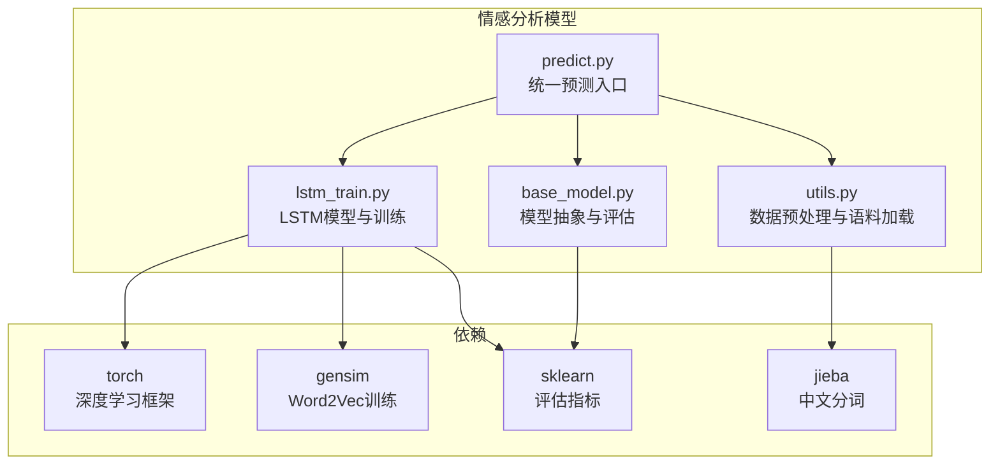
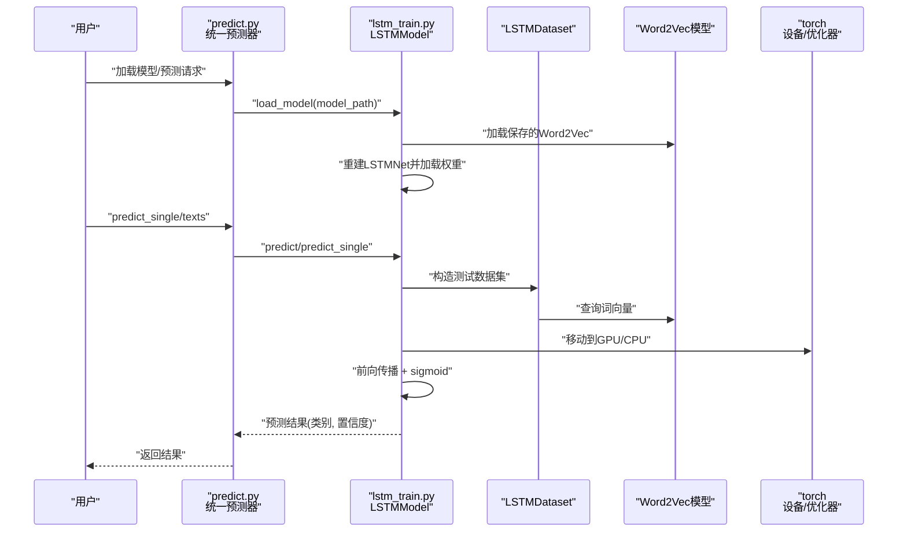
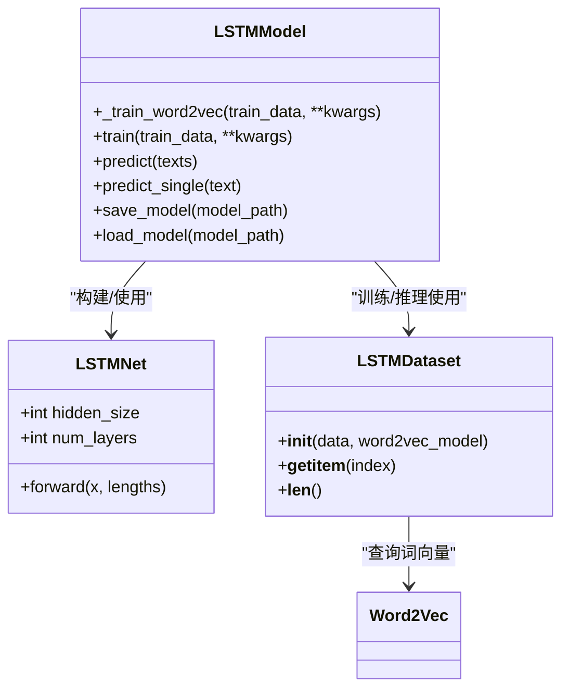
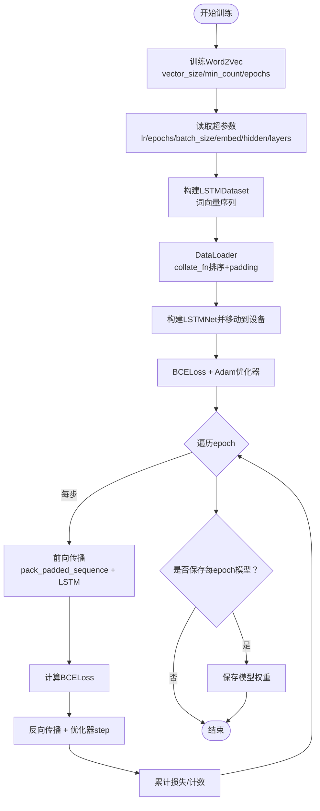
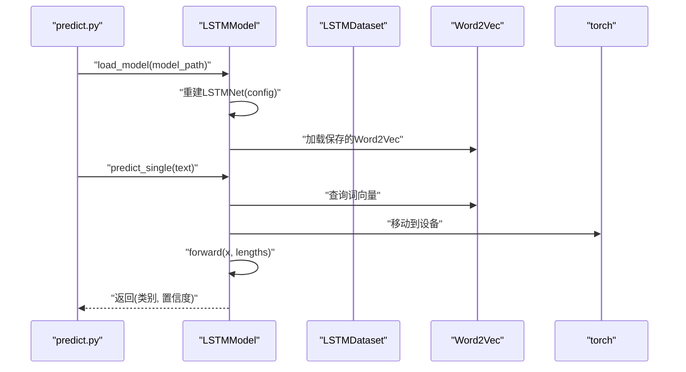
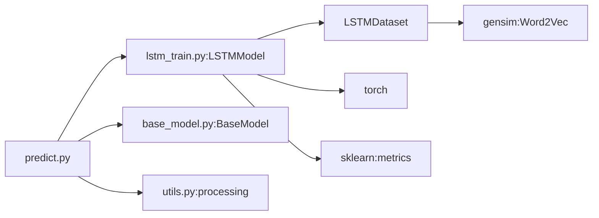

# LSTM情感分析

<cite>
**本文引用的文件**
- [SentimentAnalysisModel/WeiboSentiment_MachineLearning/lstm_train.py](file://SentimentAnalysisModel/WeiboSentiment_MachineLearning/lstm_train.py)
- [SentimentAnalysisModel/WeiboSentiment_MachineLearning/predict.py](file://SentimentAnalysisModel/WeiboSentiment_MachineLearning/predict.py)
- [SentimentAnalysisModel/WeiboSentiment_MachineLearning/base_model.py](file://SentimentAnalysisModel/WeiboSentiment_MachineLearning/base_model.py)
- [SentimentAnalysisModel/WeiboSentiment_MachineLearning/utils.py](file://SentimentAnalysisModel/WeiboSentiment_MachineLearning/utils.py)
- [requirements.txt](file://requirements.txt)
</cite>

## 目录
1. [简介](#简介)
2. [项目结构](#项目结构)
3. [核心组件](#核心组件)
4. [架构总览](#架构总览)
5. [详细组件分析](#详细组件分析)
6. [依赖关系分析](#依赖关系分析)
7. [性能与超参数](#性能与超参数)
8. [故障排查指南](#故障排查指南)
9. [结论](#结论)
10. [附录](#附录)

## 简介
本文件围绕仓库中的LSTM情感分析实现，系统性解析循环神经网络与Word2Vec词向量的结合方式，阐述序列建模原理、隐藏层设计（hidden_size）、训练超参数（epochs、batch_size）对模型性能的影响；说明模型如何捕捉上下文语义信息，并对比其与传统方法在长文本理解上的优势；提供GPU加速训练的配置建议；并完整解释predict.py中LSTM模型加载与推理流程。同时给出常见训练问题（如梯度消失）的排查方案。

## 项目结构
该情感分析模块位于“SentimentAnalysisModel/WeiboSentiment_MachineLearning”，核心文件包括：
- lstm_train.py：LSTM模型定义、训练、预测、保存/加载逻辑
- predict.py：统一预测入口，支持加载多种模型（含LSTM）
- base_model.py：统一的模型抽象与评估接口
- utils.py：数据预处理、停用词、语料加载等工具
- requirements.txt：依赖声明，包含torch、gensim、sklearn等

图表来源
- [SentimentAnalysisModel/WeiboSentiment_MachineLearning/lstm_train.py](file://SentimentAnalysisModel/WeiboSentiment_MachineLearning/lstm_train.py#L1-L352)
- [SentimentAnalysisModel/WeiboSentiment_MachineLearning/predict.py](file://SentimentAnalysisModel/WeiboSentiment_MachineLearning/predict.py#L1-L310)
- [SentimentAnalysisModel/WeiboSentiment_MachineLearning/base_model.py](file://SentimentAnalysisModel/WeiboSentiment_MachineLearning/base_model.py#L1-L120)
- [SentimentAnalysisModel/WeiboSentiment_MachineLearning/utils.py](file://SentimentAnalysisModel/WeiboSentiment_MachineLearning/utils.py#L1-L138)
- [requirements.txt](file://requirements.txt#L60-L67)

章节来源
- [SentimentAnalysisModel/WeiboSentiment_MachineLearning/lstm_train.py](file://SentimentAnalysisModel/WeiboSentiment_MachineLearning/lstm_train.py#L1-L352)
- [SentimentAnalysisModel/WeiboSentiment_MachineLearning/predict.py](file://SentimentAnalysisModel/WeiboSentiment_MachineLearning/predict.py#L1-L310)
- [SentimentAnalysisModel/WeiboSentiment_MachineLearning/base_model.py](file://SentimentAnalysisModel/WeiboSentiment_MachineLearning/base_model.py#L1-L120)
- [SentimentAnalysisModel/WeiboSentiment_MachineLearning/utils.py](file://SentimentAnalysisModel/WeiboSentiment_MachineLearning/utils.py#L1-L138)
- [requirements.txt](file://requirements.txt#L60-L67)

## 核心组件
- LSTM模型与数据集
  - LSTMNet：双向LSTM + 全连接层 + Sigmoid输出，使用pack_padded_sequence处理变长序列
  - LSTMDataset：将文本按空格切分为词，查表得到词向量，过滤无效样本
  - collate_fn：按长度降序排序、pad_sequence填充、返回长度列表
- 训练流程
  - Word2Vec训练：基于分词后的句子，支持vector_size、min_count、epochs等超参
  - 模型训练：BCELoss + Adam优化器，支持每epoch保存模型
- 推理流程
  - predict：批量推理，predict_single：单条推理，返回类别与置信度
  - save/load_model：保存/加载模型权重与Word2Vec模型
- 统一预测器
  - SentimentPredictor：集中加载/预测，支持单模型与集成预测

章节来源
- [SentimentAnalysisModel/WeiboSentiment_MachineLearning/lstm_train.py](file://SentimentAnalysisModel/WeiboSentiment_MachineLearning/lstm_train.py#L20-L278)
- [SentimentAnalysisModel/WeiboSentiment_MachineLearning/predict.py](file://SentimentAnalysisModel/WeiboSentiment_MachineLearning/predict.py#L22-L189)

## 架构总览
下图展示LSTM情感分析从数据到模型再到推理的整体流程。

图表来源
- [SentimentAnalysisModel/WeiboSentiment_MachineLearning/predict.py](file://SentimentAnalysisModel/WeiboSentiment_MachineLearning/predict.py#L35-L118)
- [SentimentAnalysisModel/WeiboSentiment_MachineLearning/lstm_train.py](file://SentimentAnalysisModel/WeiboSentiment_MachineLearning/lstm_train.py#L178-L278)

## 详细组件分析

### LSTM网络结构与序列建模
- 结构要点
  - 双向LSTM：拼接正反向最终隐藏状态，增强上下文建模能力
  - 全连接层 + Sigmoid：二分类输出，阈值0.5作为决策边界
  - 初始化隐藏/细胞状态：h0/c0全零初始化，维度与层数和双向性相关
- 序列建模原理
  - pack_padded_sequence：对变长序列进行打包，减少填充计算开销
  - pad_sequence：批内按最长序列填充，collate_fn返回真实长度
  - 输出来自最后时刻的双向隐藏状态拼接，体现全局上下文

图表来源
- [SentimentAnalysisModel/WeiboSentiment_MachineLearning/lstm_train.py](file://SentimentAnalysisModel/WeiboSentiment_MachineLearning/lstm_train.py#L55-L278)

章节来源
- [SentimentAnalysisModel/WeiboSentiment_MachineLearning/lstm_train.py](file://SentimentAnalysisModel/WeiboSentiment_MachineLearning/lstm_train.py#L55-L110)
- [SentimentAnalysisModel/WeiboSentiment_MachineLearning/lstm_train.py](file://SentimentAnalysisModel/WeiboSentiment_MachineLearning/lstm_train.py#L111-L176)
- [SentimentAnalysisModel/WeiboSentiment_MachineLearning/lstm_train.py](file://SentimentAnalysisModel/WeiboSentiment_MachineLearning/lstm_train.py#L178-L201)

### 训练流程与超参数
- Word2Vec训练
  - 输入：按空格分词的句子列表
  - 关键超参：vector_size（词向量维度）、min_count（最小词频）、epochs（训练轮数）
- LSTM训练
  - 超参：learning_rate、num_epochs、batch_size、embed_size、hidden_size、num_layers
  - 损失与优化：BCELoss + Adam
  - 设备：自动检测CUDA，优先使用GPU
  - 每epoch可选保存中间模型
- 数据处理
  - 训练/测试数据加载：统一接口，返回(文本, 标签)元组
  - 预处理：去噪、分词、否定词拼接、空格连接

图表来源
- [SentimentAnalysisModel/WeiboSentiment_MachineLearning/lstm_train.py](file://SentimentAnalysisModel/WeiboSentiment_MachineLearning/lstm_train.py#L90-L176)
- [SentimentAnalysisModel/WeiboSentiment_MachineLearning/lstm_train.py](file://SentimentAnalysisModel/WeiboSentiment_MachineLearning/lstm_train.py#L130-L176)
- [SentimentAnalysisModel/WeiboSentiment_MachineLearning/base_model.py](file://SentimentAnalysisModel/WeiboSentiment_MachineLearning/base_model.py#L110-L120)
- [SentimentAnalysisModel/WeiboSentiment_MachineLearning/utils.py](file://SentimentAnalysisModel/WeiboSentiment_MachineLearning/utils.py#L46-L65)

章节来源
- [SentimentAnalysisModel/WeiboSentiment_MachineLearning/lstm_train.py](file://SentimentAnalysisModel/WeiboSentiment_MachineLearning/lstm_train.py#L90-L176)
- [SentimentAnalysisModel/WeiboSentiment_MachineLearning/base_model.py](file://SentimentAnalysisModel/WeiboSentiment_MachineLearning/base_model.py#L110-L120)
- [SentimentAnalysisModel/WeiboSentiment_MachineLearning/utils.py](file://SentimentAnalysisModel/WeiboSentiment_MachineLearning/utils.py#L46-L65)

### 推理流程与模型持久化
- 加载模型
  - 从保存的字典中恢复Word2Vec与LSTM配置，重建网络并加载权重
- 单条/批量预测
  - 单条：将文本分词后查表得到词向量，添加batch维，传入模型获取概率
  - 批量：DataLoader + collate_fn，按长度排序+padding，提升效率
- 置信度
  - 以sigmoid输出作为正类概率，负类置信度为1-正类概率

图表来源
- [SentimentAnalysisModel/WeiboSentiment_MachineLearning/lstm_train.py](file://SentimentAnalysisModel/WeiboSentiment_MachineLearning/lstm_train.py#L255-L278)
- [SentimentAnalysisModel/WeiboSentiment_MachineLearning/lstm_train.py](file://SentimentAnalysisModel/WeiboSentiment_MachineLearning/lstm_train.py#L203-L229)
- [SentimentAnalysisModel/WeiboSentiment_MachineLearning/predict.py](file://SentimentAnalysisModel/WeiboSentiment_MachineLearning/predict.py#L35-L66)

章节来源
- [SentimentAnalysisModel/WeiboSentiment_MachineLearning/lstm_train.py](file://SentimentAnalysisModel/WeiboSentiment_MachineLearning/lstm_train.py#L230-L278)
- [SentimentAnalysisModel/WeiboSentiment_MachineLearning/lstm_train.py](file://SentimentAnalysisModel/WeiboSentiment_MachineLearning/lstm_train.py#L203-L229)
- [SentimentAnalysisModel/WeiboSentiment_MachineLearning/predict.py](file://SentimentAnalysisModel/WeiboSentiment_MachineLearning/predict.py#L35-L118)

## 依赖关系分析
- 模块耦合
  - lstm_train.py与utils.py通过processing函数耦合，保证训练/推理文本预处理一致
  - predict.py聚合多种模型，LSTMModel通过load_model接口与predict.py解耦
- 外部依赖
  - torch：深度学习框架，自动选择GPU/CPU
  - gensim：Word2Vec训练
  - sklearn：评估指标（accuracy、f1）

图表来源
- [SentimentAnalysisModel/WeiboSentiment_MachineLearning/predict.py](file://SentimentAnalysisModel/WeiboSentiment_MachineLearning/predict.py#L14-L21)
- [SentimentAnalysisModel/WeiboSentiment_MachineLearning/lstm_train.py](file://SentimentAnalysisModel/WeiboSentiment_MachineLearning/lstm_train.py#L1-L19)
- [SentimentAnalysisModel/WeiboSentiment_MachineLearning/base_model.py](file://SentimentAnalysisModel/WeiboSentiment_MachineLearning/base_model.py#L1-L23)
- [SentimentAnalysisModel/WeiboSentiment_MachineLearning/utils.py](file://SentimentAnalysisModel/WeiboSentiment_MachineLearning/utils.py#L46-L65)

章节来源
- [SentimentAnalysisModel/WeiboSentiment_MachineLearning/predict.py](file://SentimentAnalysisModel/WeiboSentiment_MachineLearning/predict.py#L14-L21)
- [SentimentAnalysisModel/WeiboSentiment_MachineLearning/lstm_train.py](file://SentimentAnalysisModel/WeiboSentiment_MachineLearning/lstm_train.py#L1-L19)
- [SentimentAnalysisModel/WeiboSentiment_MachineLearning/base_model.py](file://SentimentAnalysisModel/WeiboSentiment_MachineLearning/base_model.py#L1-L23)
- [SentimentAnalysisModel/WeiboSentiment_MachineLearning/utils.py](file://SentimentAnalysisModel/WeiboSentiment_MachineLearning/utils.py#L46-L65)

## 性能与超参数
- hidden_size
  - 影响LSTM隐藏状态维度与表达能力，增大可提升建模复杂度但增加计算与内存
  - 双向LSTM输出维度为hidden_size*2，需考虑全连接层输入规模
- embed_size
  - 词向量维度，应与Word2Vec vector_size保持一致
- num_layers
  - 增加深度可捕获更复杂的时序依赖，但易引发梯度问题
- batch_size
  - 影响收敛稳定性与显存占用，建议在GPU显存允许范围内尽量增大
- epochs
  - 过少欠拟合，过多过拟合；可结合早停策略（当前实现未内置，可扩展）
- GPU加速
  - 自动检测CUDA，模型与张量均会移动到GPU；若无GPU，自动回退CPU
  - 如需使用GPU版本torch，参考requirements.txt中的索引源说明

章节来源
- [SentimentAnalysisModel/WeiboSentiment_MachineLearning/lstm_train.py](file://SentimentAnalysisModel/WeiboSentiment_MachineLearning/lstm_train.py#L118-L140)
- [requirements.txt](file://requirements.txt#L60-L67)

## 故障排查指南
- 梯度消失/爆炸
  - 现象：loss不下降或NaN，梯度异常
  - 排查与缓解
    - 检查学习率是否过大（建议从较小值开始）
    - 增加num_layers或hidden_size时，注意梯度裁剪（可扩展加入clip_grad_norm）
    - 使用双向LSTM时，确保正确初始化h0/c0
    - 适当降低batch_size，检查padding是否合理
- 词向量缺失
  - 现象：样本被过滤或预测失败
  - 排查与缓解
    - 检查分词与预处理一致性（训练/推理均使用processing）
    - 调整min_count，使低频词进入词表
    - 确认Word2Vec模型已正确保存/加载
- 显存不足
  - 现象：OOM
  - 排查与缓解
    - 降低batch_size或hidden_size
    - 使用更短序列或提前截断
    - 确认GPU可见设备设置（当前LSTM自动选择设备）
- 评估指标异常
  - 现象：准确率/F1异常
  - 排查与缓解
    - 检查标签分布是否均衡
    - 调整阈值或采用集成预测（predict.py提供集成接口）

章节来源
- [SentimentAnalysisModel/WeiboSentiment_MachineLearning/lstm_train.py](file://SentimentAnalysisModel/WeiboSentiment_MachineLearning/lstm_train.py#L141-L176)
- [SentimentAnalysisModel/WeiboSentiment_MachineLearning/utils.py](file://SentimentAnalysisModel/WeiboSentiment_MachineLearning/utils.py#L46-L65)
- [SentimentAnalysisModel/WeiboSentiment_MachineLearning/predict.py](file://SentimentAnalysisModel/WeiboSentiment_MachineLearning/predict.py#L152-L189)

## 结论
本实现将Word2Vec与双向LSTM结合，通过pack_padded_sequence高效处理变长序列，利用双向隐藏状态拼接捕捉上下文语义，适合微博等长文本场景。相比传统方法（如朴素贝叶斯、SVM），LSTM在序列依赖与上下文建模上具备优势。通过合理的超参数与GPU加速，可在保证效果的同时提升训练效率。推理侧提供统一入口，便于多模型对比与集成应用。

## 附录
- 训练与推理命令
  - 训练：通过命令行参数传入训练/测试路径、模型保存路径、epochs、batch_size、hidden_size、learning_rate等
  - 评估：支持仅评估已有模型
  - 示例预测：训练完成后打印若干示例文本的预测结果
- 预处理一致性
  - 训练与推理均使用processing函数进行清洗与分词，确保词向量查询一致

章节来源
- [SentimentAnalysisModel/WeiboSentiment_MachineLearning/lstm_train.py](file://SentimentAnalysisModel/WeiboSentiment_MachineLearning/lstm_train.py#L280-L352)
- [SentimentAnalysisModel/WeiboSentiment_MachineLearning/utils.py](file://SentimentAnalysisModel/WeiboSentiment_MachineLearning/utils.py#L46-L65)