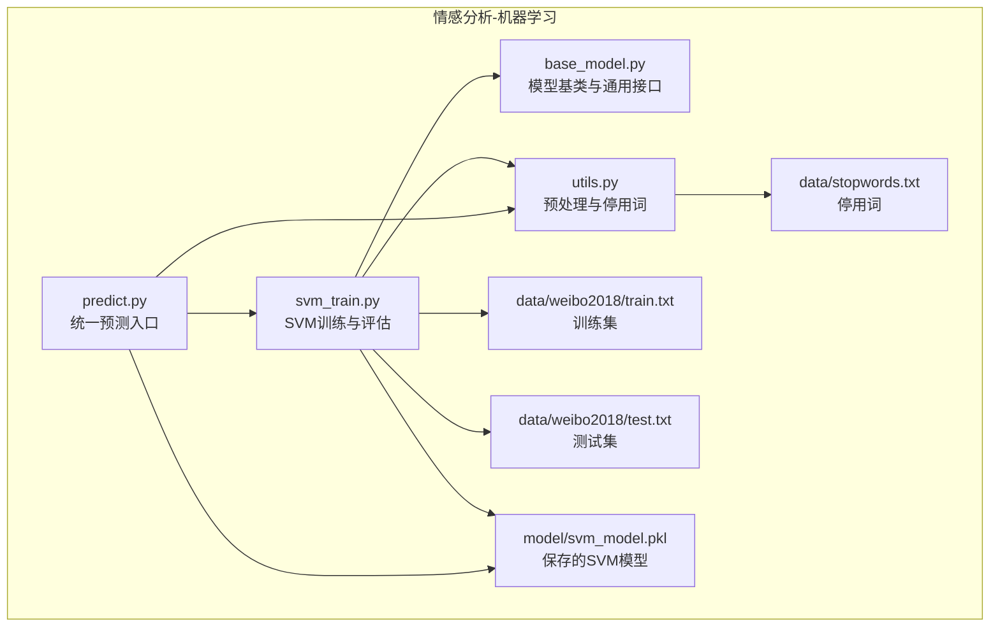
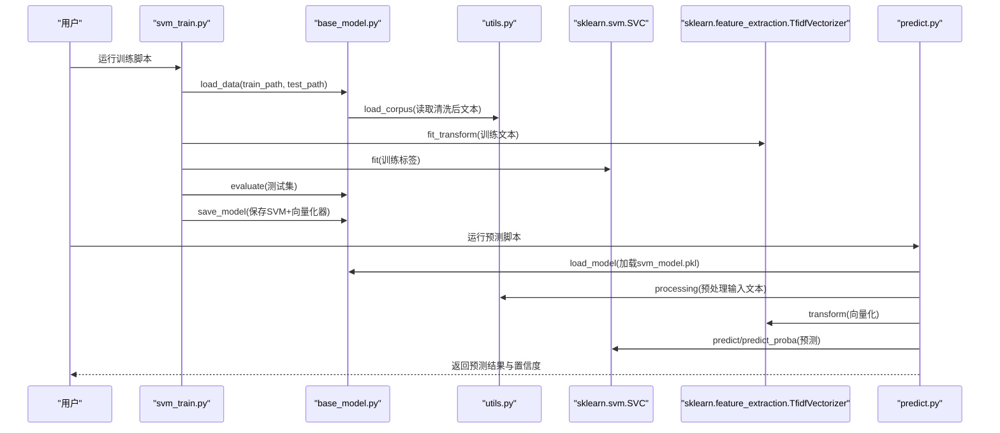
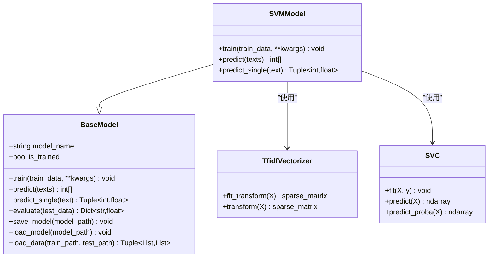
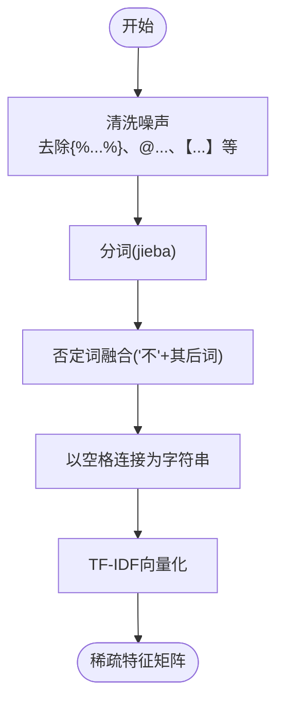
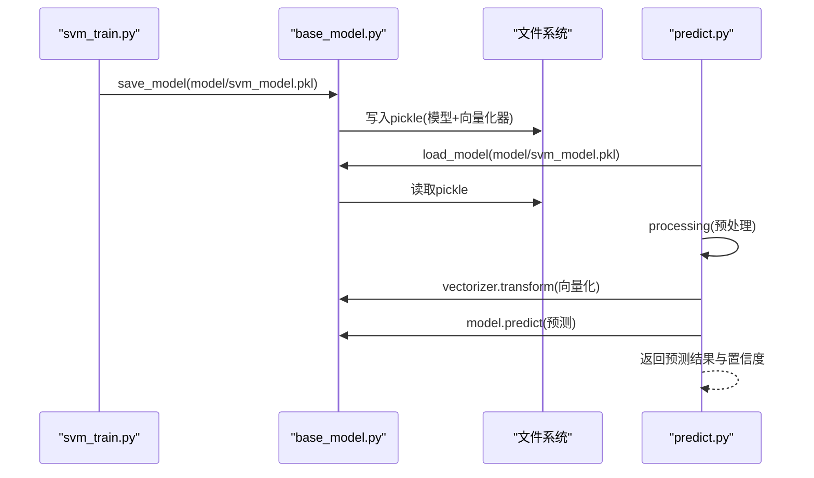
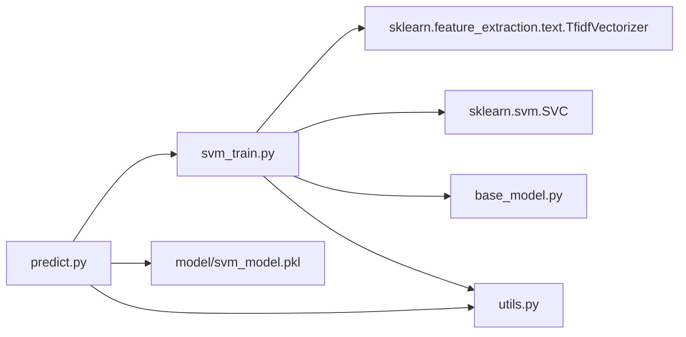

# SVM情感分析

<cite>
**本文引用的文件**
- [svm_train.py](file://SentimentAnalysisModel/WeiboSentiment_MachineLearning/svm_train.py)
- [base_model.py](file://SentimentAnalysisModel/WeiboSentiment_MachineLearning/base_model.py)
- [utils.py](file://SentimentAnalysisModel/WeiboSentiment_MachineLearning/utils.py)
- [predict.py](file://SentimentAnalysisModel/WeiboSentiment_MachineLearning/predict.py)
- [README.md](file://SentimentAnalysisModel/WeiboSentiment_MachineLearning/README.md)
- [stopwords.txt](file://SentimentAnalysisModel/WeiboSentiment_MachineLearning/data/stopwords.txt)
- [train.txt](file://SentimentAnalysisModel/WeiboSentiment_MachineLearning/data/weibo2018/train.txt)
- [test.txt](file://SentimentAnalysisModel/WeiboSentiment_MachineLearning/data/weibo2018/test.txt)
</cite>

## 目录
1. [简介](#简介)
2. [项目结构](#项目结构)
3. [核心组件](#核心组件)
4. [架构总览](#架构总览)
5. [详细组件分析](#详细组件分析)
6. [依赖关系分析](#依赖关系分析)
7. [性能考量](#性能考量)
8. [故障排查指南](#故障排查指南)
9. [结论](#结论)
10. [附录](#附录)

## 简介
本文件围绕基于TF-IDF特征的支持向量机（SVM）情感分析模块展开，重点解析以下方面：
- 文本向量化流程（TF-IDF）与停用词策略
- 核函数选择（如RBF）对分类边界的非线性影响
- 训练参数配置指南（C值、核函数类型、gamma）
- 模型保存与加载，以及如何在统一预测入口中调用
- 在高维稀疏文本数据上的泛化能力优势
- 结合预处理工具解释特征工程的重要性
- 性能调优建议与常见问题（如过拟合）的解决方案

## 项目结构
该模块位于“WeiboSentiment_MachineLearning”子项目中，采用“按功能分层”的组织方式：
- 训练脚本：svm_train.py
- 基类抽象：base_model.py
- 预处理与停用词：utils.py
- 统一预测入口：predict.py
- 数据与停用词资源：data/weibo2018/*.txt、data/stopwords.txt
- 项目说明：README.md

图表来源
- [svm_train.py](file://SentimentAnalysisModel/WeiboSentiment_MachineLearning/svm_train.py#L1-L166)
- [base_model.py](file://SentimentAnalysisModel/WeiboSentiment_MachineLearning/base_model.py#L1-L120)
- [utils.py](file://SentimentAnalysisModel/WeiboSentiment_MachineLearning/utils.py#L1-L138)
- [predict.py](file://SentimentAnalysisModel/WeiboSentiment_MachineLearning/predict.py#L1-L310)
- [stopwords.txt](file://SentimentAnalysisModel/WeiboSentiment_MachineLearning/data/stopwords.txt#L1-L28)
- [train.txt](file://SentimentAnalysisModel/WeiboSentiment_MachineLearning/data/weibo2018/train.txt)
- [test.txt](file://SentimentAnalysisModel/WeiboSentiment_MachineLearning/data/weibo2018/test.txt)

章节来源
- [README.md](file://SentimentAnalysisModel/WeiboSentiment_MachineLearning/README.md#L1-L108)

## 核心组件
- SVMModel：继承自BaseModel，封装SVM训练、预测、评估与持久化逻辑；负责TF-IDF向量化与SVM分类器实例化。
- BaseModel：提供统一的训练/预测接口、评估指标计算、模型保存/加载、数据加载等通用能力。
- utils：提供停用词加载、文本清洗与分词、模型序列化/反序列化等工具。
- predict：统一预测入口，支持加载多种模型（含SVM），并提供单条/批量/集成预测。

章节来源
- [svm_train.py](file://SentimentAnalysisModel/WeiboSentiment_MachineLearning/svm_train.py#L16-L100)
- [base_model.py](file://SentimentAnalysisModel/WeiboSentiment_MachineLearning/base_model.py#L14-L120)
- [utils.py](file://SentimentAnalysisModel/WeiboSentiment_MachineLearning/utils.py#L1-L138)
- [predict.py](file://SentimentAnalysisModel/WeiboSentiment_MachineLearning/predict.py#L1-L189)

## 架构总览
SVM情感分析的端到端流程如下：
- 数据准备：通过BaseModel.load_data加载训练/测试数据
- 文本预处理：utils.processing进行清洗、分词、否定词融合等
- TF-IDF向量化：TfidfVectorizer将文本转为高维稀疏特征矩阵
- SVM训练：SVC在稀疏特征上拟合，支持概率输出
- 模型评估：使用准确率与加权F1评估
- 模型保存：将SVM分类器与向量化器一同序列化
- 预测阶段：predict统一入口加载模型，对单条或多条文本进行预测

图表来源
- [svm_train.py](file://SentimentAnalysisModel/WeiboSentiment_MachineLearning/svm_train.py#L102-L166)
- [base_model.py](file://SentimentAnalysisModel/WeiboSentiment_MachineLearning/base_model.py#L45-L120)
- [utils.py](file://SentimentAnalysisModel/WeiboSentiment_MachineLearning/utils.py#L20-L138)
- [predict.py](file://SentimentAnalysisModel/WeiboSentiment_MachineLearning/predict.py#L88-L189)

## 详细组件分析

### SVMModel 类与训练流程
- 继承关系：SVMModel -> BaseModel
- 关键职责：
  - 训练：构建TF-IDF向量，设置SVM参数（kernel、C、gamma），训练SVC并启用概率输出
  - 预测：对输入文本进行向量化后预测类别；提供单样本预测并返回置信度
  - 评估：委托BaseModel.evaluate计算准确率与F1
  - 持久化：保存SVM分类器与TfidfVectorizer，便于predict复用

图表来源
- [svm_train.py](file://SentimentAnalysisModel/WeiboSentiment_MachineLearning/svm_train.py#L16-L100)
- [base_model.py](file://SentimentAnalysisModel/WeiboSentiment_MachineLearning/base_model.py#L14-L120)

章节来源
- [svm_train.py](file://SentimentAnalysisModel/WeiboSentiment_MachineLearning/svm_train.py#L22-L58)
- [base_model.py](file://SentimentAnalysisModel/WeiboSentiment_MachineLearning/base_model.py#L45-L120)

### 文本向量化与特征工程
- TF-IDF向量化：
  - 使用TfidfVectorizer对清洗后的文本进行向量化，得到高维稀疏矩阵
  - 输出维度即为词汇表大小，适合SVM在稀疏特征空间中高效工作
- 停用词策略：
  - 从data/stopwords.txt加载停用词，并在向量化时传入stop_words
  - 停用词有助于降低噪声、减少特征维度、提升泛化能力
- 预处理逻辑：
  - 去除特定格式标记、@提及、话题标签等噪声
  - 使用jieba进行中文分词，保留字母类token
  - 对否定词“不”进行融合处理，增强语义表达
  - 提供简单预处理函数用于预测阶段的快速清洗

图表来源
- [utils.py](file://SentimentAnalysisModel/WeiboSentiment_MachineLearning/utils.py#L46-L66)
- [utils.py](file://SentimentAnalysisModel/WeiboSentiment_MachineLearning/utils.py#L116-L138)
- [stopwords.txt](file://SentimentAnalysisModel/WeiboSentiment_MachineLearning/data/stopwords.txt#L1-L28)

章节来源
- [utils.py](file://SentimentAnalysisModel/WeiboSentiment_MachineLearning/utils.py#L1-L138)
- [stopwords.txt](file://SentimentAnalysisModel/WeiboSentiment_MachineLearning/data/stopwords.txt#L1-L28)

### 核函数选择与分类边界
- 支持的核函数：linear、poly、rbf、sigmoid
- RBF核的优势：
  - 在高维稀疏文本特征空间中，RBF能学习非线性决策边界，适合捕捉复杂的词组合与情感模式
  - 对异常值相对鲁棒，有利于在微博等UGC场景中保持稳定性
- 参数影响：
  - C：控制正则化强度；C越大越拟合训练数据，可能过拟合；C越小越平滑，可能欠拟合
  - gamma：决定单个样本的影响范围；gamma越大，决策边界越敏感，易过拟合；gamma越小，边界越平滑

章节来源
- [svm_train.py](file://SentimentAnalysisModel/WeiboSentiment_MachineLearning/svm_train.py#L47-L54)

### 训练参数配置指南
- kernel：可选linear、poly、rbf、sigmoid，默认rbf
- C：正则化参数，默认1.0；建议在[0.1, 1, 10, 100]范围内网格搜索
- gamma：核函数系数，默认'scale'；也可设为float或'auto'
- 其他建议：
  - 使用交叉验证选择最优超参
  - 若出现过拟合，优先增大C的对数值尺度或减小gamma
  - 若欠拟合，尝试增大gamma或减小C

章节来源
- [svm_train.py](file://SentimentAnalysisModel/WeiboSentiment_MachineLearning/svm_train.py#L102-L119)

### 模型保存与predict调用
- 保存：
  - BaseModel.save_model将SVM分类器与TfidfVectorizer一起序列化，便于后续加载
  - 默认保存路径为model/svm_model.pkl
- 加载与预测：
  - predict统一入口加载svm_model.pkl，对输入文本进行processing预处理后向量化，再调用SVC预测
  - 支持单条与批量预测，以及多模型集成预测

图表来源
- [base_model.py](file://SentimentAnalysisModel/WeiboSentiment_MachineLearning/base_model.py#L70-L108)
- [predict.py](file://SentimentAnalysisModel/WeiboSentiment_MachineLearning/predict.py#L88-L189)

章节来源
- [base_model.py](file://SentimentAnalysisModel/WeiboSentiment_MachineLearning/base_model.py#L70-L108)
- [predict.py](file://SentimentAnalysisModel/WeiboSentiment_MachineLearning/predict.py#L1-L189)

### 在高维稀疏文本数据上的泛化能力
- 稀疏性优势：TF-IDF在中文微博数据上产生高维稀疏特征，SVM在稀疏空间中计算效率高、内存占用低
- 泛化能力：SVM（尤其是RBF核）在复杂非线性边界下具有良好的泛化能力，适合微博等UGC场景的噪声与多样性
- 特征工程的重要性：停用词过滤、否定词融合、噪声清洗显著提升特征质量，从而改善模型性能

章节来源
- [README.md](file://SentimentAnalysisModel/WeiboSentiment_MachineLearning/README.md#L1-L108)
- [utils.py](file://SentimentAnalysisModel/WeiboSentiment_MachineLearning/utils.py#L46-L66)

## 依赖关系分析
- svm_train.py依赖：
  - sklearn.feature_extraction.text.TfidfVectorizer：文本向量化
  - sklearn.svm.SVC：SVM分类器
  - 自定义base_model.BaseModel：统一接口与评估
  - 自定义utils.stopwords：停用词
- predict.py依赖：
  - svm_train.SVMModel：用于加载与预测
  - utils.processing：统一预处理
  - 模型持久化文件model/svm_model.pkl

图表来源
- [svm_train.py](file://SentimentAnalysisModel/WeiboSentiment_MachineLearning/svm_train.py#L1-L166)
- [predict.py](file://SentimentAnalysisModel/WeiboSentiment_MachineLearning/predict.py#L1-L189)

章节来源
- [svm_train.py](file://SentimentAnalysisModel/WeiboSentiment_MachineLearning/svm_train.py#L1-L166)
- [predict.py](file://SentimentAnalysisModel/WeiboSentiment_MachineLearning/predict.py#L1-L189)

## 性能考量
- 计算与内存：
  - SVM在高维稀疏特征上训练成本较高，但推理较快
  - 建议在CPU上进行训练，在GPU不可用时仍可接受
- 特征规模：
  - TF-IDF特征维度较大，可通过特征选择或降维进一步优化（如卡方选择、PCA）
- 超参搜索：
  - 使用网格搜索或随机搜索在C、gamma等关键参数上寻找最优组合
- 评估指标：
  - 使用准确率与加权F1综合评估；关注类别不平衡问题

[本节为通用指导，无需具体文件来源]

## 故障排查指南
- 模型尚未训练即调用预测：
  - 抛出异常提示需先训练；请确认已执行训练流程并保存模型
- 模型文件不存在：
  - 加载模型时若文件缺失，抛出文件不存在异常；请检查model/svm_model.pkl路径
- 数据格式问题：
  - 训练/测试数据需为“文本,标签”的格式；请核对data/weibo2018/train.txt与test.txt
- 过拟合症状：
  - 训练集准确率很高但测试集偏低；建议增大C的对数尺度或减小gamma
- 欠拟合症状：
  - 训练/测试均偏低；建议增大gamma或减小C
- 停用词未生效：
  - 确认stopwords.txt存在且编码正确；否则将回退为空停用词列表

章节来源
- [svm_train.py](file://SentimentAnalysisModel/WeiboSentiment_MachineLearning/svm_train.py#L68-L99)
- [base_model.py](file://SentimentAnalysisModel/WeiboSentiment_MachineLearning/base_model.py#L94-L108)
- [utils.py](file://SentimentAnalysisModel/WeiboSentiment_MachineLearning/utils.py#L1-L18)
- [train.txt](file://SentimentAnalysisModel/WeiboSentiment_MachineLearning/data/weibo2018/train.txt)
- [test.txt](file://SentimentAnalysisModel/WeiboSentiment_MachineLearning/data/weibo2018/test.txt)

## 结论
SVM情感分析模块通过TF-IDF向量化与SVC分类器实现了在高维稀疏文本上的稳健分类。合理的特征工程（停用词、否定词融合、噪声清洗）与核函数选择（尤其是RBF）显著提升了模型的泛化能力。借助BaseModel提供的统一接口与predict的统一入口，SVM模型可方便地保存、加载与集成使用，满足生产级部署与多模型对比的需求。

[本节为总结，无需具体文件来源]

## 附录
- 常用命令参考：
  - 训练SVM：python svm_train.py --kernel rbf --C 1.0
  - 交互式预测：python predict.py
  - 指定模型预测：python predict.py --model_type svm --text "..."
  - 集成预测：python predict.py --ensemble --text "..."

章节来源
- [README.md](file://SentimentAnalysisModel/WeiboSentiment_MachineLearning/README.md#L47-L83)