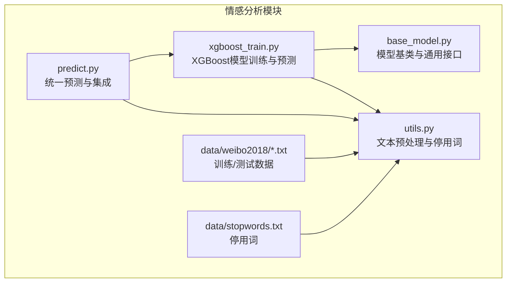
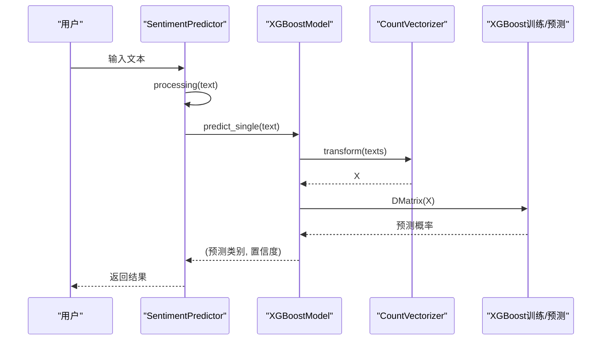
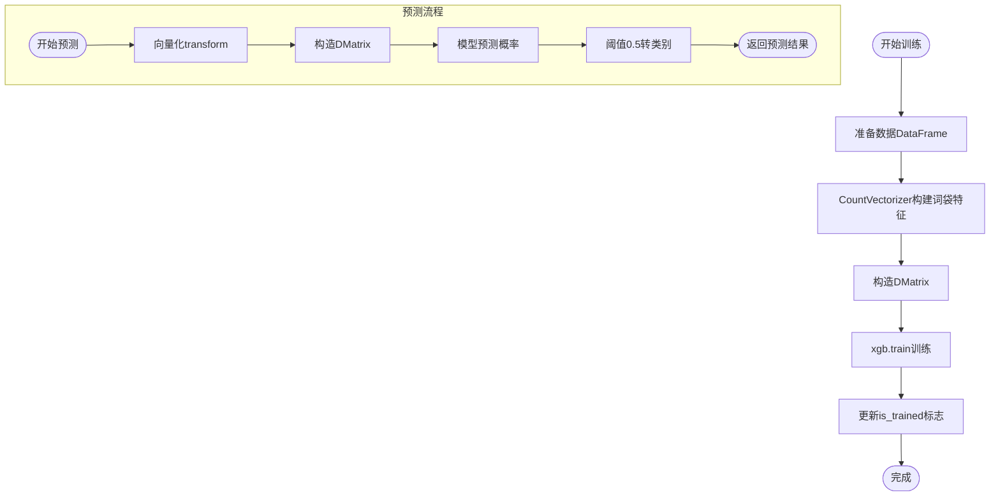
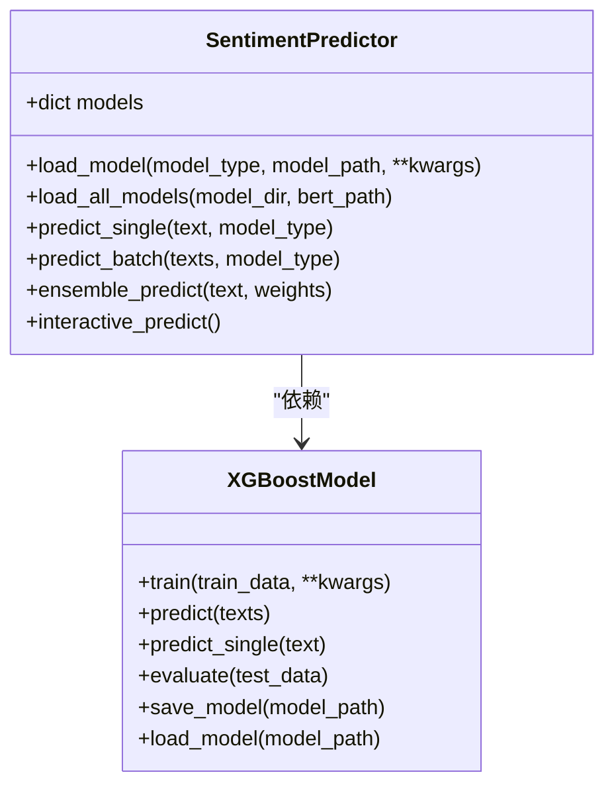
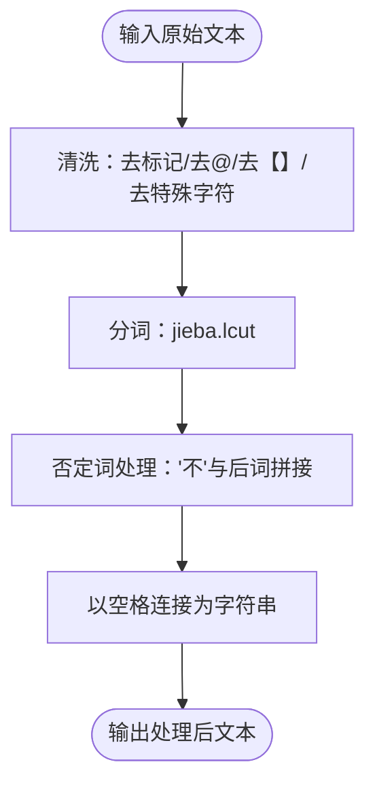
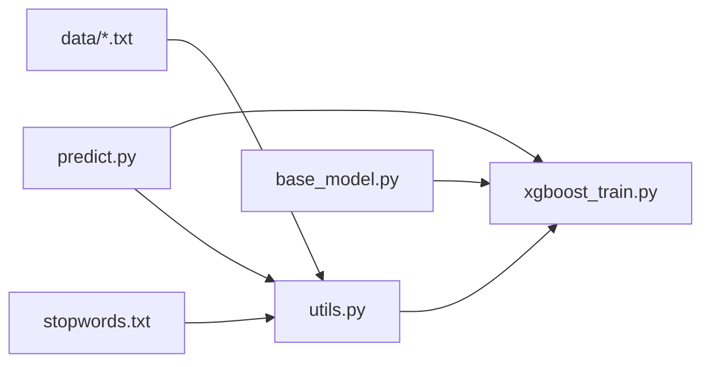

# XGBoost情感分析

<cite>
**本文引用的文件**
- [xgboost_train.py](file://SentimentAnalysisModel/WeiboSentiment_MachineLearning/xgboost_train.py)
- [predict.py](file://SentimentAnalysisModel/WeiboSentiment_MachineLearning/predict.py)
- [utils.py](file://SentimentAnalysisModel/WeiboSentiment_MachineLearning/utils.py)
- [base_model.py](file://SentimentAnalysisModel/WeiboSentiment_MachineLearning/base_model.py)
- [train.txt](file://SentimentAnalysisModel/WeiboSentiment_MachineLearning/data/weibo2018/train.txt)
- [test.txt](file://SentimentAnalysisModel/WeiboSentiment_MachineLearning/data/weibo2018/test.txt)
- [stopwords.txt](file://SentimentAnalysisModel/WeiboSentiment_MachineLearning/data/stopwords.txt)
</cite>

## 目录
1. [引言](#引言)
2. [项目结构](#项目结构)
3. [核心组件](#核心组件)
4. [架构总览](#架构总览)
5. [详细组件分析](#详细组件分析)
6. [依赖关系分析](#依赖关系分析)
7. [性能与内存优化](#性能与内存优化)
8. [故障排查指南](#故障排查指南)
9. [结论](#结论)
10. [附录](#附录)

## 引言
本技术文档围绕XGBoost情感分析实现，系统梳理训练脚本、预测与集成、文本预处理、特征工程与正则化参数的作用，并给出性能优化与内存管理建议。读者无需深入机器学习背景即可理解整体流程与关键参数含义。

## 项目结构
本项目的情感分析模块位于SentimentAnalysisModel/WeiboSentiment_MachineLearning目录，其中：
- 训练与模型：xgboost_train.py
- 统一预测与集成：predict.py
- 文本预处理与工具：utils.py
- 基类与通用接口：base_model.py
- 训练/测试数据：data/weibo2018/train.txt、test.txt
- 停用词：data/stopwords.txt

图表来源
- [xgboost_train.py](file://SentimentAnalysisModel/WeiboSentiment_MachineLearning/xgboost_train.py#L1-L233)
- [predict.py](file://SentimentAnalysisModel/WeiboSentiment_MachineLearning/predict.py#L1-L310)
- [utils.py](file://SentimentAnalysisModel/WeiboSentiment_MachineLearning/utils.py#L1-L138)
- [base_model.py](file://SentimentAnalysisModel/WeiboSentiment_MachineLearning/base_model.py#L1-L120)

章节来源
- [xgboost_train.py](file://SentimentAnalysisModel/WeiboSentiment_MachineLearning/xgboost_train.py#L1-L233)
- [predict.py](file://SentimentAnalysisModel/WeiboSentiment_MachineLearning/predict.py#L1-L310)
- [utils.py](file://SentimentAnalysisModel/WeiboSentiment_MachineLearning/utils.py#L1-L138)
- [base_model.py](file://SentimentAnalysisModel/WeiboSentiment_MachineLearning/base_model.py#L1-L120)

## 核心组件
- XGBoostModel：基于sklearn CountVectorizer的词袋特征工程，使用XGBoost DMatrix训练与预测，提供单样本与批量预测、评估与模型持久化。
- SentimentPredictor：统一预测入口，支持加载多种模型（含XGBoost），提供单条/批量预测与加权集成预测。
- TextProcessing：清洗、分词、否定词拼接、停用词过滤、BERT专用清洗等。
- BaseModel：统一的训练/评估/保存/加载接口，便于扩展其他模型。

章节来源
- [xgboost_train.py](file://SentimentAnalysisModel/WeiboSentiment_MachineLearning/xgboost_train.py#L17-L159)
- [predict.py](file://SentimentAnalysisModel/WeiboSentiment_MachineLearning/predict.py#L22-L189)
- [utils.py](file://SentimentAnalysisModel/WeiboSentiment_MachineLearning/utils.py#L46-L138)
- [base_model.py](file://SentimentAnalysisModel/WeiboSentiment_MachineLearning/base_model.py#L14-L120)

## 架构总览
XGBoost情感分析采用“文本预处理 → 特征工程 → 模型训练/预测 → 评估/集成”的流水线式架构。训练阶段通过CountVectorizer构建词袋特征，XGBoost以DMatrix为输入进行梯度提升；预测阶段复用相同的向量化器与模型，输出类别与置信度；统一预测器支持多模型并行与加权集成。

图表来源
- [predict.py](file://SentimentAnalysisModel/WeiboSentiment_MachineLearning/predict.py#L88-L118)
- [xgboost_train.py](file://SentimentAnalysisModel/WeiboSentiment_MachineLearning/xgboost_train.py#L76-L128)
- [utils.py](file://SentimentAnalysisModel/WeiboSentiment_MachineLearning/utils.py#L46-L66)

## 详细组件分析

### XGBoostModel：梯度提升决策树实现与正则化
- 特征工程
  - 使用CountVectorizer构建词袋特征，支持token_pattern、stop_words与max_features限制特征规模。
  - 训练时fit_transform，预测时transform，确保向量化器一致。
- 模型训练
  - 参数键值对包含booster、max_depth、scale_pos_weight、colsample_bytree、objective、eval_metric、eta、nthread等。
  - 使用xgb.DMatrix封装特征与标签，xgb.train执行梯度提升迭代。
- 预测与评估
  - predict返回类别标签；predict_single返回(类别, 置信度)。
  - evaluate使用accuracy、f1与roc_auc_score评估性能。
- 关键参数作用
  - max_depth：树的最大深度，控制模型复杂度与过拟合风险。
  - eta（学习率）：步长，较小值提升泛化但需更多轮次。
  - colsample_bytree：每棵树随机采样特征比例，降低过拟合。
  - scale_pos_weight：正负样本不平衡时的正样本权重，平衡类别分布。
  - nthread：训练线程数，影响CPU利用率与训练速度。
- 特征重要性
  - XGBoost原生支持特征重要性统计（如split/gain/cover），可在训练后通过模型导出或可视化工具获取。当前脚本未直接暴露该接口，但可通过扩展访问底层模型对象实现。

图表来源
- [xgboost_train.py](file://SentimentAnalysisModel/WeiboSentiment_MachineLearning/xgboost_train.py#L23-L128)

章节来源
- [xgboost_train.py](file://SentimentAnalysisModel/WeiboSentiment_MachineLearning/xgboost_train.py#L23-L159)

### 统一预测与集成：predict.py
- 模型加载
  - 支持加载bayes、svm、xgboost、lstm、bert模型；BERT需额外预训练路径。
  - 通过load_all_models批量加载或load_model按类型加载。
- 单条/批量预测
  - predict_single：对单条文本进行预处理后调用各模型predict_single。
  - predict_batch：对批量文本进行预处理后调用各模型predict。
- 集成预测
  - ensemble_predict：对多个模型的预测概率进行加权平均，返回最终类别与置信度。
  - 权重可自定义，未提供时按等权平均。
- 交互式预测
  - 提供交互界面，支持查看已加载模型、单条预测、集成预测与退出。

图表来源
- [predict.py](file://SentimentAnalysisModel/WeiboSentiment_MachineLearning/predict.py#L22-L189)
- [xgboost_train.py](file://SentimentAnalysisModel/WeiboSentiment_MachineLearning/xgboost_train.py#L17-L159)

章节来源
- [predict.py](file://SentimentAnalysisModel/WeiboSentiment_MachineLearning/predict.py#L22-L309)

### 文本预处理：utils.py
- 停用词加载
  - 从stopwords.txt加载停用词列表，若文件不存在则提示并使用空列表。
- 数据清洗与分词
  - processing：去除特定格式标记、@用户名、【】内容、特殊字符；使用jieba分词；对“不+词”进行拼接增强否定表达；以空格连接生成字符串。
  - processing_bert：针对BERT的清洗版本，保留更原始文本。
- 通用工具
  - save_model/load_model：基于pickle的模型序列化/反序列化。
  - preprocess_text_simple：简化清洗与表情符号删除、多余空白合并。

图表来源
- [utils.py](file://SentimentAnalysisModel/WeiboSentiment_MachineLearning/utils.py#L46-L66)

章节来源
- [utils.py](file://SentimentAnalysisModel/WeiboSentiment_MachineLearning/utils.py#L1-L138)
- [stopwords.txt](file://SentimentAnalysisModel/WeiboSentiment_MachineLearning/data/stopwords.txt#L1-L28)

### 数据格式与加载
- 数据文件格式
  - train.txt/test.txt每行包含：ID, 标签, 内容，标签为0/1。
- 加载逻辑
  - utils.load_corpus：按行解析，调用processing清洗后组成[(content, label)]。
  - BaseModel.load_data：统一加载训练与测试数据。

章节来源
- [train.txt](file://SentimentAnalysisModel/WeiboSentiment_MachineLearning/data/weibo2018/train.txt#L1-L200)
- [test.txt](file://SentimentAnalysisModel/WeiboSentiment_MachineLearning/data/weibo2018/test.txt#L1-L200)
- [utils.py](file://SentimentAnalysisModel/WeiboSentiment_MachineLearning/utils.py#L20-L31)
- [base_model.py](file://SentimentAnalysisModel/WeiboSentiment_MachineLearning/base_model.py#L110-L120)

## 依赖关系分析
- 模块耦合
  - xgboost_train.py依赖base_model（继承）、utils（停用词）、sklearn.CountVectorizer与xgboost。
  - predict.py依赖各模型类与utils的processing。
- 数据依赖
  - 训练/测试数据与停用词文件为外部资源，路径通过命令行参数或默认值指定。
- 可能的循环依赖
  - 当前文件间无循环导入；predict.py动态导入各模型类，避免静态循环。

图表来源
- [xgboost_train.py](file://SentimentAnalysisModel/WeiboSentiment_MachineLearning/xgboost_train.py#L1-L233)
- [predict.py](file://SentimentAnalysisModel/WeiboSentiment_MachineLearning/predict.py#L1-L310)
- [utils.py](file://SentimentAnalysisModel/WeiboSentiment_MachineLearning/utils.py#L1-L138)
- [base_model.py](file://SentimentAnalysisModel/WeiboSentiment_MachineLearning/base_model.py#L1-L120)

章节来源
- [xgboost_train.py](file://SentimentAnalysisModel/WeiboSentiment_MachineLearning/xgboost_train.py#L1-L233)
- [predict.py](file://SentimentAnalysisModel/WeiboSentiment_MachineLearning/predict.py#L1-L310)
- [utils.py](file://SentimentAnalysisModel/WeiboSentiment_MachineLearning/utils.py#L1-L138)
- [base_model.py](file://SentimentAnalysisModel/WeiboSentiment_MachineLearning/base_model.py#L1-L120)

## 性能与内存优化
- 特征工程优化
  - 控制max_features：减少稀疏矩阵维度，降低内存占用与训练时间。
  - 合理设置token_pattern：避免过多噪声词进入特征空间。
- 正则化参数调优
  - max_depth：从默认6逐步增大，观察验证集F1/AUC变化，防止过拟合。
  - eta：较小学习率（如0.1~0.2）提升稳定性，需相应增加num_boost_round。
  - colsample_bytree：0.6~0.8平衡特征多样性与过拟合。
  - scale_pos_weight：在类别极度不平衡时调整正样本权重。
- 训练与预测
  - nthread：根据CPU核数设置，充分利用多核；注意与系统调度冲突。
  - num_boost_round：早停策略（如eval_set）可减少无效迭代。
- 内存管理
  - 使用稀疏矩阵（CountVectorizer默认输出）存储特征。
  - 预测阶段复用同一向量化器，避免重复fit_transform。
  - 模型保存使用pickle，注意文件大小与兼容性；必要时考虑压缩或更换序列化方案。
- 数据质量
  - 停用词与清洗规则直接影响特征质量；建议结合业务场景持续迭代processing。
  - 训练/测试数据分布需保持一致，避免数据漂移导致性能下降。

[本节为通用指导，不直接分析具体文件]

## 故障排查指南
- 模型未训练即预测
  - 现象：抛出未训练错误。
  - 处理：先调用train，再进行predict或evaluate。
- 模型文件不存在
  - 现象：加载模型时报错。
  - 处理：确认model_path是否存在，或先训练并保存。
- 数据路径错误
  - 现象：加载训练/测试数据失败。
  - 处理：检查train_path/test_path是否指向正确的文件路径。
- 预测结果异常
  - 现象：置信度异常或类别固定。
  - 处理：检查向量化器是否一致、参数设置是否合理、数据清洗是否过度。
- 集成预测权重缺失
  - 现象：weights为空导致等权。
  - 处理：为各模型提供权重或使用默认等权。

章节来源
- [xgboost_train.py](file://SentimentAnalysisModel/WeiboSentiment_MachineLearning/xgboost_train.py#L85-L128)
- [base_model.py](file://SentimentAnalysisModel/WeiboSentiment_MachineLearning/base_model.py#L70-L108)
- [predict.py](file://SentimentAnalysisModel/WeiboSentiment_MachineLearning/predict.py#L43-L66)

## 结论
本实现以XGBoost为核心，结合CountVectorizer与统一预测器，形成可扩展、可评估、可集成的情感分析流水线。通过合理设置正则化参数与文本预处理策略，可在微博语料上取得稳定性能。建议后续引入特征重要性导出、早停策略与更丰富的评估指标，以进一步提升模型可解释性与鲁棒性。

[本节为总结性内容，不直接分析具体文件]

## 附录
- 命令行参数（训练）
  - --train_path/--test_path：训练/测试数据路径
  - --model_path：模型保存路径
  - --max_features：词袋特征上限
  - --max_depth：树最大深度
  - --eta：学习率
  - --num_boost_round：迭代轮数
  - --eval_only：仅评估模式
- 命令行参数（预测）
  - --model_dir：模型目录
  - --bert_path：BERT预训练路径
  - --model_type：指定模型类型
  - --text：直接预测指定文本
  - --interactive/--ensemble：交互模式与集成预测

章节来源
- [xgboost_train.py](file://SentimentAnalysisModel/WeiboSentiment_MachineLearning/xgboost_train.py#L161-L233)
- [predict.py](file://SentimentAnalysisModel/WeiboSentiment_MachineLearning/predict.py#L254-L309)