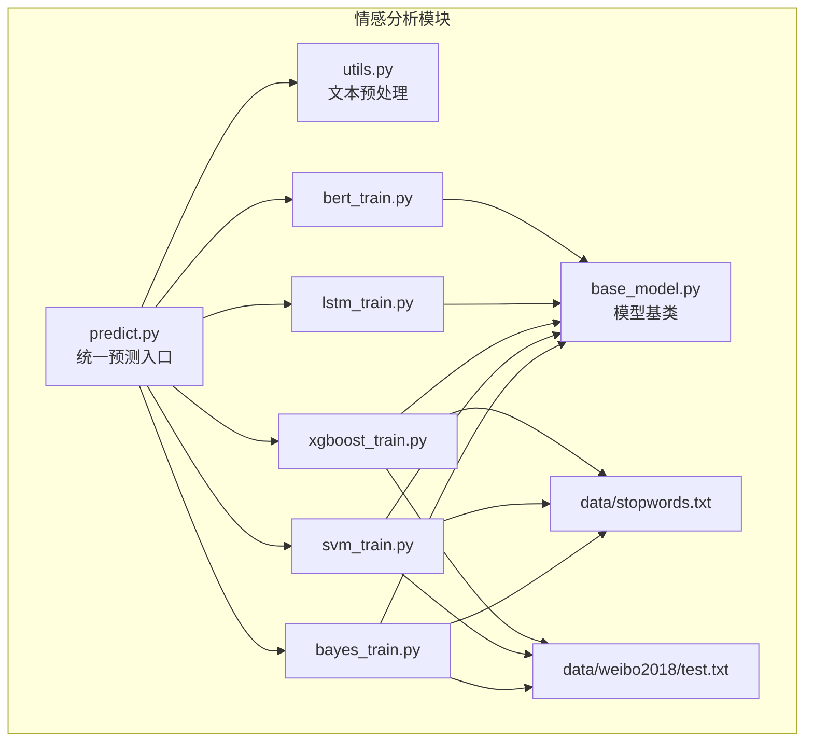
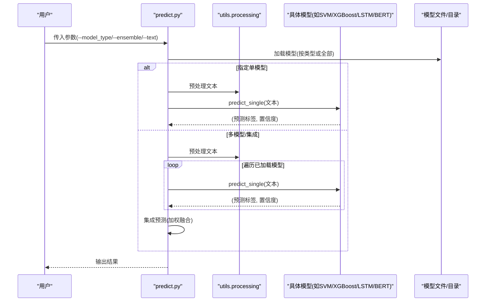
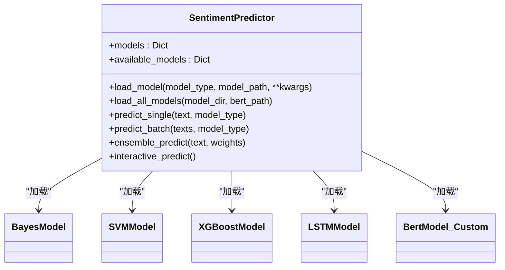
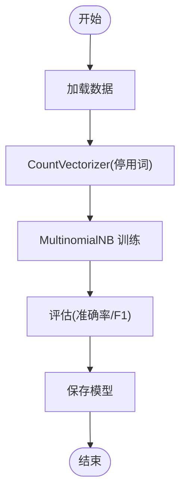
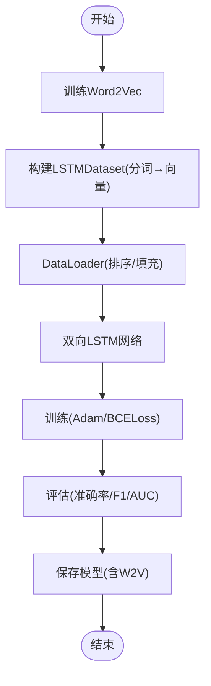
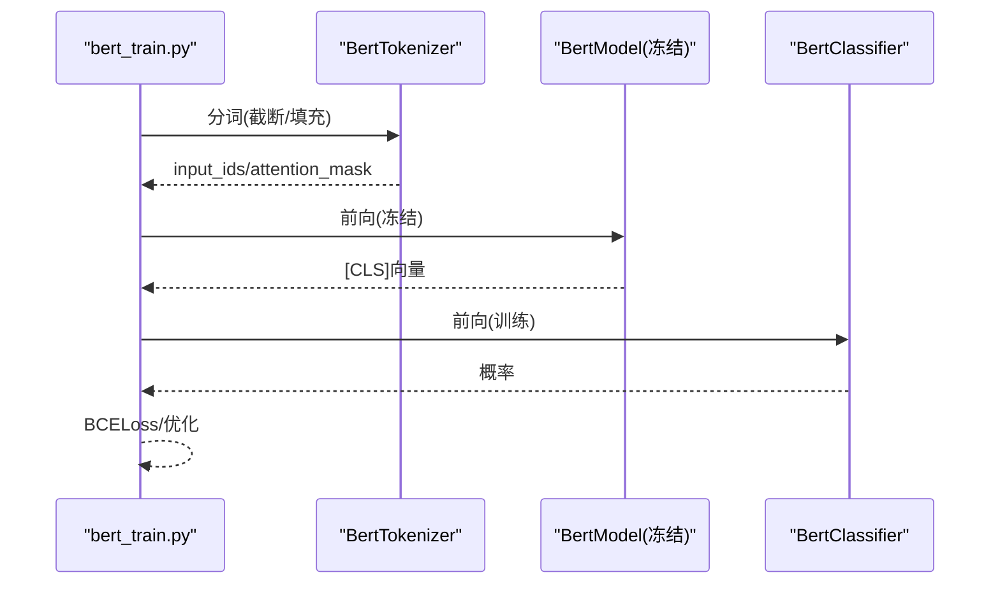
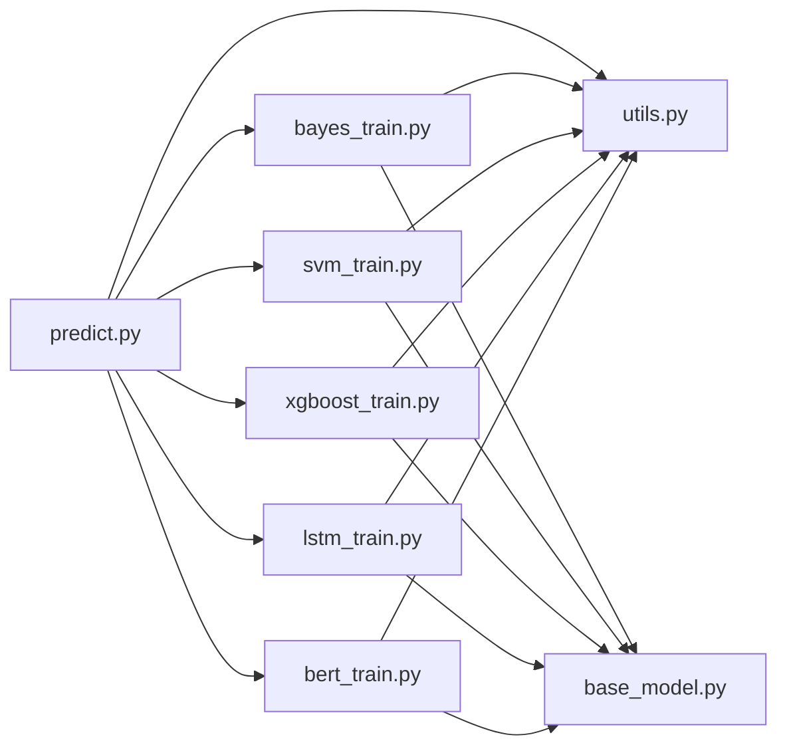

# 基于传统机器学习的微博情感分析

<cite>
**本文引用的文件**
- [README.md](file://SentimentAnalysisModel/WeiboSentiment_MachineLearning/README.md)
- [predict.py](file://SentimentAnalysisModel/WeiboSentiment_MachineLearning/predict.py)
- [utils.py](file://SentimentAnalysisModel/WeiboSentiment_MachineLearning/utils.py)
- [base_model.py](file://SentimentAnalysisModel/WeiboSentiment_MachineLearning/base_model.py)
- [svm_train.py](file://SentimentAnalysisModel/WeiboSentiment_MachineLearning/svm_train.py)
- [bayes_train.py](file://SentimentAnalysisModel/WeiboSentiment_MachineLearning/bayes_train.py)
- [xgboost_train.py](file://SentimentAnalysisModel/WeiboSentiment_MachineLearning/xgboost_train.py)
- [lstm_train.py](file://SentimentAnalysisModel/WeiboSentiment_MachineLearning/lstm_train.py)
- [bert_train.py](file://SentimentAnalysisModel/WeiboSentiment_MachineLearning/bert_train.py)
- [requirements.txt](file://requirements.txt)
- [test.txt](file://SentimentAnalysisModel/WeiboSentiment_MachineLearning/data/weibo2018/test.txt)
- [stopwords.txt](file://SentimentAnalysisModel/WeiboSentiment_MachineLearning/data/stopwords.txt)
</cite>

## 目录
1. [简介](#简介)
2. [项目结构](#项目结构)
3. [核心组件](#核心组件)
4. [架构总览](#架构总览)
5. [详细组件分析](#详细组件分析)
6. [依赖关系分析](#依赖关系分析)
7. [性能与对比](#性能与对比)
8. [故障排查指南](#故障排查指南)
9. [结论](#结论)
10. [附录](#附录)

## 简介
本项目提供基于传统机器学习方法的中文微博情感二分类方案，覆盖朴素贝叶斯、SVM、XGBoost、LSTM（词嵌入）与 BERT（特征抽取+分类头）五类模型。通过统一的预测入口与模块化训练脚本，用户可快速加载已训练模型进行推理，也可基于自定义数据集重新训练各模型。项目同时提供文本预处理工具，便于在不同模型之间保持一致的特征工程流程。

## 项目结构
- 模型训练与预测脚本位于 SentimentAnalysisModel/WeiboSentiment_MachineLearning 目录
- 统一预测入口：predict.py
- 通用基类：base_model.py
- 文本预处理：utils.py
- 各模型训练脚本：bayes_train.py、svm_train.py、xgboost_train.py、lstm_train.py、bert_train.py
- 数据与停用词：data/weibo2018/test.txt、data/stopwords.txt
- 依赖声明：requirements.txt

图表来源
- [predict.py](file://SentimentAnalysisModel/WeiboSentiment_MachineLearning/predict.py#L1-L310)
- [utils.py](file://SentimentAnalysisModel/WeiboSentiment_MachineLearning/utils.py#L1-L138)
- [base_model.py](file://SentimentAnalysisModel/WeiboSentiment_MachineLearning/base_model.py#L1-L120)
- [bayes_train.py](file://SentimentAnalysisModel/WeiboSentiment_MachineLearning/bayes_train.py#L1-L155)
- [svm_train.py](file://SentimentAnalysisModel/WeiboSentiment_MachineLearning/svm_train.py#L1-L166)
- [xgboost_train.py](file://SentimentAnalysisModel/WeiboSentiment_MachineLearning/xgboost_train.py#L1-L233)
- [lstm_train.py](file://SentimentAnalysisModel/WeiboSentiment_MachineLearning/lstm_train.py#L1-L352)
- [bert_train.py](file://SentimentAnalysisModel/WeiboSentiment_MachineLearning/bert_train.py#L1-L413)
- [test.txt](file://SentimentAnalysisModel/WeiboSentiment_MachineLearning/data/weibo2018/test.txt#L1-L200)
- [stopwords.txt](file://SentimentAnalysisModel/WeiboSentiment_MachineLearning/data/stopwords.txt#L1-L28)

章节来源
- [README.md](file://SentimentAnalysisModel/WeiboSentiment_MachineLearning/README.md#L1-L108)

## 核心组件
- 统一预测器：predict.py 提供加载单模型或多模型、批量预测、交互式预测与集成预测的能力；内部通过 utils.processing 对输入文本进行清洗与分词。
- 模型基类：base_model.BaseModel 规范了训练、评估、保存与加载流程，统一了 predict/predict_single 接口。
- 文本预处理：utils.py 提供停用词加载、清洗规则、分词与拼接逻辑，以及通用的模型保存/加载工具。
- 训练脚本：各模型训练脚本继承 BaseModel，实现各自的特征工程与分类器训练流程，并提供命令行参数与评估输出。

章节来源
- [predict.py](file://SentimentAnalysisModel/WeiboSentiment_MachineLearning/predict.py#L1-L310)
- [base_model.py](file://SentimentAnalysisModel/WeiboSentiment_MachineLearning/base_model.py#L1-L120)
- [utils.py](file://SentimentAnalysisModel/WeiboSentiment_MachineLearning/utils.py#L1-L138)

## 架构总览
统一预测流程如下：用户通过命令行或交互方式调用 predict.py，predict.py 根据配置加载对应模型，调用 utils.processing 进行预处理，随后调用各模型的 predict/predict_single 接口完成推理；若启用集成预测，则对多模型输出进行加权融合。

图表来源
- [predict.py](file://SentimentAnalysisModel/WeiboSentiment_MachineLearning/predict.py#L1-L310)
- [utils.py](file://SentimentAnalysisModel/WeiboSentiment_MachineLearning/utils.py#L1-L138)
- [svm_train.py](file://SentimentAnalysisModel/WeiboSentiment_MachineLearning/svm_train.py#L1-L166)
- [xgboost_train.py](file://SentimentAnalysisModel/WeiboSentiment_MachineLearning/xgboost_train.py#L1-L233)
- [lstm_train.py](file://SentimentAnalysisModel/WeiboSentiment_MachineLearning/lstm_train.py#L1-L352)
- [bert_train.py](file://SentimentAnalysisModel/WeiboSentiment_MachineLearning/bert_train.py#L1-L413)

## 详细组件分析

### 统一预测器（predict.py）
- 功能要点
  - 支持加载 bayes、svm、xgboost、lstm、bert 五类模型
  - 支持单模型预测、批量预测与交互式预测
  - 支持多模型集成预测（加权平均置信度）
  - 预处理统一调用 utils.processing
- 关键流程
  - load_model/load_all_models：按模型类型加载对应模型实例与持久化文件
  - predict_single/predict_batch：对单条或多条文本进行预测
  - ensemble_predict：对多模型输出进行加权融合，返回最终预测与置信度
  - interactive_predict：交互式输入文本，展示各模型与集成结果

图表来源
- [predict.py](file://SentimentAnalysisModel/WeiboSentiment_MachineLearning/predict.py#L1-L310)
- [bayes_train.py](file://SentimentAnalysisModel/WeiboSentiment_MachineLearning/bayes_train.py#L1-L155)
- [svm_train.py](file://SentimentAnalysisModel/WeiboSentiment_MachineLearning/svm_train.py#L1-L166)
- [xgboost_train.py](file://SentimentAnalysisModel/WeiboSentiment_MachineLearning/xgboost_train.py#L1-L233)
- [lstm_train.py](file://SentimentAnalysisModel/WeiboSentiment_MachineLearning/lstm_train.py#L1-L352)
- [bert_train.py](file://SentimentAnalysisModel/WeiboSentiment_MachineLearning/bert_train.py#L1-L413)

章节来源
- [predict.py](file://SentimentAnalysisModel/WeiboSentiment_MachineLearning/predict.py#L1-L310)

### 文本预处理（utils.py）
- 停用词加载：从 data/stopwords.txt 加载停用词列表，若缺失则提示并使用空列表
- 预处理函数
  - processing：清洗特殊标记、@用户名、话题标签、零宽字符；使用 jieba 分词；对否定词“不”与后词拼接；以空格连接为字符串
  - processing_bert：清洗规则与 processing 类似，但保留原始文本用于 BERT 输入
  - save_model/load_model：基于 pickle 的模型持久化与加载
  - preprocess_text_simple：简化清洗规则，适合预测阶段快速清洗
- 影响说明
  - 去除噪声（话题、@、零宽字符）有助于减少无关特征
  - 分词与否定词拼接提升对否定表达的建模能力
  - 停用词过滤降低噪声词影响，提升模型稳定性

章节来源
- [utils.py](file://SentimentAnalysisModel/WeiboSentiment_MachineLearning/utils.py#L1-L138)
- [stopwords.txt](file://SentimentAnalysisModel/WeiboSentiment_MachineLearning/data/stopwords.txt#L1-L28)

### 模型基类（base_model.py）
- 规范接口
  - train：训练模型
  - predict：批量预测
  - predict_single：单条预测（默认置信度为0，具体模型可覆盖）
  - evaluate：评估并打印准确率、F1、分类报告
  - save_model/load_model：保存与加载模型（含 vectorizer 与训练状态）
  - load_data：加载训练/测试数据（调用 utils.load_corpus）
- 设计意义
  - 统一训练/评估/保存/加载流程，便于扩展新模型
  - 为 predict.py 的多模型加载与调用提供契约

章节来源
- [base_model.py](file://SentimentAnalysisModel/WeiboSentiment_MachineLearning/base_model.py#L1-L120)

### 朴素贝叶斯（bayes_train.py）
- 特征工程：CountVectorizer（词袋模型），使用停用词过滤
- 分类器：MultinomialNB
- 输出：predict 返回类别标签；predict_single 返回类别与置信度
- 训练流程：加载数据 → 构建词袋 → 训练 → 评估 → 保存

图表来源
- [bayes_train.py](file://SentimentAnalysisModel/WeiboSentiment_MachineLearning/bayes_train.py#L1-L155)
- [base_model.py](file://SentimentAnalysisModel/WeiboSentiment_MachineLearning/base_model.py#L1-L120)

章节来源
- [bayes_train.py](file://SentimentAnalysisModel/WeiboSentiment_MachineLearning/bayes_train.py#L1-L155)

### SVM（svm_train.py）
- 特征工程：TfidfVectorizer（TF-IDF），使用停用词过滤
- 分类器：SVM（支持 RBF/线性/多项式/sigmoid 核，C/gamma 可调）
- 输出：predict 返回类别标签；predict_single 返回类别与置信度（基于概率）
- 训练流程：加载数据 → TF-IDF → SVM 训练 → 评估 → 保存

章节来源
- [svm_train.py](file://SentimentAnalysisModel/WeiboSentiment_MachineLearning/svm_train.py#L1-L166)

### XGBoost（xgboost_train.py）
- 特征工程：CountVectorizer（限制最大特征数），使用停用词过滤
- 分类器：XGBoost（二分类逻辑回归目标）
- 输出：predict 返回类别标签；predict_single 返回类别与置信度
- 评估：额外计算 AUC 指标
- 训练流程：加载数据 → 词袋 → DMatrix → XGBoost 训练 → 评估 → 保存

章节来源
- [xgboost_train.py](file://SentimentAnalysisModel/WeiboSentiment_MachineLearning/xgboost_train.py#L1-L233)

### LSTM（lstm_train.py）
- 特征工程：先训练 Word2Vec（gensim），再将文本映射为词向量序列
- 模型结构：双向 LSTM + 全连接 + Sigmoid
- 训练流程：训练 Word2Vec → 构建数据集（按长度排序、padding）→ LSTM 训练 → 评估 → 保存（含模型权重与 Word2Vec）
- 预测流程：将文本映射为词向量 → 前向传播 → 阈值化输出

图表来源
- [lstm_train.py](file://SentimentAnalysisModel/WeiboSentiment_MachineLearning/lstm_train.py#L1-L352)

章节来源
- [lstm_train.py](file://SentimentAnalysisModel/WeiboSentiment_MachineLearning/lstm_train.py#L1-L352)

### BERT（bert_train.py）
- 特征工程：使用预训练中文 BERT（自动下载或本地加载），冻结参数，取 [CLS] 向量作为句子表示
- 分类器：自定义全连接 + Sigmoid
- 训练流程：加载/下载 BERT → 构建数据集 → 分类器训练 → 评估 → 保存（仅保存分类器权重与配置）
- 预测流程：分词 → BERT 编码 → 取 [CLS] 向量 → 分类器 → 阈值化输出

图表来源
- [bert_train.py](file://SentimentAnalysisModel/WeiboSentiment_MachineLibrary/bert_train.py#L1-L413)

章节来源
- [bert_train.py](file://SentimentAnalysisModel/WeiboSentiment_MachineLearning/bert_train.py#L1-L413)

## 依赖关系分析
- 预测入口依赖各模型实现与 utils 预处理
- 各模型训练脚本依赖 base_model 与 utils
- 预训练模型（BERT）依赖 transformers；LSTM 依赖 gensim 与 torch
- 通用依赖（pandas、numpy、sklearn、xgboost）在 requirements.txt 中声明

图表来源
- [predict.py](file://SentimentAnalysisModel/WeiboSentiment_MachineLearning/predict.py#L1-L310)
- [utils.py](file://SentimentAnalysisModel/WeiboSentiment_MachineLearning/utils.py#L1-L138)
- [base_model.py](file://SentimentAnalysisModel/WeiboSentiment_MachineLearning/base_model.py#L1-L120)
- [bayes_train.py](file://SentimentAnalysisModel/WeiboSentiment_MachineLearning/bayes_train.py#L1-L155)
- [svm_train.py](file://SentimentAnalysisModel/WeiboSentiment_MachineLearning/svm_train.py#L1-L166)
- [xgboost_train.py](file://SentimentAnalysisModel/WeiboSentiment_MachineLearning/xgboost_train.py#L1-L233)
- [lstm_train.py](file://SentimentAnalysisModel/WeiboSentiment_MachineLearning/lstm_train.py#L1-L352)
- [bert_train.py](file://SentimentAnalysisModel/WeiboSentiment_MachineLearning/bert_train.py#L1-L413)

章节来源
- [requirements.txt](file://requirements.txt#L1-L87)

## 性能与对比
- 训练效率
  - 朴素贝叶斯与 SVM：特征维度适中，训练较快
  - XGBoost：梯度提升，训练时间中等，支持特征重要性
  - LSTM：需训练 Word2Vec 并进行序列建模，训练时间较长，建议 GPU
  - BERT：冻结参数仅训练分类头，训练时间较短，但首次下载模型需网络
- 预测速度
  - 朴素贝叶斯 < SVM < XGBoost < BERT ≈ LSTM（取决于批大小与设备）
- 准确率与 AUC
  - README 提供了各模型在微博数据集上的准确率与 AUC（XGBoost 包含 AUC），可作为参考
- 内存占用
  - BERT > LSTM > XGBoost > SVM > 朴素贝叶斯

章节来源
- [README.md](file://SentimentAnalysisModel/WeiboSentiment_MachineLearning/README.md#L1-L108)

## 故障排查指南
- 模型文件不存在
  - 现象：加载模型时报错或跳过
  - 处理：确认 model_dir 与模型文件名匹配；BERT 需确保本地模型路径存在或允许自动下载
- BERT 首次加载失败
  - 现象：下载失败或网络受限
  - 处理：手动下载中文 BERT 模型至指定路径，或使用在线加载（需网络）
- LSTM 训练缓慢
  - 现象：训练耗时长
  - 处理：使用 GPU；减小 batch_size 或 hidden_size；降低训练轮数
- 预测结果异常
  - 现象：置信度恒为 0.5 或极不稳定
  - 处理：检查预处理是否一致；确认模型已训练并保存；检查停用词文件是否存在

章节来源
- [predict.py](file://SentimentAnalysisModel/WeiboSentiment_MachineLearning/predict.py#L1-L310)
- [bert_train.py](file://SentimentAnalysisModel/WeiboSentiment_MachineLearning/bert_train.py#L1-L413)
- [lstm_train.py](file://SentimentAnalysisModel/WeiboSentiment_MachineLearning/lstm_train.py#L1-L352)

## 结论
本项目提供了从数据到模型再到推理的完整链路，统一了文本预处理与模型接口，便于快速切换与集成不同算法。用户可通过 predict.py 便捷地进行单模型或集成预测；亦可使用各训练脚本基于自定义数据集快速复现实验。结合 utils 的清洗与分词策略，可在不同模型间保持一致的特征工程流程，从而提升结果的可比性与稳定性。

## 附录

### 使用示例（命令行）
- 交互式预测
  - python predict.py
- 单模型预测
  - python predict.py --model_type bert --text "今天天气真好，心情很棒"
- 多模型集成预测
  - python predict.py --ensemble --text "这部电影太无聊了"

章节来源
- [README.md](file://SentimentAnalysisModel/WeiboSentiment_MachineLearning/README.md#L69-L84)
- [predict.py](file://SentimentAnalysisModel/WeiboSentiment_MachineLearning/predict.py#L254-L310)

### 基于自定义数据集重新训练
- 数据格式
  - 训练/测试数据采用 CSV 格式，字段顺序为：ID, 标签, 文本
  - 示例数据：data/weibo2018/test.txt
- 训练命令（示例）
  - 朴素贝叶斯：python bayes_train.py
  - SVM：python svm_train.py --kernel rbf --C 1.0
  - XGBoost：python xgboost_train.py --max_depth 6 --eta 0.3 --num_boost_round 200
  - LSTM：python lstm_train.py --epochs 5 --batch_size 100 --hidden_size 64
  - BERT：python bert_train.py --epochs 10 --batch_size 100 --learning_rate 1e-3
- 评估与保存
  - 各训练脚本均支持评估与保存模型文件，默认保存在 ./model/ 目录

章节来源
- [README.md](file://SentimentAnalysisModel/WeiboSentiment_MachineLearning/README.md#L40-L68)
- [test.txt](file://SentimentAnalysisModel/WeiboSentiment_MachineLearning/data/weibo2018/test.txt#L1-L200)
- [bayes_train.py](file://SentimentAnalysisModel/WeiboSentiment_MachineLearning/bayes_train.py#L97-L155)
- [svm_train.py](file://SentimentAnalysisModel/WeiboSentiment_MachineLearning/svm_train.py#L102-L166)
- [xgboost_train.py](file://SentimentAnalysisModel/WeiboSentiment_MachineLearning/xgboost_train.py#L161-L233)
- [lstm_train.py](file://SentimentAnalysisModel/WeiboSentiment_MachineLearning/lstm_train.py#L280-L352)
- [bert_train.py](file://SentimentAnalysisModel/WeiboSentiment_MachineLearning/bert_train.py#L342-L413)