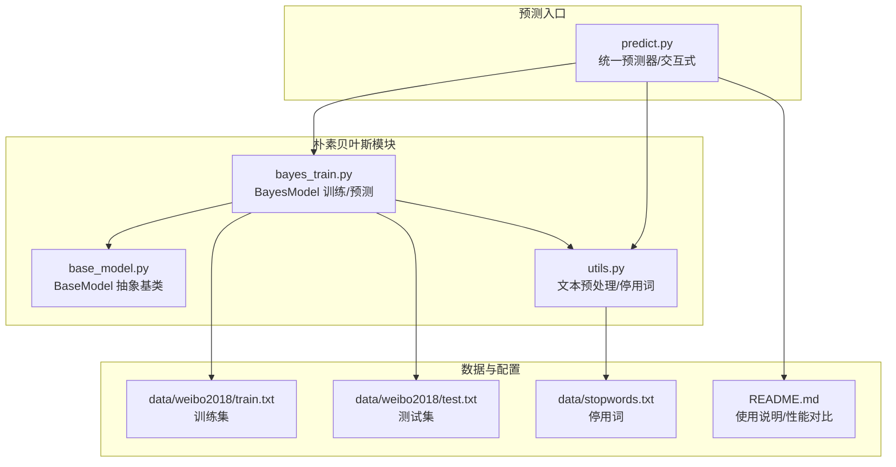
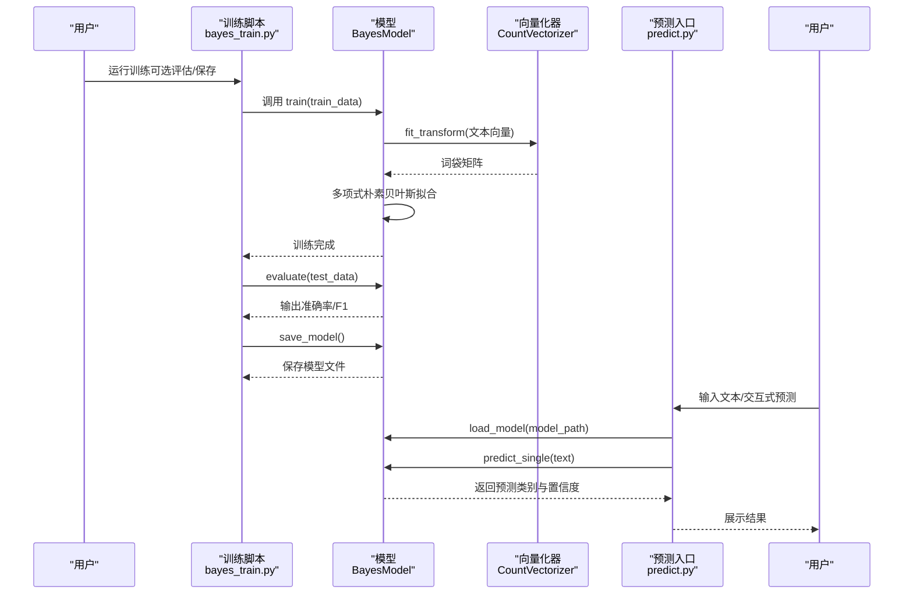
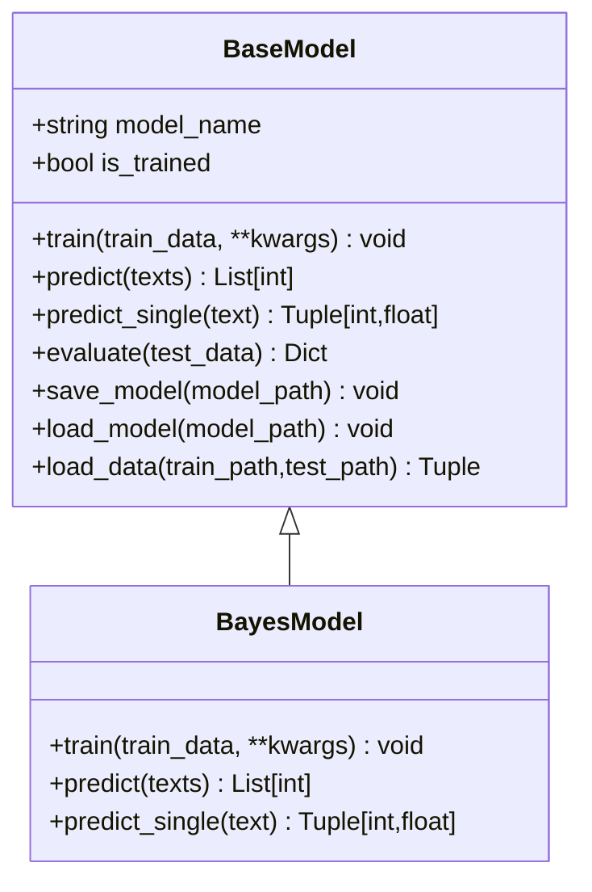
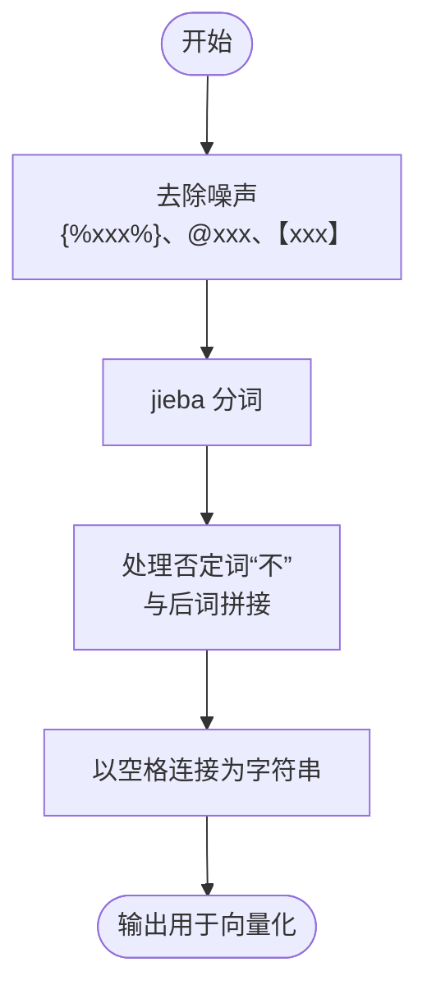
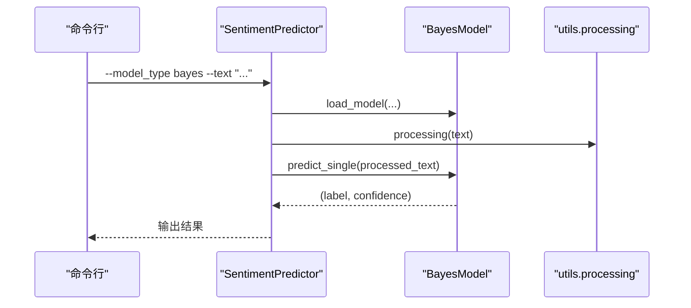
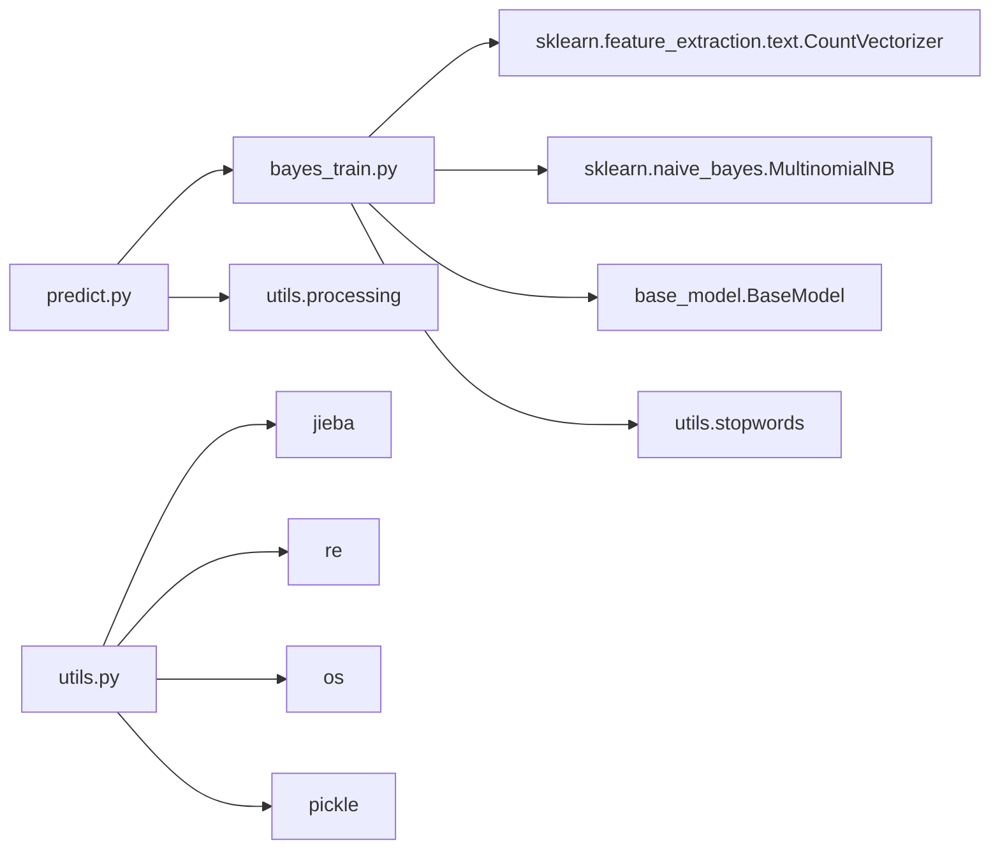

# 朴素贝叶斯情感分析

<cite>
**本文引用的文件**
- [bayes_train.py](file://SentimentAnalysisModel/WeiboSentiment_MachineLearning/bayes_train.py)
- [predict.py](file://SentimentAnalysisModel/WeiboSentiment_MachineLearning/predict.py)
- [utils.py](file://SentimentAnalysisModel/WeiboSentiment_MachineLearning/utils.py)
- [base_model.py](file://SentimentAnalysisModel/WeiboSentiment_MachineLearning/base_model.py)
- [README.md](file://SentimentAnalysisModel/WeiboSentiment_MachineLearning/README.md)
- [data/stopwords.txt](file://SentimentAnalysisModel/WeiboSentiment_MachineLearning/data/stopwords.txt)
- [data/weibo2018/train.txt](file://SentimentAnalysisModel/WeiboSentiment_MachineLearning/data/weibo2018/train.txt)
- [data/weibo2018/test.txt](file://SentimentAnalysisModel/WeiboSentiment_MachineLearning/data/weibo2018/test.txt)
</cite>

## 目录
1. [简介](#简介)
2. [项目结构](#项目结构)
3. [核心组件](#核心组件)
4. [架构总览](#架构总览)
5. [详细组件分析](#详细组件分析)
6. [依赖关系分析](#依赖关系分析)
7. [性能考量](#性能考量)
8. [故障排查指南](#故障排查指南)
9. [结论](#结论)
10. [附录](#附录)

## 简介
本文件围绕朴素贝叶斯情感分析在微博文本上的实现进行系统化说明，聚焦于以下要点：
- 训练脚本 bayes_train.py 如何使用词袋模型与多项式朴素贝叶斯进行训练；
- 特征提取流程（分词、去停用词、否定词处理）与概率计算机制；
- 训练脚本的调用方式与参数说明；
- 如何通过 predict.py 加载模型进行推理；
- 结合 utils.py 中的文本预处理函数，说明其对分类效果的影响；
- 与其他模型（SVM、XGBoost、LSTM、BERT）在准确率、速度与资源消耗上的对比与适用场景建议。

## 项目结构
与朴素贝叶斯情感分析直接相关的文件与职责如下：
- bayes_train.py：定义 BayesModel 类，封装训练、评估、保存与预测逻辑，使用 CountVectorizer 构建词袋模型，使用多项式朴素贝叶斯分类器。
- predict.py：统一预测入口，支持加载多种模型（含朴素贝叶斯），提供单条/批量预测与交互式预测，内部通过 utils.processing 对输入文本进行预处理。
- utils.py：提供停用词加载、文本清洗、分词与否定词拼接、BERT专用清洗等工具函数，以及通用的模型保存/加载。
- base_model.py：抽象基类，统一训练/评估/保存/加载接口，便于不同模型共享通用能力。
- README.md：项目说明、性能对比、训练与预测命令示例。
- data/stopwords.txt：停用词集合。
- data/weibo2018/train.txt、test.txt：微博情感数据集，包含标签与文本字段。

图表来源
- [bayes_train.py](file://SentimentAnalysisModel/WeiboSentiment_MachineLearning/bayes_train.py#L1-L155)
- [predict.py](file://SentimentAnalysisModel/WeiboSentiment_MachineLearning/predict.py#L1-L310)
- [utils.py](file://SentimentAnalysisModel/WeiboSentiment_MachineLearning/utils.py#L1-L138)
- [base_model.py](file://SentimentAnalysisModel/WeiboSentiment_MachineLearning/base_model.py#L1-L120)
- [README.md](file://SentimentAnalysisModel/WeiboSentiment_MachineLearning/README.md#L1-L108)

章节来源
- [README.md](file://SentimentAnalysisModel/WeiboSentiment_MachineLearning/README.md#L1-L108)

## 核心组件
- BayesModel（bayes_train.py）：继承 BaseModel，实现朴素贝叶斯训练与预测。训练阶段使用 CountVectorizer 构建词袋模型，并用多项式朴素贝叶斯拟合；预测阶段将文本转换为向量后进行类别预测与置信度计算。
- SentimentPredictor（predict.py）：统一预测器，支持加载多种模型（含朴素贝叶斯），提供单条/批量预测、集成预测与交互式预测；预测前通过 utils.processing 对输入文本进行清洗与分词。
- utils.processing（utils.py）：文本清洗（去除话题、@用户、特殊符号等）、分词、否定词“不”与后词拼接、空格连接为字符串；utils.stopwords 提供停用词列表。
- BaseModel（base_model.py）：统一的训练/评估/保存/加载接口，便于扩展其他模型。

章节来源
- [bayes_train.py](file://SentimentAnalysisModel/WeiboSentiment_MachineLearning/bayes_train.py#L1-L155)
- [predict.py](file://SentimentAnalysisModel/WeiboSentiment_MachineLearning/predict.py#L1-L310)
- [utils.py](file://SentimentAnalysisModel/WeiboSentiment_MachineLearning/utils.py#L1-L138)
- [base_model.py](file://SentimentAnalysisModel/WeiboSentiment_MachineLearning/base_model.py#L1-L120)

## 架构总览
朴素贝叶斯情感分析的端到端流程如下：
- 数据准备：从 data/weibo2018/train.txt 与 test.txt 加载样本，调用 utils.load_corpus（由 BaseModel.load_data 调用）。
- 文本预处理：训练与预测均通过 utils.processing 对原始文本进行清洗、分词与否定词处理。
- 特征工程：CountVectorizer 将文本转换为词袋向量，过滤停用词。
- 模型训练：多项式朴素贝叶斯拟合训练集向量与标签。
- 模型评估：使用 BaseModel.evaluate 计算准确率与F1。
- 推理：predict.py 加载已保存的 BayesModel，对输入文本进行预处理与预测。

图表来源
- [bayes_train.py](file://SentimentAnalysisModel/WeiboSentiment_MachineLearning/bayes_train.py#L1-L155)
- [predict.py](file://SentimentAnalysisModel/WeiboSentiment_MachineLearning/predict.py#L1-L310)
- [base_model.py](file://SentimentAnalysisModel/WeiboSentiment_MachineLearning/base_model.py#L1-L120)

## 详细组件分析

### 训练脚本 bayes_train.py
- 类 BayesModel
  - 继承 BaseModel，构造函数初始化 model_name="Bayes"。
  - train(train_data, **kwargs)：
    - 将 [(text, label)] 转为 DataFrame，准备特征与标签。
    - 使用 CountVectorizer 构建词袋模型，stop_words=utils.stopwords。
    - fit_transform 训练集文本，得到 X_train，y_train。
    - 初始化多项式朴素贝叶斯分类器并拟合。
    - 设置 is_trained=True。
  - predict(texts)：将 texts 转为向量后进行预测，返回类别列表。
  - predict_single(text)：返回 (预测类别, 置信度)。置信度取 predict_proba 的最大值。
- 主函数 main()：
  - 支持参数：--train_path、--test_path、--model_path、--eval_only。
  - eval_only 模式：加载已有模型，评估测试集。
  - 训练模式：加载数据、训练、评估、保存模型，并进行示例预测。

图表来源
- [base_model.py](file://SentimentAnalysisModel/WeiboSentiment_MachineLearning/base_model.py#L1-L120)
- [bayes_train.py](file://SentimentAnalysisModel/WeiboSentiment_MachineLearning/bayes_train.py#L1-L155)

章节来源
- [bayes_train.py](file://SentimentAnalysisModel/WeiboSentiment_MachineLearning/bayes_train.py#L1-L155)

### 文本预处理 utils.py
- 停用词加载：从 data/stopwords.txt 读取停用词列表，若文件不存在则提示并使用空列表。
- 数据加载：load_corpus(path) 读取 train.txt/test.txt，按行解析标签与文本，调用 processing 进行预处理。
- processing(text)：
  - 去除 、@xxx、【xxx】等噪声；
  - 使用 jieba.lcut 分词；
  - 对否定词“不”与后词进行拼接，避免否定语义被忽略；
  - 以空格连接为字符串，供 CountVectorizer 使用。
- processing_bert(text)：针对 BERT 的清洗版本，保留更多原始信息。
- 保存/加载：save_model/load_model 使用 pickle，便于持久化模型与向量化器。

图表来源
- [utils.py](file://SentimentAnalysisModel/WeiboSentiment_MachineLearning/utils.py#L1-L138)

章节来源
- [utils.py](file://SentimentAnalysisModel/WeiboSentiment_MachineLearning/utils.py#L1-L138)
- [data/stopwords.txt](file://SentimentAnalysisModel/WeiboSentiment_MachineLearning/data/stopwords.txt#L1-L28)

### 预测入口 predict.py
- SentimentPredictor：
  - load_model(model_type, model_path, **kwargs)：支持加载朴素贝叶斯模型（以及其他模型）。
  - load_all_models(model_dir, bert_path)：批量加载所有可用模型。
  - predict_single(text, model_type=None)：对单条文本进行预测，若未指定模型则对所有已加载模型进行预测。
  - predict_batch(texts, model_type=None)：批量预测。
  - ensemble_predict(text, weights=None)：多模型加权集成预测，按置信度合成最终结果。
  - interactive_predict()：交互式预测，支持查看已加载模型、切换模式、查看集成结果。
- 参数与调用：
  - --model_dir、--bert_path、--model_type、--text、--interactive、--ensemble。

图表来源
- [predict.py](file://SentimentAnalysisModel/WeiboSentiment_MachineLearning/predict.py#L1-L310)

章节来源
- [predict.py](file://SentimentAnalysisModel/WeiboSentiment_MachineLearning/predict.py#L1-L310)

### 训练与评估流程（代码级）
- 训练流程：加载数据 → 构建词袋 → 多项式朴素贝叶斯拟合 → 评估 → 保存。
- 评估指标：准确率与加权F1（BaseModel.evaluate）。
- 示例预测：在训练完成后对若干示例文本进行 predict_single，输出类别与置信度。

章节来源
- [bayes_train.py](file://SentimentAnalysisModel/WeiboSentiment_MachineLearning/bayes_train.py#L1-L155)
- [base_model.py](file://SentimentAnalysisModel/WeiboSentiment_MachineLearning/base_model.py#L1-L120)

## 依赖关系分析
- bayes_train.py 依赖：
  - sklearn.feature_extraction.text.CountVectorizer：词袋向量化。
  - sklearn.naive_bayes.MultinomialNB：多项式朴素贝叶斯分类器。
  - utils.stopwords：停用词列表。
  - base_model.BaseModel：统一接口与评估/保存/加载。
- predict.py 依赖：
  - bayes_train.BayesModel：加载与预测。
  - utils.processing：文本预处理。
- utils.py 依赖：
  - jieba：中文分词。
  - re：正则清洗。
  - os、pickle：文件与模型持久化。

图表来源
- [bayes_train.py](file://SentimentAnalysisModel/WeiboSentiment_MachineLearning/bayes_train.py#L1-L155)
- [predict.py](file://SentimentAnalysisModel/WeiboSentiment_MachineLearning/predict.py#L1-L310)
- [utils.py](file://SentimentAnalysisModel/WeiboSentiment_MachineLearning/utils.py#L1-L138)
- [base_model.py](file://SentimentAnalysisModel/WeiboSentiment_MachineLearning/base_model.py#L1-L120)

## 性能考量
- 准确率与速度：
  - README.md 显示在微博数据集上，朴素贝叶斯准确率与SVM持平，优于XGBoost，接近LSTM与BERT；同时具备“速度快、内存占用小”的特点。
- 资源消耗：
  - 朴素贝叶斯仅需训练与推理时的少量内存，适合在线推理与边缘部署。
- 特征规模：
  - CountVectorizer 生成的特征维度取决于词表大小，可通过 stop_words 与 token_pattern 控制；停用词与清洗策略直接影响特征质量与模型性能。

章节来源
- [README.md](file://SentimentAnalysisModel/WeiboSentiment_MachineLearning/README.md#L1-L108)

## 故障排查指南
- 模型未训练即预测：
  - BayesModel.predict/predict_single 会在未训练时抛出异常。请先调用 train 或加载已保存模型。
- 模型文件不存在：
  - predict.py/load_model 会在文件不存在时报错。请检查 --model_path 或使用 load_all_models 自动定位。
- 停用词文件缺失：
  - utils.stopwords 若找不到 data/stopwords.txt，会提示并使用空停用词列表。建议补齐停用词以提升特征质量。
- 数据格式问题：
  - data/weibo2018/train.txt/test.txt 为 CSV 风格，需确保字段顺序与解析逻辑一致（标签、文本）。
- 集成预测权重：
  - predict.py 的 ensemble_predict 默认等权聚合，若需自定义权重，可传入 weights 字典。

章节来源
- [bayes_train.py](file://SentimentAnalysisModel/WeiboSentiment_MachineLearning/bayes_train.py#L1-L155)
- [predict.py](file://SentimentAnalysisModel/WeiboSentiment_MachineLearning/predict.py#L1-L310)
- [utils.py](file://SentimentAnalysisModel/WeiboSentiment_MachineLearning/utils.py#L1-L138)

## 结论
朴素贝叶斯在微博情感分析任务中具有良好的平衡性：在准确率与资源占用之间表现稳健，适合快速迭代与在线部署。其性能优势主要来源于：
- 简洁高效的特征工程（词袋+停用词过滤+否定词处理）；
- 多项式朴素贝叶斯对离散特征的良好建模；
- 统一的训练/评估/保存/加载接口，便于扩展与集成。

在实际应用中，建议：
- 使用 utils.processing 保证预处理一致性；
- 通过 predict.py 的交互式与集成预测功能提升用户体验；
- 在资源受限场景优先选择朴素贝叶斯，若对准确率有更高要求可考虑SVM/XGBoost/LSTM/BERT。

## 附录

### 训练脚本调用方式与参数
- 基本训练：
  - python bayes_train.py
- 评估已有模型：
  - python bayes_train.py --eval_only --model_path ./model/bayes_model.pkl
- 指定数据路径与保存路径：
  - python bayes_train.py --train_path ./data/weibo2018/train.txt --test_path ./data/weibo2018/test.txt --model_path ./model/bayes_model.pkl

章节来源
- [bayes_train.py](file://SentimentAnalysisModel/WeiboSentiment_MachineLearning/bayes_train.py#L97-L155)

### 预测脚本调用方式与参数
- 交互式预测（默认）：
  - python predict.py
- 指定模型与文本：
  - python predict.py --model_type bayes --text "今天天气真好，心情很棒"
- 集成预测：
  - python predict.py --ensemble --text "这部电影太无聊了"

章节来源
- [predict.py](file://SentimentAnalysisModel/WeiboSentiment_MachineLearning/predict.py#L254-L310)

### 数据文件说明
- 停用词：data/stopwords.txt
- 训练集：data/weibo2018/train.txt
- 测试集：data/weibo2018/test.txt

章节来源
- [data/stopwords.txt](file://SentimentAnalysisModel/WeiboSentiment_MachineLearning/data/stopwords.txt#L1-L28)
- [data/weibo2018/train.txt](file://SentimentAnalysisModel/WeiboSentiment_MachineLearning/data/weibo2018/train.txt#L10-L120)
- [data/weibo2018/test.txt](file://SentimentAnalysisModel/WeiboSentiment_MachineLearning/data/weibo2018/test.txt#L10-L120)