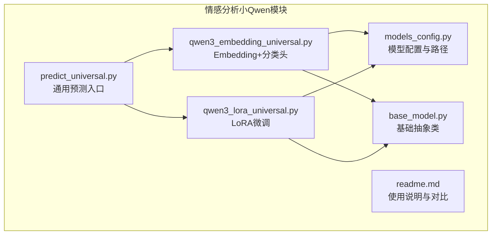
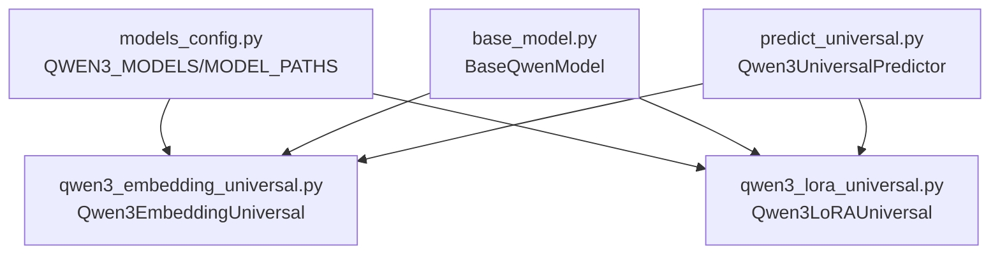
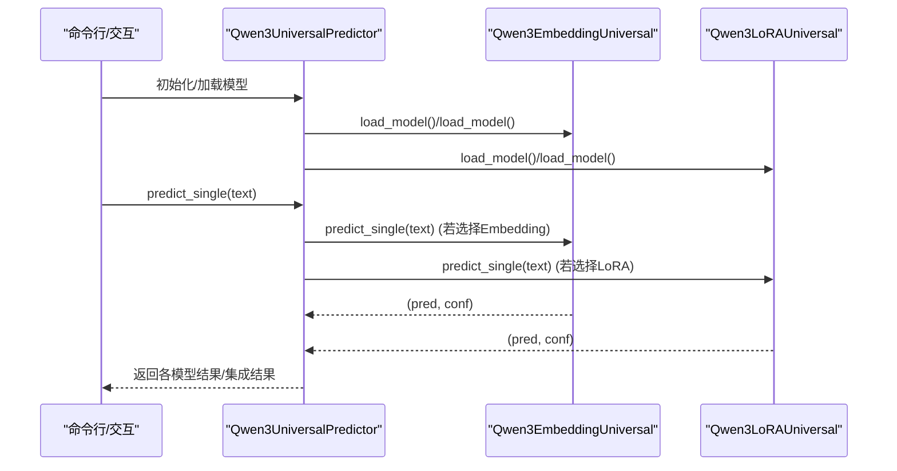
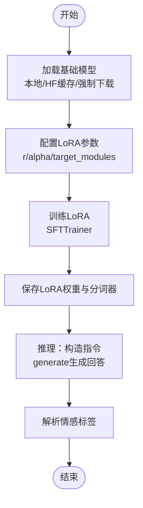
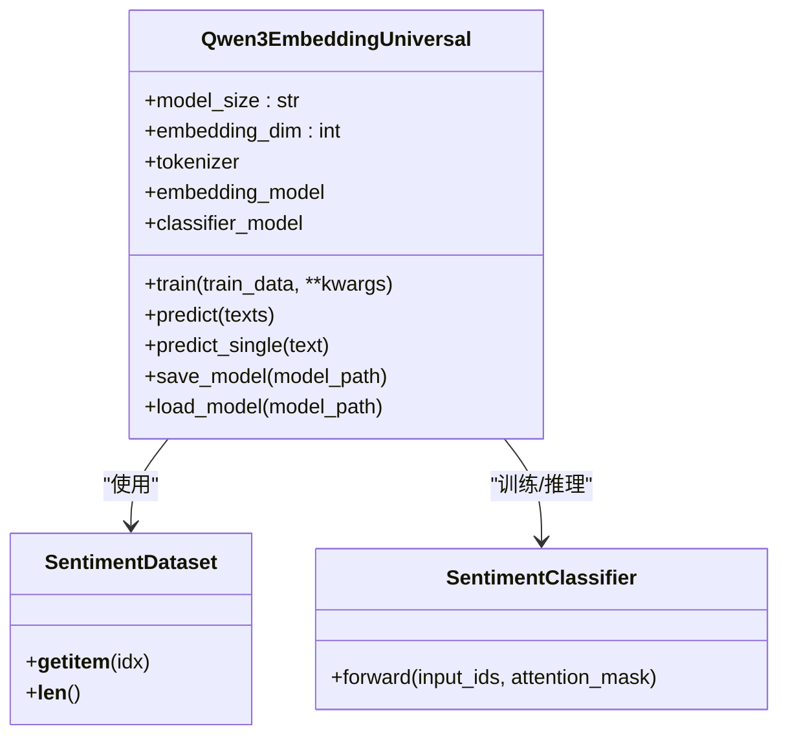
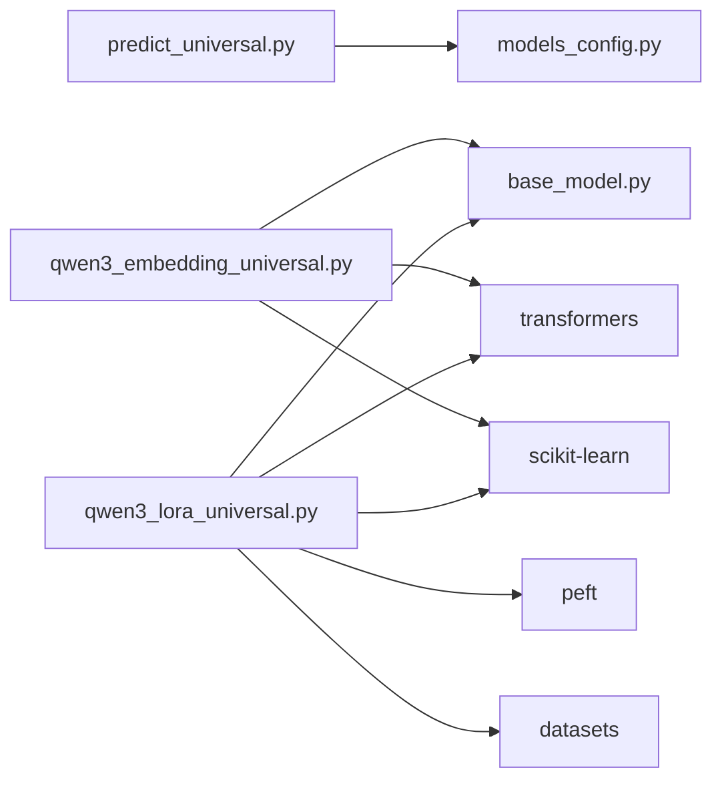
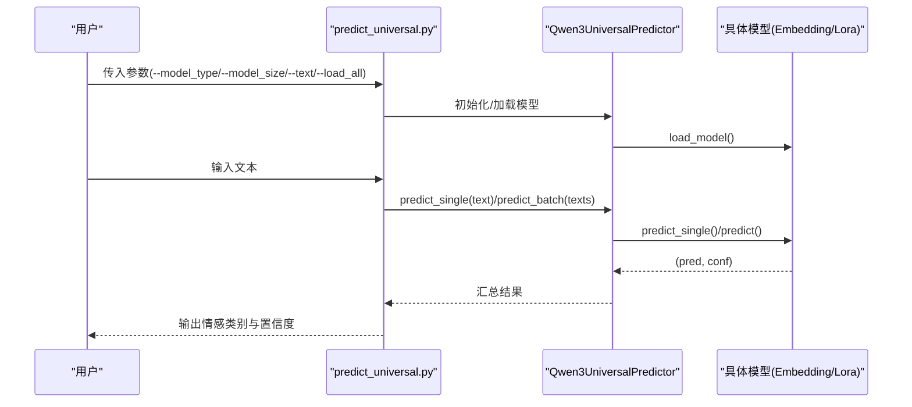

# 基于小参数Qwen3的情感分析模型

<cite>
**本文引用的文件**
- [predict_universal.py](file://SentimentAnalysisModel/WeiboSentiment_SmallQwen/predict_universal.py)
- [qwen3_lora_universal.py](file://SentimentAnalysisModel/WeiboSentiment_SmallQwen/qwen3_lora_universal.py)
- [qwen3_embedding_universal.py](file://SentimentAnalysisModel/WeiboSentiment_SmallQwen/qwen3_embedding_universal.py)
- [models_config.py](file://SentimentAnalysisModel/WeiboSentiment_SmallQwen/models_config.py)
- [base_model.py](file://SentimentAnalysisModel/WeiboSentiment_SmallQwen/base_model.py)
- [readme.md](file://SentimentAnalysisModel/WeiboSentiment_SmallQwen/readme.md)
</cite>

## 目录
1. [简介](#简介)
2. [项目结构](#项目结构)
3. [核心组件](#核心组件)
4. [架构总览](#架构总览)
5. [详细组件分析](#详细组件分析)
6. [依赖关系分析](#依赖关系分析)
7. [性能考量](#性能考量)
8. [故障排查指南](#故障排查指南)
9. [结论](#结论)
10. [附录](#附录)

## 简介
本项目面向资源受限环境，提供基于小参数Qwen3（0.6B/4B/8B）的情感分析解决方案，重点通过LoRA微调实现轻量化部署，兼顾高准确率与低显存占用，适用于边缘设备或高并发服务场景。文档聚焦以下目标：
- 解析通用预测接口与适配器集成逻辑
- 说明模型路径、批次大小、最大序列长度等关键配置项的作用
- 提供从加载模型到输出情感评分的完整调用流程示例
- 强调在保持较高准确率的同时显著降低显存占用的优势

## 项目结构
本模块位于 SentimentAnalysisModel/WeiboSentiment_SmallQwen 目录下，包含通用预测入口、LoRA微调与Embedding分类头两种训练/推理路径、基础抽象类以及配置文件。

图表来源
- [predict_universal.py](file://SentimentAnalysisModel/WeiboSentiment_SmallQwen/predict_universal.py#L1-L120)
- [qwen3_embedding_universal.py](file://SentimentAnalysisModel/WeiboSentiment_SmallQwen/qwen3_embedding_universal.py#L1-L120)
- [qwen3_lora_universal.py](file://SentimentAnalysisModel/WeiboSentiment_SmallQwen/qwen3_lora_universal.py#L1-L120)
- [models_config.py](file://SentimentAnalysisModel/WeiboSentiment_SmallQwen/models_config.py#L1-L53)
- [base_model.py](file://SentimentAnalysisModel/WeiboSentiment_SmallQwen/base_model.py#L1-L80)
- [readme.md](file://SentimentAnalysisModel/WeiboSentiment_SmallQwen/readme.md#L1-L98)

章节来源
- [predict_universal.py](file://SentimentAnalysisModel/WeiboSentiment_SmallQwen/predict_universal.py#L1-L120)
- [qwen3_embedding_universal.py](file://SentimentAnalysisModel/WeiboSentiment_SmallQwen/qwen3_embedding_universal.py#L1-L120)
- [qwen3_lora_universal.py](file://SentimentAnalysisModel/WeiboSentiment_SmallQwen/qwen3_lora_universal.py#L1-L120)
- [models_config.py](file://SentimentAnalysisModel/WeiboSentiment_SmallQwen/models_config.py#L1-L53)
- [base_model.py](file://SentimentAnalysisModel/WeiboSentiment_SmallQwen/base_model.py#L1-L80)
- [readme.md](file://SentimentAnalysisModel/WeiboSentiment_SmallQwen/readme.md#L1-L98)

## 核心组件
- 通用预测器：统一加载与调用Embedding+分类头与LoRA两种路径的模型，支持单条/批量/集成预测与交互式预测。
- Embedding+分类头：冻结Embedding模型，训练小型分类头，推理快速、显存占用低。
- LoRA微调：冻结基础模型参数，仅训练LoRA适配器，效果更佳但显存占用更高。
- 基础抽象类：统一训练、预测、评估、保存/加载接口，便于扩展。
- 配置中心：集中管理不同规模模型的基础模型名称、嵌入维度、最大长度、推荐超参与模型保存路径。

章节来源
- [predict_universal.py](file://SentimentAnalysisModel/WeiboSentiment_SmallQwen/predict_universal.py#L22-L180)
- [qwen3_embedding_universal.py](file://SentimentAnalysisModel/WeiboSentiment_SmallQwen/qwen3_embedding_universal.py#L84-L170)
- [qwen3_lora_universal.py](file://SentimentAnalysisModel/WeiboSentiment_SmallQwen/qwen3_lora_universal.py#L28-L120)
- [base_model.py](file://SentimentAnalysisModel/WeiboSentiment_SmallQwen/base_model.py#L14-L78)
- [models_config.py](file://SentimentAnalysisModel/WeiboSentiment_SmallQwen/models_config.py#L7-L53)

## 架构总览
整体架构由“配置驱动 + 抽象基类 + 具体实现 + 通用预测入口”构成。通用预测器负责模型生命周期管理与调用，具体实现分别对接Embedding+分类头与LoRA两种方案。

图表来源
- [models_config.py](file://SentimentAnalysisModel/WeiboSentiment_SmallQwen/models_config.py#L7-L53)
- [base_model.py](file://SentimentAnalysisModel/WeiboSentiment_SmallQwen/base_model.py#L14-L78)
- [qwen3_embedding_universal.py](file://SentimentAnalysisModel/WeiboSentiment_SmallQwen/qwen3_embedding_universal.py#L84-L170)
- [qwen3_lora_universal.py](file://SentimentAnalysisModel/WeiboSentiment_SmallQwen/qwen3_lora_universal.py#L28-L120)
- [predict_universal.py](file://SentimentAnalysisModel/WeiboSentiment_SmallQwen/predict_universal.py#L22-L120)

## 详细组件分析

### 通用预测接口（predict_universal.py）
- 功能要点
  - 统一加载：支持按类型（embedding/lora）与规模（0.6B/4B/8B）加载模型；支持加载全部或指定组合。
  - 统一预测：提供单条、批量与集成预测；集成策略基于各模型置信度的简单平均。
  - 交互式体验：提供菜单式选择、模型切换、性能对比等交互功能。
  - CLI入口：支持命令行参数控制加载、预测与集成模式。
- 关键流程
  - 加载阶段：根据配置文件定位模型路径，校验文件存在后实例化对应模型对象并缓存。
  - 预测阶段：调用具体模型的predict_single/predict接口，返回情感类别与置信度。
  - 集成阶段：对多个模型的预测结果进行聚合，得到最终类别与置信度。

图表来源
- [predict_universal.py](file://SentimentAnalysisModel/WeiboSentiment_SmallQwen/predict_universal.py#L22-L180)
- [qwen3_embedding_universal.py](file://SentimentAnalysisModel/WeiboSentiment_SmallQwen/qwen3_embedding_universal.py#L225-L279)
- [qwen3_lora_universal.py](file://SentimentAnalysisModel/WeiboSentiment_SmallQwen/qwen3_lora_universal.py#L275-L323)

章节来源
- [predict_universal.py](file://SentimentAnalysisModel/WeiboSentiment_SmallQwen/predict_universal.py#L22-L180)
- [predict_universal.py](file://SentimentAnalysisModel/WeiboSentiment_SmallQwen/predict_universal.py#L180-L377)

### LoRA微调适配器集成（qwen3_lora_universal.py）
- 适配器集成逻辑
  - 基础模型加载：优先本地缓存，其次HuggingFace缓存，最后强制下载；自动保存至本地models目录。
  - LoRA配置：基于配置文件设定秩与alpha，冻结基础模型参数，仅训练LoRA适配器。
  - 训练流程：构造指令格式数据，分词与标签映射，使用SFTTrainer进行训练，保存LoRA权重与分词器。
  - 推理流程：加载基础模型与LoRA权重，构造指令模板，调用generate生成回答，解析情感标签并给出置信度。
- 关键点
  - 显存占用：LoRA微调需要加载基础模型与LoRA权重，显存需求高于Embedding+分类头。
  - 性能上限：相比Embedding+分类头，LoRA通常具备更高的性能上限，适合复杂情感任务。

图表来源
- [qwen3_lora_universal.py](file://SentimentAnalysisModel/WeiboSentiment_SmallQwen/qwen3_lora_universal.py#L45-L130)
- [qwen3_lora_universal.py](file://SentimentAnalysisModel/WeiboSentiment_SmallQwen/qwen3_lora_universal.py#L167-L263)
- [qwen3_lora_universal.py](file://SentimentAnalysisModel/WeiboSentiment_SmallQwen/qwen3_lora_universal.py#L290-L354)

章节来源
- [qwen3_lora_universal.py](file://SentimentAnalysisModel/WeiboSentiment_SmallQwen/qwen3_lora_universal.py#L28-L120)
- [qwen3_lora_universal.py](file://SentimentAnalysisModel/WeiboSentiment_SmallQwen/qwen3_lora_universal.py#L120-L263)
- [qwen3_lora_universal.py](file://SentimentAnalysisModel/WeiboSentiment_SmallQwen/qwen3_lora_universal.py#L264-L354)

### Embedding+分类头（qwen3_embedding_universal.py）
- 训练流程
  - 冻结Embedding模型参数，仅训练小型分类头（全连接+Dropout+Sigmoid）。
  - 数据集封装：将文本转为input_ids/attention_mask/label张量。
  - 训练循环：BCE损失+Adam优化器，按批次前向、反向与更新。
- 推理流程
  - 对输入文本分词后，前向传播获取首token位置的隐藏状态，送入分类头得到概率，阈值化得到类别与置信度。

图表来源
- [qwen3_embedding_universal.py](file://SentimentAnalysisModel/WeiboSentiment_SmallQwen/qwen3_embedding_universal.py#L22-L83)
- [qwen3_embedding_universal.py](file://SentimentAnalysisModel/WeiboSentiment_SmallQwen/qwen3_embedding_universal.py#L84-L170)
- [qwen3_embedding_universal.py](file://SentimentAnalysisModel/WeiboSentiment_SmallQwen/qwen3_embedding_universal.py#L225-L326)

章节来源
- [qwen3_embedding_universal.py](file://SentimentAnalysisModel/WeiboSentiment_SmallQwen/qwen3_embedding_universal.py#L22-L83)
- [qwen3_embedding_universal.py](file://SentimentAnalysisModel/WeiboSentiment_SmallQwen/qwen3_embedding_universal.py#L84-L170)
- [qwen3_embedding_universal.py](file://SentimentAnalysisModel/WeiboSentiment_SmallQwen/qwen3_embedding_universal.py#L225-L326)

### 基础抽象类（base_model.py）
- 角色：统一训练、预测、评估、保存/加载接口，子类只需实现具体细节。
- 评估：内置准确率与加权F1分数计算，并输出分类报告。
- 数据加载：优先CSV，其次txt，否则提供样例数据演示。

章节来源
- [base_model.py](file://SentimentAnalysisModel/WeiboSentiment_SmallQwen/base_model.py#L14-L78)
- [base_model.py](file://SentimentAnalysisModel/WeiboSentiment_SmallQwen/base_model.py#L80-L171)

### 配置中心（models_config.py）
- QWEN3_MODELS：定义不同规模模型的基础模型名称、嵌入模型名称、嵌入维度、最大长度、推荐批大小、推荐学习率、LoRA秩与alpha。
- MODEL_PATHS：定义Embedding与LoRA两类模型的保存/加载路径，按规模区分。

章节来源
- [models_config.py](file://SentimentAnalysisModel/WeiboSentiment_SmallQwen/models_config.py#L7-L53)

## 依赖关系分析
- 组件耦合
  - predict_universal.py 通过 models_config.py 间接依赖 QWEN3_MODELS/MODEL_PATHS，实现对不同规模模型的统一管理。
  - qwen3_embedding_universal.py 与 qwen3_lora_universal.py 均继承自 base_model.py，共享训练/评估/保存/加载接口契约。
  - 两者均依赖 transformers 与 torch，LoRA路径额外依赖 peft 与 datasets。
- 外部依赖
  - transformers：加载基础模型与分词器
  - torch：张量运算与设备调度
  - peft：LoRA适配器
  - datasets：训练数据集封装
  - scikit-learn：评估指标

图表来源
- [predict_universal.py](file://SentimentAnalysisModel/WeiboSentiment_SmallQwen/predict_universal.py#L17-L21)
- [qwen3_embedding_universal.py](file://SentimentAnalysisModel/WeiboSentiment_SmallQwen/qwen3_embedding_universal.py#L1-L20)
- [qwen3_lora_universal.py](file://SentimentAnalysisModel/WeiboSentiment_SmallQwen/qwen3_lora_universal.py#L9-L17)
- [base_model.py](file://SentimentAnalysisModel/WeiboSentiment_SmallQwen/base_model.py#L1-L13)

章节来源
- [predict_universal.py](file://SentimentAnalysisModel/WeiboSentiment_SmallQwen/predict_universal.py#L17-L21)
- [qwen3_embedding_universal.py](file://SentimentAnalysisModel/WeiboSentiment_SmallQwen/qwen3_embedding_universal.py#L1-L20)
- [qwen3_lora_universal.py](file://SentimentAnalysisModel/WeiboSentiment_SmallQwen/qwen3_lora_universal.py#L9-L17)
- [base_model.py](file://SentimentAnalysisModel/WeiboSentiment_SmallQwen/base_model.py#L1-L13)

## 性能考量
- 显存占用
  - Embedding+分类头：仅加载小型分类头，显存占用低，适合资源受限与高并发场景。
  - LoRA微调：需加载基础模型与LoRA权重，显存占用较高，但通常取得更好效果。
- 推理速度
  - Embedding+分类头：一次前向传播即可完成，延迟低。
  - LoRA微调：采用自回归生成，速度较慢，但灵活性更高。
- 批大小与序列长度
  - 配置文件提供推荐批大小与最大长度，实际运行中可根据显存与任务需求调整。
- 集成预测
  - 通用预测器支持多模型集成，提升稳定性与鲁棒性。

章节来源
- [readme.md](file://SentimentAnalysisModel/WeiboSentiment_SmallQwen/readme.md#L25-L40)
- [readme.md](file://SentimentAnalysisModel/WeiboSentiment_SmallQwen/readme.md#L89-L98)
- [models_config.py](file://SentimentAnalysisModel/WeiboSentiment_SmallQwen/models_config.py#L7-L39)
- [predict_universal.py](file://SentimentAnalysisModel/WeiboSentiment_SmallQwen/predict_universal.py#L140-L179)

## 故障排查指南
- 模型文件不存在
  - 现象：加载模型时报错或跳过。
  - 处理：确认模型路径配置正确，先进行训练或检查本地/缓存/HF下载是否成功。
- 基础模型下载失败
  - 现象：本地缓存与HF缓存均失败。
  - 处理：检查网络与HF缓存路径，必要时手动下载并放置到本地models目录。
- 未训练即预测
  - 现象：抛出“尚未训练”的异常。
  - 处理：先执行训练流程，再进行预测。
- 数据格式不正确
  - 现象：数据加载失败或样例数据演示。
  - 处理：确保CSV包含'review'与'label'列，或txt每行格式为'文本内容<tab>标签'。

章节来源
- [predict_universal.py](file://SentimentAnalysisModel/WeiboSentiment_SmallQwen/predict_universal.py#L32-L67)
- [qwen3_lora_universal.py](file://SentimentAnalysisModel/WeiboSentiment_SmallQwen/qwen3_lora_universal.py#L102-L130)
- [qwen3_embedding_universal.py](file://SentimentAnalysisModel/WeiboSentiment_SmallQwen/qwen3_embedding_universal.py#L139-L161)
- [base_model.py](file://SentimentAnalysisModel/WeiboSentiment_SmallQwen/base_model.py#L80-L171)

## 结论
本模块通过“配置驱动 + 抽象基类 + 两条推理路径”的设计，实现了对小参数Qwen3情感分析任务的灵活部署。Embedding+分类头路径在资源受限与高并发场景下具有明显优势；LoRA微调路径在准确性与灵活性方面更胜一筹。结合通用预测器与集成策略，可在不同业务需求间灵活取舍。

## 附录

### 从加载模型到输出情感评分的完整调用流程示例
- 方式A：命令行直接预测
  - 指定模型类型与规模，传入待分析文本，返回各模型的预测结果与置信度。
- 方式B：交互式预测
  - 启动后选择方法（Embedding+分类头或LoRA微调）与模型规模，输入文本进行预测，支持切换模型与性能对比。
- 方式C：批量预测与集成
  - 加载多个模型后，对一批文本进行批量预测，再进行集成得到最终结果。

图表来源
- [predict_universal.py](file://SentimentAnalysisModel/WeiboSentiment_SmallQwen/predict_universal.py#L326-L377)
- [predict_universal.py](file://SentimentAnalysisModel/WeiboSentiment_SmallQwen/predict_universal.py#L109-L179)

章节来源
- [predict_universal.py](file://SentimentAnalysisModel/WeiboSentiment_SmallQwen/predict_universal.py#L326-L377)
- [readme.md](file://SentimentAnalysisModel/WeiboSentiment_SmallQwen/readme.md#L70-L98)

### 关键配置项说明
- QWEN3_MODELS
  - base_model/embedding_model：基础与Embedding模型名称，用于加载。
  - embedding_dim：嵌入维度，决定分类头输入特征维。
  - max_length：最大序列长度，影响分词与显存占用。
  - recommended_batch_size/recommended_lr：推荐批大小与学习率，便于快速起步。
  - lora_r/lora_alpha：LoRA秩与alpha，控制适配器容量与缩放。
- MODEL_PATHS
  - embedding/lora：按规模划分的模型保存/加载路径，统一管理。

章节来源
- [models_config.py](file://SentimentAnalysisModel/WeiboSentiment_SmallQwen/models_config.py#L7-L53)