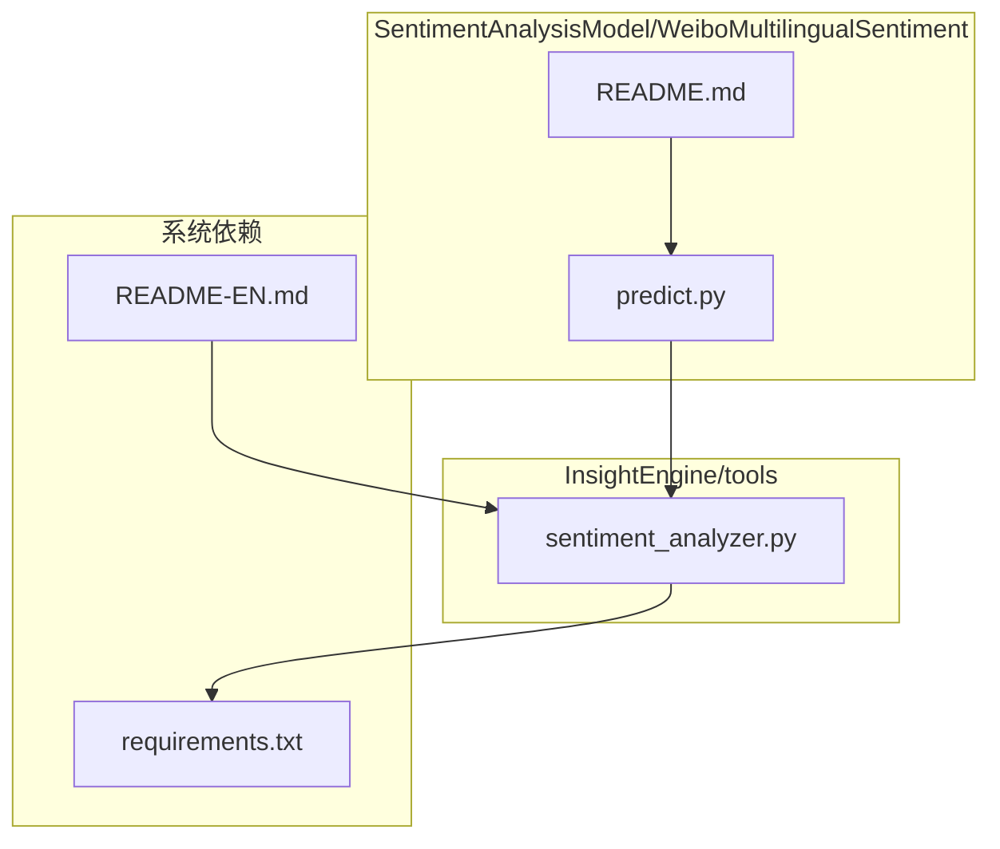
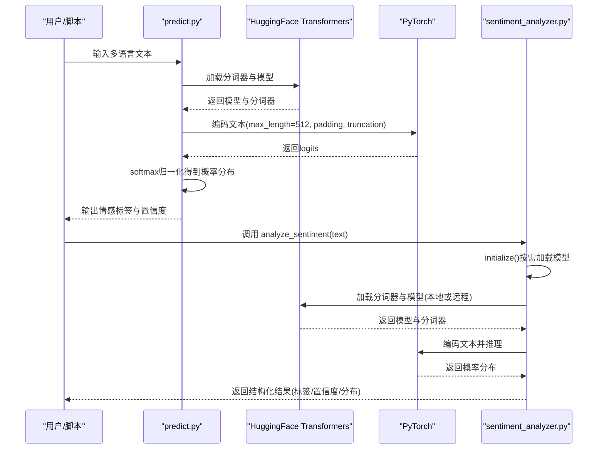
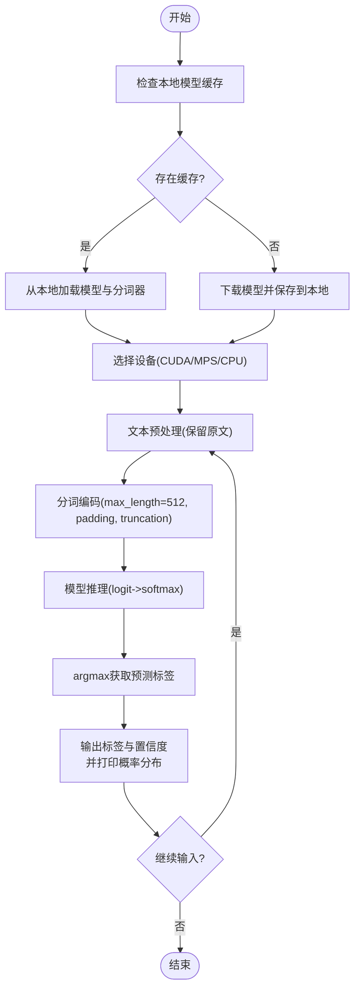
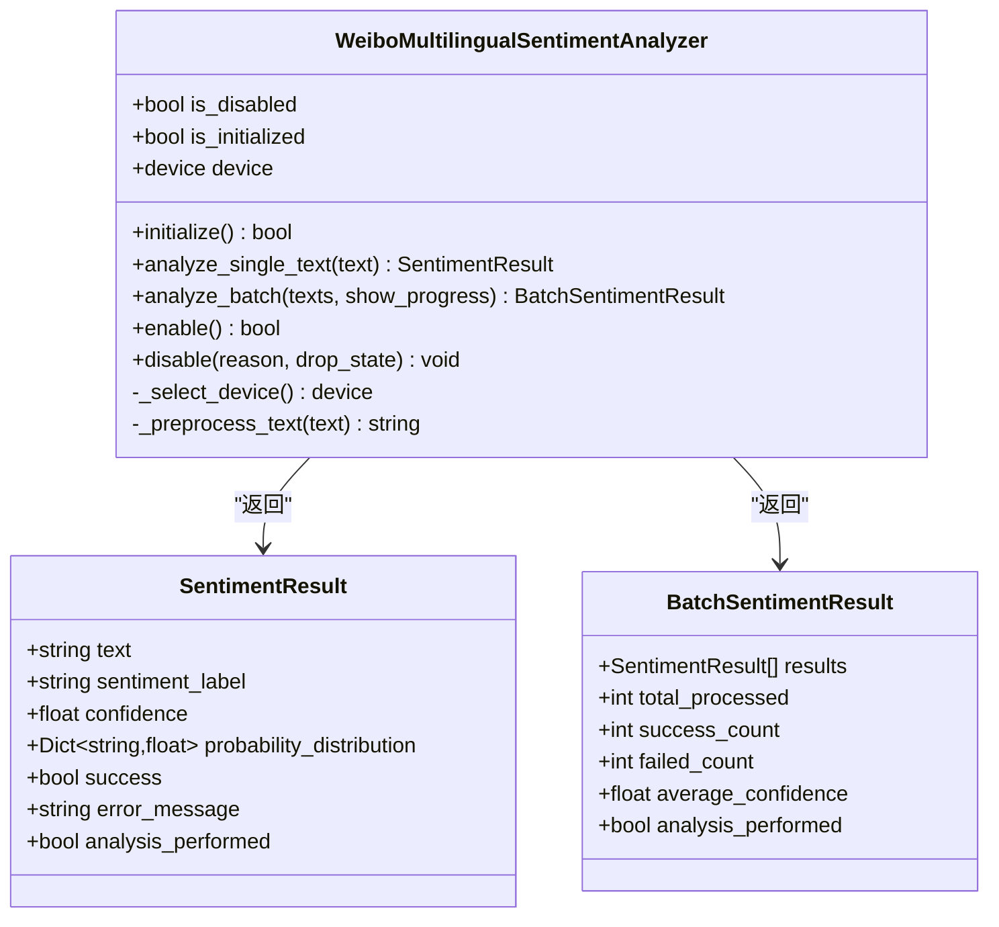
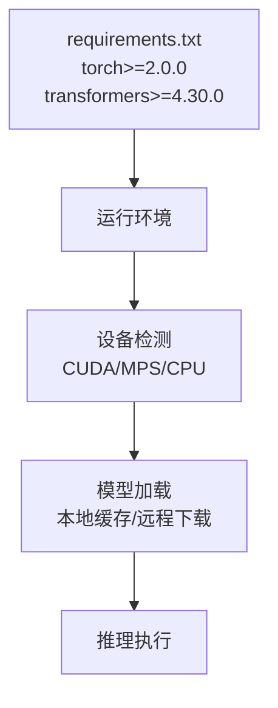

# 微博多语言情感分析模型

<cite>
**本文引用的文件**
- [README.md](file://SentimentAnalysisModel/WeiboMultilingualSentiment/README.md)
- [predict.py](file://SentimentAnalysisModel/WeiboMultilingualSentiment/predict.py)
- [sentiment_analyzer.py](file://InsightEngine/tools/sentiment_analyzer.py)
- [requirements.txt](file://requirements.txt)
- [README-EN.md](file://README-EN.md)
</cite>

## 目录
1. [简介](#简介)
2. [项目结构](#项目结构)
3. [核心组件](#核心组件)
4. [架构总览](#架构总览)
5. [详细组件分析](#详细组件分析)
6. [依赖分析](#依赖分析)
7. [性能考虑](#性能考虑)
8. [故障排查指南](#故障排查指南)
9. [结论](#结论)
10. [附录](#附录)

## 简介
本技术文档围绕 WeiboMultilingualSentiment 模型展开，面向希望在多语言微博内容上进行情感分类（非常负面、负面、中性、正面、非常正面）的用户与开发者。文档将系统性说明：
- 模型如何支持多语言文本的情感识别
- predict.py 中核心函数（如 predict_sentiment 的等价流程）的输入参数、返回值结构与内部处理流程
- 在 Python 脚本与命令行中的实际调用示例
- 结合 README.md 的部署说明，给出依赖安装与运行环境配置
- 在跨语言舆情分析中的典型应用场景、语言覆盖范围与潜在性能瓶颈

## 项目结构
WeiboMultilingualSentiment 模型位于 SentimentAnalysisModel/WeiboMultilingualSentiment 目录下，提供独立的预测入口；同时，InsightEngine/tools/sentiment_analyzer.py 提供统一的多语言情感分析封装，便于在 AI Agent 中复用。

图表来源
- [README.md](file://SentimentAnalysisModel/WeiboMultilingualSentiment/README.md#L1-L113)
- [predict.py](file://SentimentAnalysisModel/WeiboMultilingualSentiment/predict.py#L1-L190)
- [sentiment_analyzer.py](file://InsightEngine/tools/sentiment_analyzer.py#L1-L200)
- [requirements.txt](file://requirements.txt#L61-L67)
- [README-EN.md](file://README-EN.md#L591-L607)

章节来源
- [README.md](file://SentimentAnalysisModel/WeiboMultilingualSentiment/README.md#L1-L113)
- [predict.py](file://SentimentAnalysisModel/WeiboMultilingualSentiment/predict.py#L1-L190)
- [sentiment_analyzer.py](file://InsightEngine/tools/sentiment_analyzer.py#L1-L200)
- [requirements.txt](file://requirements.txt#L61-L67)
- [README-EN.md](file://README-EN.md#L591-L607)

## 核心组件
- WeiboMultilingualSentiment 独立预测程序：提供交互式 CLI，支持多语言文本输入与示例演示，输出情感标签与置信度分布。
- InsightEngine 多语言情感分析器：封装模型加载、设备选择、推理与结果结构化，提供单文本与批量分析接口，便于在 AI Agent 中集成。

章节来源
- [README.md](file://SentimentAnalysisModel/WeiboMultilingualSentiment/README.md#L1-L113)
- [predict.py](file://SentimentAnalysisModel/WeiboMultilingualSentiment/predict.py#L1-L190)
- [sentiment_analyzer.py](file://InsightEngine/tools/sentiment_analyzer.py#L79-L234)

## 架构总览
WeiboMultilingualSentiment 的推理链路由两部分组成：
- 独立预测入口：直接加载 HuggingFace 模型，进行分词、推理与概率归一化，输出情感标签与置信度。
- 统一封装入口：通过 InsightEngine 的情感分析器，延迟初始化模型，自动选择设备（CUDA/MPS/CPU），提供统一的结果数据结构与批量处理能力。

图表来源
- [predict.py](file://SentimentAnalysisModel/WeiboMultilingualSentiment/predict.py#L1-L190)
- [sentiment_analyzer.py](file://InsightEngine/tools/sentiment_analyzer.py#L158-L234)

## 详细组件分析

### 组件A：WeiboMultilingualSentiment 独立预测程序
- 功能概述
  - 自动检测本地是否存在模型缓存，存在则直接加载；否则从 HuggingFace 下载并保存至本地目录，便于后续快速启动。
  - 自动选择设备（CUDA/MPS/CPU），并在控制台打印设备信息。
  - 提供交互式输入循环，支持输入“demo”查看多语言示例，支持输入“q”退出。
  - 输出情感标签与置信度，同时打印全部类别的概率分布。

- 关键流程（以 predict.py 为主）
  - 模型加载与缓存：根据本地路径是否存在模型决定加载策略。
  - 文本预处理：当前实现为保留原文，便于多语言直接处理。
  - 编码与推理：使用 AutoTokenizer 与 AutoModelForSequenceClassification，max_length=512，padding=True，truncation=True，return_tensors='pt'。
  - 结果解析：softmax 归一化得到概率分布，argmax 获取预测标签，输出标签与置信度，并打印各分类概率。

- 输入参数与返回值
  - 输入：文本字符串（多语言均可）
  - 返回：情感标签（非常负面/负面/中性/正面/非常正面）与置信度（0~1），并附带全类别概率分布
  - 交互式示例：支持输入“demo”触发内置多语言示例，输出对应语言与预测结果

- 实际调用示例
  - 命令行运行：进入模型目录后执行脚本，按提示输入文本或“demo”
  - 代码示例：参考 README.md 中的示例，展示如何使用 AutoTokenizer 与 AutoModelForSequenceClassification 进行推理

图表来源
- [predict.py](file://SentimentAnalysisModel/WeiboMultilingualSentiment/predict.py#L1-L190)

章节来源
- [README.md](file://SentimentAnalysisModel/WeiboMultilingualSentiment/README.md#L1-L113)
- [predict.py](file://SentimentAnalysisModel/WeiboMultilingualSentiment/predict.py#L1-L190)

### 组件B：InsightEngine 多语言情感分析器
- 功能概述
  - 封装 WeiboMultilingualSentiment 模型，提供统一的 initialize、analyze_single_text、analyze_batch 接口。
  - 自动检测依赖（torch、transformers），若缺失则禁用情感分析功能。
  - 自动选择最佳设备（CUDA/MPS/CPU），并记录设备类型。
  - 统一结果结构：包含文本、情感标签、置信度、概率分布、成功标志与错误信息等。

- 关键流程
  - 初始化：按需加载模型与分词器，保存到本地缓存目录，设置设备并进入推理模式。
  - 单文本分析：预处理文本，编码，推理，构建结果对象。
  - 批量分析：遍历文本列表，逐条分析，统计成功率、失败数与平均置信度。

- 输入参数与返回值
  - analyze_sentiment(text_or_texts, initialize_if_needed)
    - 参数：text_or_texts（字符串或字符串列表），initialize_if_needed（是否自动初始化）
    - 返回：单文本返回 SentimentResult，批量返回 BatchSentimentResult
  - analyze_single_text(text)
    - 返回：SentimentResult（包含文本、标签、置信度、概率分布、成功标志、错误信息）
  - analyze_batch(texts, show_progress)
    - 返回：BatchSentimentResult（包含 results 列表、总数、成功数、失败数、平均置信度）

- 实际调用示例
  - 在脚本中调用 analyze_sentiment("I love this!") 或 analyze_sentiment(["文本1","文本2"])，内部会按需初始化模型并返回结构化结果
  - 也可直接构造 WeiboMultilingualSentimentAnalyzer 并调用 initialize()/analyze_single_text()/analyze_batch()

图表来源
- [sentiment_analyzer.py](file://InsightEngine/tools/sentiment_analyzer.py#L54-L101)
- [sentiment_analyzer.py](file://InsightEngine/tools/sentiment_analyzer.py#L242-L356)
- [sentiment_analyzer.py](file://InsightEngine/tools/sentiment_analyzer.py#L357-L429)

章节来源
- [sentiment_analyzer.py](file://InsightEngine/tools/sentiment_analyzer.py#L79-L234)
- [sentiment_analyzer.py](file://InsightEngine/tools/sentiment_analyzer.py#L242-L356)
- [sentiment_analyzer.py](file://InsightEngine/tools/sentiment_analyzer.py#L357-L429)
- [sentiment_analyzer.py](file://InsightEngine/tools/sentiment_analyzer.py#L592-L628)
- [sentiment_analyzer.py](file://InsightEngine/tools/sentiment_analyzer.py#L647-L704)

## 依赖分析
- PyTorch 与 Transformers
  - 系统依赖文件 requirements.txt 中明确列出 torch 与 transformers 的最低版本要求，确保推理可用。
  - InsightEngine 的情感分析器在导入阶段检测这两个库的存在，若缺失则禁用情感分析功能。
- 运行环境
  - 自动检测 CUDA/MPS/CPU 设备，优先使用 GPU；若无可用 GPU，则回退到 CPU。
- 模型缓存
  - 首次运行会从 HuggingFace 下载模型并保存到本地目录，后续直接加载，减少网络开销。

图表来源
- [requirements.txt](file://requirements.txt#L61-L67)
- [sentiment_analyzer.py](file://InsightEngine/tools/sentiment_analyzer.py#L142-L157)
- [sentiment_analyzer.py](file://InsightEngine/tools/sentiment_analyzer.py#L180-L218)

章节来源
- [requirements.txt](file://requirements.txt#L61-L67)
- [sentiment_analyzer.py](file://InsightEngine/tools/sentiment_analyzer.py#L142-L157)
- [sentiment_analyzer.py](file://InsightEngine/tools/sentiment_analyzer.py#L180-L218)

## 性能考虑
- 设备选择
  - 优先使用 CUDA 或 MPS，显著降低推理时间；CPU 仅作为回退方案。
- 文本长度与批处理
  - 编码时采用 max_length=512，padding=True，truncation=True，避免超长文本导致显存不足。
  - 批量分析时逐条推理，适合中小规模任务；大规模数据建议分批或并行化（需自行扩展）。
- 模型缓存
  - 首次下载后本地缓存，后续启动无需网络，提升响应速度。
- 置信度与概率分布
  - softmax 输出的概率分布可用于二次决策或可视化，但不会改变推理性能。

[本节为通用性能建议，不直接分析具体文件]

## 故障排查指南
- 依赖缺失
  - 现象：情感分析被禁用，返回不可用状态
  - 处理：安装 torch 与 transformers 至满足 requirements.txt 的版本要求
- 网络问题
  - 现象：首次加载模型失败或超时
  - 处理：检查网络连通性，或离线准备本地模型缓存
- 设备不可用
  - 现象：未检测到可用 GPU，自动回退 CPU
  - 处理：确认驱动与 CUDA/MPS 环境；必要时调整硬件或使用 CPU
- 输入异常
  - 现象：空文本或编码异常
  - 处理：确保输入非空且符合预期格式；预处理会去除多余空白

章节来源
- [requirements.txt](file://requirements.txt#L61-L67)
- [sentiment_analyzer.py](file://InsightEngine/tools/sentiment_analyzer.py#L103-L118)
- [sentiment_analyzer.py](file://InsightEngine/tools/sentiment_analyzer.py#L235-L240)

## 结论
WeiboMultilingualSentiment 模型提供了多语言情感分类能力，支持 5 级细粒度情感标签。独立预测程序适合快速体验与演示，而 InsightEngine 的情感分析器更适合在 AI Agent 中进行集成与批量处理。通过本地缓存与设备自动选择，系统在易用性与性能之间取得平衡。建议在生产环境中结合业务需求，合理设置置信度阈值与结果聚合策略，以获得更稳健的跨语言舆情分析效果。

[本节为总结性内容，不直接分析具体文件]

## 附录

### A. 部署与运行环境配置
- 安装依赖
  - 使用 pip 安装 torch 与 transformers，版本满足 requirements.txt 的最低要求
- 运行方式
  - 独立运行：进入模型目录后执行 predict.py，按提示输入文本或“demo”
  - 集成运行：在脚本中调用 analyze_sentiment 或直接使用 WeiboMultilingualSentimentAnalyzer

章节来源
- [README.md](file://SentimentAnalysisModel/WeiboMultilingualSentiment/README.md#L31-L47)
- [requirements.txt](file://requirements.txt#L61-L67)
- [README-EN.md](file://README-EN.md#L591-L607)

### B. 实际调用示例（Python 脚本与命令行）
- 命令行示例
  - 参考 README-EN.md 中的示例，进入模型目录后执行 predict.py
- Python 脚本示例
  - 参考 README.md 中的示例，使用 AutoTokenizer 与 AutoModelForSequenceClassification 进行推理
- 在 InsightEngine 中使用
  - 调用 analyze_sentiment("文本") 或 analyze_sentiment(["文本1","文本2"])，内部按需初始化模型并返回结构化结果

章节来源
- [README.md](file://SentimentAnalysisModel/WeiboMultilingualSentiment/README.md#L54-L79)
- [README-EN.md](file://README-EN.md#L591-L607)
- [sentiment_analyzer.py](file://InsightEngine/tools/sentiment_analyzer.py#L647-L704)

### C. 语言覆盖与应用场景
- 语言覆盖
  - README.md 明确支持 22 种语言，涵盖中文、英文、西班牙文、阿拉伯文、日文、韩文等
  - 情感级别为 5 级（非常负面、负面、中性、正面、非常正面）
- 应用场景
  - 国际社交媒体监控、多语言客户反馈分析、全球产品评论情感分类、跨语言品牌情感追踪、多语言客服优化、国际市场研究

章节来源
- [README.md](file://SentimentAnalysisModel/WeiboMultilingualSentiment/README.md#L9-L30)
- [README.md](file://SentimentAnalysisModel/WeiboMultilingualSentiment/README.md#L87-L95)