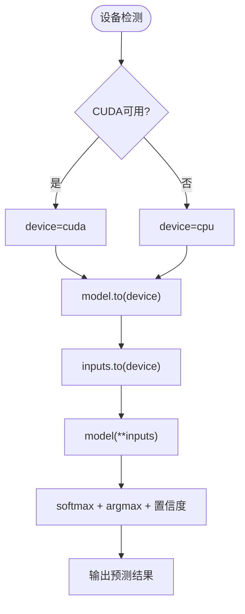

# BERT中文LoRA微调模型

<cite>
**本文引用的文件列表**
- [README.md](file://README.md)
- [predict.py](file://SentimentAnalysisModel/WeiboSentiment_Finetuned/BertChinese-Lora/predict.py)
- [predict_pipeline.py](file://SentimentAnalysisModel/WeiboSentiment_Finetuned/BertChinese-Lora/predict_pipeline.py)
- [README.md（BERT中文LoRA模块）](file://SentimentAnalysisModel/WeiboSentiment_Finetuned/BertChinese-Lora/README.md)
- [train.py（GPT2-Lora）](file://SentimentAnalysisModel/WeiboSentiment_Finetuned/GPT2-Lora/train.py)
- [requirements.txt](file://requirements.txt)
</cite>

## 目录
1. [引言](#引言)
2. [项目结构](#项目结构)
3. [核心组件](#核心组件)
4. [架构总览](#架构总览)
5. [组件详解](#组件详解)
6. [依赖关系分析](#依赖关系分析)
7. [性能考量](#性能考量)
8. [故障排查指南](#故障排查指南)
9. [结论](#结论)
10. [附录](#附录)

## 引言
本技术文档围绕基于HuggingFace预训练模型 wsqstar/GISchat-weibo-100k-fine-tuned-bert 的中文微博情感分析推理与可扩展文本预处理展开，重点说明：
- 基于 transformers 的直接模型调用与 pipeline 两种推理路径；
- 预处理函数的可扩展性设计，便于接入自定义清洗逻辑；
- 设备自动检测（CPU/GPU）与推理流程；
- 对比直接使用 AutoModelForSequenceClassification 与 pipeline 的性能差异；
- 结合 README 中的训练说明，概述 train.py 的关键配置参数（学习率、rank 值、dropout 等），帮助高级用户进行二次训练。

## 项目结构
BERT中文LoRA微调模型位于 SentimentAnalysisModel/WeiboSentiment_Finetuned/BertChinese-Lora 目录，包含以下关键文件：
- predict.py：直接模型调用的推理脚本，包含本地缓存、设备检测与推理流程。
- predict_pipeline.py：使用 transformers.pipeline 的简化推理脚本，包含基础文本预处理。
- README.md：使用说明与模型存储说明。

图表来源
- [predict.py](file://SentimentAnalysisModel/WeiboSentiment_Finetuned/BertChinese-Lora/predict.py#L1-L90)
- [predict_pipeline.py](file://SentimentAnalysisModel/WeiboSentiment_Finetuned/BertChinese-Lora/predict_pipeline.py#L1-L101)
- [README.md（BERT中文LoRA模块）](file://SentimentAnalysisModel/WeiboSentiment_Finetuned/BertChinese-Lora/README.md#L1-L78)

章节来源
- [README.md（BERT中文LoRA模块）](file://SentimentAnalysisModel/WeiboSentiment_Finetuned/BertChinese-Lora/README.md#L1-L78)

## 核心组件
- 预处理函数：提供可扩展的文本清洗入口，便于用户注入自定义清洗逻辑。
- 模型加载与缓存：优先从本地加载，若不存在则从 HuggingFace 下载并保存到本地，避免重复下载。
- 设备检测与推理：自动检测 CUDA/GPU，将模型与张量移动到设备，使用 torch.no_grad 进行推理。
- Pipeline 推理：使用 transformers.pipeline 的 text-classification 任务，返回全部分数并解析置信度。

章节来源
- [predict.py](file://SentimentAnalysisModel/WeiboSentiment_Finetuned/BertChinese-Lora/predict.py#L1-L90)
- [predict_pipeline.py](file://SentimentAnalysisModel/WeiboSentiment_Finetuned/BertChinese-Lora/predict_pipeline.py#L1-L101)

## 架构总览
BERT中文LoRA微调模型的推理路径分为两条主线：
- 直接模型调用：手动分词、编码、前向推理、softmax 后处理。
- Pipeline 方式：通过 pipeline 封装，简化调用流程，适合快速集成。

图表来源
- [predict.py](file://SentimentAnalysisModel/WeiboSentiment_Finetuned/BertChinese-Lora/predict.py#L1-L90)

图表来源
- [predict_pipeline.py](file://SentimentAnalysisModel/WeiboSentiment_Finetuned/BertChinese-Lora/predict_pipeline.py#L1-L101)

## 组件详解

### 预处理函数与可扩展性
- 预处理函数提供统一入口，当前实现返回原文本，便于用户扩展清洗规则（如去除 @、表情、特殊字符等）。
- 扩展建议：在保持输入字符串与输出字符串一致的前提下，按需添加正则清洗、停用词过滤、标准化等步骤。

图表来源
- [predict.py](file://SentimentAnalysisModel/WeiboSentiment_Finetuned/BertChinese-Lora/predict.py#L5-L7)
- [predict_pipeline.py](file://SentimentAnalysisModel/WeiboSentiment_Finetuned/BertChinese-Lora/predict_pipeline.py#L4-L14)

章节来源
- [predict.py](file://SentimentAnalysisModel/WeiboSentiment_Finetuned/BertChinese-Lora/predict.py#L5-L7)
- [predict_pipeline.py](file://SentimentAnalysisModel/WeiboSentiment_Finetuned/BertChinese-Lora/predict_pipeline.py#L4-L14)

### 模型加载与本地缓存机制
- 本地缓存：若 ./model 存在，则直接 from_pretrained 本地路径；否则从 HuggingFace 下载并保存到本地。
- 首次运行：自动下载模型与分词器，保存到本地目录，后续无需网络。
- 模型存储：README 指出模型大小约 400MB，首次下载需要网络连接。

图表来源
- [predict.py](file://SentimentAnalysisModel/WeiboSentiment_Finetuned/BertChinese-Lora/predict.py#L12-L32)
- [predict_pipeline.py](file://SentimentAnalysisModel/WeiboSentiment_Finetuned/BertChinese-Lora/predict_pipeline.py#L18-L50)
- [README.md（BERT中文LoRA模块）](file://SentimentAnalysisModel/WeiboSentiment_Finetuned/BertChinese-Lora/README.md#L67-L78)

章节来源
- [predict.py](file://SentimentAnalysisModel/WeiboSentiment_Finetuned/BertChinese-Lora/predict.py#L12-L32)
- [predict_pipeline.py](file://SentimentAnalysisModel/WeiboSentiment_Finetuned/BertChinese-Lora/predict_pipeline.py#L18-L50)
- [README.md（BERT中文LoRA模块）](file://SentimentAnalysisModel/WeiboSentiment_Finetuned/BertChinese-Lora/README.md#L67-L78)

### 设备自动检测与推理流程
- 设备检测：优先使用 CUDA，否则回退到 CPU。
- 推理流程：分词编码 → 移动到设备 → 前向推理 → softmax → argmax → 置信度计算 → 结果输出。
- Pipeline 流程：pipeline 自动处理设备分配与前向推理，返回分数列表，解析置信度。

图表来源
- [predict.py](file://SentimentAnalysisModel/WeiboSentiment_Finetuned/BertChinese-Lora/predict.py#L33-L88)
- [predict_pipeline.py](file://SentimentAnalysisModel/WeiboSentiment_Finetuned/BertChinese-Lora/predict_pipeline.py#L70-L98)

章节来源
- [predict.py](file://SentimentAnalysisModel/WeiboSentiment_Finetuned/BertChinese-Lora/predict.py#L33-L88)
- [predict_pipeline.py](file://SentimentAnalysisModel/WeiboSentiment_Finetuned/BertChinese-Lora/predict_pipeline.py#L70-L98)

### 调用 pipeline 接口进行批量预测
- pipeline 的 text-classification 任务支持 return_all_scores=True，便于获取正/负两类置信度。
- 预处理：可复用预处理函数，对输入文本进行清洗。
- 结果解析：遍历返回的分数列表，匹配 LABEL_1/LABEL_0，确定最终预测与置信度。

图表来源
- [predict_pipeline.py](file://SentimentAnalysisModel/WeiboSentiment_Finetuned/BertChinese-Lora/predict_pipeline.py#L15-L98)

章节来源
- [predict_pipeline.py](file://SentimentAnalysisModel/WeiboSentiment_Finetuned/BertChinese-Lora/predict_pipeline.py#L15-L98)

### 直接使用 AutoModelForSequenceClassification 的性能差异
- 直接模型调用：手动分词、编码、前向推理、softmax，可控性强，适合批量推理与自定义后处理。
- pipeline：封装度更高，调用便捷，但在批量处理时可能因额外封装与设备分配产生轻微开销。
- 性能建议：大批量推理时优先使用直接模型调用，配合 torch.no_grad 与固定 max_length、padding/truncation 策略，减少不必要的张量拷贝与重复计算。

章节来源
- [predict.py](file://SentimentAnalysisModel/WeiboSentiment_Finetuned/BertChinese-Lora/predict.py#L61-L88)
- [predict_pipeline.py](file://SentimentAnalysisModel/WeiboSentiment_Finetuned/BertChinese-Lora/predict_pipeline.py#L70-L98)

### LoRA（低秩适应）技术路径与参数说明
- LoRA 通过在预训练模型的注意力投影层等模块插入低秩矩阵，仅训练这些可训练参数，大幅降低显存占用与训练成本。
- 训练配置参考（来自 GPT2-Lora 的 train.py）：
  - rank（r）：控制可训练参数数量，r 越小参数越少，显存占用更低。
  - lora_alpha：LoRA 缩放因子，影响更新幅度。
  - dropout：训练时的丢弃概率，有助于正则化。
  - target_modules：指定 LoRA 注入的目标模块（如注意力投影层）。
  - 学习率：LoRA 训练通常使用较小学习率，以稳定收敛。
- 本仓库的 BertChinese-Lora 目录未包含 train.py，但 README 指明使用 wsqstar/GISchat-weibo-100k-fine-tuned-bert 进行推理。若需二次训练，可参考 GPT2-Lora 的 train.py 中的 LoRA 配置与训练流程。

图表来源
- [train.py（GPT2-Lora）](file://SentimentAnalysisModel/WeiboSentiment_Finetuned/GPT2-Lora/train.py#L231-L246)

章节来源
- [train.py（GPT2-Lora）](file://SentimentAnalysisModel/WeiboSentiment_Finetuned/GPT2-Lora/train.py#L231-L246)
- [README.md（BERT中文LoRA模块）](file://SentimentAnalysisModel/WeiboSentiment_Finetuned/BertChinese-Lora/README.md#L1-L20)

## 依赖关系分析
- 运行时依赖：torch、transformers、scikit-learn（可选）、xgboost（可选）等。
- 推理路径依赖：AutoTokenizer、AutoModelForSequenceClassification、pipeline。
- 设备依赖：CUDA 可用时优先使用 GPU，否则回退 CPU。

图表来源
- [requirements.txt](file://requirements.txt#L61-L67)
- [predict.py](file://SentimentAnalysisModel/WeiboSentiment_Finetuned/BertChinese-Lora/predict.py#L1-L4)
- [predict_pipeline.py](file://SentimentAnalysisModel/WeiboSentiment_Finetuned/BertChinese-Lora/predict_pipeline.py#L1-L2)

章节来源
- [requirements.txt](file://requirements.txt#L61-L67)
- [predict.py](file://SentimentAnalysisModel/WeiboSentiment_Finetuned/BertChinese-Lora/predict.py#L1-L4)
- [predict_pipeline.py](file://SentimentAnalysisModel/WeiboSentiment_Finetuned/BertChinese-Lora/predict_pipeline.py#L1-L2)

## 性能考量
- 显存占用：LoRA 仅训练低秩参数，显著降低显存占用；推理时仍需加载基础模型权重，但可利用 GPU 加速。
- 批量推理：直接模型调用更适合批量处理，建议固定 max_length、padding/truncation，减少重复计算。
- 设备选择：优先使用 CUDA，若显存不足，可降低 batch size 或 max_length。
- 网络与缓存：首次运行会下载模型到本地 ./model，后续无需网络，提升整体吞吐。

## 故障排查指南
- 模型加载失败：检查网络连接与本地缓存路径，确保 ./model 存在或首次运行能成功下载并保存。
- 设备不可用：确认 CUDA 可用性，或允许自动回退到 CPU。
- 输入为空：当输入为空时，程序会提示重新输入，避免空张量导致的异常。
- 预处理异常：若自定义预处理逻辑报错，建议在预处理函数中增加异常捕获与日志输出，定位问题。

章节来源
- [predict.py](file://SentimentAnalysisModel/WeiboSentiment_Finetuned/BertChinese-Lora/predict.py#L39-L42)
- [predict.py](file://SentimentAnalysisModel/WeiboSentiment_Finetuned/BertChinese-Lora/predict.py#L52-L54)
- [predict_pipeline.py](file://SentimentAnalysisModel/WeiboSentiment_Finetuned/BertChinese-Lora/predict_pipeline.py#L52-L55)

## 结论
- 本模块基于 wsqstar/GISchat-weibo-100k-fine-tuned-bert 提供高效的中文微博情感分析推理能力。
- 预处理函数具备良好的可扩展性，便于接入自定义清洗逻辑。
- 通过本地缓存与设备自动检测，实现快速、稳定的推理体验。
- 若需二次训练，可参考 GPT2-Lora 的 train.py 中的 LoRA 配置与训练流程，结合 rank、alpha、dropout 等参数进行调优。

## 附录
- 快速开始与使用示例可参考 BERT中文LoRA 模块的 README。
- 若需批量预测，优先使用直接模型调用路径，结合 pipeline 的简化路径进行对比验证。

章节来源
- [README.md（BERT中文LoRA模块）](file://SentimentAnalysisModel/WeiboSentiment_Finetuned/BertChinese-Lora/README.md#L14-L41)