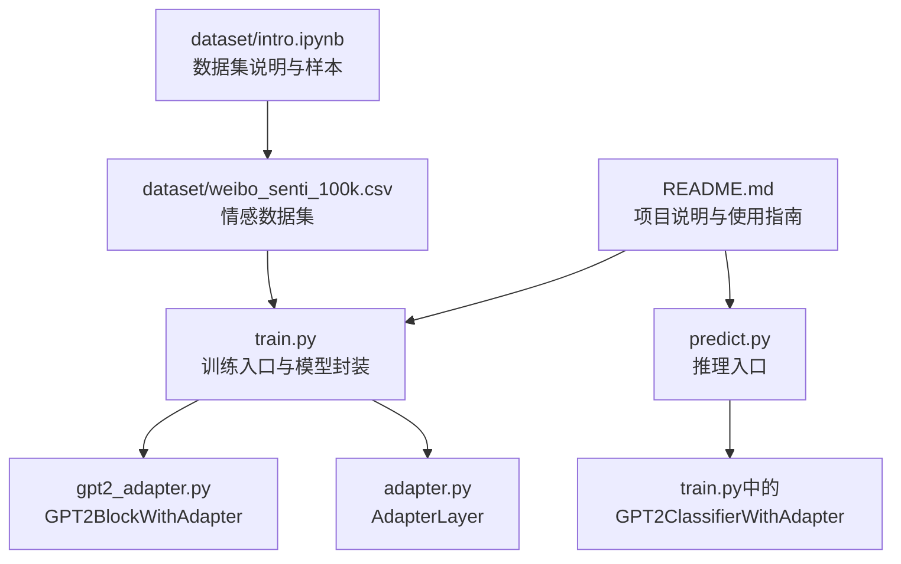
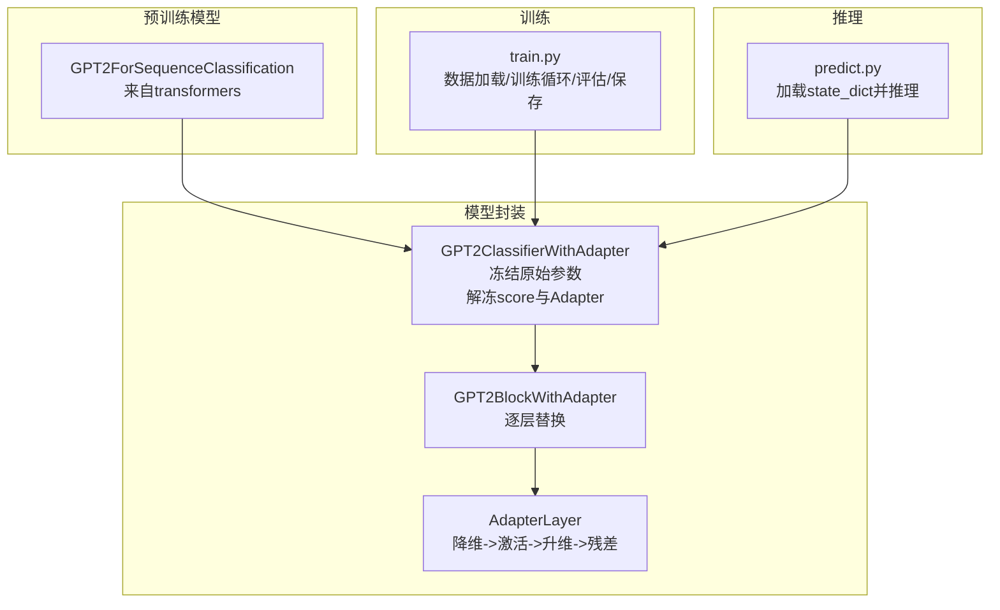
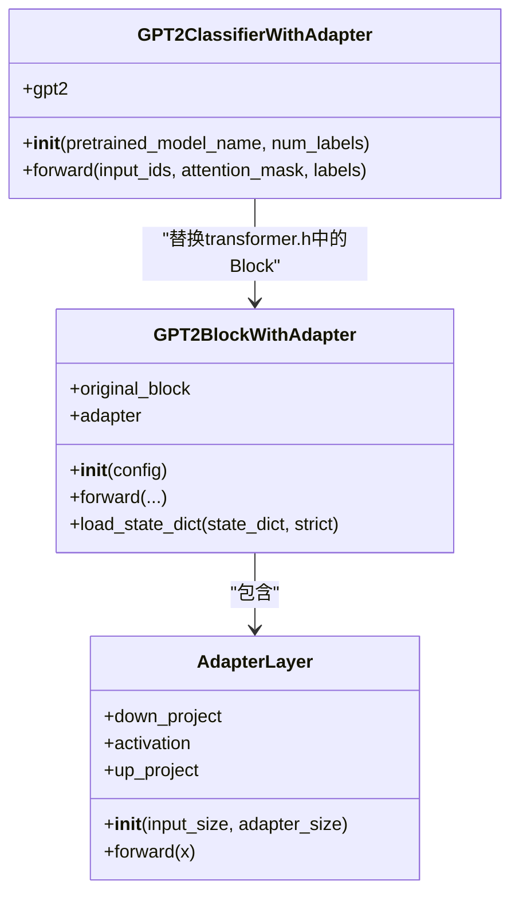
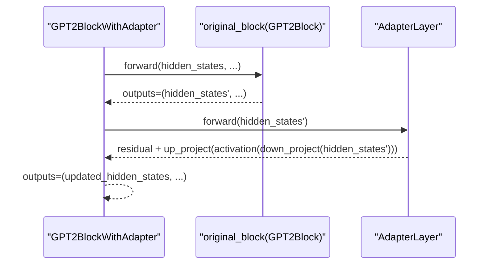
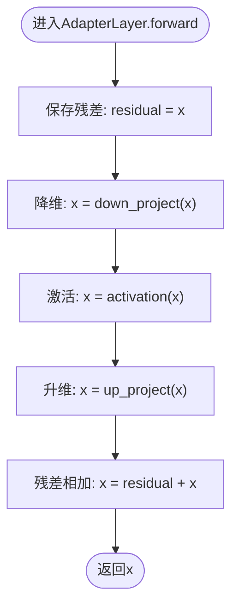
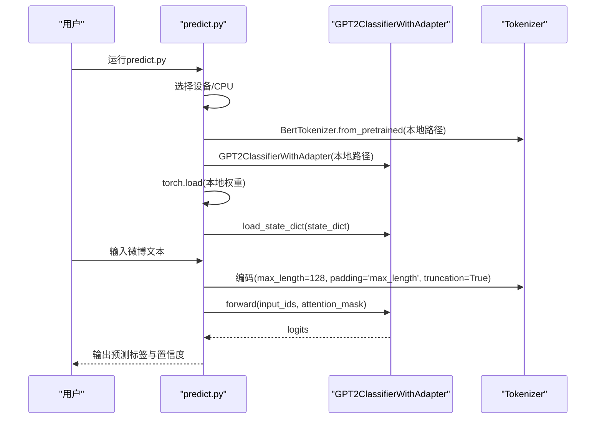
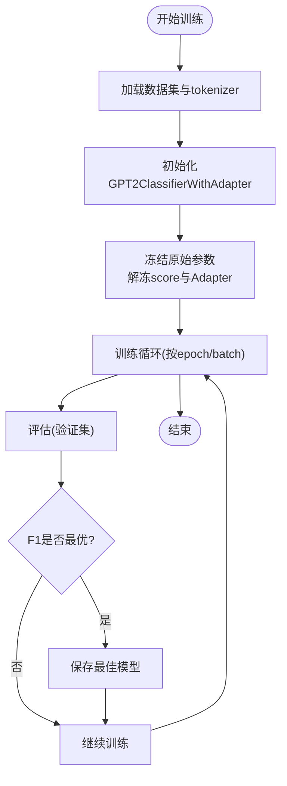
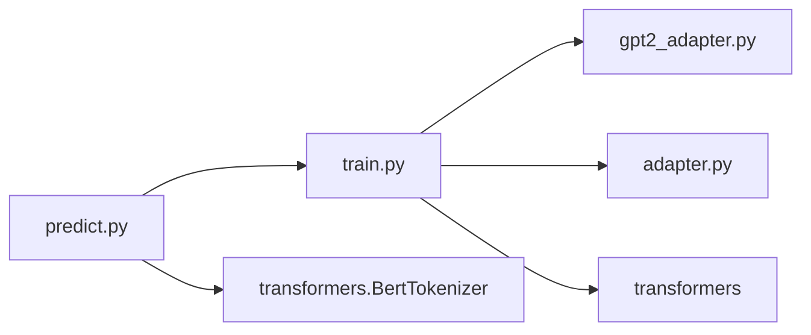

# GPT-2 Adapter Tuning微调模型

<cite>
**本文引用的文件**
- [train.py](file://SentimentAnalysisModel/WeiboSentiment_Finetuned/GPT2-AdapterTuning/train.py)
- [predict.py](file://SentimentAnalysisModel/WeiboSentiment_Finetuned/GPT2-AdapterTuning/predict.py)
- [gpt2_adapter.py](file://SentimentAnalysisModel/WeiboSentiment_Finetuned/GPT2-AdapterTuning/gpt2_adapter.py)
- [adapter.py](file://SentimentAnalysisModel/WeiboSentiment_Finetuned/GPT2-AdapterTuning/adapter.py)
- [README.md](file://SentimentAnalysisModel/WeiboSentiment_Finetuned/GPT2-AdapterTuning/README.md)
- [weibo_senti_100k.csv](file://SentimentAnalysisModel/WeiboSentiment_Finetuned/GPT2-AdapterTuning/dataset/weibo_senti_100k.csv)
- [intro.ipynb](file://SentimentAnalysisModel/WeiboSentiment_Finetuned/GPT2-AdapterTuning/dataset/intro.ipynb)
</cite>

## 目录
1. [引言](#引言)
2. [项目结构](#项目结构)
3. [核心组件](#核心组件)
4. [架构总览](#架构总览)
5. [关键组件详解](#关键组件详解)
6. [依赖关系分析](#依赖关系分析)
7. [性能与效率考量](#性能与效率考量)
8. [故障排查指南](#故障排查指南)
9. [结论](#结论)
10. [附录：扩展与实践建议](#附录扩展与实践建议)

## 引言
本技术文档围绕“GPT-2 Adapter Tuning微调模型”展开，系统阐述Adapter Tuning的核心思想与实现细节，重点分析GPT2ClassifierWithAdapter类的架构设计、Adapter模块的插入位置与前馈网络结构、残差连接策略，以及从本地加载state_dict并重建带Adapter的模型实例的流程。同时，对比Adapter Tuning与LoRA在参数量、推理延迟与训练稳定性方面的差异，给出可操作的扩展建议，帮助读者在实际任务中做出合理选择。

## 项目结构
该项目位于SentimentAnalysisModel/WeiboSentiment_Finetuned/GPT2-AdapterTuning目录，包含训练、预测、Adapter实现与数据集等核心文件。

图表来源
- [train.py](file://SentimentAnalysisModel/WeiboSentiment_Finetuned/GPT2-AdapterTuning/train.py#L1-L310)
- [predict.py](file://SentimentAnalysisModel/WeiboSentiment_Finetuned/GPT2-AdapterTuning/predict.py#L1-L69)
- [gpt2_adapter.py](file://SentimentAnalysisModel/WeiboSentiment_Finetuned/GPT2-AdapterTuning/gpt2_adapter.py#L1-L60)
- [adapter.py](file://SentimentAnalysisModel/WeiboSentiment_Finetuned/GPT2-AdapterTuning/adapter.py#L1-L42)
- [README.md](file://SentimentAnalysisModel/WeiboSentiment_Finetuned/GPT2-AdapterTuning/README.md#L1-L93)
- [weibo_senti_100k.csv](file://SentimentAnalysisModel/WeiboSentiment_Finetuned/GPT2-AdapterTuning/dataset/weibo_senti_100k.csv#L1-L120)
- [intro.ipynb](file://SentimentAnalysisModel/WeiboSentiment_Finetuned/GPT2-AdapterTuning/dataset/intro.ipynb#L1-L281)

章节来源
- [README.md](file://SentimentAnalysisModel/WeiboSentiment_Finetuned/GPT2-AdapterTuning/README.md#L1-L93)

## 核心组件
- GPT2ClassifierWithAdapter：在预训练GPT-2序列分类模型基础上，将每个Transformer Block替换为带Adapter的版本，并冻结原始参数，仅训练分类器与Adapter层，实现参数高效微调。
- GPT2BlockWithAdapter：在原有GPT2Block前向过程中，先调用原始Block，再将输出通过AdapterLayer，实现残差连接。
- AdapterLayer：通用Adapter组件，包含降维线性层、ReLU激活、升维线性层与残差连接，隐藏维度可配置。
- 训练脚本train.py：负责数据加载、模型初始化、参数冻结/解冻策略、训练循环、评估与最佳模型保存。
- 预测脚本predict.py：从本地加载最佳模型权重，重建模型实例，进行交互式情感分析。

章节来源
- [train.py](file://SentimentAnalysisModel/WeiboSentiment_Finetuned/GPT2-AdapterTuning/train.py#L56-L100)
- [gpt2_adapter.py](file://SentimentAnalysisModel/WeiboSentiment_Finetuned/GPT2-AdapterTuning/gpt2_adapter.py#L1-L60)
- [adapter.py](file://SentimentAnalysisModel/WeiboSentiment_Finetuned/GPT2-AdapterTuning/adapter.py#L1-L42)
- [predict.py](file://SentimentAnalysisModel/WeiboSentiment_Finetuned/GPT2-AdapterTuning/predict.py#L1-L69)

## 架构总览
下图展示了从预训练模型到带Adapter的GPT-2分类器的整体架构，以及训练与推理的关键流程。

图表来源
- [train.py](file://SentimentAnalysisModel/WeiboSentiment_Finetuned/GPT2-AdapterTuning/train.py#L56-L100)
- [gpt2_adapter.py](file://SentimentAnalysisModel/WeiboSentiment_Finetuned/GPT2-AdapterTuning/gpt2_adapter.py#L1-L60)
- [adapter.py](file://SentimentAnalysisModel/WeiboSentiment_Finetuned/GPT2-AdapterTuning/adapter.py#L1-L42)
- [predict.py](file://SentimentAnalysisModel/WeiboSentiment_Finetuned/GPT2-AdapterTuning/predict.py#L1-L69)

## 关键组件详解

### GPT2ClassifierWithAdapter类设计
- 预训练模型加载：从本地路径加载GPT2ForSequenceClassification，确保pad_token_id与eos一致。
- Block替换：遍历transformer.h中的每个GPT2Block，用GPT2BlockWithAdapter替换，并复制原始权重。
- 参数冻结与解冻：冻结所有原始参数，仅解冻分类器score层与Adapter层，实现参数高效微调。
- 前向传播：直接委托底层GPT2ForSequenceClassification的forward，传入input_ids、attention_mask与labels。

图表来源
- [train.py](file://SentimentAnalysisModel/WeiboSentiment_Finetuned/GPT2-AdapterTuning/train.py#L56-L100)
- [gpt2_adapter.py](file://SentimentAnalysisModel/WeiboSentiment_Finetuned/GPT2-AdapterTuning/gpt2_adapter.py#L1-L60)
- [adapter.py](file://SentimentAnalysisModel/WeiboSentiment_Finetuned/GPT2-AdapterTuning/adapter.py#L1-L42)

章节来源
- [train.py](file://SentimentAnalysisModel/WeiboSentiment_Finetuned/GPT2-AdapterTuning/train.py#L56-L100)

### GPT2BlockWithAdapter的修改逻辑
- 原始Block调用：forward中先调用original_block，传入所有支持的参数，保留其输出结构。
- 输出处理：取第一个元素（隐藏状态）作为Adapter的输入。
- Adapter接入：将隐藏状态通过AdapterLayer，实现降维-激活-升维-残差连接。
- 输出更新：将修改后的隐藏状态放回输出元组首位，其余输出保持不变。
- 权重加载：load_state_dict将state_dict传递给original_block，便于从原始GPT2Block恢复权重。

图表来源
- [gpt2_adapter.py](file://SentimentAnalysisModel/WeiboSentiment_Finetuned/GPT2-AdapterTuning/gpt2_adapter.py#L20-L54)

章节来源
- [gpt2_adapter.py](file://SentimentAnalysisModel/WeiboSentiment_Finetuned/GPT2-AdapterTuning/gpt2_adapter.py#L1-L60)

### AdapterLayer的前馈网络与残差连接
- 结构组成：降维线性层、ReLU激活、升维线性层。
- 初始化策略：降维与升维层均采用小幅度正态初始化，升维层偏置初始化为零，以降低对原始模型的初始扰动。
- 残差连接：输出与输入相加，保证信息流动稳定。

图表来源
- [adapter.py](file://SentimentAnalysisModel/WeiboSentiment_Finetuned/GPT2-AdapterTuning/adapter.py#L1-L42)

章节来源
- [adapter.py](file://SentimentAnalysisModel/WeiboSentiment_Finetuned/GPT2-AdapterTuning/adapter.py#L1-L42)

### 从本地加载state_dict并重建模型实例
- 设备选择：优先使用CUDA，否则CPU。
- 本地模型路径：使用本地gpt2-chinese模型与tokenizer。
- 模型重建：通过GPT2ClassifierWithAdapter(local_model_path)实例化带Adapter的分类器。
- 权重加载：torch.load加载best_weibo_sentiment_model.pth，映射到设备后调用model.load_state_dict。
- 推理：将编码后的input_ids与attention_mask送入模型，softmax得到概率分布，argmax得到类别。

图表来源
- [predict.py](file://SentimentAnalysisModel/WeiboSentiment_Finetuned/GPT2-AdapterTuning/predict.py#L1-L69)
- [train.py](file://SentimentAnalysisModel/WeiboSentiment_Finetuned/GPT2-AdapterTuning/train.py#L56-L100)

章节来源
- [predict.py](file://SentimentAnalysisModel/WeiboSentiment_Finetuned/GPT2-AdapterTuning/predict.py#L1-L69)

### 训练流程与评估
- 数据集：weibo_senti_100k.csv，包含约10万条情感标注的微博文本，正负向各约5万条。
- 数据加载：WeiboSentimentDataset封装编码与标签，DataLoader批量加载。
- 训练循环：AdamW优化器，线性warmup学习率调度，梯度裁剪，按batch更新。
- 评估：计算loss、accuracy与F1，保存最佳模型（F1最高）。

图表来源
- [train.py](file://SentimentAnalysisModel/WeiboSentiment_Finetuned/GPT2-AdapterTuning/train.py#L102-L196)
- [train.py](file://SentimentAnalysisModel/WeiboSentiment_Finetuned/GPT2-AdapterTuning/train.py#L197-L310)
- [weibo_senti_100k.csv](file://SentimentAnalysisModel/WeiboSentiment_Finetuned/GPT2-AdapterTuning/dataset/weibo_senti_100k.csv#L1-L120)
- [intro.ipynb](file://SentimentAnalysisModel/WeiboSentiment_Finetuned/GPT2-AdapterTuning/dataset/intro.ipynb#L1-L281)

章节来源
- [train.py](file://SentimentAnalysisModel/WeiboSentiment_Finetuned/GPT2-AdapterTuning/train.py#L102-L196)
- [train.py](file://SentimentAnalysisModel/WeiboSentiment_Finetuned/GPT2-AdapterTuning/train.py#L197-L310)
- [weibo_senti_100k.csv](file://SentimentAnalysisModel/WeiboSentiment_Finetuned/GPT2-AdapterTuning/dataset/weibo_senti_100k.csv#L1-L120)
- [intro.ipynb](file://SentimentAnalysisModel/WeiboSentiment_Finetuned/GPT2-AdapterTuning/dataset/intro.ipynb#L1-L281)

## 依赖关系分析
- train.py依赖：
  - adapter.py：AdapterLayer
  - gpt2_adapter.py：GPT2BlockWithAdapter
  - transformers：GPT2ForSequenceClassification、GPT2Config、get_linear_schedule_with_warmup
  - torch、sklearn、pandas、numpy、tqdm等
- predict.py依赖：
  - train.py中的GPT2ClassifierWithAdapter
  - transformers的BertTokenizer
  - torch

图表来源
- [train.py](file://SentimentAnalysisModel/WeiboSentiment_Finetuned/GPT2-AdapterTuning/train.py#L1-L30)
- [predict.py](file://SentimentAnalysisModel/WeiboSentiment_Finetuned/GPT2-AdapterTuning/predict.py#L1-L20)
- [gpt2_adapter.py](file://SentimentAnalysisModel/WeiboSentiment_Finetuned/GPT2-AdapterTuning/gpt2_adapter.py#L1-L10)
- [adapter.py](file://SentimentAnalysisModel/WeiboSentiment_Finetuned/GPT2-AdapterTuning/adapter.py#L1-L10)

章节来源
- [train.py](file://SentimentAnalysisModel/WeiboSentiment_Finetuned/GPT2-AdapterTuning/train.py#L1-L30)
- [predict.py](file://SentimentAnalysisModel/WeiboSentiment_Finetuned/GPT2-AdapterTuning/predict.py#L1-L20)

## 性能与效率考量
- 参数量对比（概念性说明）：
  - Adapter Tuning：仅训练Adapter层与分类器score层，参数量远小于全参数微调。
  - LoRA：在注意力投影矩阵上注入低秩分解，参数量同样显著低于全参，但实现与Adapter不同。
- 推理延迟：
  - Adapter：每层增加一次线性变换与残差，延迟略高于原模型，但通常可接受。
  - LoRA：在注意力计算中引入低秩矩阵乘，推理时需融合或显式执行，延迟取决于实现策略。
- 训练稳定性：
  - Adapter：通过残差连接与小幅度初始化，有助于稳定训练；冻结预训练权重可缓解灾难性遗忘。
  - LoRA：低秩更新通常更稳定，但秩的选择与学习率需谨慎调优。
- 实践建议：
  - 若追求极低参数量与快速部署，优先Adapter。
  - 若需在注意力结构上精细控制，可考虑LoRA。
  - 两种方法均可与梯度裁剪、warmup等常规技巧结合，提升收敛稳定性。

[本节为通用性能讨论，不直接分析具体文件，故无章节来源]

## 故障排查指南
- 本地模型路径不存在或不完整：
  - 现象：训练脚本报错或无法加载预训练权重。
  - 处理：确认本地模型路径存在config.json/pytorch_model.bin或model.safetensors；必要时重新下载并保存。
- pad_token_id不一致：
  - 现象：推理或训练时出现填充异常。
  - 处理：在训练脚本中显式设置model.gpt2.config.pad_token_id与tokenizer.pad_token_id一致。
- CUDA内存不足：
  - 现象：OOM错误。
  - 处理：降低batch size、缩短max_length、关闭不必要的调试输出。
- 权重加载失败：
  - 现象：load_state_dict报错。
  - 处理：检查state_dict键名与模型结构一致性；确保使用strict=False或兼容的加载方式。

章节来源
- [train.py](file://SentimentAnalysisModel/WeiboSentiment_Finetuned/GPT2-AdapterTuning/train.py#L250-L270)
- [predict.py](file://SentimentAnalysisModel/WeiboSentiment_Finetuned/GPT2-AdapterTuning/predict.py#L10-L30)

## 结论
本项目以Adapter Tuning为核心，通过在GPT-2的每个Transformer Block后插入轻量级Adapter层，实现了参数高效微调。训练脚本冻结原始参数，仅训练分类器与Adapter，显著降低了参数量与训练成本；推理脚本通过从本地加载state_dict重建模型，实现快速部署。Adapter的残差连接与小幅度初始化有助于稳定训练，适合资源受限场景与多任务共享基础模型的部署需求。

[本节为总结性内容，不直接分析具体文件，故无章节来源]

## 附录：扩展与实践建议
- 调整Adapter隐藏维度：
  - Adapter的隐藏维度（adapter_size）直接影响参数量与拟合能力。较小维度更节省参数，较大维度可能提升性能但增加开销。建议从64起步，结合验证集F1与推理延迟进行网格搜索。
- Adapter位置选择：
  - 本项目在每个GPT2Block后插入Adapter。也可尝试仅在部分层插入，或在注意力子层内部插入，以平衡参数与效果。
- 初始化与正则：
  - 保持AdapterLayer的初始化策略（小幅度权重、升维层偏置接近零），并结合权重衰减与梯度裁剪，提升训练稳定性。
- 与LoRA对比：
  - 若需在注意力投影矩阵上注入低秩更新，可参考LoRA实现；两者均可显著降低参数量，但适用场景与实现细节不同，建议根据任务特性与部署约束选择。

[本节为扩展建议，不直接分析具体文件，故无章节来源]