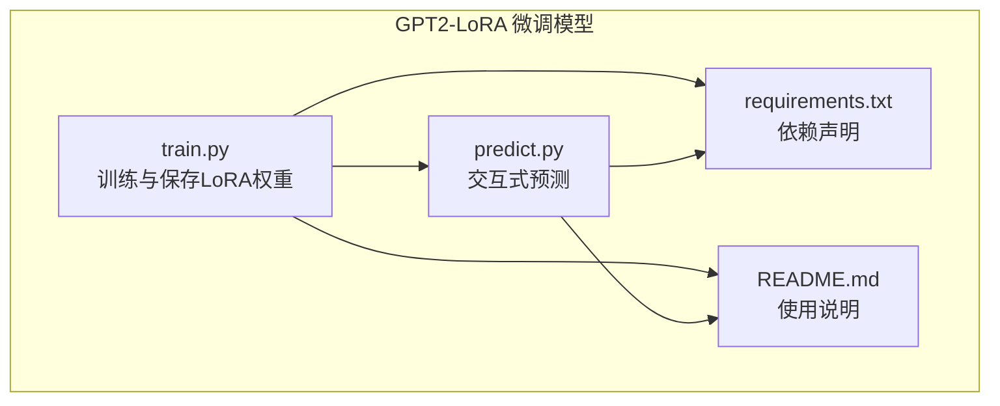
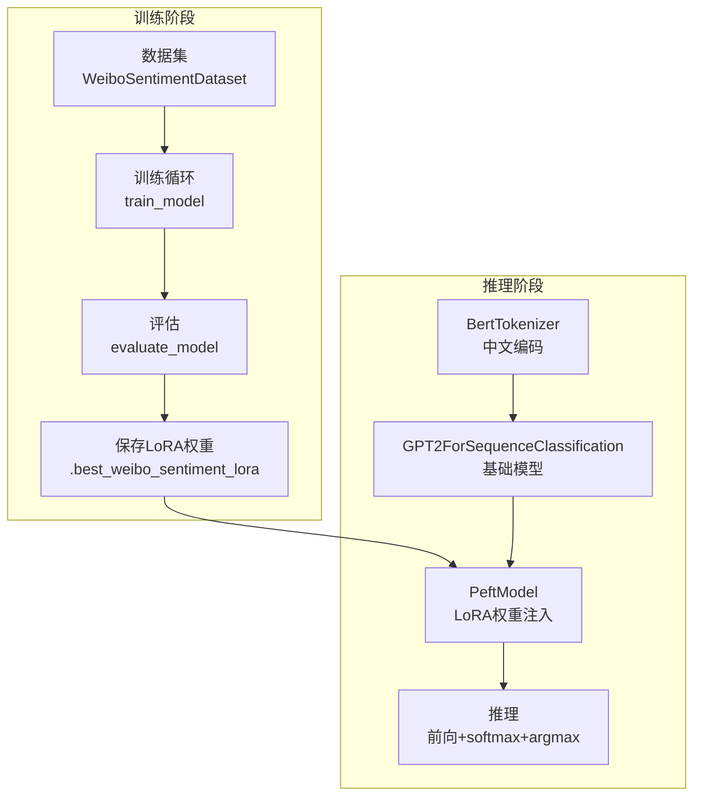
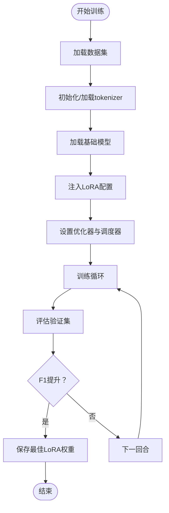
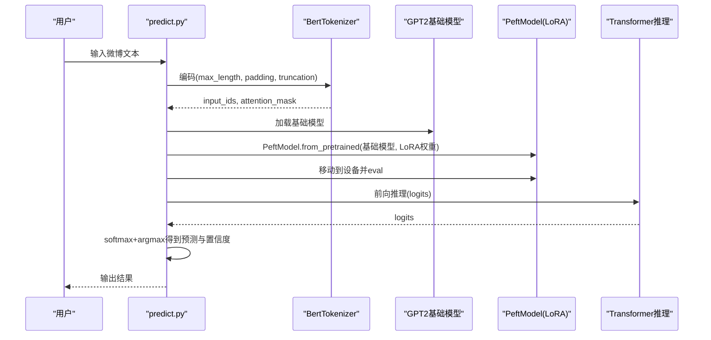
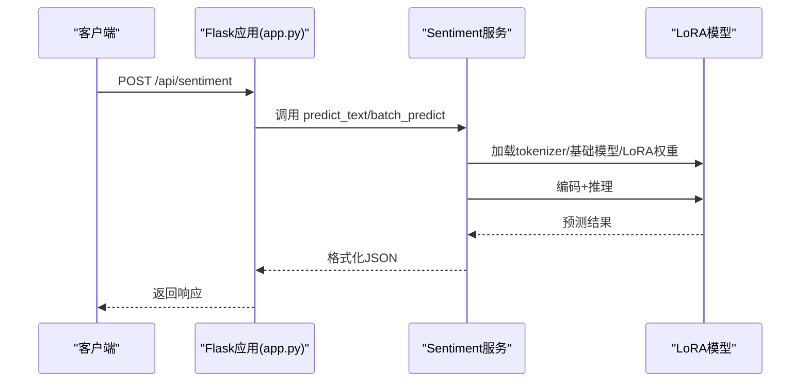
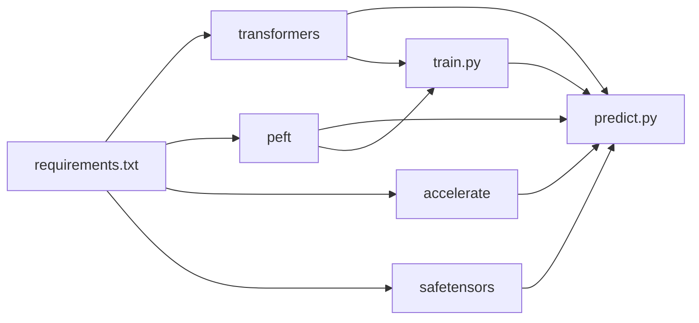

# GPT-2 LoRA微调模型

<cite>
**本文引用的文件**
- [predict.py](file://SentimentAnalysisModel/WeiboSentiment_Finetuned/GPT2-Lora/predict.py)
- [train.py](file://SentimentAnalysisModel/WeiboSentiment_Finetuned/GPT2-Lora/train.py)
- [requirements.txt](file://SentimentAnalysisModel/WeiboSentiment_Finetuned/GPT2-Lora/requirements.txt)
- [README.md](file://SentimentAnalysisModel/WeiboSentiment_Finetuned/GPT2-Lora/README.md)
- [flask_interface.py](file://ReportEngine/flask_interface.py)
- [app.py](file://app.py)
</cite>

## 目录
1. [简介](#简介)
2. [项目结构](#项目结构)
3. [核心组件](#核心组件)
4. [架构总览](#架构总览)
5. [详细组件分析](#详细组件分析)
6. [依赖关系分析](#依赖关系分析)
7. [性能考量](#性能考量)
8. [故障排查指南](#故障排查指南)
9. [结论](#结论)
10. [附录](#附录)

## 简介
本文件面向“GPT-2 LoRA微调模型”的完整使用与扩展文档，重点围绕以下目标展开：
- 解释如何使用 peft 库在预训练的 GPT-2 中文模型上注入可训练的低秩适配层（LoRA），以实现高效微调。
- 深入分析 predict.py 的实现细节，包括 PeftModel.from_pretrained 如何加载基础模型与 LoRA 权重，以及 BertTokenizer 对中文文本的编码处理。
- 明确模型路径配置（base_model_path 与 lora_model_path）之间的依赖关系与错误处理机制。
- 提供在非交互式场景下将 main 函数封装为 API 服务的思路与实践参考。
- 结合 train.py 脚本，解释 LoRA 特有的超参数（如 r、lora_alpha、lora_dropout）对模型性能的影响，并给出针对微博短文本优化的训练建议。

## 项目结构
该模型位于 SentimentAnalysisModel/WeiboSentiment_Finetuned/GPT2-Lora 目录，包含训练脚本、预测脚本、依赖声明与使用说明。其典型文件组织如下：
- train.py：基于 PEFT 的 LoRA 训练流程，包含数据集构建、LoRA 配置、训练循环与评估。
- predict.py：交互式预测脚本，负责加载 tokenizer、基础模型与 LoRA 权重，并进行推理。
- requirements.txt：运行所需的 Python 依赖。
- README.md：项目说明、使用方法、LoRA 配置与性能对比等。

图表来源
- [predict.py](file://SentimentAnalysisModel/WeiboSentiment_Finetuned/GPT2-Lora/predict.py#L1-L107)
- [train.py](file://SentimentAnalysisModel/WeiboSentiment_Finetuned/GPT2-Lora/train.py#L1-L283)
- [requirements.txt](file://SentimentAnalysisModel/WeiboSentiment_Finetuned/GPT2-Lora/requirements.txt#L1-L10)
- [README.md](file://SentimentAnalysisModel/WeiboSentiment_Finetuned/GPT2-Lora/README.md#L1-L142)

章节来源
- [predict.py](file://SentimentAnalysisModel/WeiboSentiment_Finetuned/GPT2-Lora/predict.py#L1-L107)
- [train.py](file://SentimentAnalysisModel/WeiboSentiment_Finetuned/GPT2-Lora/train.py#L1-L283)
- [requirements.txt](file://SentimentAnalysisModel/WeiboSentiment_Finetuned/GPT2-Lora/requirements.txt#L1-L10)
- [README.md](file://SentimentAnalysisModel/WeiboSentiment_Finetuned/GPT2-Lora/README.md#L1-L142)

## 核心组件
- 训练组件（train.py）
  - 数据集：WeiboSentimentDataset，支持固定长度编码与标签映射。
  - LoRA 配置：LoraConfig，指定任务类型、目标模块、秩 r、alpha、dropout 等。
  - 训练循环：train_model，包含前向、反向、梯度裁剪、学习率调度与验证。
  - 评估指标：evaluate_model，计算损失、准确率与宏平均 F1。
  - 模型保存：保存最佳 LoRA 权重到指定目录。
- 预测组件（predict.py）
  - 设备选择：自动检测 GPU/CPU。
  - 路径与依赖：base_model_path 与 lora_model_path 的存在性检查与错误提示。
  - 模型加载：BertTokenizer.from_pretrained、GPT2ForSequenceClassification.from_pretrained、PeftModel.from_pretrained。
  - 推理流程：编码、移动到设备、前向推理、softmax 输出、argmax 决策与置信度提取。
  - 交互式输入：循环读取用户输入，支持退出键。

章节来源
- [train.py](file://SentimentAnalysisModel/WeiboSentiment_Finetuned/GPT2-Lora/train.py#L1-L283)
- [predict.py](file://SentimentAnalysisModel/WeiboSentiment_Finetuned/GPT2-Lora/predict.py#L1-L107)

## 架构总览
下图展示了 LoRA 微调在 GPT-2 上的端到端工作流，从数据准备、LoRA 注入、训练到推理预测。

图表来源
- [train.py](file://SentimentAnalysisModel/WeiboSentiment_Finetuned/GPT2-Lora/train.py#L1-L283)
- [predict.py](file://SentimentAnalysisModel/WeiboSentiment_Finetuned/GPT2-Lora/predict.py#L1-L107)

## 详细组件分析

### 训练组件（train.py）
- 数据集与编码
  - WeiboSentimentDataset 将文本编码为 input_ids、attention_mask，并返回 long 类型标签。
  - 编码参数 max_length、padding、truncation、return_tensors='pt' 保证张量输入一致性。
- LoRA 配置与注入
  - LoraConfig 指定任务类型为序列分类（SEQ_CLS），target_modules 选择注意力投影层，r 控制秩，lora_alpha 控制缩放，lora_dropout 控制正则化。
  - get_peft_model 将 LoRA 注入基础模型，打印可训练参数统计。
- 训练与评估
  - 优化器使用 AdamW，学习率与 warmup 步数按训练步数线性调度。
  - train_model 中每轮训练后进行验证，保存最佳 F1 对应的 LoRA 权重。
- 路径与模型加载
  - 本地模型与 tokenizer 的存在性检查，必要时从 Hugging Face 下载并保存到本地。
  - 基础模型与 tokenizer 的 pad_token_id 保持一致，避免填充不匹配。

图表来源
- [train.py](file://SentimentAnalysisModel/WeiboSentiment_Finetuned/GPT2-Lora/train.py#L1-L283)

章节来源
- [train.py](file://SentimentAnalysisModel/WeiboSentuned/GPT2-Lora/train.py#L1-L283)

### 预测组件（predict.py）
- 设备与路径
  - 自动检测 CUDA，优先使用 GPU；base_model_path 与 lora_model_path 为相对路径，需确保目录存在。
  - 对 lora_model_path 存在性进行检查，缺失时提示先运行训练脚本。
- 模型与 Tokenizer 加载
  - BertTokenizer.from_pretrained 从 base_model_path 加载中文分词器，设置 pad_token。
  - GPT2ForSequenceClassification.from_pretrained 加载基础模型，num_labels=2。
  - PeftModel.from_pretrained 将 LoRA 权重注入基础模型，移动到设备并设置 eval 模式。
- 推理流程
  - 文本预处理（当前为空操作），编码后转移到设备。
  - 前向推理得到 logits，softmax 归一化，argmax 得到类别与置信度。
- 错误处理
  - tokenizer、基础模型、LoRA 权重加载失败均有明确提示。
  - 预测阶段异常捕获并提示，避免程序中断。

图表来源
- [predict.py](file://SentimentAnalysisModel/WeiboSentiment_Finetuned/GPT2-Lora/predict.py#L1-L107)

章节来源
- [predict.py](file://SentimentAnalysisModel/WeiboSentiment_Finetuned/GPT2-Lora/predict.py#L1-L107)

### LoRA 超参数对性能的影响与优化建议
- r（秩）
  - 控制可训练参数规模，r 越大越灵活但显存与训练时间增加；r 过小可能导致欠拟合。
  - 在微博短文本场景中，r=8 通常能在较小参数量下取得良好效果。
- lora_alpha（缩放因子）
  - 控制 LoRA 残差分支的缩放强度；较大 alpha 更强调适配层贡献，可能提升拟合但易过拟合。
- lora_dropout（丢弃率）
  - 用于正则化，缓解过拟合；在微博短文本上 0.1 左右较为稳健。
- 训练建议（针对微博短文本）
  - 数据增强：对正负样本进行同义替换、插入噪声等，提升泛化。
  - 学习率：LoRA 微调通常使用较高学习率，AdamW + warmup 策略有助于稳定收敛。
  - 梯度裁剪：防止梯度爆炸，提高稳定性。
  - 早停：以验证集 F1 为指标，避免过度训练。
  - 批大小：短文本可适当增大 batch size，提升吞吐。
  - 评估指标：关注宏平均 F1，平衡正负样本不均衡。

章节来源
- [train.py](file://SentimentAnalysisModel/WeiboSentiment_Finetuned/GPT2-Lora/train.py#L231-L246)
- [README.md](file://SentimentAnalysisModel/WeiboSentiment_Finetuned/GPT2-Lora/README.md#L82-L117)

### 非交互式场景下的 API 服务封装思路
- 将 predict.py 的 main 流程抽象为可复用函数，例如：
  - load_model：加载 tokenizer、基础模型与 LoRA 权重，返回模型与 tokenizer。
  - predict_text：接收文本，执行编码、推理、后处理，返回预测标签与置信度。
  - batch_predict：批量处理文本列表，返回聚合统计。
- 在 Flask/FastAPI 中暴露接口：
  - GET/POST /api/sentiment：接收文本或文本列表，返回 JSON 结果。
  - SSE/长连接：在需要流式反馈时，可参考 ReportEngine 的 SSE 实现思路。
- 参考现有 Flask 接口实现：
  - ReportEngine/flask_interface.py 展示了任务注册、SSE 事件流、进度推送与错误兜底。
  - app.py 中包含通用的 API 路由与错误处理模式，可用于统一返回结构与日志记录。

图表来源
- [flask_interface.py](file://ReportEngine/flask_interface.py#L1-L200)
- [app.py](file://app.py#L1037-L1128)
- [predict.py](file://SentimentAnalysisModel/WeiboSentiment_Finetuned/GPT2-Lora/predict.py#L1-L107)

章节来源
- [flask_interface.py](file://ReportEngine/flask_interface.py#L1-L200)
- [app.py](file://app.py#L1037-L1128)
- [predict.py](file://SentimentAnalysisModel/WeiboSentiment_Finetuned/GPT2-Lora/predict.py#L1-L107)

## 依赖关系分析
- 运行时依赖
  - torch、transformers、peft、pandas、numpy、scikit-learn、tqdm、datasets、accelerate、safetensors。
- 训练与推理的耦合点
  - predict.py 依赖 train.py 保存的 LoRA 权重目录（best_weibo_sentiment_lora）。
  - tokenizer 与基础模型的 pad_token_id 必须一致，避免填充不匹配。
- 路径与错误处理
  - 若 LoRA 权重目录不存在，predict.py 提示先运行训练脚本。
  - 若 tokenizer 或基础模型加载失败，给出明确提示并终止。

图表来源
- [requirements.txt](file://SentimentAnalysisModel/WeiboSentiment_Finetuned/GPT2-Lora/requirements.txt#L1-L10)
- [predict.py](file://SentimentAnalysisModel/WeiboSentiment_Finetuned/GPT2-Lora/predict.py#L1-L107)
- [train.py](file://SentimentAnalysisModel/WeiboSentiment_Finetuned/GPT2-Lora/train.py#L1-L283)

章节来源
- [requirements.txt](file://SentimentAnalysisModel/WeiboSentiment_Finetuned/GPT2-Lora/requirements.txt#L1-L10)
- [predict.py](file://SentimentAnalysisModel/WeiboSentiment_Finetuned/GPT2-Lora/predict.py#L1-L107)
- [train.py](file://SentimentAnalysisModel/WeiboSentiment_Finetuned/GPT2-Lora/train.py#L1-L283)

## 性能考量
- 训练效率
  - LoRA 仅训练少量参数，显著降低显存占用与训练时间；适合在资源受限环境下快速迭代。
- 推理效率
  - 预测阶段仅加载 LoRA 权重，推理速度较快；建议启用 GPU 并合理设置 max_length。
- 数据与超参
  - 短文本（如微博）建议 r=8、alpha=32、dropout=0.1，并配合 warmup 与梯度裁剪。
- 模型体积
  - LoRA 权重文件小，便于部署与版本管理；可在不同任务间共享同一基础模型。

## 故障排查指南
- 无法加载 LoRA 权重
  - 确认 best_weibo_sentiment_lora 目录存在且包含权重文件；若缺失，先运行 train.py。
- tokenizer 加载失败
  - 确保 models/gpt2-chinese 目录包含必要的配置与词汇表文件；必要时删除目录后重新下载。
- 基础模型加载失败
  - 检查本地模型文件完整性；若损坏，删除后重新下载。
- 推理报错
  - 捕获异常并打印错误信息，确认输入文本非空且编码参数合理。
- API 服务封装
  - 参考 ReportEngine 的 SSE 与错误处理模式，统一返回结构与日志记录；在 app.py 中可借鉴其路由与异常处理风格。

章节来源
- [predict.py](file://SentimentAnalysisModel/WeiboSentiment_Finetuned/GPT2-Lora/predict.py#L1-L107)
- [train.py](file://SentimentAnalysisModel/WeiboSentiment_Finetuned/GPT2-Lora/train.py#L1-L283)
- [flask_interface.py](file://ReportEngine/flask_interface.py#L1-L200)
- [app.py](file://app.py#L1037-L1128)

## 结论
本项目以 peft 为基础，通过 LoRA 技术在 GPT-2 中文模型上实现了高效的微博情感二分类微调。predict.py 展示了从基础模型到 LoRA 权重的完整加载与推理流程；train.py 则提供了可复用的训练框架与超参数配置。结合现有 Flask 接口实现，可将该模型无缝接入非交互式 API 服务，满足生产环境的部署与扩展需求。

## 附录
- 使用步骤概览
  - 安装依赖：pip install -r requirements.txt
  - 训练模型：python train.py（自动下载与保存模型与 tokenizer）
  - 交互式预测：python predict.py（进入控制台循环）
- 模型路径约定
  - 基础模型与 tokenizer：./models/gpt2-chinese/
  - LoRA 权重：./best_weibo_sentiment_lora/

章节来源
- [README.md](file://SentimentAnalysisModel/WeiboSentiment_Finetuned/GPT2-Lora/README.md#L54-L117)
- [requirements.txt](file://SentimentAnalysisModel/WeiboSentiment_Finetuned/GPT2-Lora/requirements.txt#L1-L10)
- [predict.py](file://SentimentAnalysisModel/WeiboSentiment_Finetuned/GPT2-Lora/predict.py#L1-L107)
- [train.py](file://SentimentAnalysisModel/WeiboSentiment_Finetuned/GPT2-Lora/train.py#L1-L283)