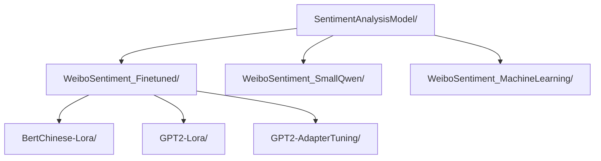
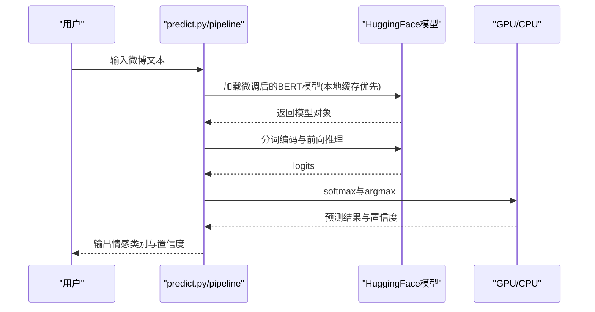
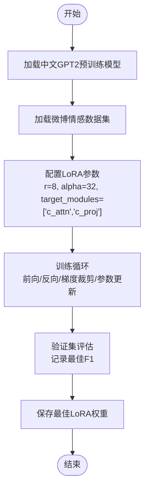
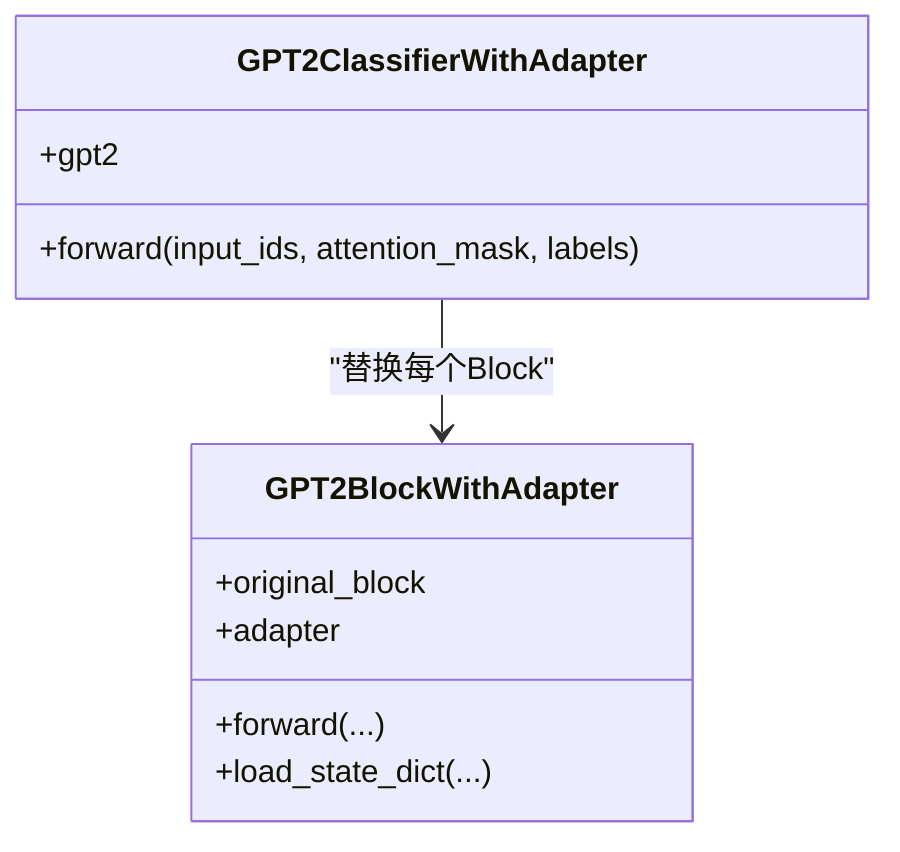
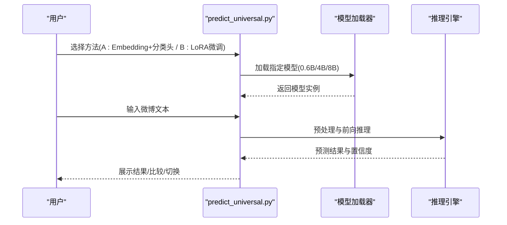
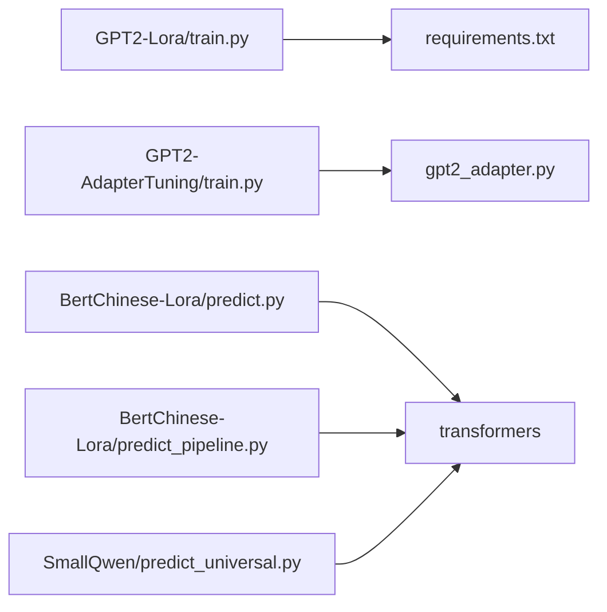

# 微调型微博情感分析模型

<cite>
**本文引用的文件**
- [README.md](file://README.md)
- [SentimentAnalysisModel/WeiboSentiment_Finetuned/BertChinese-Lora/README.md](file://SentimentAnalysisModel/WeiboSentiment_Finetuned/BertChinese-Lora/README.md)
- [SentimentAnalysisModel/WeiboSentiment_Finetuned/BertChinese-Lora/predict.py](file://SentimentAnalysisModel/WeiboSentiment_Finetuned/BertChinese-Lora/predict.py)
- [SentimentAnalysisModel/WeiboSentiment_Finetuned/BertChinese-Lora/predict_pipeline.py](file://SentimentAnalysisModel/WeiboSentiment_Finetuned/BertChinese-Lora/predict_pipeline.py)
- [SentimentAnalysisModel/WeiboSentiment_Finetuned/GPT2-Lora/README.md](file://SentimentAnalysisModel/WeiboSentiment_Finetuned/GPT2-Lora/README.md)
- [SentimentAnalysisModel/WeiboSentiment_Finetuned/GPT2-Lora/train.py](file://SentimentAnalysisModel/WeiboSentiment_Finetuned/GPT2-Lora/train.py)
- [SentimentAnalysisModel/WeiboSentiment_Finetuned/GPT2-Lora/requirements.txt](file://SentimentAnalysisModel/WeiboSentiment_Finetuned/GPT2-Lora/requirements.txt)
- [SentimentAnalysisModel/WeiboSentiment_Finetuned/GPT2-AdapterTuning/README.md](file://SentimentAnalysisModel/WeiboSentiment_Finetuned/GPT2-AdapterTuning/README.md)
- [SentimentAnalysisModel/WeiboSentiment_Finetuned/GPT2-AdapterTuning/train.py](file://SentimentAnalysisModel/WeiboSentiment_Finetuned/GPT2-AdapterTuning/train.py)
- [SentimentAnalysisModel/WeiboSentiment_Finetuned/GPT2-AdapterTuning/gpt2_adapter.py](file://SentimentAnalysisModel/WeiboSentiment_Finetuned/GPT2-AdapterTuning/gpt2_adapter.py)
- [SentimentAnalysisModel/WeiboSentiment_SmallQwen/readme.md](file://SentimentAnalysisModel/WeiboSentiment_SmallQwen/readme.md)
- [SentimentAnalysisModel/WeiboSentiment_SmallQwen/predict_universal.py](file://SentimentAnalysisModel/WeiboSentiment_SmallQwen/predict_universal.py)
- [SentimentAnalysisModel/WeiboSentiment_MachineLearning/predict.py](file://SentimentAnalysisModel/WeiboSentiment_MachineLearning/predict.py)
</cite>

## 目录
1. [简介](#简介)
2. [项目结构](#项目结构)
3. [核心组件](#核心组件)
4. [架构总览](#架构总览)
5. [详细组件分析](#详细组件分析)
6. [依赖关系分析](#依赖关系分析)
7. [性能与资源考量](#性能与资源考量)
8. [故障排查指南](#故障排查指南)
9. [结论](#结论)
10. [附录](#附录)

## 简介
本文件围绕“微调型微博情感分析模型”展开，重点覆盖三类微调方法：BERT中文LoRA、GPT-2 LoRA与GPT-2 Adapter Tuning。文档从架构优势、统一接口设计、差异化实现路径、推理示例、性能对比与资源消耗、以及训练脚本说明等方面进行系统化梳理，帮助用户根据硬件条件与精度需求选择合适方案，并为高级用户提供二次微调参考。

## 项目结构
本项目在顶层README中明确了SentimentAnalysisModel模块的组织方式，包含多种情感分析模型实现，其中本次关注的三类微调方法分别位于：
- BertChinese-Lora：BERT中文LoRA微调
- GPT2-Lora：GPT-2 LoRA微调
- GPT2-AdapterTuning：GPT-2 Adapter微调
- SmallQwen：小参数Qwen3统一预测接口（包含Embedding+分类头与LoRA两种路径）
- MachineLearning：传统机器学习方法的统一预测接口

图表来源
- [README.md](file://README.md#L232-L294)

章节来源
- [README.md](file://README.md#L232-L294)

## 核心组件
- BERT中文LoRA：基于HuggingFace预训练模型的直接调用与pipeline两种预测路径，支持本地缓存与GPU加速。
- GPT-2 LoRA：基于PEFT的LoRA微调，训练少量参数，部署权重小，推理快。
- GPT-2 Adapter：在Transformer Block中插入Adapter层，冻结主干参数，仅训练Adapter与分类器。
- 小参数Qwen3统一预测：提供Embedding+分类头与LoRA两种路径，支持交互式与命令行预测，内置模型选择与比较功能。
- 传统机器学习统一预测：提供贝叶斯、SVM、XGBoost、LSTM、BERT五类模型的统一加载与预测接口。

章节来源
- [SentimentAnalysisModel/WeiboSentiment_Finetuned/BertChinese-Lora/README.md](file://SentimentAnalysisModel/WeiboSentiment_Finetuned/BertChinese-Lora/README.md#L1-L78)
- [SentimentAnalysisModel/WeiboSentiment_Finetuned/GPT2-Lora/README.md](file://SentimentAnalysisModel/WeiboSentiment_Finetuned/GPT2-Lora/README.md#L1-L142)
- [SentimentAnalysisModel/WeiboSentiment_Finetuned/GPT2-AdapterTuning/README.md](file://SentimentAnalysisModel/WeiboSentiment_Finetuned/GPT2-AdapterTuning/README.md#L1-L93)
- [SentimentAnalysisModel/WeiboSentiment_SmallQwen/readme.md](file://SentimentAnalysisModel/WeiboSentiment_SmallQwen/readme.md#L1-L98)
- [SentimentAnalysisModel/WeiboSentiment_MachineLearning/predict.py](file://SentimentAnalysisModel/WeiboSentiment_MachineLearning/predict.py#L1-L310)

## 架构总览
三类微调方法在推理阶段均提供统一的交互式预测体验，但在训练与部署层面采用不同的参数高效策略：
- LoRA：通过低秩矩阵注入，仅训练少量参数，模型体积小，推理快，适合资源受限与快速部署场景。
- Adapter：在Transformer层中插入小型瓶颈层，冻结主干，仅训练Adapter与分类器，兼顾性能与资源占用。
- 小参数Qwen3：提供两种路径，Embedding+分类头适合极致低资源与低延迟场景；LoRA微调在精度上更优，但推理速度与显存占用更高。

图表来源
- [SentimentAnalysisModel/WeiboSentiment_Finetuned/BertChinese-Lora/predict.py](file://SentimentAnalysisModel/WeiboSentiment_Finetuned/BertChinese-Lora/predict.py#L1-L90)
- [SentimentAnalysisModel/WeiboSentiment_Finetuned/BertChinese-Lora/predict_pipeline.py](file://SentimentAnalysisModel/WeiboSentiment_Finetuned/BertChinese-Lora/predict_pipeline.py#L1-L101)
- [SentimentAnalysisModel/WeiboSentiment_Finetuned/GPT2-Lora/train.py](file://SentimentAnalysisModel/WeiboSentiment_Finetuned/GPT2-Lora/train.py#L1-L283)
- [SentimentAnalysisModel/WeiboSentiment_Finetuned/GPT2-AdapterTuning/train.py](file://SentimentAnalysisModel/WeiboSentiment_Finetuned/GPT2-AdapterTuning/train.py#L1-L310)
- [SentimentAnalysisModel/WeiboSentiment_Finetuned/GPT2-AdapterTuning/gpt2_adapter.py](file://SentimentAnalysisModel/WeiboSentiment_Finetuned/GPT2-AdapterTuning/gpt2_adapter.py#L1-L60)
- [SentimentAnalysisModel/WeiboSentiment_SmallQwen/predict_universal.py](file://SentimentAnalysisModel/WeiboSentiment_SmallQwen/predict_universal.py#L1-L377)

## 详细组件分析

### BERT中文LoRA
- 统一接口设计
  - 直接模型调用：predict.py通过AutoTokenizer与AutoModelForSequenceClassification加载微调后的BERT模型，支持本地缓存与GPU加速，提供交互式预测。
  - Pipeline方式：predict_pipeline.py使用transformers.pipeline进行简化调用，同样支持本地缓存与交互式预测。
- 差异化实现路径
  - 直接调用：手动构建分词、前向推理与softmax，便于自定义处理与调试。
  - Pipeline：通过pipeline封装，减少样板代码，适合快速部署与集成。
- 推理示例（路径参考）
  - 直接调用路径：[SentimentAnalysisModel/WeiboSentiment_Finetuned/BertChinese-Lora/predict.py](file://SentimentAnalysisModel/WeiboSentiment_Finetuned/BertChinese-Lora/predict.py#L1-L90)
  - Pipeline路径：[SentimentAnalysisModel/WeiboSentiment_Finetuned/BertChinese-Lora/predict_pipeline.py](file://SentimentAnalysisModel/WeiboSentiment_Finetuned/BertChinese-Lora/predict_pipeline.py#L1-L101)
- 架构优势
  - 参数效率：基于预训练模型微调，推理时仅加载微调权重，显存占用低。
  - 易用性：提供两种预测路径，满足不同开发偏好。

图表来源
- [SentimentAnalysisModel/WeiboSentiment_Finetuned/BertChinese-Lora/predict.py](file://SentimentAnalysisModel/WeiboSentiment_Finetuned/BertChinese-Lora/predict.py#L1-L90)
- [SentimentAnalysisModel/WeiboSentiment_Finetuned/BertChinese-Lora/predict_pipeline.py](file://SentimentAnalysisModel/WeiboSentiment_Finetuned/BertChinese-Lora/predict_pipeline.py#L1-L101)

章节来源
- [SentimentAnalysisModel/WeiboSentiment_Finetuned/BertChinese-Lora/README.md](file://SentimentAnalysisModel/WeiboSentiment_Finetuned/BertChinese-Lora/README.md#L1-L78)
- [SentimentAnalysisModel/WeiboSentiment_Finetuned/BertChinese-Lora/predict.py](file://SentimentAnalysisModel/WeiboSentiment_Finetuned/BertChinese-Lora/predict.py#L1-L90)
- [SentimentAnalysisModel/WeiboSentiment_Finetuned/BertChinese-Lora/predict_pipeline.py](file://SentimentAnalysisModel/WeiboSentiment_Finetuned/BertChinese-Lora/predict_pipeline.py#L1-L101)

### GPT-2 LoRA
- 统一接口设计
  - predict.py提供交互式预测，加载训练好的LoRA权重，支持本地缓存与GPU加速。
- 差异化实现路径
  - 训练脚本train.py基于PEFT库实现LoRA配置与训练，保存最佳LoRA权重，便于部署。
- 推理示例（路径参考）
  - 预测脚本：[SentimentAnalysisModel/WeiboSentiment_Finetuned/GPT2-Lora/train.py](file://SentimentAnalysisModel/WeiboSentiment_Finetuned/GPT2-Lora/train.py#L1-L283)
  - 依赖清单：[SentimentAnalysisModel/WeiboSentiment_Finetuned/GPT2-Lora/requirements.txt](file://SentimentAnalysisModel/WeiboSentiment_Finetuned/GPT2-Lora/requirements.txt#L1-L10)
- 架构优势
  - 参数效率：LoRA仅训练极少量参数，模型体积小，推理快，部署友好。
  - 插件式设计：LoRA权重可动态加载/卸载，支持多任务共享基础模型。

图表来源
- [SentimentAnalysisModel/WeiboSentiment_Finetuned/GPT2-Lora/train.py](file://SentimentAnalysisModel/WeiboSentiment_Finetuned/GPT2-Lora/train.py#L1-L283)

章节来源
- [SentimentAnalysisModel/WeiboSentiment_Finetuned/GPT2-Lora/README.md](file://SentimentAnalysisModel/WeiboSentiment_Finetuned/GPT2-Lora/README.md#L1-L142)
- [SentimentAnalysisModel/WeiboSentiment_Finetuned/GPT2-Lora/train.py](file://SentimentAnalysisModel/WeiboSentiment_Finetuned/GPT2-Lora/train.py#L1-L283)
- [SentimentAnalysisModel/WeiboSentiment_Finetuned/GPT2-Lora/requirements.txt](file://SentimentAnalysisModel/WeiboSentiment_Finetuned/GPT2-Lora/requirements.txt#L1-L10)

### GPT-2 Adapter Tuning
- 统一接口设计
  - predict.py提供交互式预测，加载训练好的Adapter模型（state_dict）。
- 差异化实现路径
  - 训练脚本train.py通过替换GPT2Block为带Adapter的版本，冻结主干参数，仅训练Adapter与分类器。
  - gpt2_adapter.py定义GPT2BlockWithAdapter，将Adapter层插入原始Block输出的隐藏状态中。
- 推理示例（路径参考）
  - 训练脚本：[SentimentAnalysisModel/WeiboSentiment_Finetuned/GPT2-AdapterTuning/train.py](file://SentimentAnalysisModel/WeiboSentiment_Finetuned/GPT2-AdapterTuning/train.py#L1-L310)
  - Block级Adapter实现：[SentimentAnalysisModel/WeiboSentiment_Finetuned/GPT2-AdapterTuning/gpt2_adapter.py](file://SentimentAnalysisModel/WeiboSentiment_Finetuned/GPT2-AdapterTuning/gpt2_adapter.py#L1-L60)
- 架构优势
  - 参数高效：仅训练Adapter与分类器，冻结主干，防止灾难性遗忘。
  - 模块化插入：在Transformer层中插入Adapter，便于多任务共享基础模型。

图表来源
- [SentimentAnalysisModel/WeiboSentiment_Finetuned/GPT2-AdapterTuning/gpt2_adapter.py](file://SentimentAnalysisModel/WeiboSentiment_Finetuned/GPT2-AdapterTuning/gpt2_adapter.py#L1-L60)
- [SentimentAnalysisModel/WeiboSentiment_Finetuned/GPT2-AdapterTuning/train.py](file://SentimentAnalysisModel/WeiboSentiment_Finetuned/GPT2-AdapterTuning/train.py#L1-L310)

章节来源
- [SentimentAnalysisModel/WeiboSentiment_Finetuned/GPT2-AdapterTuning/README.md](file://SentimentAnalysisModel/WeiboSentiment_Finetuned/GPT2-AdapterTuning/README.md#L1-L93)
- [SentimentAnalysisModel/WeiboSentiment_Finetuned/GPT2-AdapterTuning/train.py](file://SentimentAnalysisModel/WeiboSentiment_Finetuned/GPT2-AdapterTuning/train.py#L1-L310)
- [SentimentAnalysisModel/WeiboSentiment_Finetuned/GPT2-AdapterTuning/gpt2_adapter.py](file://SentimentAnalysisModel/WeiboSentiment_Finetuned/GPT2-AdapterTuning/gpt2_adapter.py#L1-L60)

### 小参数Qwen3统一预测
- 统一接口设计
  - predict_universal.py提供统一预测器，支持加载Embedding+分类头与LoRA两类路径，支持交互式与命令行预测，内置模型选择与比较功能。
- 差异化实现路径
  - Embedding+分类头：冻结Embedding，仅训练分类头，推理快、显存占用低。
  - LoRA微调：冻结大部分参数，训练LoRA适配器，精度更高但推理更慢、显存更高。
- 推理示例（路径参考）
  - 统一预测接口：[SentimentAnalysisModel/WeiboSentiment_SmallQwen/predict_universal.py](file://SentimentAnalysisModel/WeiboSentiment_SmallQwen/predict_universal.py#L1-L377)
  - 方法对比与使用说明：[SentimentAnalysisModel/WeiboSentiment_SmallQwen/readme.md](file://SentimentAnalysisModel/WeiboSentiment_SmallQwen/readme.md#L1-L98)
- 架构优势
  - 双路径设计：兼顾极致低资源与更高精度。
  - 交互式体验：内置模型选择、切换、比较功能，便于快速评估与决策。

图表来源
- [SentimentAnalysisModel/WeiboSentiment_SmallQwen/predict_universal.py](file://SentimentAnalysisModel/WeiboSentiment_SmallQwen/predict_universal.py#L1-L377)
- [SentimentAnalysisModel/WeiboSentiment_SmallQwen/readme.md](file://SentimentAnalysisModel/WeiboSentiment_SmallQwen/readme.md#L1-L98)

章节来源
- [SentimentAnalysisModel/WeiboSentiment_SmallQwen/readme.md](file://SentimentAnalysisModel/WeiboSentiment_SmallQwen/readme.md#L1-L98)
- [SentimentAnalysisModel/WeiboSentiment_SmallQwen/predict_universal.py](file://SentimentAnalysisModel/WeiboSentiment_SmallQwen/predict_universal.py#L1-L377)

### 传统机器学习统一预测
- 统一接口设计
  - predict.py提供统一的SentimentPredictor类，支持加载贝叶斯、SVM、XGBoost、LSTM、BERT五类模型，支持单条/批量预测与集成预测。
- 差异化实现路径
  - 各模型独立训练与保存，predict.py通过统一接口加载并预测，便于横向对比与集成。
- 推理示例（路径参考）
  - 统一预测接口：[SentimentAnalysisModel/WeiboSentiment_MachineLearning/predict.py](file://SentimentAnalysisModel/WeiboSentiment_MachineLearning/predict.py#L1-L310)

章节来源
- [SentimentAnalysisModel/WeiboSentiment_MachineLearning/predict.py](file://SentimentAnalysisModel/WeiboSentiment_MachineLearning/predict.py#L1-L310)

## 依赖关系分析
- 外部依赖
  - transformers、torch、peft（LoRA）、scikit-learn、pandas、numpy、tqdm等。
- 模块耦合
  - 各微调方法的predict脚本与训练脚本解耦，训练脚本负责权重保存，预测脚本负责加载与推理。
  - 小参数Qwen3提供统一预测器，内部按路径区分Embedding+分类头与LoRA两类实现。

图表来源
- [SentimentAnalysisModel/WeiboSentiment_Finetuned/GPT2-Lora/requirements.txt](file://SentimentAnalysisModel/WeiboSentiment_Finetuned/GPT2-Lora/requirements.txt#L1-L10)
- [SentimentAnalysisModel/WeiboSentiment_Finetuned/GPT2-Lora/train.py](file://SentimentAnalysisModel/WeiboSentiment_Finetuned/GPT2-Lora/train.py#L1-L283)
- [SentimentAnalysisModel/WeiboSentiment_Finetuned/GPT2-AdapterTuning/train.py](file://SentimentAnalysisModel/WeiboSentiment_Finetuned/GPT2-AdapterTuning/train.py#L1-L310)
- [SentimentAnalysisModel/WeiboSentiment_Finetuned/GPT2-AdapterTuning/gpt2_adapter.py](file://SentimentAnalysisModel/WeiboSentiment_Finetuned/GPT2-AdapterTuning/gpt2_adapter.py#L1-L60)
- [SentimentAnalysisModel/WeiboSentiment_Finetuned/BertChinese-Lora/predict.py](file://SentimentAnalysisModel/WeiboSentiment_Finetuned/BertChinese-Lora/predict.py#L1-L90)
- [SentimentAnalysisModel/WeiboSentiment_Finetuned/BertChinese-Lora/predict_pipeline.py](file://SentimentAnalysisModel/WeiboSentiment_Finetuned/BertChinese-Lora/predict_pipeline.py#L1-L101)
- [SentimentAnalysisModel/WeiboSentiment_SmallQwen/predict_universal.py](file://SentimentAnalysisModel/WeiboSentiment_SmallQwen/predict_universal.py#L1-L377)

章节来源
- [SentimentAnalysisModel/WeiboSentiment_Finetuned/GPT2-Lora/requirements.txt](file://SentimentAnalysisModel/WeiboSentiment_Finetuned/GPT2-Lora/requirements.txt#L1-L10)
- [SentimentAnalysisModel/WeiboSentiment_Finetuned/GPT2-Lora/train.py](file://SentimentAnalysisModel/WeiboSentiment_Finetuned/GPT2-Lora/train.py#L1-L283)
- [SentimentAnalysisModel/WeiboSentiment_Finetuned/GPT2-AdapterTuning/train.py](file://SentimentAnalysisModel/WeiboSentiment_Finetuned/GPT2-AdapterTuning/train.py#L1-L310)
- [SentimentAnalysisModel/WeiboSentiment_Finetuned/GPT2-AdapterTuning/gpt2_adapter.py](file://SentimentAnalysisModel/WeiboSentiment_Finetuned/GPT2-AdapterTuning/gpt2_adapter.py#L1-L60)
- [SentimentAnalysisModel/WeiboSentiment_Finetuned/BertChinese-Lora/predict.py](file://SentimentAnalysisModel/WeiboSentiment_Finetuned/BertChinese-Lora/predict.py#L1-L90)
- [SentimentAnalysisModel/WeiboSentiment_Finetuned/BertChinese-Lora/predict_pipeline.py](file://SentimentAnalysisModel/WeiboSentiment_Finetuned/BertChinese-Lora/predict_pipeline.py#L1-L101)
- [SentimentAnalysisModel/WeiboSentiment_SmallQwen/predict_universal.py](file://SentimentAnalysisModel/WeiboSentiment_SmallQwen/predict_universal.py#L1-L377)

## 性能与资源考量
- 准确率
  - README中明确指出：LoRA微调在仅训练极少参数的情况下仍能保持良好分类性能；Adapter微调同样能在少量参数下保持良好性能；小参数Qwen3的LoRA微调通常优于Embedding+分类头路径，但性能不及直接接分类头的Embedding路径。
- 推理速度
  - LoRA与Adapter均显著优于全参数微调；小参数Qwen3的Embedding+分类头路径推理最快，LoRA微调路径相对较慢。
- 资源消耗
  - LoRA与Adapter的模型文件小，显存占用低；Embedding+分类头仅需训练分类头，显存占用极低；LoRA微调需要加载基础模型与LoRA参数到显存，显存占用较高。
- 选择建议
  - 资源受限且对延迟敏感：优先Embedding+分类头（小参数Qwen3）。
  - 需要更高精度且显存充足：优先LoRA微调（小参数Qwen3或GPT-2 LoRA）。
  - 需要模块化与多任务共享：优先Adapter（GPT-2 Adapter）。

章节来源
- [SentimentAnalysisModel/WeiboSentiment_Finetuned/GPT2-Lora/README.md](file://SentimentAnalysisModel/WeiboSentiment_Finetuned/GPT2-Lora/README.md#L92-L142)
- [SentimentAnalysisModel/WeiboSentiment_Finetuned/GPT2-AdapterTuning/README.md](file://SentimentAnalysisModel/WeiboSentiment_Finetuned/GPT2-AdapterTuning/README.md#L60-L93)
- [SentimentAnalysisModel/WeiboSentiment_SmallQwen/readme.md](file://SentimentAnalysisModel/WeiboSentiment_SmallQwen/readme.md#L1-L98)

## 故障排查指南
- 模型加载失败
  - BERT中文LoRA：检查本地model目录是否存在，若不存在会尝试在线下载并保存；若网络异常，可手动下载后放置到本地路径。
  - GPT-2 LoRA：确保训练完成后生成best_weibo_sentiment_lora目录，预测时需加载该目录下的LoRA权重。
  - GPT-2 Adapter：确保训练保存的best_weibo_sentiment_model.pth存在。
- 设备与显存
  - 若GPU不可用，脚本会自动回退到CPU；显存不足时建议优先选择Embedding+分类头路径（小参数Qwen3）。
- 依赖缺失
  - 安装requirements.txt中列出的依赖，特别是peft（LoRA）与transformers。
- 文本预处理
  - BERT中文LoRA的pipeline版本提供基础预处理规则，可根据实际需求在predict.py/predict_pipeline.py中扩展。

章节来源
- [SentimentAnalysisModel/WeiboSentiment_Finetuned/BertChinese-Lora/README.md](file://SentimentAnalysisModel/WeiboSentiment_Finetuned/BertChinese-Lora/README.md#L60-L78)
- [SentimentAnalysisModel/WeiboSentiment_Finetuned/GPT2-Lora/README.md](file://SentimentAnalysisModel/WeiboSentiment_Finetuned/GPT2-Lora/README.md#L118-L142)
- [SentimentAnalysisModel/WeiboSentiment_Finetuned/GPT2-AdapterTuning/README.md](file://SentimentAnalysisModel/WeiboSentiment_Finetuned/GPT2-AdapterTuning/README.md#L88-L93)
- [SentimentAnalysisModel/WeiboSentiment_Finetuned/GPT2-Lora/requirements.txt](file://SentimentAnalysisModel/WeiboSentiment_Finetuned/GPT2-Lora/requirements.txt#L1-L10)

## 结论
- LoRA与Adapter均为参数高效微调的优秀方案，LoRA在部署与推理方面更具优势，Adapter在模块化与多任务共享方面更灵活。
- 小参数Qwen3提供双路径设计，既能满足极致低资源场景，也能在精度上取得更佳表现。
- 传统机器学习统一预测接口便于横向对比与集成，适合快速评估与部署。
- 建议根据硬件条件与精度需求选择合适方案：资源受限选Embedding+分类头，追求更高精度选LoRA微调，需要模块化与多任务共享选Adapter。

## 附录
- 训练脚本简要说明（路径参考）
  - GPT-2 LoRA训练：[SentimentAnalysisModel/WeiboSentiment_Finetuned/GPT2-Lora/train.py](file://SentimentAnalysisModel/WeiboSentiment_Finetuned/GPT2-Lora/train.py#L1-L283)
  - GPT-2 Adapter训练：[SentimentAnalysisModel/WeiboSentiment_Finetuned/GPT2-AdapterTuning/train.py](file://SentimentAnalysisModel/WeiboSentiment_Finetuned/GPT2-AdapterTuning/train.py#L1-L310)
- 推理示例（路径参考）
  - BERT中文LoRA（直接调用）：[SentimentAnalysisModel/WeiboSentiment_Finetuned/BertChinese-Lora/predict.py](file://SentimentAnalysisModel/WeiboSentiment_Finetuned/BertChinese-Lora/predict.py#L1-L90)
  - BERT中文LoRA（pipeline）：[SentimentAnalysisModel/WeiboSentiment_Finetuned/BertChinese-Lora/predict_pipeline.py](file://SentimentAnalysisModel/WeiboSentiment_Finetuned/BertChinese-Lora/predict_pipeline.py#L1-L101)
  - 小参数Qwen3统一预测：[SentimentAnalysisModel/WeiboSentiment_SmallQwen/predict_universal.py](file://SentimentAnalysisModel/WeiboSentiment_SmallQwen/predict_universal.py#L1-L377)
  - 传统机器学习统一预测：[SentimentAnalysisModel/WeiboSentiment_MachineLearning/predict.py](file://SentimentAnalysisModel/WeiboSentiment_MachineLearning/predict.py#L1-L310)