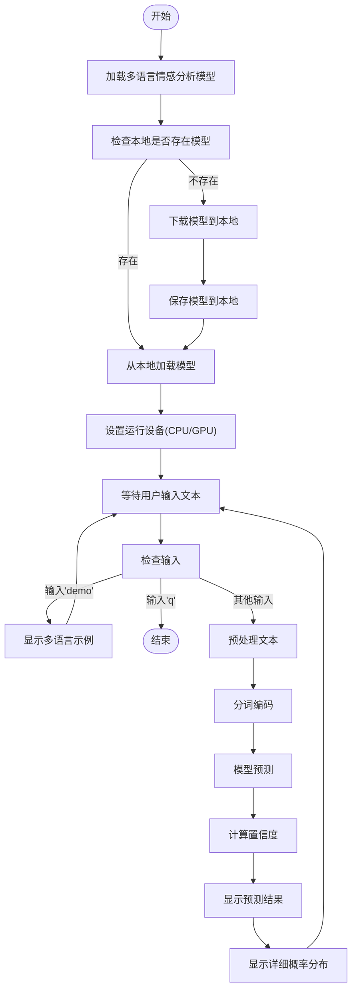
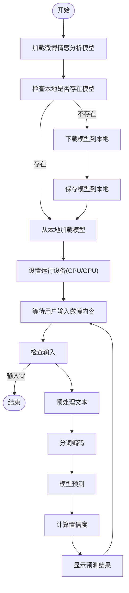
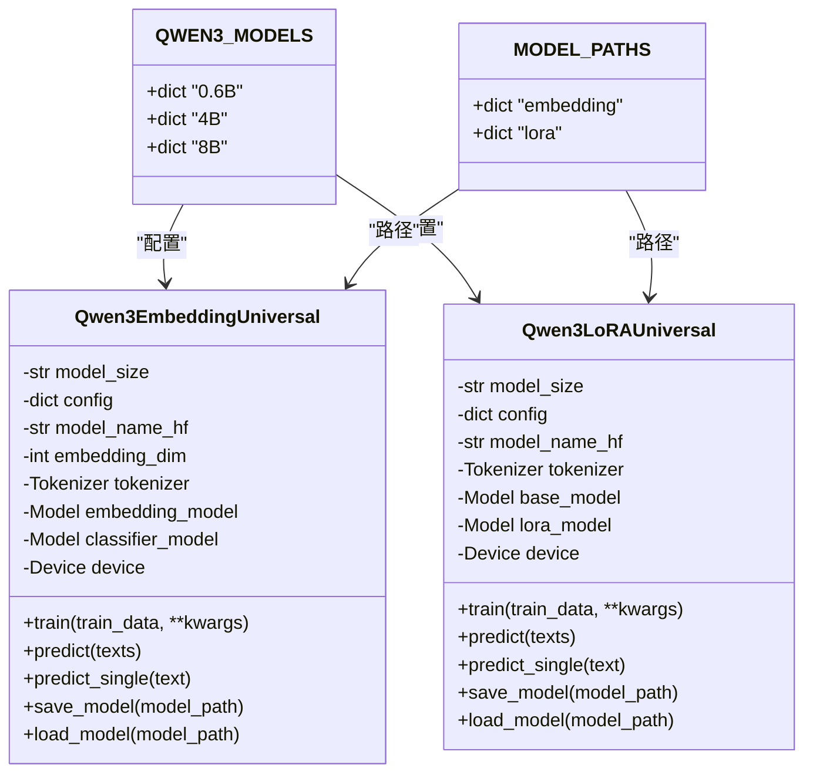
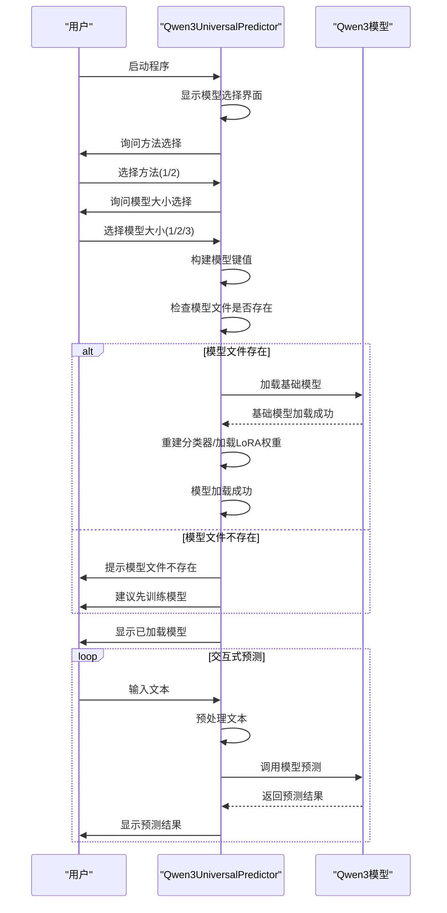
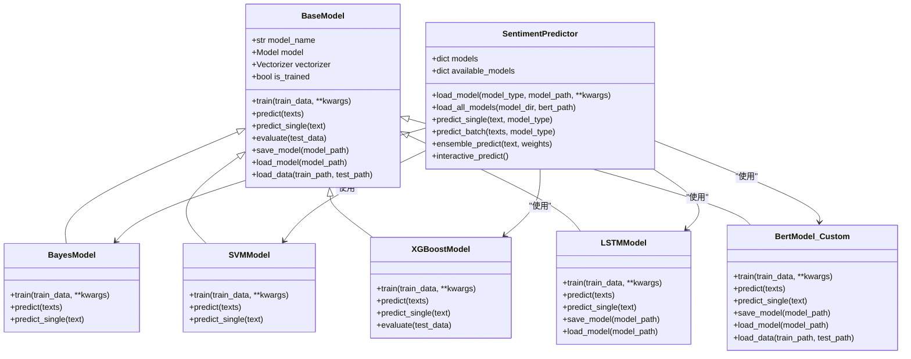
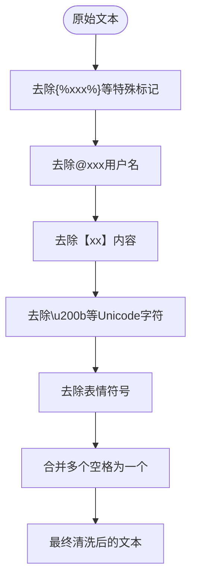

# 情感分析模型

<cite>
**本文档引用的文件**
- [predict.py](file://SentimentAnalysisModel/WeiboMultilingualSentiment/predict.py)
- [predict.py](file://SentimentAnalysisModel/WeiboSentiment_Finetuned/BertChinese-Lora/predict.py)
- [predict.py](file://SentimentAnalysisModel/WeiboSentiment_MachineLearning/predict.py)
- [predict_universal.py](file://SentimentAnalysisModel/WeiboSentiment_SmallQwen/predict_universal.py)
- [base_model.py](file://SentimentAnalysisModel/WeiboSentiment_MachineLearning/base_model.py)
- [utils.py](file://SentimentAnalysisModel/WeiboSentiment_MachineLearning/utils.py)
- [models_config.py](file://SentimentAnalysisModel/WeiboSentiment_SmallQwen/models_config.py)
- [qwen3_embedding_universal.py](file://SentimentAnalysisModel/WeiboSentiment_SmallQwen/qwen3_embedding_universal.py)
- [qwen3_lora_universal.py](file://SentimentAnalysisModel/WeiboSentiment_SmallQwen/qwen3_lora_universal.py)
- [predict_pipeline.py](file://SentimentAnalysisModel/WeiboSentiment_Finetuned/BertChinese-Lora/predict_pipeline.py)
</cite>

## 目录
1. [简介](#简介)
2. [多语言情感分析模型](#多语言情感分析模型)
3. [基于BERT中文LoRA微调的模型](#基于bert中文lora微调的模型)
4. [基于小参数Qwen3微调的模型](#基于小参数qwen3微调的模型)
5. [传统机器学习方法](#传统机器学习方法)
6. [配置项说明](#配置项说明)
7. [调用方法](#调用方法)

## 简介
BettaFish项目集成了多种情感分析模型，通过融合微调模型和传统机器学习方法，确保分析结果的深度和准确性。系统支持多语言情感分析、基于BERT中文LoRA微调的模型、基于小参数Qwen3微调的模型以及使用SVM、XGBoost等的传统机器学习方法。每种模型都有其特定的使用场景和优势，用户可以根据需求选择合适的模型进行情感预测。

**Section sources**
- [predict.py](file://SentimentAnalysisModel/WeiboMultilingualSentiment/predict.py#L1-L190)
- [predict.py](file://SentimentAnalysisModel/WeiboSentiment_Finetuned/BertChinese-Lora/predict.py#L1-L90)
- [predict.py](file://SentimentAnalysisModel/WeiboSentiment_MachineLearning/predict.py#L1-L310)
- [predict_universal.py](file://SentimentAnalysisModel/WeiboSentiment_SmallQwen/predict_universal.py#L1-L377)

## 多语言情感分析模型
多语言情感分析模型使用`tabularisai/multilingual-sentiment-analysis`预训练模型，支持22种语言的文本分析，包括中文、英文、西班牙文、阿拉伯文、日文、韩文等。该模型采用5级分类体系，将情感分为"非常负面"、"负面"、"中性"、"正面"和"非常正面"五个等级。

模型在首次使用时会自动下载并保存到本地`./model`目录，后续运行直接从本地加载，提高加载速度。预测时，模型会输出详细的概率分布，显示每个情感类别的置信度。



**Diagram sources**
- [predict.py](file://SentimentAnalysisModel/WeiboMultilingualSentiment/predict.py#L1-L190)

**Section sources**
- [predict.py](file://SentimentAnalysisModel/WeiboMultilingualSentiment/predict.py#L1-L190)

## 基于BERT中文LoRA微调的模型
基于BERT中文LoRA微调的模型使用`wsqstar/GISchat-weibo-100k-fine-tuned-bert`预训练模型，专门针对微博文本进行了微调。该模型采用二分类体系，将情感分为"正面情感"和"负面情感"两类。

模型支持两种加载方式：直接使用`AutoModelForSequenceClassification`进行预测，或使用`pipeline`方式简化调用。与多语言模型类似，该模型也会在首次使用时自动下载并保存到本地`./model`目录。



**Diagram sources**
- [predict.py](file://SentimentAnalysisModel/WeiboSentiment_Finetuned/BertChinese-Lora/predict.py#L1-L90)
- [predict_pipeline.py](file://SentimentAnalysisModel/WeiboSentiment_Finetuned/BertChinese-Lora/predict_pipeline.py#L1-L101)

**Section sources**
- [predict.py](file://SentimentAnalysisModel/WeiboSentiment_Finetuned/BertChinese-Lora/predict.py#L1-L90)
- [predict_pipeline.py](file://SentimentAnalysisModel/WeiboSentiment_Finetuned/BertChinese-Lora/predict_pipeline.py#L1-L101)

## 基于小参数Qwen3微调的模型
基于小参数Qwen3微调的模型支持0.6B、4B、8B三种规格的模型，提供两种微调方法：Embedding + 分类头和LoRA微调。用户可以根据硬件条件和性能需求选择合适的模型和方法。

### 模型配置
模型配置文件`models_config.py`定义了不同规模模型的参数和配置：



**Diagram sources**
- [models_config.py](file://SentimentAnalysisModel/WeiboSentiment_SmallQwen/models_config.py#L1-L53)
- [qwen3_embedding_universal.py](file://SentimentAnalysisModel/WeiboSentiment_SmallQwen/qwen3_embedding_universal.py#L1-L424)
- [qwen3_lora_universal.py](file://SentimentAnalysisModel/WeiboSentiment_SmallQwen/qwen3_lora_universal.py#L1-L468)

### Embedding + 分类头方法
Embedding + 分类头方法将Qwen3作为固定嵌入模型，只训练一个简单的分类头。这种方法推理速度快，显存占用少，适合资源有限的环境。

### LoRA微调方法
LoRA微调方法通过低秩适应技术对Qwen3模型进行微调。这种方法效果更好，但显存占用较多，适合高性能计算环境。



**Diagram sources**
- [predict_universal.py](file://SentimentAnalysisModel/WeiboSentiment_SmallQwen/predict_universal.py#L1-L377)
- [qwen3_embedding_universal.py](file://SentimentAnalysisModel/WeiboSentiment_SmallQwen/qwen3_embedding_universal.py#L1-L424)
- [qwen3_lora_universal.py](file://SentimentAnalysisModel/WeiboSentiment_SmallQwen/qwen3_lora_universal.py#L1-L468)

**Section sources**
- [predict_universal.py](file://SentimentAnalysisModel/WeiboSentiment_SmallQwen/predict_universal.py#L1-L377)
- [models_config.py](file://SentimentAnalysisModel/WeiboSentiment_SmallQwen/models_config.py#L1-L53)
- [qwen3_embedding_universal.py](file://SentimentAnalysisModel/WeiboSentiment_SmallQwen/qwen3_embedding_universal.py#L1-L424)
- [qwen3_lora_universal.py](file://SentimentAnalysisModel/WeiboSentiment_SmallQwen/qwen3_lora_universal.py#L1-L468)

## 传统机器学习方法
传统机器学习方法包括朴素贝叶斯、SVM、XGBoost、LSTM和BERT等模型。这些模型通过`SentimentPredictor`统一接口进行管理，支持单个模型预测和集成预测。

### 模型基类
所有传统机器学习模型都继承自`BaseModel`基类，实现了统一的接口：



**Diagram sources**
- [base_model.py](file://SentimentAnalysisModel/WeiboSentiment_MachineLearning/base_model.py#L1-L120)
- [bayes_train.py](file://SentimentAnalysisModel/WeiboSentiment_MachineLearning/bayes_train.py#L1-L155)
- [svm_train.py](file://SentimentAnalysisModel/WeiboSentiment_MachineLearning/svm_train.py#L1-L166)
- [xgboost_train.py](file://SentimentAnalysisModel/WeiboSentiment_MachineLearning/xgboost_train.py#L1-L233)
- [lstm_train.py](file://SentimentAnalysisModel/WeiboSentiment_MachineLearning/lstm_train.py#L1-L352)
- [bert_train.py](file://SentimentAnalysisModel/WeiboSentiment_MachineLearning/bert_train.py#L1-L413)
- [predict.py](file://SentimentAnalysisModel/WeiboSentiment_MachineLearning/predict.py#L1-L310)

### 文本预处理
文本预处理是传统机器学习方法的重要环节，`utils.py`文件提供了多种预处理函数：



**Diagram sources**
- [utils.py](file://SentimentAnalysisModel/WeiboSentiment_MachineLearning/utils.py#L1-L138)

**Section sources**
- [base_model.py](file://SentimentAnalysisModel/WeiboSentiment_MachineLearning/base_model.py#L1-L120)
- [bayes_train.py](file://SentimentAnalysisModel/WeiboSentiment_MachineLearning/bayes_train.py#L1-L155)
- [svm_train.py](file://SentimentAnalysisModel/WeiboSentiment_MachineLearning/svm_train.py#L1-L166)
- [xgboost_train.py](file://SentimentAnalysisModel/WeiboSentiment_MachineLearning/xgboost_train.py#L1-L233)
- [lstm_train.py](file://SentimentAnalysisModel/WeiboSentiment_MachineLearning/lstm_train.py#L1-L352)
- [bert_train.py](file://SentimentAnalysisModel/WeiboSentiment_MachineLearning/bert_train.py#L1-L413)
- [predict.py](file://SentimentAnalysisModel/WeiboSentiment_MachineLearning/predict.py#L1-L310)
- [utils.py](file://SentimentAnalysisModel/WeiboSentiment_MachineLearning/utils.py#L1-L138)

## 配置项说明
系统通过配置项控制模型性能，主要配置项包括：

| 配置项 | 说明 | 影响 |
|--------|------|------|
| `SENTIMENT_CONFIG` | 情感分析配置 | 控制整体行为 |
| `置信度阈值` | 判断情感倾向的阈值 | 阈值越高，判断越严格 |
| `批处理大小` | 批量预测时的批次大小 | 影响内存使用和处理速度 |
| `模型路径` | 模型文件存储路径 | 影响模型加载速度 |
| `设备选择` | CPU或GPU运行 | 影响预测速度 |

**Section sources**
- [predict.py](file://SentimentAnalysisModel/WeiboMultilingualSentiment/predict.py#L1-L190)
- [predict.py](file://SentimentAnalysisModel/WeiboSentiment_Finetuned/BertChinese-Lora/predict.py#L1-L90)
- [predict.py](file://SentimentAnalysisModel/WeiboSentiment_MachineLearning/predict.py#L1-L310)
- [predict_universal.py](file://SentimentAnalysisModel/WeiboSentiment_SmallQwen/predict_universal.py#L1-L377)

## 调用方法
### 命令行调用
所有情感分析模型都支持命令行调用，通过`--text`参数直接预测指定文本：

```bash
# 多语言情感分析
python SentimentAnalysisModel/WeiboMultilingualSentiment/predict.py --text "今天天气真好"

# BERT中文LoRA微调模型
python SentimentAnalysisModel/WeiboSentiment_Finetuned/BertChinese-Lora/predict.py --text "今天天气真好"

# 传统机器学习模型
python SentimentAnalysisModel/WeiboSentiment_MachineLearning/predict.py --text "今天天气真好" --model_type svm

# Qwen3模型
python SentimentAnalysisModel/WeiboSentiment_SmallQwen/predict_universal.py --text "今天天气真好" --model_type lora --model_size 0.6B
```

### 代码中调用
在代码中可以通过导入相应的预测脚本进行调用：

```python
# 多语言情感分析
from SentimentAnalysisModel.WeiboMultilingualSentiment.predict import main
main()

# BERT中文LoRA微调模型
from SentimentAnalysisModel.WeiboSentiment_Finetuned.BertChinese-Lora.predict import main
main()

# 传统机器学习模型
from SentimentAnalysisModel.WeiboSentiment_MachineLearning.predict import SentimentPredictor
predictor = SentimentPredictor()
predictor.load_all_models()
results = predictor.predict_single("今天天气真好")

# Qwen3模型
from SentimentAnalysisModel.WeiboSentiment_SmallQwen.predict_universal import Qwen3UniversalPredictor
predictor = Qwen3UniversalPredictor()
predictor.load_all_models()
results = predictor.predict_single("今天天气真好")
```

**Section sources**
- [predict.py](file://SentimentAnalysisModel/WeiboMultilingualSentiment/predict.py#L1-L190)
- [predict.py](file://SentimentAnalysisModel/WeiboSentiment_Finetuned/BertChinese-Lora/predict.py#L1-L90)
- [predict.py](file://SentimentAnalysisModel/WeiboSentiment_MachineLearning/predict.py#L1-L310)
- [predict_universal.py](file://SentimentAnalysisModel/WeiboSentiment_SmallQwen/predict_universal.py#L1-L377)