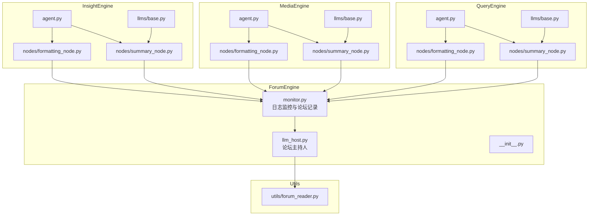
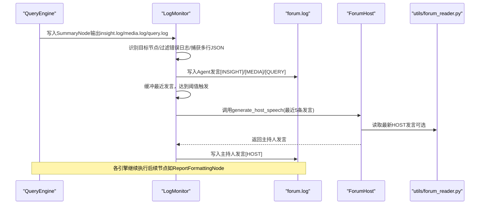
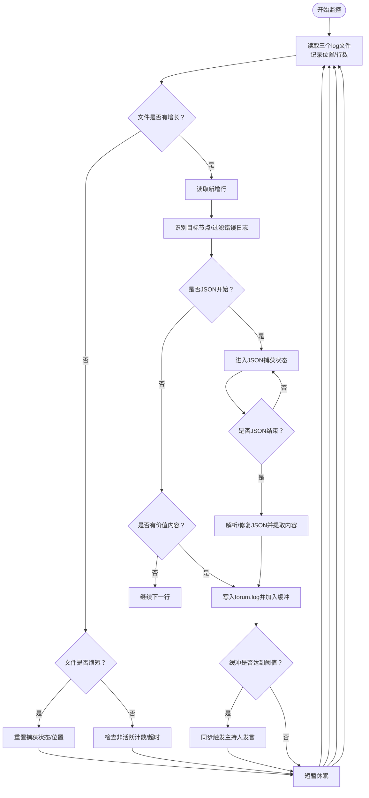
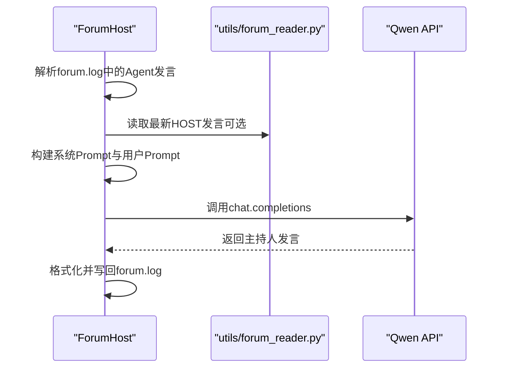
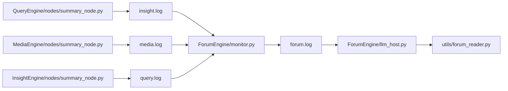

# ForumEngine - Agent协作机制

<cite>
**本文引用的文件**
- [ForumEngine/monitor.py](file://ForumEngine/monitor.py)
- [ForumEngine/llm_host.py](file://ForumEngine/llm_host.py)
- [ForumEngine/__init__.py](file://ForumEngine/__init__.py)
- [QueryEngine/agent.py](file://QueryEngine/agent.py)
- [MediaEngine/agent.py](file://MediaEngine/agent.py)
- [InsightEngine/agent.py](file://InsightEngine/agent.py)
- [QueryEngine/nodes/summary_node.py](file://QueryEngine/nodes/summary_node.py)
- [MediaEngine/nodes/summary_node.py](file://MediaEngine/nodes/summary_node.py)
- [InsightEngine/nodes/summary_node.py](file://InsightEngine/nodes/summary_node.py)
- [QueryEngine/nodes/formatting_node.py](file://QueryEngine/nodes/formatting_node.py)
- [MediaEngine/nodes/formatting_node.py](file://MediaEngine/nodes/formatting_node.py)
- [InsightEngine/nodes/formatting_node.py](file://InsightEngine/nodes/formatting_node.py)
- [QueryEngine/llms/base.py](file://QueryEngine/llms/base.py)
- [MediaEngine/llms/base.py](file://MediaEngine/llms/base.py)
- [InsightEngine/llms/base.py](file://InsightEngine/llms/base.py)
- [utils/forum_reader.py](file://utils/forum_reader.py)
- [tests/test_monitor.py](file://tests/test_monitor.py)
</cite>

## 目录
1. [简介](#简介)
2. [项目结构](#项目结构)
3. [核心组件](#核心组件)
4. [架构总览](#架构总览)
5. [详细组件分析](#详细组件分析)
6. [依赖关系分析](#依赖关系分析)
7. [性能考量](#性能考量)
8. [故障排查指南](#故障排查指南)
9. [结论](#结论)

## 简介
本文件面向ForumEngine的“多Agent论坛”协作机制，系统阐述其设计理念与实现方式。ForumEngine通过监控三个引擎（QueryEngine、MediaEngine、InsightEngine）的SummaryNode输出，汇聚各Agent的阶段性洞察，形成论坛对话；当达到一定阈值时，由论坛主持人（LLM Host）对Agent发言进行综合引导与总结，并将结果写回论坛日志。该设计强调：
- 基于日志的异步消息传递模型
- 明确的状态同步与任务流转边界
- 死锁预防策略（超时、错误块过滤、非活跃计数）

## 项目结构
ForumEngine位于顶层目录下，核心文件包括：
- monitor.py：日志监控与论坛记录
- llm_host.py：论坛主持人（LLM）模块
- __init__.py：对外导出LogMonitor

三个引擎各自包含：
- agent.py：引擎主流程与节点编排
- nodes/*：节点实现（如SummaryNode、FormattingNode等）
- llms/base.py：统一的OpenAI兼容LLM客户端封装

图表来源
- [ForumEngine/monitor.py](file://ForumEngine/monitor.py#L1-L120)
- [ForumEngine/llm_host.py](file://ForumEngine/llm_host.py#L1-L120)
- [QueryEngine/agent.py](file://QueryEngine/agent.py#L1-L120)
- [MediaEngine/agent.py](file://MediaEngine/agent.py#L1-L120)
- [InsightEngine/agent.py](file://InsightEngine/agent.py#L1-L120)
- [QueryEngine/nodes/summary_node.py](file://QueryEngine/nodes/summary_node.py#L1-L120)
- [MediaEngine/nodes/summary_node.py](file://MediaEngine/nodes/summary_node.py#L1-L120)
- [InsightEngine/nodes/summary_node.py](file://InsightEngine/nodes/summary_node.py#L1-L120)
- [QueryEngine/nodes/formatting_node.py](file://QueryEngine/nodes/formatting_node.py#L1-L60)
- [MediaEngine/nodes/formatting_node.py](file://MediaEngine/nodes/formatting_node.py#L1-L60)
- [InsightEngine/nodes/formatting_node.py](file://InsightEngine/nodes/formatting_node.py#L1-L60)
- [QueryEngine/llms/base.py](file://QueryEngine/llms/base.py#L1-L80)
- [MediaEngine/llms/base.py](file://MediaEngine/llms/base.py#L1-L80)
- [InsightEngine/llms/base.py](file://InsightEngine/llms/base.py#L1-L80)
- [utils/forum_reader.py](file://utils/forum_reader.py#L1-L60)

章节来源
- [ForumEngine/__init__.py](file://ForumEngine/__init__.py#L1-L8)

## 核心组件
- 日志监控器（LogMonitor）
  - 监控insight.log、media.log、query.log，识别SummaryNode输出，过滤SearchNode等非目标输出，捕获多行JSON并提取有效内容，写入forum.log。
  - 采用线程安全写入、文件位置追踪、错误块过滤、非活跃超时等机制，保障稳定运行。
- 论坛主持人（ForumHost）
  - 读取forum.log中的Agent发言，构建系统与用户Prompt，调用Qwen API生成主持人发言，写回forum.log。
  - 通过工具模块读取最新HOST发言，实现跨轮次的上下文延续。
- LLM客户端（LLMClient）
  - 统一封装OpenAI兼容接口，支持流式调用与安全拼接，提供重试装饰器与超时控制，供各引擎与主持人使用。

章节来源
- [ForumEngine/monitor.py](file://ForumEngine/monitor.py#L1-L200)
- [ForumEngine/llm_host.py](file://ForumEngine/llm_host.py#L1-L120)
- [QueryEngine/llms/base.py](file://QueryEngine/llms/base.py#L1-L168)
- [MediaEngine/llms/base.py](file://MediaEngine/llms/base.py#L1-L171)
- [InsightEngine/llms/base.py](file://InsightEngine/llms/base.py#L1-L168)

## 架构总览
ForumEngine围绕“日志驱动的异步协作”展开：各Agent引擎在自身日志中输出SummaryNode结果；LogMonitor作为中枢，筛选并聚合这些输出，形成论坛对话；当满足触发条件时，ForumHost生成主持人发言，写回论坛日志，从而驱动后续分析与报告生成。

图表来源
- [ForumEngine/monitor.py](file://ForumEngine/monitor.py#L584-L740)
- [ForumEngine/llm_host.py](file://ForumEngine/llm_host.py#L57-L120)
- [utils/forum_reader.py](file://utils/forum_reader.py#L1-L60)

## 详细组件分析

### 日志监控器（LogMonitor）工作流
- 文件监控与增量读取
  - 维护每个日志文件的当前位置与行数，检测文件增长或收缩，分别处理新增行与重置状态。
- 目标节点识别与过滤
  - 通过正则与关键字识别FirstSummaryNode/ReflectionSummaryNode等目标节点；排除ERROR级别与包含错误关键词的日志；仅捕获SummaryNode的JSON输出。
- 多行JSON捕获与修复
  - 识别“清理后的输出: {”起始标记，清理时间戳后判断结束标记“}”或“] }”，解析失败时尝试修复；优先提取updated_paragraph_latest_state或paragraph_latest_state。
- 论坛记录与主持人触发
  - 将清洗后的内容写入forum.log，附带来源标签；累计到阈值后同步触发ForumHost生成主持人发言；支持超时与非活跃计数，避免死锁。

图表来源
- [ForumEngine/monitor.py](file://ForumEngine/monitor.py#L389-L740)

章节来源
- [ForumEngine/monitor.py](file://ForumEngine/monitor.py#L1-L200)
- [ForumEngine/monitor.py](file://ForumEngine/monitor.py#L200-L480)
- [ForumEngine/monitor.py](file://ForumEngine/monitor.py#L480-L740)

### 论坛主持人（ForumHost）生成流程
- 输入解析
  - 从forum.log读取最近Agent发言，解析时间戳与发言者，跳过SYSTEM与HOST自身内容。
- Prompt构建
  - 构建系统Prompt与用户Prompt，包含事件梳理、观点整合、问题引导等结构化要求。
- LLM调用与格式化
  - 调用Qwen API生成主持人发言，格式化输出并写回forum.log。
- 上下文延续
  - 通过工具模块读取最新HOST发言，作为后续Prompt的上下文，形成跨轮次的引导闭环。

图表来源
- [ForumEngine/llm_host.py](file://ForumEngine/llm_host.py#L57-L210)
- [utils/forum_reader.py](file://utils/forum_reader.py#L1-L60)

章节来源
- [ForumEngine/llm_host.py](file://ForumEngine/llm_host.py#L1-L210)
- [utils/forum_reader.py](file://utils/forum_reader.py#L1-L160)

### LLM资源管理与共享
- LLM客户端封装
  - 各引擎均使用OpenAI兼容客户端，统一支持invoke与流式stream_invoke/stream_invoke_to_string，具备超时与重试装饰器。
- 资源共享策略
  - ForumEngine通过llm_host.py集中管理主持人LLM调用；各引擎的LLMClient独立配置，互不直接耦合，避免资源争用。
- 死锁预防
  - LogMonitor在触发主持人发言时采用同步阻塞，但通过is_host_generating标志与阈值控制，避免并发重复触发；同时通过非活跃计数与超时自动结束会话。

章节来源
- [QueryEngine/llms/base.py](file://QueryEngine/llms/base.py#L1-L168)
- [MediaEngine/llms/base.py](file://MediaEngine/llms/base.py#L1-L171)
- [InsightEngine/llms/base.py](file://InsightEngine/llms/base.py#L1-L168)
- [ForumEngine/llm_host.py](file://ForumEngine/llm_host.py#L1-L120)
- [ForumEngine/monitor.py](file://ForumEngine/monitor.py#L524-L560)

### 跨Agent交互与消息传递模型
- 消息来源
  - QueryEngine、MediaEngine、InsightEngine的SummaryNode在各自日志中输出“清理后的输出: { ... }”的JSON；SearchNode等非目标节点输出被过滤。
- 消息格式
  - LogMonitor统一清洗时间戳、标签与多余前缀，提取paragraph_latest_state或updated_paragraph_latest_state作为内容。
- 传递路径
  - 从各引擎日志到forum.log，再到ForumHost；随后写回forum.log，供各引擎节点（如ReportFormattingNode）读取或作为后续Prompt输入。
- 策略决策
  - 当首次出现FirstSummaryNode时，LogMonitor清空并开启新会话；当长时间无活动或日志缩短，自动结束会话，避免无限期等待。

章节来源
- [tests/test_monitor.py](file://tests/test_monitor.py#L1-L200)
- [QueryEngine/nodes/summary_node.py](file://QueryEngine/nodes/summary_node.py#L100-L170)
- [MediaEngine/nodes/summary_node.py](file://MediaEngine/nodes/summary_node.py#L200-L240)
- [InsightEngine/nodes/summary_node.py](file://InsightEngine/nodes/summary_node.py#L199-L237)
- [QueryEngine/nodes/formatting_node.py](file://QueryEngine/nodes/formatting_node.py#L1-L60)
- [MediaEngine/nodes/formatting_node.py](file://MediaEngine/nodes/formatting_node.py#L1-L60)
- [InsightEngine/nodes/formatting_node.py](file://InsightEngine/nodes/formatting_node.py#L1-L60)

## 依赖关系分析
- 组件耦合
  - LogMonitor与各引擎节点通过日志文件耦合，不直接调用引擎代码，降低耦合度。
  - ForumHost与LogMonitor通过forum.log耦合，不直接依赖引擎节点实现。
- 外部依赖
  - OpenAI兼容客户端封装，统一超时与重试策略。
  - loguru日志库，支持多格式时间戳解析与格式化。
- 循环依赖
  - 未发现直接循环依赖；LogMonitor与ForumHost通过文件I/O解耦。

图表来源
- [ForumEngine/monitor.py](file://ForumEngine/monitor.py#L1-L120)
- [ForumEngine/llm_host.py](file://ForumEngine/llm_host.py#L1-L120)
- [QueryEngine/nodes/summary_node.py](file://QueryEngine/nodes/summary_node.py#L1-L120)
- [MediaEngine/nodes/summary_node.py](file://MediaEngine/nodes/summary_node.py#L1-L120)
- [InsightEngine/nodes/summary_node.py](file://InsightEngine/nodes/summary_node.py#L1-L120)

章节来源
- [ForumEngine/monitor.py](file://ForumEngine/monitor.py#L1-L120)
- [ForumEngine/llm_host.py](file://ForumEngine/llm_host.py#L1-L120)

## 性能考量
- I/O与解析开销
  - LogMonitor按文件大小与行数增量读取，避免全量扫描；多行JSON解析与修复在必要时进行，减少不必要的CPU消耗。
- 流式LLM调用
  - LLMClient提供流式接口，避免长文本累积导致的内存峰值；统一超时与重试策略提升鲁棒性。
- 并发与锁
  - 写入forum.log使用线程安全锁，避免竞态；主持人生成过程为同步阻塞，配合阈值与标志位，避免并发重复触发。
- 超时与非活跃
  - 非活跃计数与超时自动结束会话，防止资源长期占用。

[本节为通用指导，无需列出具体文件来源]

## 故障排查指南
- 日志识别失败
  - 检查目标节点模式与关键字是否匹配；确认日志格式（旧格式[HH:MM:SS]与新格式loguru）是否正确清理。
- JSON解析/修复失败
  - 查看LogMonitor的修复逻辑与异常分支；确认SummaryNode输出是否包含“清理后的输出: { ... }”。
- 错误日志被误捕获
  - 确认ERROR级别与错误关键词过滤逻辑；确保SearchNode输出被正确过滤。
- 主持人未触发
  - 检查阈值与缓冲区长度；确认is_host_generating标志未被意外置位；核对forum.log写入权限与路径。
- LLM调用异常
  - 检查API密钥与基础地址配置；查看重试装饰器与超时设置；确认网络连通性。

章节来源
- [tests/test_monitor.py](file://tests/test_monitor.py#L1-L341)
- [ForumEngine/monitor.py](file://ForumEngine/monitor.py#L120-L260)
- [ForumEngine/monitor.py](file://ForumEngine/monitor.py#L260-L480)
- [ForumEngine/llm_host.py](file://ForumEngine/llm_host.py#L1-L120)

## 结论
ForumEngine通过“日志驱动的异步协作”实现了多Agent论坛的自动化运转：LogMonitor负责筛选与聚合各Agent的SummaryNode输出，形成论坛对话；ForumHost在合适时机进行综合引导与总结，写回论坛日志，驱动后续流程。该设计以文件I/O为通信协议，避免直接代码耦合，具备良好的扩展性与稳定性；通过阈值、超时、错误块过滤与非活跃计数等机制，有效预防死锁与资源浪费。