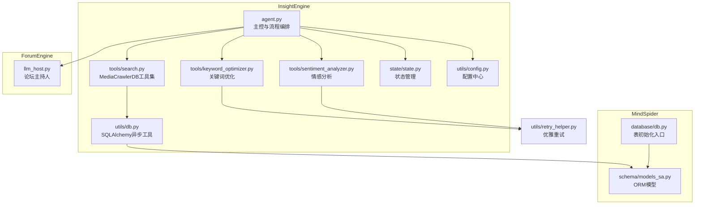
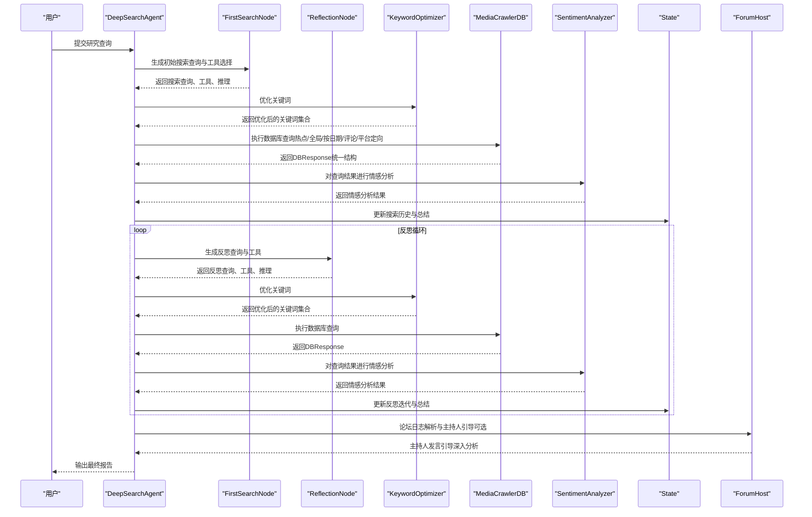
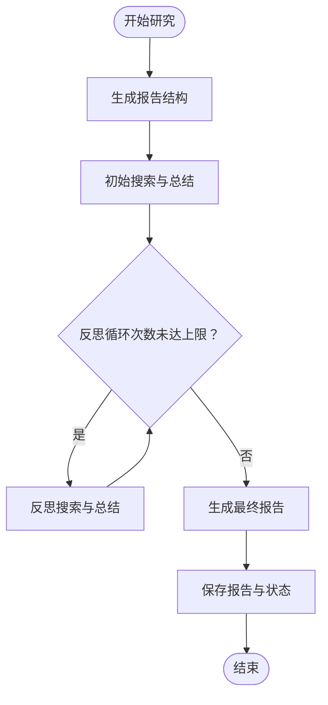
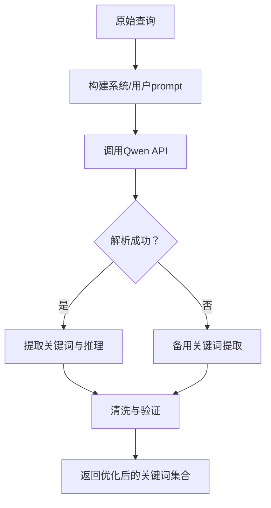
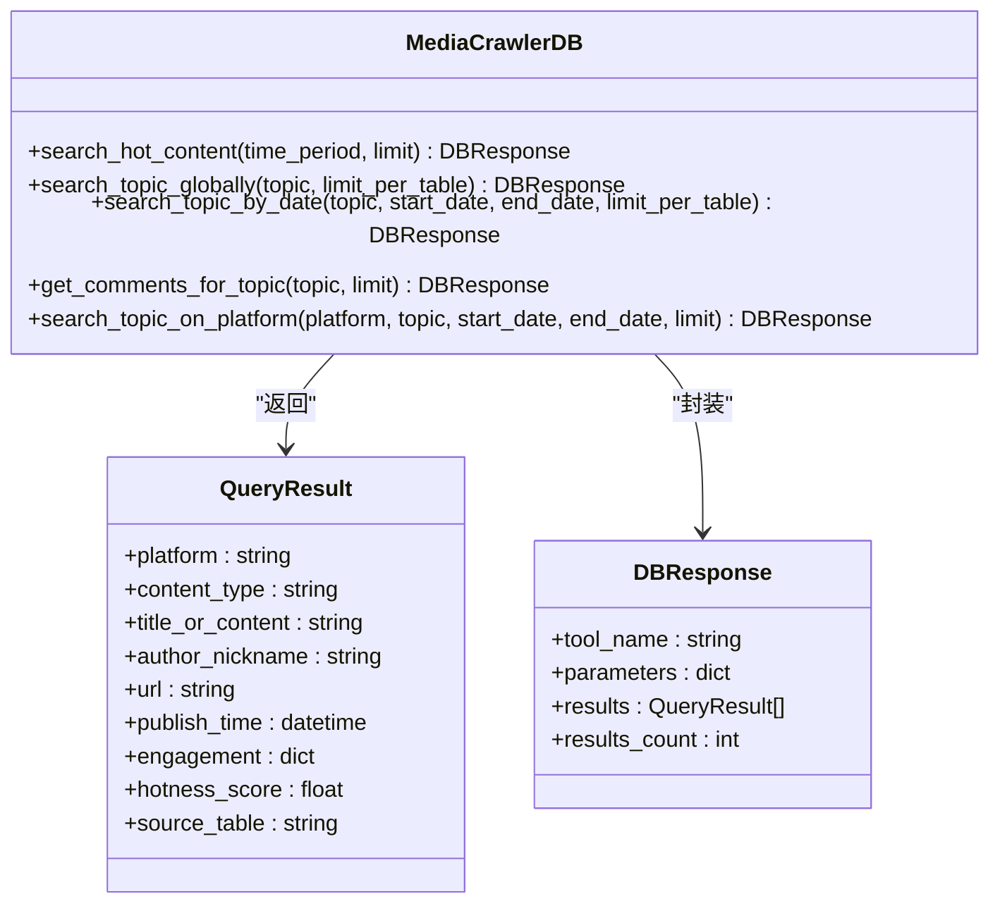
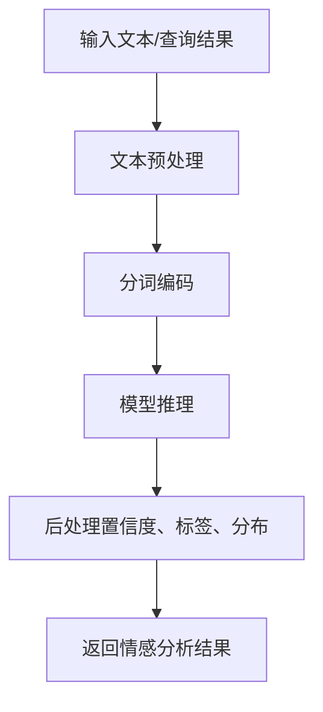
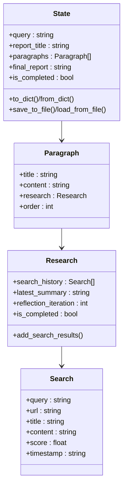
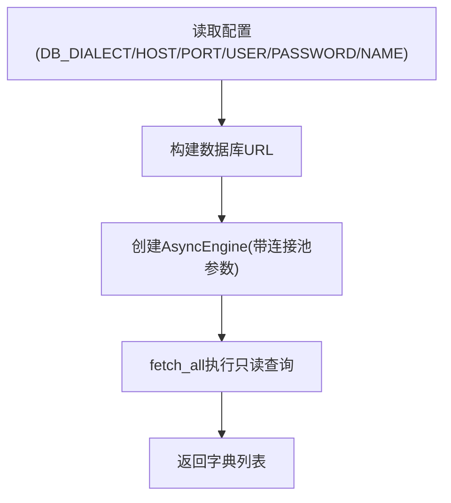
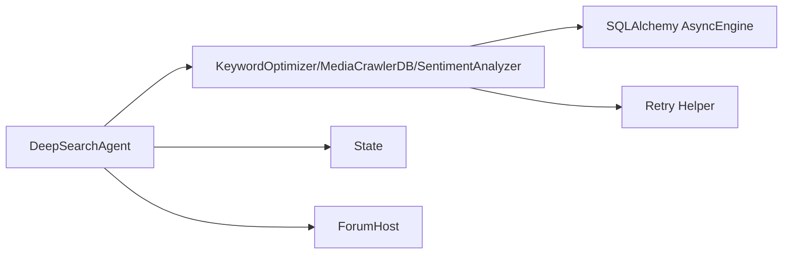

# InsightEngine - 私有数据库挖掘Agent

<cite>
**本文引用的文件**
- [InsightEngine/agent.py](file://InsightEngine/agent.py)
- [InsightEngine/tools/sentiment_analyzer.py](file://InsightEngine/tools/sentiment_analyzer.py)
- [InsightEngine/tools/keyword_optimizer.py](file://InsightEngine/tools/keyword_optimizer.py)
- [InsightEngine/tools/search.py](file://InsightEngine/tools/search.py)
- [InsightEngine/utils/db.py](file://InsightEngine/utils/db.py)
- [InsightEngine/state/state.py](file://InsightEngine/state/state.py)
- [InsightEngine/utils/config.py](file://InsightEngine/utils/config.py)
- [MindSpider/schema/models_sa.py](file://MindSpider/schema/models_sa.py)
- [MindSpider/DeepSentimentCrawling/MediaCrawler/database/db.py](file://MindSpider/DeepSentimentCrawling/MediaCrawler/database/db.py)
- [ForumEngine/llm_host.py](file://ForumEngine/llm_host.py)
- [utils/retry_helper.py](file://utils/retry_helper.py)
</cite>

## 目录
1. [简介](#简介)
2. [项目结构](#项目结构)
3. [核心组件](#核心组件)
4. [架构总览](#架构总览)
5. [详细组件分析](#详细组件分析)
6. [依赖关系分析](#依赖关系分析)
7. [性能考量](#性能考量)
8. [故障排查指南](#故障排查指南)
9. [结论](#结论)
10. [附录](#附录)

## 简介
InsightEngine 是一个面向私有舆情数据库的深度挖掘Agent，旨在通过“关键词优化 + 数据库查询 + 情感分析”的闭环流程，从本地MySQL/PostgreSQL数据库中抽取深层洞察。它与MindSpider的爬取数据无缝集成，借助MindSpider的ORM模型与数据库表结构，将采集到的热点、话题、评论等数据沉淀至数据库；InsightEngine在此基础上进行热点聚合、跨表全局检索、平台定向搜索、评论聚合与情感分析，并将结果与报告节点协同，最终生成可读性强的分析报告。同时，InsightEngine与ForumEngine协作，通过论坛主持人引导多Agent协同，持续深化分析。

## 项目结构
InsightEngine采用模块化设计，围绕Agent主控、工具集、状态管理、数据库工具与配置展开，形成清晰的分层：
- Agent主控：编排节点、工具与状态流转，负责研究流程的生命周期管理
- 工具集：
  - 关键词优化：将自然语言查询转化为贴近网民语言的关键词集合
  - 数据库查询：封装MediaCrawlerDB，提供热点、全局、按日期、评论、平台定向等工具
  - 情感分析：基于多语言情感模型，对查询结果或文本进行情感打分与分布统计
- 状态管理：记录段落研究历史、反思迭代、最终报告等
- 数据库工具：基于SQLAlchemy 2.x异步引擎，提供连接池与只读查询能力
- 配置中心：集中管理LLM、数据库、限流与默认参数

图表来源
- [InsightEngine/agent.py](file://InsightEngine/agent.py#L1-L200)
- [InsightEngine/tools/keyword_optimizer.py](file://InsightEngine/tools/keyword_optimizer.py#L1-L120)
- [InsightEngine/tools/search.py](file://InsightEngine/tools/search.py#L1-L120)
- [InsightEngine/tools/sentiment_analyzer.py](file://InsightEngine/tools/sentiment_analyzer.py#L1-L120)
- [InsightEngine/state/state.py](file://InsightEngine/state/state.py#L1-L120)
- [InsightEngine/utils/db.py](file://InsightEngine/utils/db.py#L1-L73)
- [InsightEngine/utils/config.py](file://InsightEngine/utils/config.py#L1-L45)
- [MindSpider/schema/models_sa.py](file://MindSpider/schema/models_sa.py#L1-L127)
- [MindSpider/DeepSentimentCrawling/MediaCrawler/database/db.py](file://MindSpider/DeepSentimentCrawling/MediaCrawler/database/db.py#L1-L36)
- [ForumEngine/llm_host.py](file://ForumEngine/llm_host.py#L1-L120)
- [utils/retry_helper.py](file://utils/retry_helper.py#L141-L199)

章节来源
- [InsightEngine/agent.py](file://InsightEngine/agent.py#L1-L120)
- [InsightEngine/utils/db.py](file://InsightEngine/utils/db.py#L1-L73)
- [MindSpider/schema/models_sa.py](file://MindSpider/schema/models_sa.py#L1-L127)

## 核心组件
- DeepSearchAgent：主控类，负责LLM客户端初始化、节点初始化、研究流程编排、状态管理、报告生成与持久化
- MediaCrawlerDB：数据库查询工具集，提供热点聚合、全局话题搜索、按日期搜索、评论聚合、平台定向搜索
- KeywordOptimizer：关键词优化器，将Agent生成的查询转化为贴近网民语言的关键词集合
- WeiboMultilingualSentimentAnalyzer：情感分析器，支持多语言情感打分与批量分析
- State：段落/研究/搜索历史状态管理，支持序列化与恢复
- DBResponse/QueryResult：统一查询结果数据结构，便于跨工具与LLM交互
- AsyncEngine工具：基于SQLAlchemy 2.x异步引擎，提供连接池与只读查询

章节来源
- [InsightEngine/agent.py](file://InsightEngine/agent.py#L28-L120)
- [InsightEngine/tools/search.py](file://InsightEngine/tools/search.py#L36-L120)
- [InsightEngine/tools/keyword_optimizer.py](file://InsightEngine/tools/keyword_optimizer.py#L27-L120)
- [InsightEngine/tools/sentiment_analyzer.py](file://InsightEngine/tools/sentiment_analyzer.py#L54-L140)
- [InsightEngine/state/state.py](file://InsightEngine/state/state.py#L1-L120)
- [InsightEngine/utils/db.py](file://InsightEngine/utils/db.py#L1-L73)

## 架构总览
InsightEngine的架构围绕“查询-分析-反思-报告”的循环展开，其中关键词优化与情感分析贯穿始终，数据库查询工具集提供统一的只读访问接口，状态管理保障研究过程可追踪与可恢复，ForumEngine通过主持人引导多Agent协同，形成“私有数据库挖掘 + 多Agent协作”的闭环。

图表来源
- [InsightEngine/agent.py](file://InsightEngine/agent.py#L372-L770)
- [InsightEngine/tools/keyword_optimizer.py](file://InsightEngine/tools/keyword_optimizer.py#L63-L148)
- [InsightEngine/tools/search.py](file://InsightEngine/tools/search.py#L130-L397)
- [InsightEngine/tools/sentiment_analyzer.py](file://InsightEngine/tools/sentiment_analyzer.py#L467-L590)
- [ForumEngine/llm_host.py](file://ForumEngine/llm_host.py#L57-L120)

## 详细组件分析

### 组件A：DeepSearchAgent（主控与流程编排）
- 初始化与依赖注入：LLM客户端、搜索工具集、情感分析器、处理节点、状态对象
- 关键流程：
  - 执行搜索工具：根据工具名选择对应查询策略，对关键词进行优化，按优化后的关键词多次查询并整合结果，去重与统一结构
  - 情感分析：对热点内容或搜索结果进行情感分析，支持独立情感分析工具
  - 研究流程：生成报告结构 → 初始搜索与总结 → 反思循环 → 生成最终报告 → 保存报告与状态
  - 状态管理：支持进度摘要、状态保存与加载
- 错误处理：对数据库查询、日期校验、工具参数缺失等情况进行容错与日志记录

图表来源
- [InsightEngine/agent.py](file://InsightEngine/agent.py#L372-L770)

章节来源
- [InsightEngine/agent.py](file://InsightEngine/agent.py#L28-L120)
- [InsightEngine/agent.py](file://InsightEngine/agent.py#L105-L248)
- [InsightEngine/agent.py](file://InsightEngine/agent.py#L372-L770)

### 组件B：KeywordOptimizer（关键词优化中间件）
- 功能：将Agent生成的自然语言查询转换为贴近网民语言的关键词集合，提升数据库检索命中率
- 实现要点：
  - 使用OpenAI兼容接口调用Qwen模型，构建系统与用户prompt
  - 支持JSON与文本两种响应解析策略，失败时回退到备用提取方案
  - 对关键词进行清洗、去重与长度限制，避免专业术语与空格
  - 通过优雅重试装饰器保证非关键API失败时的系统稳定性

图表来源
- [InsightEngine/tools/keyword_optimizer.py](file://InsightEngine/tools/keyword_optimizer.py#L63-L148)
- [utils/retry_helper.py](file://utils/retry_helper.py#L141-L199)

章节来源
- [InsightEngine/tools/keyword_optimizer.py](file://InsightEngine/tools/keyword_optimizer.py#L1-L298)
- [utils/retry_helper.py](file://utils/retry_helper.py#L141-L199)

### 组件C：MediaCrawlerDB（数据库查询工具集）
- 功能：封装多种数据库查询工具，统一返回DBResponse结构，屏蔽SQL复杂度
- 工具清单：
  - 热点内容：按平台加权计算综合热度，支持24小时/周/年时间窗口
  - 全局话题搜索：跨内容、评论、标签、来源关键字等字段进行LIKE匹配
  - 按日期搜索：限定历史日期范围内的内容检索
  - 评论聚合：从各平台评论表中聚合评论
  - 平台定向搜索：在指定平台内精确搜索话题并支持时间筛选
- 数据结构：
  - QueryResult：统一字段（平台、内容类型、标题/内容、作者、URL、发布时间、互动、热度分值、来源表等）
  - DBResponse：封装工具名、参数、结果列表与计数

图表来源
- [InsightEngine/tools/search.py](file://InsightEngine/tools/search.py#L36-L120)
- [InsightEngine/tools/search.py](file://InsightEngine/tools/search.py#L130-L397)

章节来源
- [InsightEngine/tools/search.py](file://InsightEngine/tools/search.py#L1-L463)

### 组件D：WeiboMultilingualSentimentAnalyzer（情感分析）
- 功能：对文本或查询结果进行情感分析，支持单文本与批量分析，输出情感标签、置信度与分布统计
- 实现要点：
  - 自动选择GPU/CPU/MPS设备，支持本地模型缓存与首次下载
  - 提供透传模式（当模型不可用时），保证系统可用性
  - 对查询结果进行字段自适应提取，支持高置信度结果筛选与摘要统计

图表来源
- [InsightEngine/tools/sentiment_analyzer.py](file://InsightEngine/tools/sentiment_analyzer.py#L242-L356)
- [InsightEngine/tools/sentiment_analyzer.py](file://InsightEngine/tools/sentiment_analyzer.py#L467-L590)

章节来源
- [InsightEngine/tools/sentiment_analyzer.py](file://InsightEngine/tools/sentiment_analyzer.py#L1-L704)

### 组件E：State（状态管理）
- 功能：记录段落研究历史、反思迭代次数、最新总结、是否完成等，支持序列化与恢复
- 数据结构：
  - Search：单条搜索记录
  - Research：段落研究过程
  - Paragraph：段落
  - State：整体报告状态

图表来源
- [InsightEngine/state/state.py](file://InsightEngine/state/state.py#L1-L259)

章节来源
- [InsightEngine/state/state.py](file://InsightEngine/state/state.py#L1-L259)

### 组件F：数据库连接与查询（SQLAlchemy异步）
- 功能：提供基于SQLAlchemy 2.x的异步引擎与只读查询封装，支持MySQL与PostgreSQL
- 实现要点：
  - 通过配置中心读取DB_HOST/DB_PORT/DB_USER/DB_PASSWORD/DB_NAME/DB_DIALECT
  - 自动拼接数据库URL，支持环境变量覆盖
  - 连接池配置：pool_pre_ping、pool_recycle，确保连接有效性与回收
  - fetch_all：异步执行只读查询，返回字典列表

图表来源
- [InsightEngine/utils/db.py](file://InsightEngine/utils/db.py#L28-L73)
- [InsightEngine/utils/config.py](file://InsightEngine/utils/config.py#L1-L45)

章节来源
- [InsightEngine/utils/db.py](file://InsightEngine/utils/db.py#L1-L73)
- [InsightEngine/utils/config.py](file://InsightEngine/utils/config.py#L1-L45)

### 组件G：与MindSpider的爬取数据集成
- MindSpider通过ORM模型定义了扩展表（如daily_news、daily_topics、topic_news_relation、crawling_tasks等），InsightEngine的查询工具集可直接基于这些表进行跨表聚合与关联分析
- MindSpider的数据库初始化入口提供了表结构创建与数据库类型选择（SQLite/MySQL/PostgreSQL），InsightEngine通过SQLAlchemy异步引擎与之协同

章节来源
- [MindSpider/schema/models_sa.py](file://MindSpider/schema/models_sa.py#L1-L127)
- [MindSpider/DeepSentimentCrawling/MediaCrawler/database/db.py](file://MindSpider/DeepSentimentCrawling/MediaCrawler/database/db.py#L1-L36)

### 组件H：与ForumEngine的协作与分析结果共享
- InsightEngine在研究流程中可与ForumEngine协作，通过解析论坛日志，由论坛主持人生成引导性发言，推动多Agent协同与深入分析
- 主持人解析INSIGHT/MEDIA/QUERY等Agent的发言，生成综合性引导，促进跨Agent信息融合与视角互补

章节来源
- [ForumEngine/llm_host.py](file://ForumEngine/llm_host.py#L57-L120)
- [README.md（一次完整分析流程）](file://README.md#L105-L118)

## 依赖关系分析
- 组件耦合与内聚：
  - DeepSearchAgent对工具集与状态管理高度内聚，通过统一接口调用工具，降低对外部实现细节的耦合
  - MediaCrawlerDB与SQLAlchemy异步引擎解耦，通过fetch_all抽象数据库访问
  - KeywordOptimizer与SentimentAnalyzer均通过装饰器与配置中心实现可插拔与可配置
- 外部依赖：
  - OpenAI兼容接口（SiliconFlow）用于关键词优化与论坛主持人
  - SQLAlchemy 2.x异步引擎与aiomysql/asyncpg驱动
  - Transformers与PyTorch用于情感分析模型推理
- 潜在循环依赖：
  - 未发现直接循环依赖；工具与Agent之间为单向依赖

图表来源
- [InsightEngine/agent.py](file://InsightEngine/agent.py#L1-L120)
- [InsightEngine/tools/keyword_optimizer.py](file://InsightEngine/tools/keyword_optimizer.py#L1-L120)
- [InsightEngine/tools/search.py](file://InsightEngine/tools/search.py#L1-L120)
- [InsightEngine/tools/sentiment_analyzer.py](file://InsightEngine/tools/sentiment_analyzer.py#L1-L120)
- [InsightEngine/utils/db.py](file://InsightEngine/utils/db.py#L1-L73)
- [utils/retry_helper.py](file://utils/retry_helper.py#L141-L199)

章节来源
- [InsightEngine/agent.py](file://InsightEngine/agent.py#L1-L120)
- [InsightEngine/tools/search.py](file://InsightEngine/tools/search.py#L1-L120)
- [InsightEngine/tools/sentiment_analyzer.py](file://InsightEngine/tools/sentiment_analyzer.py#L1-L120)
- [utils/retry_helper.py](file://utils/retry_helper.py#L141-L199)

## 性能考量
- 连接池与超时：
  - 异步引擎启用pool_pre_ping与pool_recycle，减少失效连接带来的重试成本
  - 配置中心提供SEARCH_TIMEOUT，控制单次搜索请求超时
- 查询优化：
  - MediaCrawlerDB对各平台字段进行统一映射与加权，热点聚合使用UNION ALL合并并一次性排序
  - 通过limit_per_table与MAX_SEARCH_RESULTS_FOR_LLM控制传递给LLM的结果规模，避免过度IO
- 设备选择：
  - 情感分析器自动选择CUDA/MPS/CPU，优先使用GPU加速推理
- 批量处理：
  - 情感分析支持批量处理，提高吞吐量；关键词优化与情感分析均具备优雅重试，避免单点失败导致整体阻塞

[本节为通用指导，不直接分析具体文件]

## 故障排查指南
- 数据库连接失败：
  - 检查DB_DIALECT/HOST/PORT/USER/PASSWORD/NAME配置是否正确
  - 确认驱动安装（aiomysql/asyncpg/pymysql/psycopg），MindSpider数据库初始化入口展示了驱动差异
  - 查看连接URL拼接逻辑与环境变量覆盖
- 关键词优化API失败：
  - 检查KEYWORD_OPTIMIZER_API_KEY与BASE_URL配置
  - 观察with_graceful_retry装饰器的日志，确认是否回退到备用提取方案
- 情感分析不可用：
  - 检查SENTIMENT_ANALYSIS_ENABLED与依赖（torch/transformers）是否满足
  - 若模型加载失败，查看disable_reason并确认本地缓存路径
- 查询结果为空：
  - 检查关键词优化质量与工具参数（日期格式、平台参数、limit）
  - 使用DBResponse.error_message定位具体工具错误
- 状态保存/恢复：
  - 确认SAVE_INTERMEDIATE_STATES配置与输出目录权限
  - 使用State.save_to_file/load_from_file进行调试

章节来源
- [InsightEngine/utils/db.py](file://InsightEngine/utils/db.py#L28-L73)
- [MindSpider/DeepSentimentCrawling/MediaCrawler/database/db.py](file://MindSpider/DeepSentimentCrawling/MediaCrawler/database/db.py#L1-L36)
- [InsightEngine/tools/keyword_optimizer.py](file://InsightEngine/tools/keyword_optimizer.py#L1-L120)
- [InsightEngine/tools/sentiment_analyzer.py](file://InsightEngine/tools/sentiment_analyzer.py#L1-L120)
- [InsightEngine/state/state.py](file://InsightEngine/state/state.py#L223-L259)

## 结论
InsightEngine通过“关键词优化 + 数据库查询 + 情感分析”的组合拳，实现了对私有舆情数据库的深度挖掘与洞察生成。其模块化设计使得工具与主控解耦，状态管理与配置中心增强了可维护性与可扩展性。配合MindSpider的ORM模型与数据库表结构，InsightEngine能够高效地从多平台采集数据中提炼热点、主题与情感趋势；通过与ForumEngine的协作，进一步推动多Agent协同与深入分析，最终输出高质量的分析报告。

[本节为总结性内容，不直接分析具体文件]

## 附录
- 事务管理与连接池配置：
  - InsightEngine的异步引擎通过pool_pre_ping与pool_recycle维持连接健康；当前实现为只读查询封装，未显式使用事务API
  - 如需写入场景，建议在业务层引入AsyncSession与事务上下文管理，结合retry_helper进行幂等重试
- 异常恢复策略：
  - 关键API（关键词优化、情感分析）采用with_graceful_retry装饰器，失败时返回默认值，保证系统继续运行
  - 数据库查询异常被捕获并返回空列表，避免中断主流程
- 与MindSpider的表结构对照：
  - daily_news、daily_topics、topic_news_relation、crawling_tasks等表为InsightEngine查询工具集提供数据基础

章节来源
- [InsightEngine/utils/db.py](file://InsightEngine/utils/db.py#L28-L73)
- [utils/retry_helper.py](file://utils/retry_helper.py#L141-L199)
- [MindSpider/schema/models_sa.py](file://MindSpider/schema/models_sa.py#L1-L127)