# MediaEngine - 多模态内容分析Agent

<cite>
**本文引用的文件**
- [MediaEngine/agent.py](file://MediaEngine/agent.py)
- [MediaEngine/nodes/base_node.py](file://MediaEngine/nodes/base_node.py)
- [MediaEngine/nodes/report_structure_node.py](file://MediaEngine/nodes/report_structure_node.py)
- [MediaEngine/nodes/search_node.py](file://MediaEngine/nodes/search_node.py)
- [MediaEngine/nodes/summary_node.py](file://MediaEngine/nodes/summary_node.py)
- [MediaEngine/nodes/formatting_node.py](file://MediaEngine/nodes/formatting_node.py)
- [MediaEngine/state/state.py](file://MediaEngine/state/state.py)
- [MediaEngine/prompts/prompts.py](file://MediaEngine/prompts/prompts.py)
- [MediaEngine/utils/text_processing.py](file://MediaEngine/utils/text_processing.py)
- [MediaEngine/tools/search.py](file://MediaEngine/tools/search.py)
- [MediaEngine/utils/__init__.py](file://MediaEngine/utils/__init__.py)
- [MediaEngine/tools/__init__.py](file://MediaEngine/tools/__init__.py)
- [QueryEngine/agent.py](file://QueryEngine/agent.py)
- [InsightEngine/agent.py](file://InsightEngine/agent.py)
</cite>

## 目录
1. [简介](#简介)
2. [项目结构](#项目结构)
3. [核心组件](#核心组件)
4. [架构总览](#架构总览)
5. [详细组件分析](#详细组件分析)
6. [依赖关系分析](#依赖关系分析)
7. [性能考量](#性能考量)
8. [故障排查指南](#故障排查指南)
9. [结论](#结论)
10. [附录](#附录)

## 简介
MediaEngine 是一个面向多模态内容分析的智能Agent，专注于对文本、图片、结构化数据等多源信息进行系统化采集、提炼与格式化输出。其核心职责包括：
- 文本摘要：通过LLM对多模态搜索结果进行深度整合与归纳，形成高质量段落级摘要。
- 格式化处理：将各段落摘要统一格式化为结构化、可读性强的报告。
- 跨平台内容解析：依托Bocha多模态搜索工具，支持网页、图片、模态卡等多种结果的统一解析与应用。
- 控制流编排：以“生成报告结构 → 初始搜索与总结 → 反思循环 → 最终格式化”的流水线方式推进研究任务。

MediaEngine 与 QueryEngine 共享“搜索工具”的复用机制（均采用各自的工具集封装对外搜索接口），并与 InsightEngine 在“多模态数据融合”和“报告格式化”方面形成互补协作。

## 项目结构
MediaEngine 模块采用“节点化流水线 + 状态管理 + 提示词 + 工具集”的分层设计：
- agent.py：控制流入口，编排节点与工具，维护状态与输出。
- nodes/：节点层，包含报告结构生成、搜索查询生成、总结与反思、最终格式化等节点。
- state/state.py：状态模型，承载查询、段落、研究过程与最终报告。
- prompts/prompts.py：系统提示词与JSON Schema，约束LLM输出格式。
- utils/text_processing.py：文本清洗、JSON解析、长度截断、提示词格式化等工具。
- tools/search.py：Bocha多模态搜索客户端，封装多种搜索工具与响应解析。
- utils/__init__.py、tools/__init__.py：导出工具与配置。

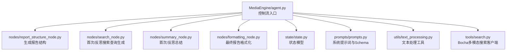

图表来源
- [MediaEngine/agent.py](file://MediaEngine/agent.py#L1-L452)
- [MediaEngine/nodes/report_structure_node.py](file://MediaEngine/nodes/report_structure_node.py#L1-L205)
- [MediaEngine/nodes/search_node.py](file://MediaEngine/nodes/search_node.py#L1-L287)
- [MediaEngine/nodes/summary_node.py](file://MediaEngine/nodes/summary_node.py#L1-L369)
- [MediaEngine/nodes/formatting_node.py](file://MediaEngine/nodes/formatting_node.py#L1-L169)
- [MediaEngine/state/state.py](file://MediaEngine/state/state.py#L1-L293)
- [MediaEngine/prompts/prompts.py](file://MediaEngine/prompts/prompts.py#L1-L451)
- [MediaEngine/utils/text_processing.py](file://MediaEngine/utils/text_processing.py#L1-L309)
- [MediaEngine/tools/search.py](file://MediaEngine/tools/search.py#L1-L390)

章节来源
- [MediaEngine/agent.py](file://MediaEngine/agent.py#L1-L120)
- [MediaEngine/nodes/base_node.py](file://MediaEngine/nodes/base_node.py#L1-L95)

## 核心组件
- DeepSearchAgent：控制流主类，负责初始化LLM、节点、工具与状态，编排研究流程。
- 节点家族：
  - ReportStructureNode：生成报告段落结构。
  - FirstSearchNode/ReflectionNode：分别生成首次与反思阶段的搜索查询。
  - FirstSummaryNode/ReflectionSummaryNode：基于搜索结果生成与更新段落摘要。
  - ReportFormattingNode：将各段落摘要格式化为最终报告。
- 状态模型 State：统一管理查询、段落、研究历史、最终报告与完成状态。
- 提示词与Schema：严格约束LLM输出，确保可解析性与一致性。
- 文本处理工具：JSON清洗、Markdown清理、长度截断、提示词格式化。
- Bocha多模态搜索工具：统一返回网页、图片、模态卡等多模态结果，简化上层接入。

章节来源
- [MediaEngine/agent.py](file://MediaEngine/agent.py#L120-L452)
- [MediaEngine/nodes/report_structure_node.py](file://MediaEngine/nodes/report_structure_node.py#L1-L205)
- [MediaEngine/nodes/search_node.py](file://MediaEngine/nodes/search_node.py#L1-L287)
- [MediaEngine/nodes/summary_node.py](file://MediaEngine/nodes/summary_node.py#L1-L369)
- [MediaEngine/nodes/formatting_node.py](file://MediaEngine/nodes/formatting_node.py#L1-L169)
- [MediaEngine/state/state.py](file://MediaEngine/state/state.py#L1-L293)
- [MediaEngine/prompts/prompts.py](file://MediaEngine/prompts/prompts.py#L1-L451)
- [MediaEngine/utils/text_processing.py](file://MediaEngine/utils/text_processing.py#L1-L309)
- [MediaEngine/tools/search.py](file://MediaEngine/tools/search.py#L1-L390)

## 架构总览
MediaEngine 的整体架构遵循“提示词驱动 + 节点流水线 + 状态持久化”的设计原则。控制流以 DeepSearchAgent 为核心，串联各节点与工具，形成可扩展的研究工作流。

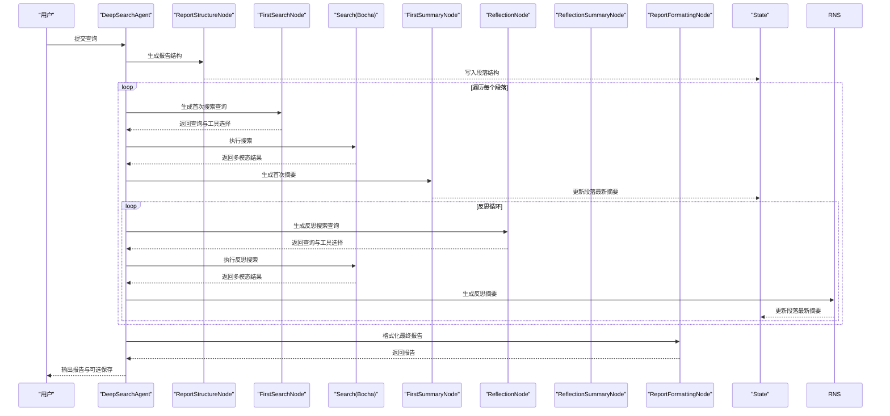

图表来源
- [MediaEngine/agent.py](file://MediaEngine/agent.py#L133-L401)
- [MediaEngine/nodes/report_structure_node.py](file://MediaEngine/nodes/report_structure_node.py#L120-L205)
- [MediaEngine/nodes/search_node.py](file://MediaEngine/nodes/search_node.py#L1-L287)
- [MediaEngine/nodes/summary_node.py](file://MediaEngine/nodes/summary_node.py#L1-L369)
- [MediaEngine/nodes/formatting_node.py](file://MediaEngine/nodes/formatting_node.py#L1-L169)
- [MediaEngine/state/state.py](file://MediaEngine/state/state.py#L1-L293)
- [MediaEngine/tools/search.py](file://MediaEngine/tools/search.py#L1-L390)

## 详细组件分析

### 控制流与节点编排（agent.py）
- 初始化：加载配置、创建LLM客户端、初始化节点、准备输出目录。
- 研究流程：
  - 生成报告结构：调用 ReportStructureNode，写入 State。
  - 处理段落：对每个段落执行“首次搜索与总结 → 反思循环 → 完成标记”。
  - 生成最终报告：调用 ReportFormattingNode，回写 State.final_report。
  - 保存报告与状态：可选保存到文件与中间状态。
- 搜索工具复用：通过 execute_search_tool 选择 BochaMultimodalSearch 的工具（comprehensive_search/web_search_only/search_for_structured_data/search_last_24_hours/search_last_week），并统一转换为兼容格式。

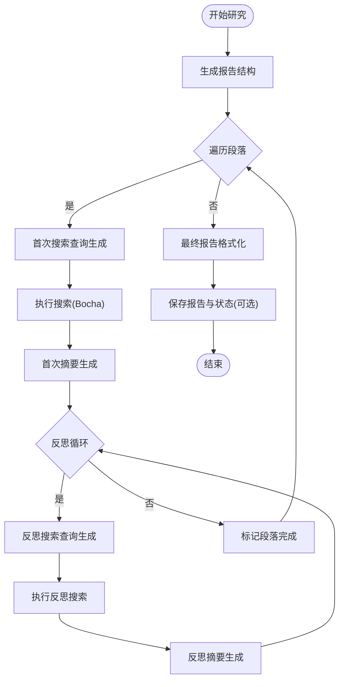

图表来源
- [MediaEngine/agent.py](file://MediaEngine/agent.py#L133-L424)

章节来源
- [MediaEngine/agent.py](file://MediaEngine/agent.py#L133-L424)

### 报告结构生成（ReportStructureNode）
- 输入：用户查询。
- 输出：段落结构列表（title/content）。
- 处理：调用 LLM 生成结构，清洗与修复JSON，校验字段，必要时回退默认结构，写入 State。

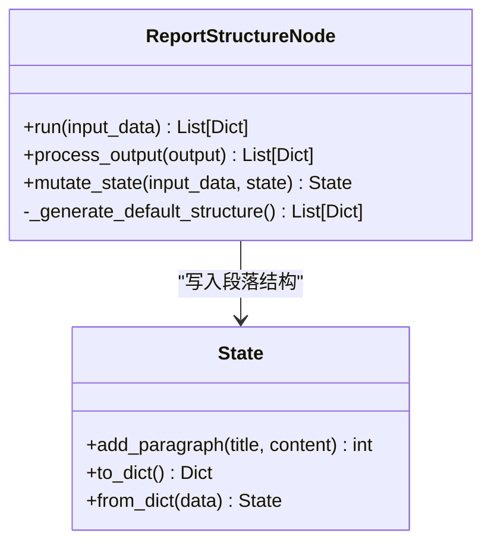

图表来源
- [MediaEngine/nodes/report_structure_node.py](file://MediaEngine/nodes/report_structure_node.py#L1-L205)
- [MediaEngine/state/state.py](file://MediaEngine/state/state.py#L1-L293)

章节来源
- [MediaEngine/nodes/report_structure_node.py](file://MediaEngine/nodes/report_structure_node.py#L1-L205)
- [MediaEngine/prompts/prompts.py](file://MediaEngine/prompts/prompts.py#L1-L120)

### 搜索查询生成（FirstSearchNode/ReflectionNode）
- FirstSearchNode：根据段落标题与预期内容，生成“搜索查询 + 工具选择 + 推理”。
- ReflectionNode：基于段落最新摘要，生成反思搜索查询与推理。
- 输出均为JSON，包含 search_query、search_tool、reasoning 等字段，经清洗与修复后使用。

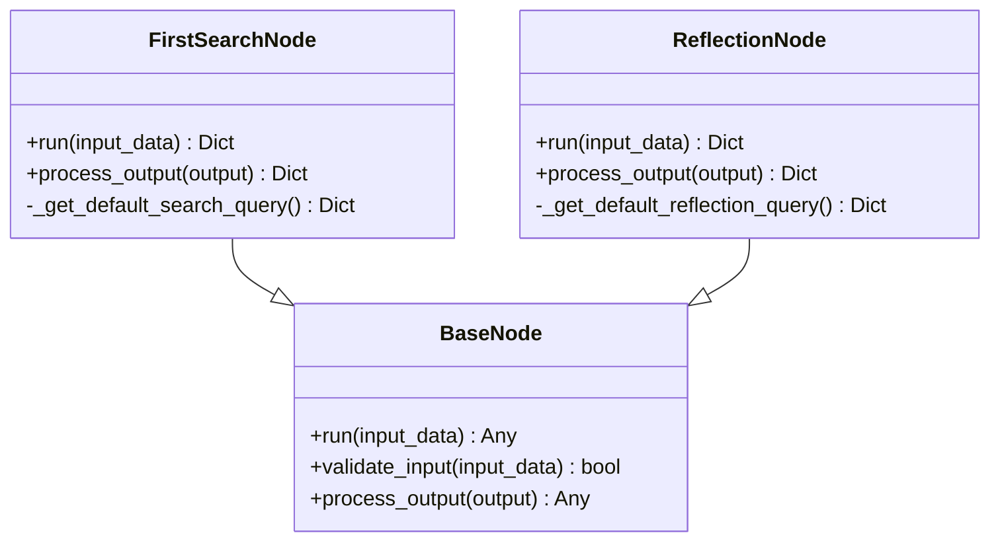

图表来源
- [MediaEngine/nodes/search_node.py](file://MediaEngine/nodes/search_node.py#L1-L287)
- [MediaEngine/nodes/base_node.py](file://MediaEngine/nodes/base_node.py#L1-L95)

章节来源
- [MediaEngine/nodes/search_node.py](file://MediaEngine/nodes/search_node.py#L1-L287)
- [MediaEngine/prompts/prompts.py](file://MediaEngine/prompts/prompts.py#L120-L220)

### 摘要生成与状态更新（FirstSummaryNode/ReflectionSummaryNode）
- FirstSummaryNode：接收搜索查询、搜索结果（已格式化），生成段落最新摘要，写入 State.paragraphs[i].research.latest_summary。
- ReflectionSummaryNode：在已有摘要基础上，结合反思搜索结果，生成更新后的摘要并递增反思次数。
- 输出均为JSON，包含 paragraph_latest_state 或 updated_paragraph_latest_state，经清洗与修复后写入状态。

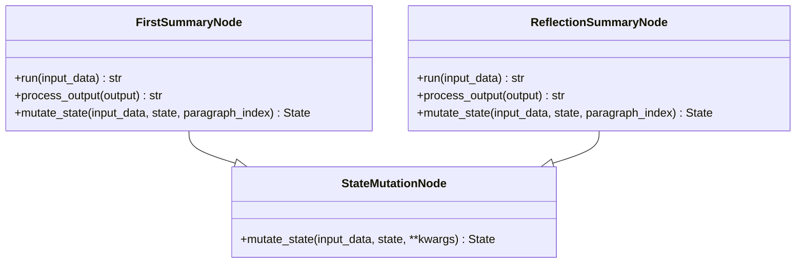

图表来源
- [MediaEngine/nodes/summary_node.py](file://MediaEngine/nodes/summary_node.py#L1-L369)
- [MediaEngine/nodes/base_node.py](file://MediaEngine/nodes/base_node.py#L1-L95)
- [MediaEngine/state/state.py](file://MediaEngine/state/state.py#L1-L293)

章节来源
- [MediaEngine/nodes/summary_node.py](file://MediaEngine/nodes/summary_node.py#L1-L369)
- [MediaEngine/utils/text_processing.py](file://MediaEngine/utils/text_processing.py#L1-L309)

### 报告格式化（ReportFormattingNode）
- 输入：各段落的 title 与 paragraph_latest_state 列表。
- 输出：Markdown 格式报告，包含标题、分隔线与结论等结构化内容。
- 备用方案：当LLM格式化失败时，使用手动格式化方法生成基础报告骨架。

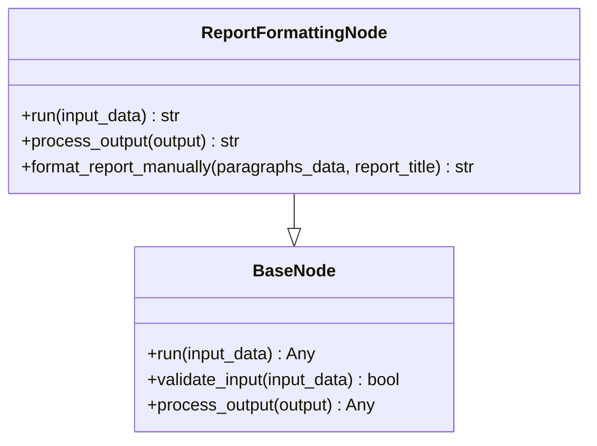

图表来源
- [MediaEngine/nodes/formatting_node.py](file://MediaEngine/nodes/formatting_node.py#L1-L169)
- [MediaEngine/nodes/base_node.py](file://MediaEngine/nodes/base_node.py#L1-L95)

章节来源
- [MediaEngine/nodes/formatting_node.py](file://MediaEngine/nodes/formatting_node.py#L1-L169)
- [MediaEngine/prompts/prompts.py](file://MediaEngine/prompts/prompts.py#L320-L451)

### 状态模型（State）
- 维护查询、报告标题、段落数组、最终报告、完成状态与时间戳。
- 段落包含标题、预期内容、研究历史（Search）、最新摘要、反思次数、完成标志。
- 提供进度统计、序列化/反序列化与保存/加载。

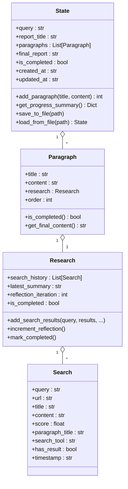

图表来源
- [MediaEngine/state/state.py](file://MediaEngine/state/state.py#L1-L293)

章节来源
- [MediaEngine/state/state.py](file://MediaEngine/state/state.py#L1-L293)

### 文本处理与提示词（utils/text_processing.py / prompts/prompts.py）
- 文本处理：
  - 清理JSON/Markdown标签、移除推理文本、修复不完整JSON、截断超长内容、格式化搜索结果用于提示词。
- 提示词与Schema：
  - 定义报告结构、首次搜索、首次总结、反思、反思总结、报告格式化等系统提示词与JSON Schema，确保LLM输出稳定可解析。

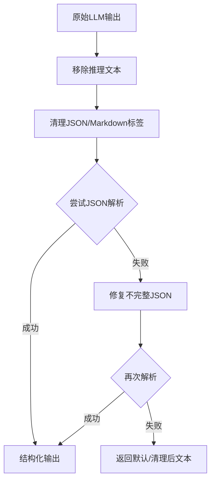

图表来源
- [MediaEngine/utils/text_processing.py](file://MediaEngine/utils/text_processing.py#L1-L309)
- [MediaEngine/prompts/prompts.py](file://MediaEngine/prompts/prompts.py#L1-L451)

章节来源
- [MediaEngine/utils/text_processing.py](file://MediaEngine/utils/text_processing.py#L1-L309)
- [MediaEngine/prompts/prompts.py](file://MediaEngine/prompts/prompts.py#L1-L451)

### 搜索工具复用机制（BochaMultimodalSearch）
- 多模态搜索工具集：comprehensive_search、web_search_only、search_for_structured_data、search_last_24_hours、search_last_week。
- 响应解析：统一解析为 BochaResponse，包含 answer、follow_ups、webpages、images、modal_cards 等字段。
- MediaEngine 与 QueryEngine 分别封装各自工具集（Bocha vs Tavily），但在“控制流”层面复用一致的“生成查询 → 执行工具 → 更新状态 → 生成摘要 → 格式化报告”的模式。

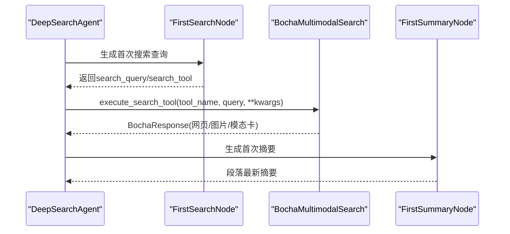

图表来源
- [MediaEngine/agent.py](file://MediaEngine/agent.py#L98-L132)
- [MediaEngine/tools/search.py](file://MediaEngine/tools/search.py#L1-L390)
- [QueryEngine/agent.py](file://QueryEngine/agent.py#L100-L140)

章节来源
- [MediaEngine/tools/search.py](file://MediaEngine/tools/search.py#L1-L390)
- [MediaEngine/agent.py](file://MediaEngine/agent.py#L98-L132)
- [QueryEngine/agent.py](file://QueryEngine/agent.py#L100-L140)

### 多模态数据处理案例
- 视频/图文融合分析：BochaResponse 的 images 与 modal_cards 可直接作为“模态卡”结构化数据进入总结节点，由提示词驱动进行“视觉内容解读 + 数据交叉验证 + 跨媒体关联分析”，最终在 ReportFormattingNode 中以统一结构化Markdown呈现。
- 结构化数据应用：search_for_structured_data 返回的模态卡（如天气、百科等）可直接参与首次/反思摘要生成，提升分析的权威性与准确性。
- 跨平台内容解析：BochaResponse 的 webpages 字段包含网页标题、摘要、抓取时间等，统一转换为兼容格式后进入摘要生成与格式化流程。

章节来源
- [MediaEngine/tools/search.py](file://MediaEngine/tools/search.py#L46-L171)
- [MediaEngine/utils/text_processing.py](file://MediaEngine/utils/text_processing.py#L288-L309)
- [MediaEngine/prompts/prompts.py](file://MediaEngine/prompts/prompts.py#L180-L451)

### 与其他Agent的数据交互模式
- 与 InsightEngine 的协作：
  - InsightEngine 侧重本地数据库与情感分析，MediaEngine 侧重多模态网络搜索与报告格式化。
  - 可在“最终报告”阶段引入 InsightEngine 的情感分析结果（如 sentiment_analysis 字段），在 ReportFormattingNode 中进行跨媒体融合展示。
- 与 QueryEngine 的对比：
  - 两者均采用“生成查询 → 执行工具 → 生成摘要 → 格式化报告”的流水线，但工具集不同（Bocha vs Tavily）。
  - 可通过统一的 State 与节点接口，实现跨Agent的报告合并与对比分析。

章节来源
- [InsightEngine/agent.py](file://InsightEngine/agent.py#L105-L248)
- [QueryEngine/agent.py](file://QueryEngine/agent.py#L100-L140)

## 依赖关系分析
- 耦合与内聚：
  - agent.py 对 nodes、state、prompts、utils、tools 的依赖清晰，节点间通过 State 与提示词解耦。
  - text_processing 与 tools 作为工具层，被 nodes 与 agent 复用，保持高内聚低耦合。
- 外部依赖：
  - Bocha API（网络请求与重试机制）。
  - LLM 客户端（通过 llm_client.stream_invoke_to_string 调用）。
- 潜在环路：
  - 未发现直接循环依赖；节点通过 State 间接通信，避免环路。

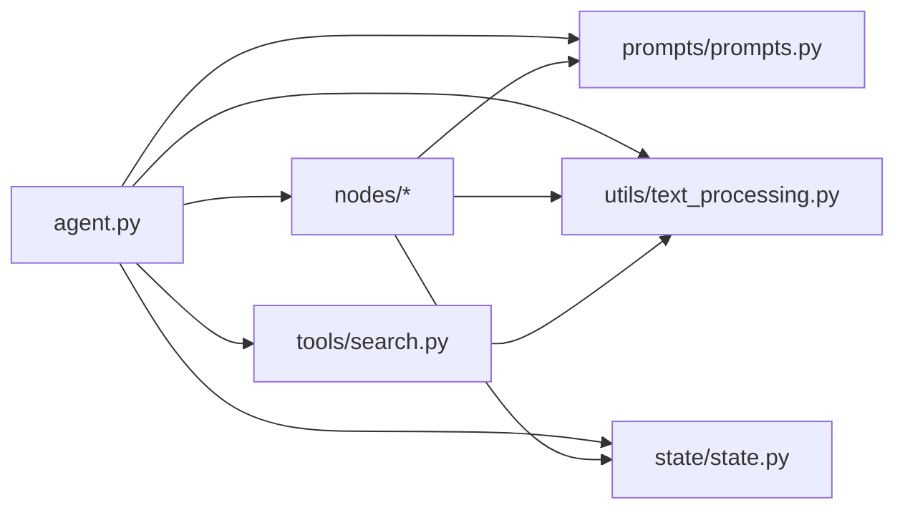

图表来源
- [MediaEngine/agent.py](file://MediaEngine/agent.py#L1-L120)
- [MediaEngine/nodes/base_node.py](file://MediaEngine/nodes/base_node.py#L1-L95)
- [MediaEngine/state/state.py](file://MediaEngine/state/state.py#L1-L293)
- [MediaEngine/utils/text_processing.py](file://MediaEngine/utils/text_processing.py#L1-L309)
- [MediaEngine/tools/search.py](file://MediaEngine/tools/search.py#L1-L390)

章节来源
- [MediaEngine/agent.py](file://MediaEngine/agent.py#L1-L120)
- [MediaEngine/nodes/base_node.py](file://MediaEngine/nodes/base_node.py#L1-L95)

## 性能考量
- 搜索结果截断：format_search_results_for_prompt 与 truncate_content 限制单条结果长度，降低LLM输入负担。
- 工具选择策略：FirstSearchNode/ReflectionNode 输出 search_tool，MediaEngine 依据工具能力选择 max_results 等参数，平衡质量与速度。
- 备用格式化：ReportFormattingNode 在LLM失败时回退手动格式化，保障可用性。
- 状态持久化：支持保存中间状态与报告，便于中断恢复与审计。

章节来源
- [MediaEngine/utils/text_processing.py](file://MediaEngine/utils/text_processing.py#L264-L309)
- [MediaEngine/agent.py](file://MediaEngine/agent.py#L233-L273)
- [MediaEngine/nodes/formatting_node.py](file://MediaEngine/nodes/formatting_node.py#L116-L169)
- [MediaEngine/state/state.py](file://MediaEngine/state/state.py#L282-L293)

## 故障排查指南
- LLM输出解析失败：
  - 使用 remove_reasoning_from_output、clean_json_tags、fix_incomplete_json 与 extract_clean_response 逐层修复。
  - 若仍失败，回退默认查询或默认结构，避免流程中断。
- 搜索工具异常：
  - 检查 Bocha API Key 与网络连接；确认工具名与参数（如 max_results）是否符合工具要求。
  - 使用 print_response_summary 快速查看响应摘要，定位问题。
- 状态异常：
  - 使用 State.save_to_file 与 State.load_from_file 进行状态持久化与恢复。
  - 通过 get_progress_summary 获取进度摘要，定位卡顿环节。

章节来源
- [MediaEngine/utils/text_processing.py](file://MediaEngine/utils/text_processing.py#L1-L309)
- [MediaEngine/tools/search.py](file://MediaEngine/tools/search.py#L260-L390)
- [MediaEngine/state/state.py](file://MediaEngine/state/state.py#L231-L293)

## 结论
MediaEngine 通过“节点化流水线 + 状态管理 + 提示词约束 + 多模态搜索工具”的组合，实现了对文本、图片、结构化数据的系统化分析与报告生成。其控制流清晰、可扩展性强，能够与 InsightEngine、QueryEngine 等Agent协同工作，形成多Agent的综合分析体系。借助文本处理工具与备用格式化策略，MediaEngine 在复杂多模态场景下具备良好的鲁棒性与实用性。

## 附录
- 关键提示词与Schema定义位于 prompts/prompts.py，涵盖报告结构、搜索查询、摘要生成与报告格式化等阶段。
- 工具导出位于 utils/__init__.py 与 tools/__init__.py，便于模块化复用。

章节来源
- [MediaEngine/prompts/prompts.py](file://MediaEngine/prompts/prompts.py#L1-L451)
- [MediaEngine/utils/__init__.py](file://MediaEngine/utils/__init__.py#L1-L27)
- [MediaEngine/tools/__init__.py](file://MediaEngine/tools/__init__.py#L1-L23)