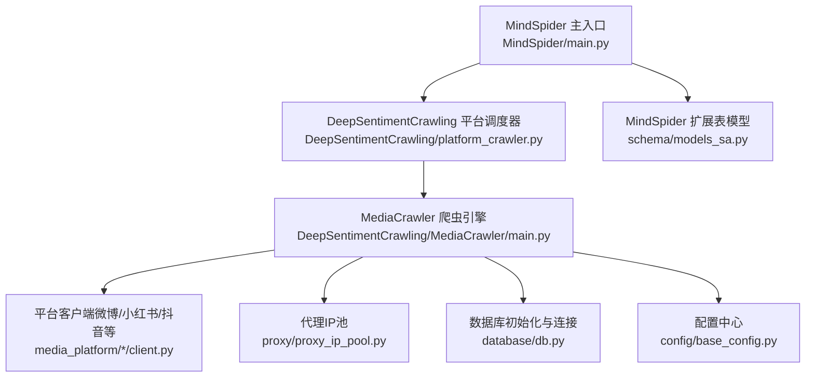
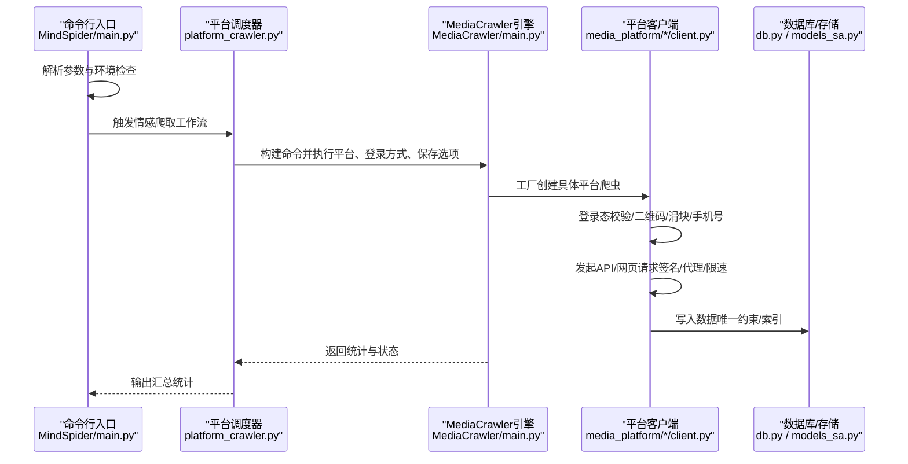
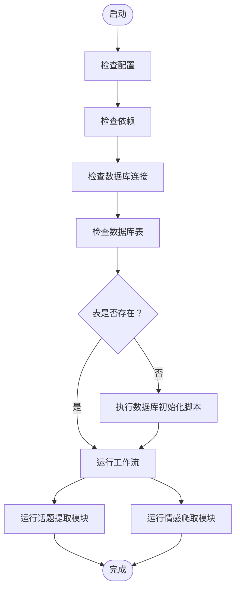
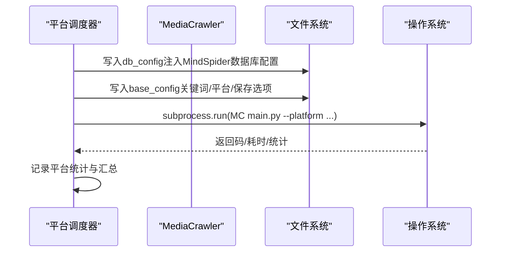
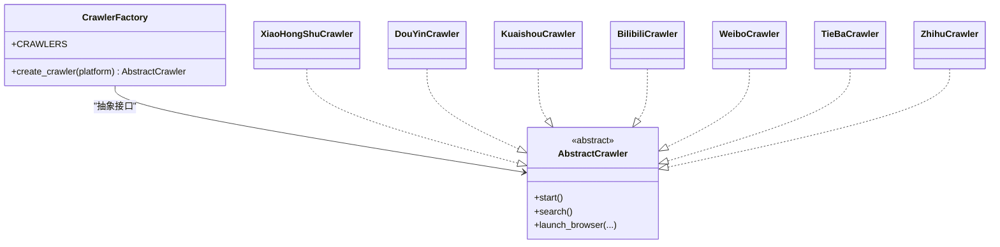
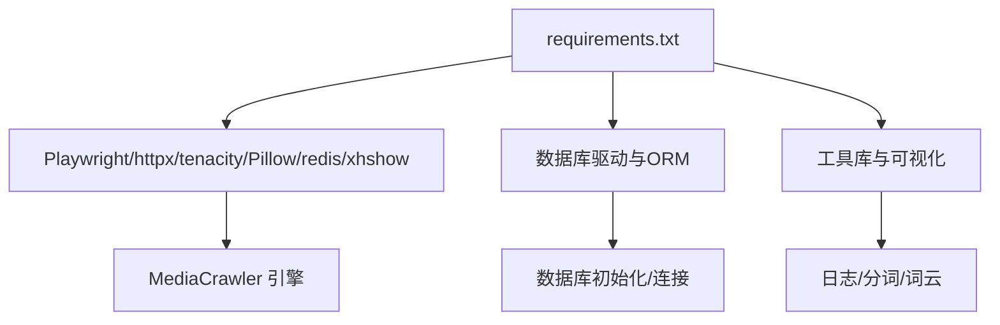

# MindSpider - 社交媒体爬虫系统

<cite>
**本文引用的文件**
- [MindSpider/main.py](file://MindSpider/main.py)
- [MindSpider/DeepSentimentCrawling/platform_crawler.py](file://MindSpider/DeepSentimentCrawling/platform_crawler.py)
- [MindSpider/DeepSentimentCrawling/MediaCrawler/main.py](file://MindSpider/DeepSentimentCrawling/MediaCrawler/main.py)
- [MindSpider/DeepSentimentCrawling/MediaCrawler/proxy/proxy_ip_pool.py](file://MindSpider/DeepSentimentCrawling/MediaCrawler/proxy/proxy_ip_pool.py)
- [MindSpider/schema/models_sa.py](file://MindSpider/schema/models_sa.py)
- [MindSpider/requirements.txt](file://MindSpider/requirements.txt)
- [MindSpider/DeepSentimentCrawling/MediaCrawler/config/base_config.py](file://MindSpider/DeepSentimentCrawling/MediaCrawler/config/base_config.py)
- [MindSpider/DeepSentimentCrawling/MediaCrawler/media_platform/weibo/client.py](file://MindSpider/DeepSentimentCrawling/MediaCrawler/media_platform/weibo/client.py)
- [MindSpider/DeepSentimentCrawling/MediaCrawler/media_platform/xhs/client.py](file://MindSpider/DeepSentimentCrawling/MediaCrawler/media_platform/xhs/client.py)
- [MindSpider/DeepSentimentCrawling/MediaCrawler/media_platform/douyin/client.py](file://MindSpider/DeepSentimentCrawling/MediaCrawler/media_platform/douyin/client.py)
- [MindSpider/DeepSentimentCrawling/MediaCrawler/media_platform/weibo/login.py](file://MindSpider/DeepSentimentCrawling/MediaCrawler/media_platform/weibo/login.py)
- [MindSpider/DeepSentimentCrawling/MediaCrawler/media_platform/xhs/login.py](file://MindSpider/DeepSentimentCrawling/MediaCrawler/media_platform/xhs/login.py)
- [MindSpider/DeepSentimentCrawling/MediaCrawler/media_platform/douyin/login.py](file://MindSpider/DeepSentimentCrawling/MediaCrawler/media_platform/douyin/login.py)
- [MindSpider/DeepSentimentCrawling/MediaCrawler/database/db.py](file://MindSpider/DeepSentimentCrawling/MediaCrawler/database/db.py)
- [MindSpider/DeepSentimentCrawling/MediaCrawler/base/base_crawler.py](file://MindSpider/DeepSentimentCrawling/MediaCrawler/base/base_crawler.py)
</cite>

## 目录
1. [简介](#简介)
2. [项目结构](#项目结构)
3. [核心组件](#核心组件)
4. [架构总览](#架构总览)
5. [详细组件分析](#详细组件分析)
6. [依赖关系分析](#依赖关系分析)
7. [性能与稳定性考量](#性能与稳定性考量)
8. [故障排查指南](#故障排查指南)
9. [结论](#结论)
10. [附录](#附录)

## 简介
MindSpider 是一个面向社交媒体数据采集的基础设施，整合了“广义话题提取”和“深度情感爬取”两大模块。系统通过统一入口启动，协调各平台爬虫（微博、小红书、抖音、快手、B站、贴吧、知乎）进行关键词搜索、内容详情与评论抓取，并将结果持久化至数据库或本地文件。系统内置代理IP池、反爬策略（签名、滑块验证、CDP模式）、登录机制（二维码/手机号/Cookie）以及分布式可扩展的调度能力，支持增量抓取与去重。

## 项目结构
MindSpider 顶层由多个子工程组成，其中与本次文档密切相关的有：
- MindSpider：主入口与状态管理
- DeepSentimentCrawling：深度情感爬取模块，内含 MediaCrawler 爬虫引擎
- schema：MindSpider 扩展表的 SQLAlchemy ORM 模型

图表来源
- [MindSpider/main.py](file://MindSpider/main.py#L1-L447)
- [MindSpider/DeepSentimentCrawling/platform_crawler.py](file://MindSpider/DeepSentimentCrawling/platform_crawler.py#L1-L479)
- [MindSpider/DeepSentimentCrawling/MediaCrawler/main.py](file://MindSpider/DeepSentimentCrawling/MediaCrawler/main.py#L1-L103)
- [MindSpider/DeepSentimentCrawling/MediaCrawler/proxy/proxy_ip_pool.py](file://MindSpider/DeepSentimentCrawling/MediaCrawler/proxy/proxy_ip_pool.py#L1-L137)
- [MindSpider/DeepSentimentCrawling/MediaCrawler/database/db.py](file://MindSpider/DeepSentimentCrawling/MediaCrawler/database/db.py#L1-L36)
- [MindSpider/DeepSentimentCrawling/MediaCrawler/config/base_config.py](file://MindSpider/DeepSentimentCrawling/MediaCrawler/config/base_config.py#L1-L117)
- [MindSpider/schema/models_sa.py](file://MindSpider/schema/models_sa.py#L1-L127)

章节来源
- [MindSpider/main.py](file://MindSpider/main.py#L1-L447)
- [MindSpider/DeepSentimentCrawling/platform_crawler.py](file://MindSpider/DeepSentimentCrawling/platform_crawler.py#L1-L479)
- [MindSpider/DeepSentimentCrawling/MediaCrawler/main.py](file://MindSpider/DeepSentimentCrawling/MediaCrawler/main.py#L1-L103)

## 核心组件
- MindSpider 主入口：负责项目初始化、健康检查、模块编排与完整工作流执行。
- 平台爬虫调度器：封装 MediaCrawler 的配置注入、命令构建与执行，支持多平台批量爬取与统计。
- MediaCrawler 爬虫引擎：基于 Playwright 的异步爬虫框架，按平台工厂创建具体爬虫实例，统一启动与清理。
- 平台客户端：针对微博、小红书、抖音等平台的 API/网页客户端，封装请求、签名、登录态校验、评论抓取等。
- 代理IP池：按提供商拉取可用代理，支持有效性校验与重试。
- 数据模型：MindSpider 扩展表（每日新闻、话题、关系、任务）的 ORM 定义，支持唯一约束与索引优化。
- 配置中心：集中管理平台、关键词、登录方式、并发、保存选项、代理开关等。

章节来源
- [MindSpider/main.py](file://MindSpider/main.py#L1-L447)
- [MindSpider/DeepSentimentCrawling/platform_crawler.py](file://MindSpider/DeepSentimentCrawling/platform_crawler.py#L1-L479)
- [MindSpider/DeepSentimentCrawling/MediaCrawler/main.py](file://MindSpider/DeepSentimentCrawling/MediaCrawler/main.py#L1-L103)
- [MindSpider/DeepSentimentCrawling/MediaCrawler/proxy/proxy_ip_pool.py](file://MindSpider/DeepSentimentCrawling/MediaCrawler/proxy/proxy_ip_pool.py#L1-L137)
- [MindSpider/schema/models_sa.py](file://MindSpider/schema/models_sa.py#L1-L127)
- [MindSpider/DeepSentimentCrawling/MediaCrawler/config/base_config.py](file://MindSpider/DeepSentimentCrawling/MediaCrawler/config/base_config.py#L1-L117)

## 架构总览
MindSpider 的整体架构采用“主入口编排 + 平台调度器 + 爬虫引擎 + 平台客户端”的分层设计。主入口负责环境检查、数据库初始化与模块编排；平台调度器负责将关键词与平台映射到 MediaCrawler 的命令行参数；MediaCrawler 通过工厂模式创建具体平台爬虫，结合登录、代理、配置与存储模块完成数据采集与落库。

图表来源
- [MindSpider/main.py](file://MindSpider/main.py#L360-L447)
- [MindSpider/DeepSentimentCrawling/platform_crawler.py](file://MindSpider/DeepSentimentCrawling/platform_crawler.py#L203-L294)
- [MindSpider/DeepSentimentCrawling/MediaCrawler/main.py](file://MindSpider/DeepSentimentCrawling/MediaCrawler/main.py#L55-L103)
- [MindSpider/DeepSentimentCrawling/MediaCrawler/media_platform/xhs/client.py](file://MindSpider/DeepSentimentCrawling/MediaCrawler/media_platform/xhs/client.py#L112-L184)
- [MindSpider/DeepSentimentCrawling/MediaCrawler/media_platform/weibo/client.py](file://MindSpider/DeepSentimentCrawling/MediaCrawler/media_platform/weibo/client.py#L34-L100)
- [MindSpider/DeepSentimentCrawling/MediaCrawler/media_platform/douyin/client.py](file://MindSpider/DeepSentimentCrawling/MediaCrawler/media_platform/douyin/client.py#L97-L120)
- [MindSpider/DeepSentimentCrawling/MediaCrawler/database/db.py](file://MindSpider/DeepSentimentCrawling/MediaCrawler/database/db.py#L17-L36)
- [MindSpider/schema/models_sa.py](file://MindSpider/schema/models_sa.py#L31-L125)

## 详细组件分析

### 主入口启动流程（MindSpider/main.py）
- 初始化阶段：检查配置、依赖、数据库连接与表结构，必要时执行数据库初始化脚本。
- 工作流编排：支持仅运行话题提取、仅运行情感爬取、或完整工作流；可指定日期、平台、关键词数量、每关键词最大内容数、测试模式等。
- 统一入口：通过子进程调用各模块 main.py，实现模块解耦与可扩展。

图表来源
- [MindSpider/main.py](file://MindSpider/main.py#L47-L167)
- [MindSpider/main.py](file://MindSpider/main.py#L196-L305)
- [MindSpider/main.py](file://MindSpider/main.py#L335-L358)

章节来源
- [MindSpider/main.py](file://MindSpider/main.py#L1-L447)

### 平台调度器（DeepSentimentCrawling/platform_crawler.py）
- 数据库配置注入：根据 MindSpider 的数据库配置动态写入 MediaCrawler 的 db_config，支持 MySQL/PostgreSQL。
- 基础配置生成：将关键词、平台、爬取类型、最大内容数、评论开关等写入 base_config。
- 执行调度：构建命令行参数（平台、登录方式、保存选项），在 MediaCrawler 目录下执行，支持超时与统计收集。
- 多平台批量：按关键词聚合到平台维度一次性执行，汇总成功率、内容数、评论数等。

图表来源
- [MindSpider/DeepSentimentCrawling/platform_crawler.py](file://MindSpider/DeepSentimentCrawling/platform_crawler.py#L42-L138)
- [MindSpider/DeepSentimentCrawling/platform_crawler.py](file://MindSpider/DeepSentimentCrawling/platform_crawler.py#L139-L202)
- [MindSpider/DeepSentimentCrawling/platform_crawler.py](file://MindSpider/DeepSentimentCrawling/platform_crawler.py#L203-L294)
- [MindSpider/DeepSentimentCrawling/platform_crawler.py](file://MindSpider/DeepSentimentCrawling/platform_crawler.py#L333-L448)

章节来源
- [MindSpider/DeepSentimentCrawling/platform_crawler.py](file://MindSpider/DeepSentimentCrawling/platform_crawler.py#L1-L479)

### MediaCrawler 引擎（DeepSentimentCrawling/MediaCrawler/main.py）
- 工厂模式：根据配置的 PLATFORM 选择具体平台爬虫类（微博/小红书/抖音/快手/B站/贴吧/知乎）。
- 启动流程：解析命令行参数，初始化数据库（可选），创建爬虫实例并启动；完成后可生成词云（JSON保存模式）。
- 清理逻辑：关闭数据库连接（若使用DB/SQLite）。

图表来源
- [MindSpider/DeepSentimentCrawling/MediaCrawler/main.py](file://MindSpider/DeepSentimentCrawling/MediaCrawler/main.py#L31-L50)
- [MindSpider/DeepSentimentCrawling/MediaCrawler/main.py](file://MindSpider/DeepSentimentCrawling/MediaCrawler/main.py#L55-L103)
- [MindSpider/DeepSentimentCrawling/MediaCrawler/base/base_crawler.py](file://MindSpider/DeepSentimentCrawling/MediaCrawler/base/base_crawler.py#L17-L119)

章节来源
- [MindSpider/DeepSentimentCrawling/MediaCrawler/main.py](file://MindSpider/DeepSentimentCrawling/MediaCrawler/main.py#L1-L103)
- [MindSpider/DeepSentimentCrawling/MediaCrawler/base/base_crawler.py](file://MindSpider/DeepSentimentCrawling/MediaCrawler/base/base_crawler.py#L1-L119)

### 平台客户端与反爬策略（微博/小红书/抖音）

#### 微博（Weibo）
- 请求封装：统一 request/get/post 方法，自动校验返回码，异常抛出 DataFetchError。
- 登录态校验：通过“ping”接口检查登录状态，失败则触发重新登录。
- 评论抓取：支持分页游标与子评论递归抓取，回调驱动增量写入。
- 图片下载：通过代理访问图床，规避防盗链。
- 用户主页：解析容器ID与用户卡片，支持按用户主页抓取全部笔记。

章节来源
- [MindSpider/DeepSentimentCrawling/MediaCrawler/media_platform/weibo/client.py](file://MindSpider/DeepSentimentCrawling/MediaCrawler/media_platform/weibo/client.py#L34-L100)
- [MindSpider/DeepSentimentCrawling/MediaCrawler/media_platform/weibo/client.py](file://MindSpider/DeepSentimentCrawling/MediaCrawler/media_platform/weibo/client.py#L107-L184)
- [MindSpider/DeepSentimentCrawling/MediaCrawler/media_platform/weibo/client.py](file://MindSpider/DeepSentimentCrawling/MediaCrawler/media_platform/weibo/client.py#L213-L262)
- [MindSpider/DeepSentimentCrawling/MediaCrawler/media_platform/weibo/client.py](file://MindSpider/DeepSentimentCrawling/MediaCrawler/media_platform/weibo/client.py#L314-L382)

#### 小红书（XiaoHongShu）
- 签名机制：使用 xhshow 生成 X-S/X-T/X-S-Common/X-B3-Traceid 等签名头，GET/POST 统一封装。
- 验证码处理：遇到 471/461 响应时记录 Verifytype/Verifyuuid 并抛出异常。
- 登录态校验：通过关键词搜索返回 items 判定登录状态。
- 评论抓取：支持一级/二级评论分页抓取，回调驱动写入。
- HTML解析：解析笔记详情与用户主页，抽取所需字段。

章节来源
- [MindSpider/DeepSentimentCrawling/MediaCrawler/media_platform/xhs/client.py](file://MindSpider/DeepSentimentCrawling/MediaCrawler/media_platform/xhs/client.py#L59-L111)
- [MindSpider/DeepSentimentCrawling/MediaCrawler/media_platform/xhs/client.py](file://MindSpider/DeepSentimentCrawling/MediaCrawler/media_platform/xhs/client.py#L112-L184)
- [MindSpider/DeepSentimentCrawling/MediaCrawler/media_platform/xhs/client.py](file://MindSpider/DeepSentimentCrawling/MediaCrawler/media_platform/xhs/client.py#L206-L225)
- [MindSpider/DeepSentimentCrawling/MediaCrawler/media_platform/xhs/client.py](file://MindSpider/DeepSentimentCrawling/MediaCrawler/media_platform/xhs/client.py#L366-L414)
- [MindSpider/DeepSentimentCrawling/MediaCrawler/media_platform/xhs/client.py](file://MindSpider/DeepSentimentCrawling/MediaCrawler/media_platform/xhs/client.py#L506-L588)

#### 抖音（DouYin）
- 参数注入：从浏览器 localStorage 获取 msToken，拼接通用参数并计算 a_bogus。
- 登录态校验：检查 localStorage HasUserLogin 或 Cookie LOGIN_STATUS。
- 评论抓取：支持子评论分页抓取，回调驱动写入。
- 短链解析：解析 v.douyin.com 短链获取真实URL。
- 视频详情：通过通用接口获取视频详情。

章节来源
- [MindSpider/DeepSentimentCrawling/MediaCrawler/media_platform/douyin/client.py](file://MindSpider/DeepSentimentCrawling/MediaCrawler/media_platform/douyin/client.py#L47-L96)
- [MindSpider/DeepSentimentCrawling/MediaCrawler/media_platform/douyin/client.py](file://MindSpider/DeepSentimentCrawling/MediaCrawler/media_platform/douyin/client.py#L97-L120)
- [MindSpider/DeepSentimentCrawling/MediaCrawler/media_platform/douyin/client.py](file://MindSpider/DeepSentimentCrawling/MediaCrawler/media_platform/douyin/client.py#L188-L217)
- [MindSpider/DeepSentimentCrawling/MediaCrawler/media_platform/douyin/client.py](file://MindSpider/DeepSentimentCrawling/MediaCrawler/media_platform/douyin/client.py#L277-L313)
- [MindSpider/DeepSentimentCrawling/MediaCrawler/media_platform/douyin/client.py](file://MindSpider/DeepSentimentCrawling/MediaCrawler/media_platform/douyin/client.py#L328-L352)

### 登录机制（二维码/手机号/Cookie）
- 抖音：支持二维码/手机号/Cookie 登录；若出现滑块中间页，自动识别并模拟滑块轨迹。
- 小红书：支持二维码/手机号/Cookie 登录；登录过程中检测“请通过验证”，必要时人工干预。
- 微博：支持二维码/手机号/Cookie 登录；登录后通过 Cookie 校验登录状态。

章节来源
- [MindSpider/DeepSentimentCrawling/MediaCrawler/media_platform/douyin/login.py](file://MindSpider/DeepSentimentCrawling/MediaCrawler/media_platform/douyin/login.py#L1-L266)
- [MindSpider/DeepSentimentCrawling/MediaCrawler/media_platform/xhs/login.py](file://MindSpider/DeepSentimentCrawling/MediaCrawler/media_platform/xhs/login.py#L1-L198)
- [MindSpider/DeepSentimentCrawling/MediaCrawler/media_platform/weibo/login.py](file://MindSpider/DeepSentimentCrawling/MediaCrawler/media_platform/weibo/login.py#L1-L124)

### 代理IP池（proxy/proxy_ip_pool.py）
- 代理拉取：按配置的提供商名称从集合中选择，异步批量拉取代理。
- 有效性校验：通过 httpx 访问 echo 地址验证代理可用性，失败自动重试。
- 随机选取：随机从池中取出一个代理，使用后移除；若池空则重新加载。
- 可插拔：支持快代理、豌豆HTTP等提供商注册。

章节来源
- [MindSpider/DeepSentimentCrawling/MediaCrawler/proxy/proxy_ip_pool.py](file://MindSpider/DeepSentimentCrawling/MediaCrawler/proxy/proxy_ip_pool.py#L1-L137)

### 数据存储模型（schema/models_sa.py）
- DailyNews：每日新闻表，包含唯一约束（news_id, source_platform, crawl_date）与常用索引（日期、平台、排名）。
- DailyTopic：每日话题表，包含唯一约束（topic_id, extract_date）与状态/评分/计数字段。
- TopicNewsRelation：话题-新闻关联表，建立双向唯一约束与多维索引。
- CrawlingTask：爬取任务表，记录任务ID、主题、平台、关键词、状态、时间戳与配置参数。

章节来源
- [MindSpider/schema/models_sa.py](file://MindSpider/schema/models_sa.py#L31-L125)

## 依赖关系分析
- 运行时依赖：Playwright、httpx、tenacity、Pillow、redis、xhshow 等。
- 数据库依赖：pymysql/aiomysql、asyncpg、sqlalchemy、psycopg 等。
- 配置与工具：python-dotenv、jieba、wordcloud、matplotlib、loguru 等。

图表来源
- [MindSpider/requirements.txt](file://MindSpider/requirements.txt#L1-L60)
- [MindSpider/DeepSentimentCrawling/MediaCrawler/database/db.py](file://MindSpider/DeepSentimentCrawling/MediaCrawler/database/db.py#L17-L36)

章节来源
- [MindSpider/requirements.txt](file://MindSpider/requirements.txt#L1-L60)

## 性能与稳定性考量
- 并发与限速：通过配置 MAX_CONCURRENCY_NUM 控制并发，CRAWLER_MAX_SLEEP_SEC 控制请求间隔，避免触发平台风控。
- 代理池：ENABLE_IP_PROXY 打开后，IP_PROXY_POOL_COUNT 控制池大小，enable_validate_ip 可开启有效性校验，提升稳定性。
- 重试与降级：客户端请求普遍使用 tenacity 重试装饰器，遇到验证码/滑块/网络波动时自动重试或提示人工干预。
- CDP 模式：ENABLE_CDP_MODE 与 CDP_HEADLESS 可提升反检测能力，减少滑块/验证码触发概率。
- 存储策略：优先使用 DB/PostgreSQL 保存，具备唯一约束与索引，便于去重与查询优化。

[本节为通用指导，无需特定文件引用]

## 故障排查指南
- 数据库连接失败：检查 DB_* 配置与网络连通性；确认数据库初始化脚本执行成功。
- 爬取超时：适当提高超时时间或降低并发；检查代理有效性与网络质量。
- 登录失败：确认二维码/手机号/滑块流程是否完成；必要时使用 Cookie 登录；检查代理与浏览器环境。
- 验证码/滑块：系统会捕获验证码响应并记录；若频繁出现，建议使用 CDP 模式或更换代理。
- 评论抓取异常：检查 ENABLE_GET_COMMENTS/ENABLE_GET_SUB_COMMENTS 配置；确认回调函数正确实现。

章节来源
- [MindSpider/DeepSentimentCrawling/platform_crawler.py](file://MindSpider/DeepSentimentCrawling/platform_crawler.py#L288-L294)
- [MindSpider/DeepSentimentCrawling/MediaCrawler/media_platform/xhs/client.py](file://MindSpider/DeepSentimentCrawling/MediaCrawler/media_platform/xhs/client.py#L129-L147)
- [MindSpider/DeepSentimentCrawling/MediaCrawler/media_platform/douyin/login.py](file://MindSpider/DeepSentimentCrawling/MediaCrawler/media_platform/douyin/login.py#L162-L203)

## 结论
MindSpider 通过清晰的分层架构与模块化设计，实现了对多平台社交媒体数据的稳定采集。主入口负责全局编排，平台调度器负责配置注入与命令执行，MediaCrawler 引擎提供统一的爬虫生命周期管理，平台客户端封装反爬策略与登录机制，代理IP池与配置中心保障高可用与可扩展性。结合 MindSpider 扩展表模型，系统具备良好的增量抓取与去重能力，适合在生产环境中进行分布式部署与运维。

[本节为总结性内容，无需特定文件引用]

## 附录

### 分布式爬取配置建议
- 多实例部署：将平台调度器拆分为多个实例，按平台/关键词切分任务，通过消息队列或定时任务调度。
- 代理池共享：使用 Redis/外部代理服务统一管理代理池，避免重复拉取与冲突。
- 数据库分片：按日期/平台分表或分库，配合唯一约束与索引优化查询性能。
- CDP 集群：使用多浏览器实例与不同用户数据目录，提升反检测能力与并发度。

[本节为通用指导，无需特定文件引用]

### 增量抓取与去重机制
- 增量策略：按日期/平台/关键词维度记录任务状态与进度，下次运行跳过已完成任务。
- 去重策略：利用唯一约束（news_id/source_platform/crawl_date、topic_id/extract_date 等）避免重复入库；评论/子评论同样遵循唯一约束。
- 任务追踪：CrawlingTask 记录任务状态、开始/结束时间、成功/失败计数与错误信息，便于审计与重试。

章节来源
- [MindSpider/schema/models_sa.py](file://MindSpider/schema/models_sa.py#L31-L125)
- [MindSpider/DeepSentimentCrawling/MediaCrawler/config/base_config.py](file://MindSpider/DeepSentimentCrawling/MediaCrawler/config/base_config.py#L63-L117)

### 独立部署步骤
- 环境准备：安装 Python 3.9+，创建虚拟环境，安装依赖（requirements.txt）。
- 配置文件：准备 .env 文件，配置数据库与 API 密钥；设置平台登录方式与代理参数。
- 数据库初始化：执行数据库初始化脚本，创建 MindSpider 扩展表。
- 启动服务：运行主入口，选择工作流模式（完整/仅话题/仅情感），或直接调用平台调度器。
- 监控与日志：使用 loguru 输出日志，结合外部监控系统观察任务状态与错误。

章节来源
- [MindSpider/main.py](file://MindSpider/main.py#L335-L358)
- [MindSpider/DeepSentimentCrawling/MediaCrawler/database/db.py](file://MindSpider/DeepSentimentCrawling/MediaCrawler/database/db.py#L17-L36)
- [MindSpider/requirements.txt](file://MindSpider/requirements.txt#L1-L60)