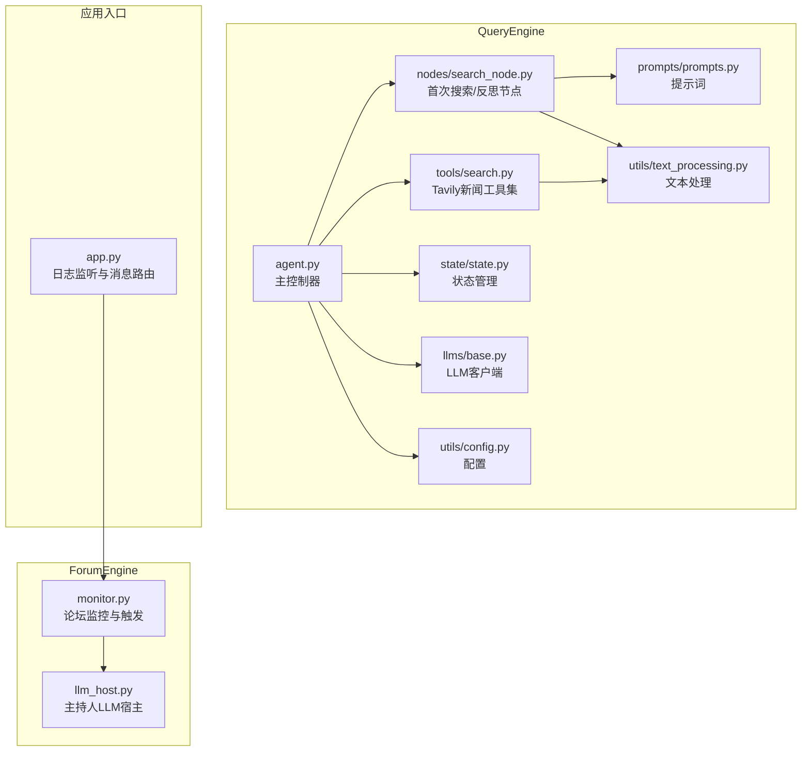
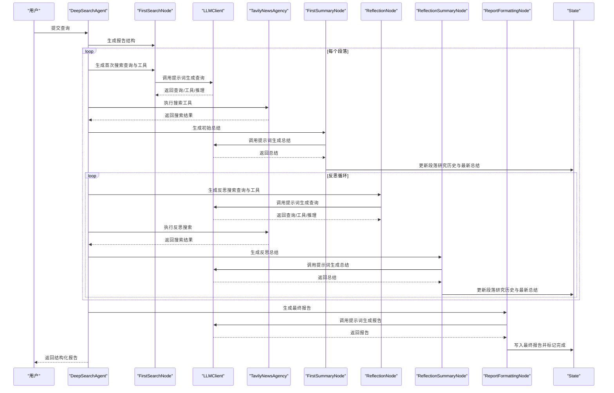
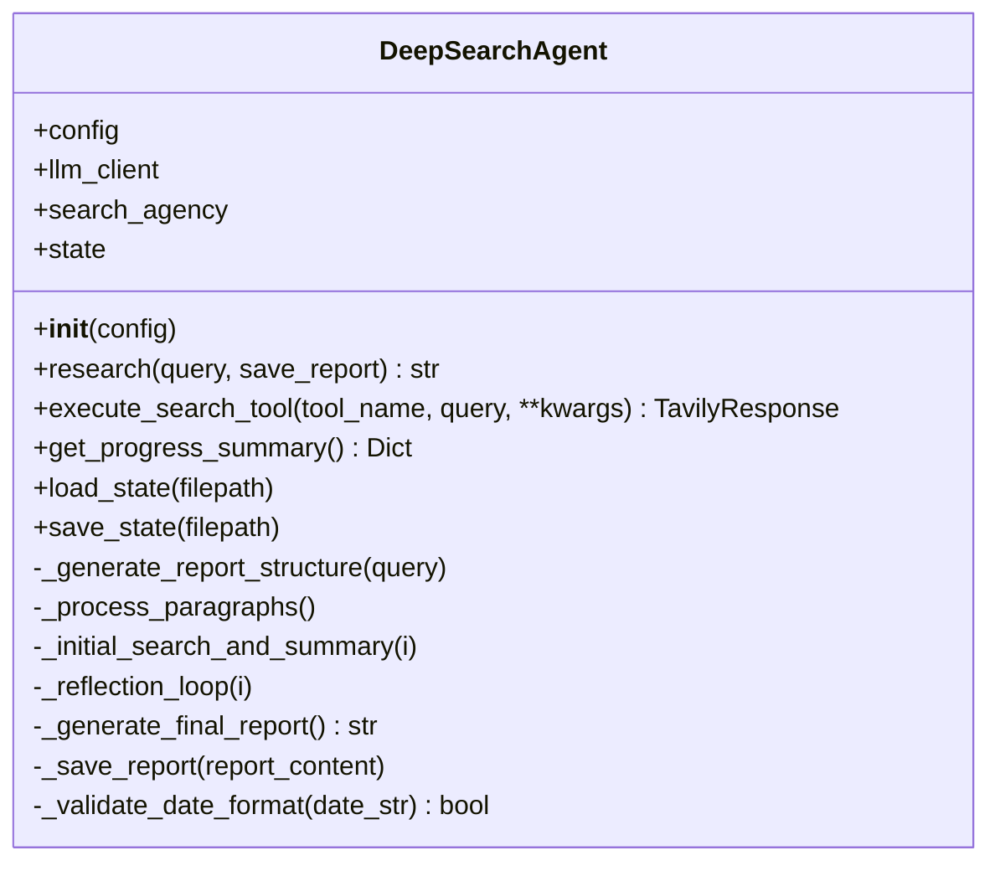
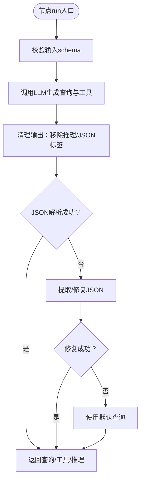
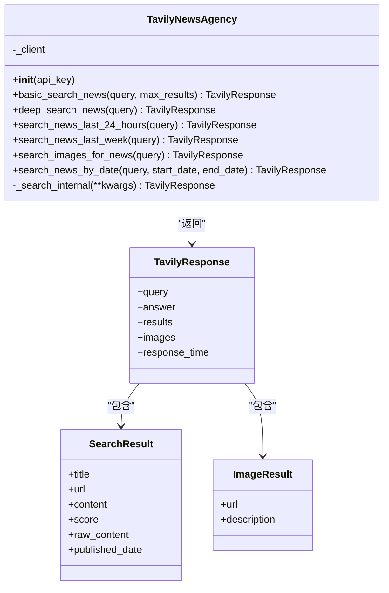
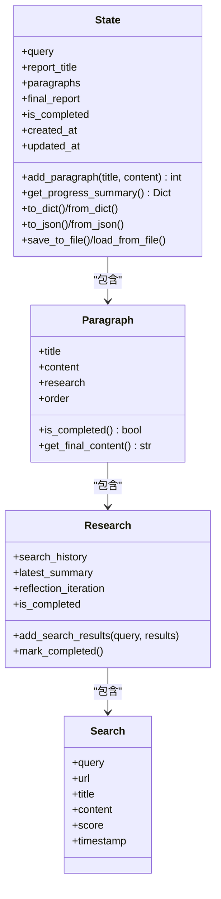
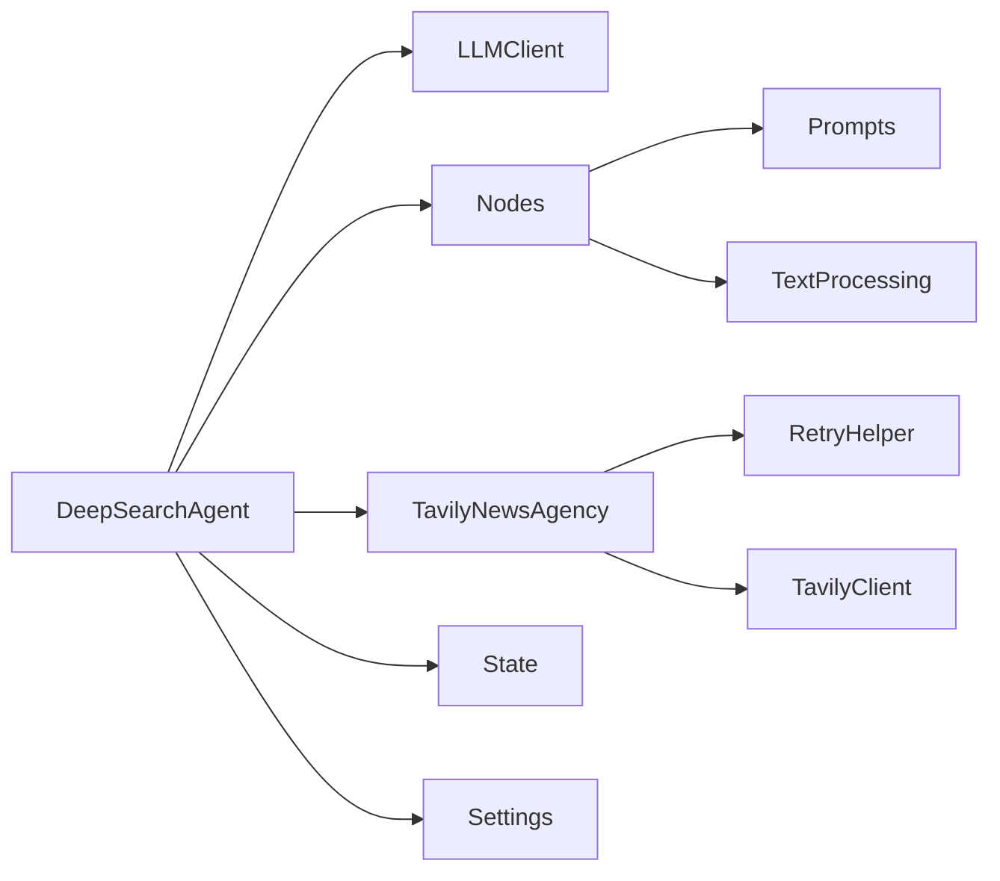
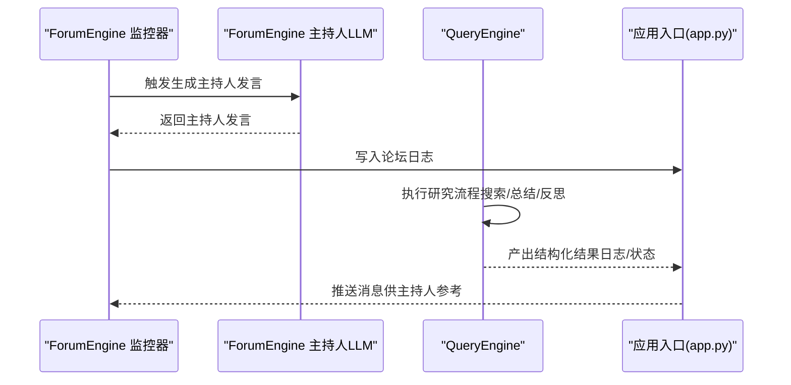

# QueryEngine - 国内外新闻广度搜索Agent

<cite>
**本文引用的文件**
- [QueryEngine/agent.py](file://QueryEngine/agent.py)
- [QueryEngine/nodes/search_node.py](file://QueryEngine/nodes/search_node.py)
- [QueryEngine/tools/search.py](file://QueryEngine/tools/search.py)
- [QueryEngine/utils/config.py](file://QueryEngine/utils/config.py)
- [QueryEngine/utils/text_processing.py](file://QueryEngine/utils/text_processing.py)
- [QueryEngine/state/state.py](file://QueryEngine/state/state.py)
- [QueryEngine/prompts/prompts.py](file://QueryEngine/prompts/prompts.py)
- [QueryEngine/llms/base.py](file://QueryEngine/llms/base.py)
- [ForumEngine/llm_host.py](file://ForumEngine/llm_host.py)
- [ForumEngine/monitor.py](file://ForumEngine/monitor.py)
- [app.py](file://app.py)
- [README-EN.md](file://README-EN.md)
</cite>

## 目录
1. [简介](#简介)
2. [项目结构](#项目结构)
3. [核心组件](#核心组件)
4. [架构总览](#架构总览)
5. [详细组件分析](#详细组件分析)
6. [依赖关系分析](#依赖关系分析)
7. [性能考虑](#性能考虑)
8. [故障排查指南](#故障排查指南)
9. [结论](#结论)
10. [附录](#附录)

## 简介
QueryEngine 是一个面向国内外新闻广度搜索的多智能体协作Agent，专注于“深度研究—反思—再研究”的迭代搜索流程。其核心目标是：
- 通过LLM驱动的节点化处理，将复杂查询拆分为多个段落，逐段进行检索、总结与反思；
- 通过统一的搜索工具集（Tavily News Agency）对接主流搜索引擎，支持基础新闻搜索、深度分析、近24小时/一周动态、图片搜索、按日期范围检索等；
- 在多智能体协作中，作为“Query Engine”响应 ForumEngine 的查询请求，提供结构化、可复用的新闻广度搜索结果，供上层 ReportEngine 汇总生成最终报告。

## 项目结构
QueryEngine 模块采用“Agent + Nodes + Tools + Prompts + State + Utils”的分层设计，遵循“LLM协调 + 节点处理 + 工具执行 + 状态持久化”的流水线模式。

**图表来源**
- [QueryEngine/agent.py](file://QueryEngine/agent.py#L1-L120)
- [QueryEngine/nodes/search_node.py](file://QueryEngine/nodes/search_node.py#L1-L120)
- [QueryEngine/tools/search.py](file://QueryEngine/tools/search.py#L1-L120)
- [QueryEngine/utils/config.py](file://QueryEngine/utils/config.py#L1-L80)
- [QueryEngine/utils/text_processing.py](file://QueryEngine/utils/text_processing.py#L1-L120)
- [QueryEngine/state/state.py](file://QueryEngine/state/state.py#L1-L120)
- [QueryEngine/prompts/prompts.py](file://QueryEngine/prompts/prompts.py#L1-L120)
- [QueryEngine/llms/base.py](file://QueryEngine/llms/base.py#L1-L120)
- [ForumEngine/llm_host.py](file://ForumEngine/llm_host.py#L43-L137)
- [ForumEngine/monitor.py](file://ForumEngine/monitor.py#L525-L695)
- [app.py](file://app.py#L387-L428)

**章节来源**
- [QueryEngine/agent.py](file://QueryEngine/agent.py#L1-L120)
- [QueryEngine/nodes/search_node.py](file://QueryEngine/nodes/search_node.py#L1-L120)
- [QueryEngine/tools/search.py](file://QueryEngine/tools/search.py#L1-L120)
- [QueryEngine/utils/config.py](file://QueryEngine/utils/config.py#L1-L80)
- [QueryEngine/utils/text_processing.py](file://QueryEngine/utils/text_processing.py#L1-L120)
- [QueryEngine/state/state.py](file://QueryEngine/state/state.py#L1-L120)
- [QueryEngine/prompts/prompts.py](file://QueryEngine/prompts/prompts.py#L1-L120)
- [QueryEngine/llms/base.py](file://QueryEngine/llms/base.py#L1-L120)
- [ForumEngine/llm_host.py](file://ForumEngine/llm_host.py#L43-L137)
- [ForumEngine/monitor.py](file://ForumEngine/monitor.py#L525-L695)
- [app.py](file://app.py#L387-L428)

## 核心组件
- DeepSearchAgent：主控制器，协调LLM、节点与工具，执行研究流程并生成最终报告。
- FirstSearchNode/ReflectionNode：节点，分别负责“首次搜索查询生成”和“反思搜索查询生成”，均依赖LLM与提示词。
- TavilyNewsAgency：工具集，封装Tavily搜索API，提供基础新闻、深度分析、近24小时/一周动态、图片搜索、按日期范围检索等工具。
- State：状态管理，记录报告结构、段落研究历史、反思迭代次数、最终报告等。
- LLMClient：统一的OpenAI兼容LLM客户端，支持流式与重试。
- 文本处理工具：清理LLM输出、修复JSON、截断内容等，保证节点输出稳定可靠。
- 配置：集中管理LLM、搜索、输出等参数，支持.env与环境变量自动加载。

**章节来源**
- [QueryEngine/agent.py](file://QueryEngine/agent.py#L1-L120)
- [QueryEngine/nodes/search_node.py](file://QueryEngine/nodes/search_node.py#L1-L120)
- [QueryEngine/tools/search.py](file://QueryEngine/tools/search.py#L1-L120)
- [QueryEngine/state/state.py](file://QueryEngine/state/state.py#L1-L120)
- [QueryEngine/llms/base.py](file://QueryEngine/llms/base.py#L1-L120)
- [QueryEngine/utils/text_processing.py](file://QueryEngine/utils/text_processing.py#L1-L120)
- [QueryEngine/utils/config.py](file://QueryEngine/utils/config.py#L1-L80)

## 架构总览
QueryEngine 的整体流程如下：
- 用户查询进入主控制器，生成报告结构；
- 对每个段落，先由 FirstSearchNode 生成搜索查询与工具选择，再调用 TavilyNewsAgency 执行搜索；
- 将搜索结果交给 FirstSummaryNode 生成初始总结，并更新 State；
- 进入反思循环：ReflectionNode 生成新的搜索查询，再次调用 TavilyNewsAgency，更新 State 并生成反思总结；
- 最终由 ReportFormattingNode 生成结构化报告，保存至文件并可选保存中间状态。

**图表来源**
- [QueryEngine/agent.py](file://QueryEngine/agent.py#L120-L474)
- [QueryEngine/nodes/search_node.py](file://QueryEngine/nodes/search_node.py#L1-L287)
- [QueryEngine/tools/search.py](file://QueryEngine/tools/search.py#L120-L251)
- [QueryEngine/state/state.py](file://QueryEngine/state/state.py#L120-L259)
- [QueryEngine/prompts/prompts.py](file://QueryEngine/prompts/prompts.py#L120-L447)
- [QueryEngine/llms/base.py](file://QueryEngine/llms/base.py#L50-L168)

## 详细组件分析

### DeepSearchAgent（主控制器）
- 负责初始化LLM客户端、搜索工具集、节点与状态；
- 提供研究入口，按段落执行“首次搜索—反思循环—最终报告生成”的完整流程；
- 对日期参数进行校验，对工具选择与搜索结果进行容错处理；
- 支持保存报告与中间状态，便于调试与复盘。

**图表来源**
- [QueryEngine/agent.py](file://QueryEngine/agent.py#L1-L474)

**章节来源**
- [QueryEngine/agent.py](file://QueryEngine/agent.py#L1-L120)
- [QueryEngine/agent.py](file://QueryEngine/agent.py#L120-L474)

### FirstSearchNode 与 ReflectionNode（搜索查询生成节点）
- 输入：段落标题、内容、必要时包含最新总结（反思节点）；
- 输出：标准化的JSON，包含“search_query”、“search_tool”、“reasoning”，以及按需的“start_date”、“end_date”；
- 输出解析：移除推理文本、清理JSON标签、修复不完整JSON、提取JSON对象/数组，最终得到稳定的查询与工具选择；
- 容错：解析失败时回退到默认查询，保证流程连续性。

**图表来源**
- [QueryEngine/nodes/search_node.py](file://QueryEngine/nodes/search_node.py#L1-L287)
- [QueryEngine/utils/text_processing.py](file://QueryEngine/utils/text_processing.py#L1-L309)
- [QueryEngine/prompts/prompts.py](file://QueryEngine/prompts/prompts.py#L120-L328)

**章节来源**
- [QueryEngine/nodes/search_node.py](file://QueryEngine/nodes/search_node.py#L1-L287)
- [QueryEngine/utils/text_processing.py](file://QueryEngine/utils/text_processing.py#L1-L309)
- [QueryEngine/prompts/prompts.py](file://QueryEngine/prompts/prompts.py#L120-L328)

### TavilyNewsAgency（搜索工具集）
- 封装 TavilyClient，提供6种工具：
  - basic_search_news：基础新闻搜索（快速、通用）
  - deep_search_news：深度新闻分析（高级摘要+结果）
  - search_news_last_24_hours：近24小时新闻
  - search_news_last_week：本周新闻
  - search_images_for_news：新闻图片搜索
  - search_news_by_date：按日期范围搜索（YYYY-MM-DD）
- 统一返回结构 TavilyResponse，包含 query、answer、results、images、response_time；
- 内部搜索执行器统一处理 topic、时间范围、结果映射与异常重试。

**图表来源**
- [QueryEngine/tools/search.py](file://QueryEngine/tools/search.py#L1-L251)

**章节来源**
- [QueryEngine/tools/search.py](file://QueryEngine/tools/search.py#L1-L251)

### State（状态管理）
- 结构化记录：报告标题、段落数组、最终报告、完成状态、时间戳；
- 段落研究：搜索历史（Search）、最新总结、反思迭代次数、完成标记；
- 提供进度摘要、序列化/反序列化、保存/加载能力，便于断点续跑与调试。

**图表来源**
- [QueryEngine/state/state.py](file://QueryEngine/state/state.py#L1-L259)

**章节来源**
- [QueryEngine/state/state.py](file://QueryEngine/state/state.py#L1-L259)

### LLMClient（统一LLM客户端）
- OpenAI兼容封装，支持普通与流式调用；
- 自动注入当前时间作为上下文，增强时效性；
- 支持重试装饰器与超时控制，提升稳定性；
- 提供字符串拼接的安全流式聚合，避免UTF-8截断问题。

**章节来源**
- [QueryEngine/llms/base.py](file://QueryEngine/llms/base.py#L1-L168)

### 文本处理与提示词
- 文本处理：清理JSON标签、移除推理文本、修复不完整JSON、截断内容、格式化搜索结果；
- 提示词：定义报告结构、首次搜索、首次总结、反思、反思总结、报告格式化等JSON Schema与系统提示词，确保LLM输出结构化、可解析。

**章节来源**
- [QueryEngine/utils/text_processing.py](file://QueryEngine/utils/text_processing.py#L1-L309)
- [QueryEngine/prompts/prompts.py](file://QueryEngine/prompts/prompts.py#L1-L447)

## 依赖关系分析
- DeepSearchAgent 依赖 LLMClient、Nodes、Tools、State、Config、TextProcessing；
- Nodes 依赖 LLMClient、Prompts、TextProcessing；
- Tools 依赖 RetryHelper 与 TavilyClient；
- State 为纯数据结构，被各节点与Agent读写；
- 配置通过 Settings 自动加载，支持 .env 与环境变量。

**图表来源**
- [QueryEngine/agent.py](file://QueryEngine/agent.py#L1-L120)
- [QueryEngine/nodes/search_node.py](file://QueryEngine/nodes/search_node.py#L1-L120)
- [QueryEngine/tools/search.py](file://QueryEngine/tools/search.py#L1-L120)
- [QueryEngine/utils/text_processing.py](file://QueryEngine/utils/text_processing.py#L1-L120)
- [QueryEngine/utils/config.py](file://QueryEngine/utils/config.py#L1-L80)

**章节来源**
- [QueryEngine/agent.py](file://QueryEngine/agent.py#L1-L120)
- [QueryEngine/nodes/search_node.py](file://QueryEngine/nodes/search_node.py#L1-L120)
- [QueryEngine/tools/search.py](file://QueryEngine/tools/search.py#L1-L120)
- [QueryEngine/utils/text_processing.py](file://QueryEngine/utils/text_processing.py#L1-L120)
- [QueryEngine/utils/config.py](file://QueryEngine/utils/config.py#L1-L80)

## 性能考虑
- 搜索结果上限控制：Agent在组装搜索结果时限制最大条数，避免提示词过长导致LLM超时或成本过高；
- 内容截断策略：对搜索结果内容进行截断，减少LLM输入体积；
- 流式LLM调用：在节点输出解析与报告生成中使用流式调用，降低首字延迟；
- 重试与超时：LLM与搜索工具均配置重试与超时，提高稳定性；
- 反思轮数可控：MAX_REFLECTIONS 控制反思循环次数，平衡质量与性能；
- 状态持久化：可选保存中间状态，便于断点续跑与调试。

[本节为通用指导，无需特定文件来源]

## 故障排查指南
- LLM输出解析失败：
  - 现象：节点输出JSON解析异常或不完整；
  - 处理：启用文本清理与修复流程，必要时回退默认查询；
  - 参考：文本处理工具与节点输出处理逻辑。
- 搜索工具参数错误：
  - 现象：按日期范围搜索缺少时间参数或格式不正确；
  - 处理：Agent对日期格式进行校验，不符合则回退到基础搜索；
  - 参考：Agent日期校验与工具调用分支。
- API密钥缺失：
  - 现象：初始化失败或调用外部服务报错；
  - 处理：检查环境变量或 .env 文件，确保 TAVILY_API_KEY 与 LLM API Key 配置正确；
  - 参考：配置加载与客户端初始化。
- 报告生成失败：
  - 现象：LLM格式化失败；
  - 处理：回退到手动格式化方法，确保最终报告可输出；
  - 参考：Agent最终报告生成与回退逻辑。

**章节来源**
- [QueryEngine/utils/text_processing.py](file://QueryEngine/utils/text_processing.py#L1-L309)
- [QueryEngine/agent.py](file://QueryEngine/agent.py#L200-L424)
- [QueryEngine/utils/config.py](file://QueryEngine/utils/config.py#L1-L80)
- [QueryEngine/llms/base.py](file://QueryEngine/llms/base.py#L1-L168)

## 结论
QueryEngine 通过“LLM驱动的节点化搜索—反思—总结”闭环，结合统一的搜索工具集与状态管理，实现了国内外新闻广度搜索的自动化与结构化。在多智能体协作中，QueryEngine 作为核心情报源，为 ForumEngine 的论坛讨论与 ReportEngine 的报告生成提供高质量、可追溯的搜索结果。通过合理的配置、健壮的错误处理与性能优化策略，QueryEngine 能够稳定地支撑复杂场景下的深度研究任务。

[本节为总结性内容，无需特定文件来源]

## 附录

### 多智能体协作示例：响应 ForumEngine 查询请求
- 论坛监控：ForumEngine 的监控器持续监听论坛日志，当满足条件时触发主持人发言生成；
- 主持人LLM：基于最近若干条Agent发言生成引导性内容；
- QueryEngine 响应：QueryEngine 在研究流程中持续产出结构化结果，供论坛讨论与后续报告集成；
- 应用入口：app.py 负责解析日志并推送消息，形成完整的多智能体协作闭环。

**图表来源**
- [ForumEngine/monitor.py](file://ForumEngine/monitor.py#L525-L695)
- [ForumEngine/llm_host.py](file://ForumEngine/llm_host.py#L43-L137)
- [app.py](file://app.py#L387-L428)
- [QueryEngine/agent.py](file://QueryEngine/agent.py#L120-L474)

**章节来源**
- [ForumEngine/monitor.py](file://ForumEngine/monitor.py#L525-L695)
- [ForumEngine/llm_host.py](file://ForumEngine/llm_host.py#L43-L137)
- [app.py](file://app.py#L387-L428)
- [README-EN.md](file://README-EN.md#L107-L123)

### 配置参数说明（Settings）
- LLM相关：QUERY_ENGINE_API_KEY、QUERY_ENGINE_BASE_URL、QUERY_ENGINE_MODEL_NAME、QUERY_ENGINE_PROVIDER
- 搜索工具：TAVILY_API_KEY
- 搜索参数：SEARCH_TIMEOUT、SEARCH_CONTENT_MAX_LENGTH、MAX_REFLECTIONS、MAX_PARAGRAPHS、MAX_SEARCH_RESULTS
- 输出配置：OUTPUT_DIR、SAVE_INTERMEDIATE_STATES

**章节来源**
- [QueryEngine/utils/config.py](file://QueryEngine/utils/config.py#L1-L80)

### 典型调用场景（代码片段路径）
- 初始化Agent并执行研究：
  - [QueryEngine/agent.py](file://QueryEngine/agent.py#L464-L474)
  - [QueryEngine/agent.py](file://QueryEngine/agent.py#L141-L175)
- 首次搜索查询生成：
  - [QueryEngine/nodes/search_node.py](file://QueryEngine/nodes/search_node.py#L45-L151)
- 反思搜索查询生成：
  - [QueryEngine/nodes/search_node.py](file://QueryEngine/nodes/search_node.py#L180-L287)
- 执行搜索工具：
  - [QueryEngine/agent.py](file://QueryEngine/agent.py#L100-L140)
  - [QueryEngine/tools/search.py](file://QueryEngine/tools/search.py#L127-L191)
- 保存报告与状态：
  - [QueryEngine/agent.py](file://QueryEngine/agent.py#L426-L462)
  - [QueryEngine/state/state.py](file://QueryEngine/state/state.py#L242-L259)