# ReportEngine - 多轮报告生成Agent

<cite>
**本文引用的文件**
- [ReportEngine/agent.py](file://ReportEngine/agent.py)
- [ReportEngine/nodes/template_selection_node.py](file://ReportEngine/nodes/template_selection_node.py)
- [ReportEngine/nodes/document_layout_node.py](file://ReportEngine/nodes/document_layout_node.py)
- [ReportEngine/nodes/word_budget_node.py](file://ReportEngine/nodes/word_budget_node.py)
- [ReportEngine/nodes/chapter_generation_node.py](file://ReportEngine/nodes/chapter_generation_node.py)
- [ReportEngine/core/stitcher.py](file://ReportEngine/core/stitcher.py)
- [ReportEngine/core/template_parser.py](file://ReportEngine/core/template_parser.py)
- [ReportEngine/renderers/html_renderer.py](file://ReportEngine/renderers/html_renderer.py)
- [ReportEngine/renderers/pdf_renderer.py](file://ReportEngine/renderers/pdf_renderer.py)
- [ReportEngine/flask_interface.py](file://ReportEngine/flask_interface.py)
- [ReportEngine/state/state.py](file://ReportEngine/state/state.py)
- [ReportEngine/prompts/prompts.py](file://ReportEngine/prompts/prompts.py)
- [ReportEngine/report_template/突发事件与危机公关舆情报告模板.md](file://ReportEngine/report_template/突发事件与危机公关舆情报告模板.md)
</cite>

## 目录
1. [引言](#引言)
2. [项目结构](#项目结构)
3. [核心组件](#核心组件)
4. [架构总览](#架构总览)
5. [详细组件分析](#详细组件分析)
6. [依赖关系分析](#依赖关系分析)
7. [性能考量](#性能考量)
8. [故障排查指南](#故障排查指南)
9. [结论](#结论)
10. [附录](#附录)

## 引言
ReportEngine 是一个以“章节IR（中间表示）”为核心的报告生成中枢，负责将多源分析引擎（Query/Media/Insight）与论坛日志整合，通过模板选择、布局设计、篇幅规划、章节生成、IR装订与渲染等多轮迭代，最终输出高质量HTML与PDF报告。其核心价值在于：
- 以模板驱动的结构化生成，确保报告一致性与可维护性
- 通过LLM节点串联关键阶段，实现“所想即所得”的提示词工程
- 以章节IR为载体，保障渲染器与PDF导出的稳定与可扩展
- 提供Web API与SSE流式接口，便于前端实时预览与导出

## 项目结构
ReportEngine 的核心模块围绕“Agent-节点-渲染器-模板-状态”展开，形成清晰的分层与职责边界：
- Agent层：总调度与多轮编排，负责事件流、状态管理与落盘
- Nodes层：模板选择、布局设计、篇幅规划、章节生成等推理节点
- Core层：模板切片、章节存储、文档IR装订
- Renderers层：HTML渲染与PDF渲染（WeasyPrint）
- Prompts层：统一的系统提示词与Schema约束
- Flask接口：对外提供HTTP/SSE服务与任务生命周期管理
- State层：任务状态与元数据的持久化与查询

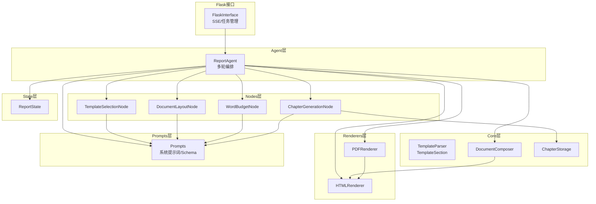

图表来源
- [ReportEngine/agent.py](file://ReportEngine/agent.py#L1-L200)
- [ReportEngine/nodes/template_selection_node.py](file://ReportEngine/nodes/template_selection_node.py#L1-L120)
- [ReportEngine/nodes/document_layout_node.py](file://ReportEngine/nodes/document_layout_node.py#L1-L120)
- [ReportEngine/nodes/word_budget_node.py](file://ReportEngine/nodes/word_budget_node.py#L1-L120)
- [ReportEngine/nodes/chapter_generation_node.py](file://ReportEngine/nodes/chapter_generation_node.py#L1-L120)
- [ReportEngine/core/stitcher.py](file://ReportEngine/core/stitcher.py#L1-L80)
- [ReportEngine/core/template_parser.py](file://ReportEngine/core/template_parser.py#L1-L120)
- [ReportEngine/renderers/html_renderer.py](file://ReportEngine/renderers/html_renderer.py#L1-L120)
- [ReportEngine/renderers/pdf_renderer.py](file://ReportEngine/renderers/pdf_renderer.py#L1-L120)
- [ReportEngine/flask_interface.py](file://ReportEngine/flask_interface.py#L1-L120)
- [ReportEngine/state/state.py](file://ReportEngine/state/state.py#L1-L80)
- [ReportEngine/prompts/prompts.py](file://ReportEngine/prompts/prompts.py#L1-L120)

章节来源
- [ReportEngine/agent.py](file://ReportEngine/agent.py#L1-L200)
- [ReportEngine/flask_interface.py](file://ReportEngine/flask_interface.py#L1-L120)

## 核心组件
- ReportAgent：多轮编排中枢，负责模板选择、布局设计、篇幅规划、章节生成、IR装订与渲染，并提供SSE事件流与状态持久化
- TemplateSelectionNode：基于查询、三引擎报告与论坛日志，选择最合适的Markdown模板
- DocumentLayoutNode：生成标题、目录、Hero与主题令牌，指导视觉与结构基调
- WordBudgetNode：为每章与小节分配字数目标与强调点，约束章节生成
- ChapterGenerationNode：按章节调用LLM，流式写入Raw并解析为章节IR，具备跨引擎修复与占位兜底
- DocumentComposer：将章节IR合并为整本Document IR，注入锚点、顺序与元数据
- HTMLRenderer：将Document IR渲染为HTML，内嵌图表、数学公式与交互脚本
- PDFRenderer：基于WeasyPrint从HTML生成PDF，支持中文字体与图表SVG注入
- TemplateParser：将Markdown模板解析为TemplateSection序列，生成稳定锚点与章节ID
- ReportState：任务状态与元数据，支持持久化与查询
- Prompts：统一的系统提示词与Schema约束，保障LLM输出结构化与可解析

章节来源
- [ReportEngine/agent.py](file://ReportEngine/agent.py#L173-L233)
- [ReportEngine/nodes/template_selection_node.py](file://ReportEngine/nodes/template_selection_node.py#L1-L120)
- [ReportEngine/nodes/document_layout_node.py](file://ReportEngine/nodes/document_layout_node.py#L1-L120)
- [ReportEngine/nodes/word_budget_node.py](file://ReportEngine/nodes/word_budget_node.py#L1-L120)
- [ReportEngine/nodes/chapter_generation_node.py](file://ReportEngine/nodes/chapter_generation_node.py#L1-L120)
- [ReportEngine/core/stitcher.py](file://ReportEngine/core/stitcher.py#L1-L80)
- [ReportEngine/renderers/html_renderer.py](file://ReportEngine/renderers/html_renderer.py#L1-L120)
- [ReportEngine/renderers/pdf_renderer.py](file://ReportEngine/renderers/pdf_renderer.py#L1-L120)
- [ReportEngine/core/template_parser.py](file://ReportEngine/core/template_parser.py#L1-L120)
- [ReportEngine/state/state.py](file://ReportEngine/state/state.py#L1-L120)
- [ReportEngine/prompts/prompts.py](file://ReportEngine/prompts/prompts.py#L1-L120)

## 架构总览
ReportEngine 的生成流程以“模板驱动”为核心，Agent按顺序驱动各节点，最终由HTMLRenderer渲染，PDFRenderer导出PDF。模板解析与章节IR贯穿始终，确保结构一致与可扩展。

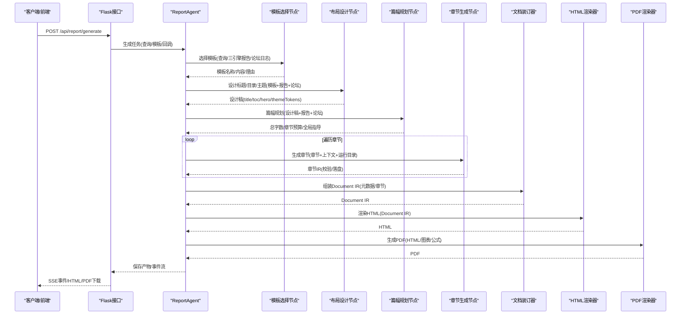

图表来源
- [ReportEngine/agent.py](file://ReportEngine/agent.py#L378-L700)
- [ReportEngine/nodes/template_selection_node.py](file://ReportEngine/nodes/template_selection_node.py#L43-L120)
- [ReportEngine/nodes/document_layout_node.py](file://ReportEngine/nodes/document_layout_node.py#L38-L120)
- [ReportEngine/nodes/word_budget_node.py](file://ReportEngine/nodes/word_budget_node.py#L38-L120)
- [ReportEngine/nodes/chapter_generation_node.py](file://ReportEngine/nodes/chapter_generation_node.py#L154-L273)
- [ReportEngine/core/stitcher.py](file://ReportEngine/core/stitcher.py#L29-L80)
- [ReportEngine/renderers/html_renderer.py](file://ReportEngine/renderers/html_renderer.py#L232-L282)
- [ReportEngine/renderers/pdf_renderer.py](file://ReportEngine/renderers/pdf_renderer.py#L1-L120)
- [ReportEngine/flask_interface.py](file://ReportEngine/flask_interface.py#L555-L700)

## 详细组件分析

### ReportAgent：多轮编排与事件流
- 职责
  - 初始化LLM客户端、节点、渲染器、章节存储与状态
  - 串联模板选择→布局设计→篇幅规划→章节生成→IR装订→HTML渲染→PDF渲染
  - 提供SSE事件流（模板选择、章节流式增量、进度、完成、错误等）
  - 支持跨引擎修复通道与内容密度兜底策略
- 关键流程
  - 模板选择：优先用户自定义模板，否则由LLM从本地模板库挑选
  - 模板切片：将Markdown标题/编号解析为TemplateSection序列
  - 布局设计：生成标题、目录、Hero与主题令牌
  - 篇幅规划：为每章/小节分配字数目标与强调点
  - 章节生成：按章节调用LLM，流式写入Raw，解析为章节IR，校验与落盘
  - IR装订：合并元数据、锚点、顺序，形成Document IR
  - 渲染：HTML渲染器输出HTML，PDF渲染器输出PDF
- 错误处理
  - 章节JSON解析失败与内容稀疏异常，支持跨引擎修复与占位兜底
  - 内容安全限制触发重试或降级
  - 事件回调异常不阻断主流程

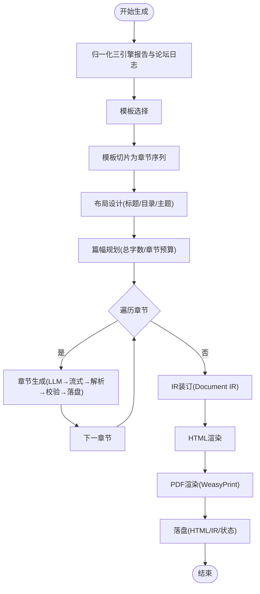

图表来源
- [ReportEngine/agent.py](file://ReportEngine/agent.py#L378-L700)
- [ReportEngine/core/template_parser.py](file://ReportEngine/core/template_parser.py#L87-L142)
- [ReportEngine/nodes/chapter_generation_node.py](file://ReportEngine/nodes/chapter_generation_node.py#L154-L273)
- [ReportEngine/core/stitcher.py](file://ReportEngine/core/stitcher.py#L29-L80)
- [ReportEngine/renderers/html_renderer.py](file://ReportEngine/renderers/html_renderer.py#L232-L282)
- [ReportEngine/renderers/pdf_renderer.py](file://ReportEngine/renderers/pdf_renderer.py#L1-L120)

章节来源
- [ReportEngine/agent.py](file://ReportEngine/agent.py#L378-L700)

### 模板选择节点：模板驱动的起点
- 输入：查询、三引擎报告、论坛日志
- 输出：模板名称、模板内容、选择理由
- 机制
  - 枚举本地模板目录，读取Markdown内容与描述
  - 使用LLM进行模板选择，支持JSON解析与文本降级提取
  - 失败时回退到空模板（让LLM自行发挥）

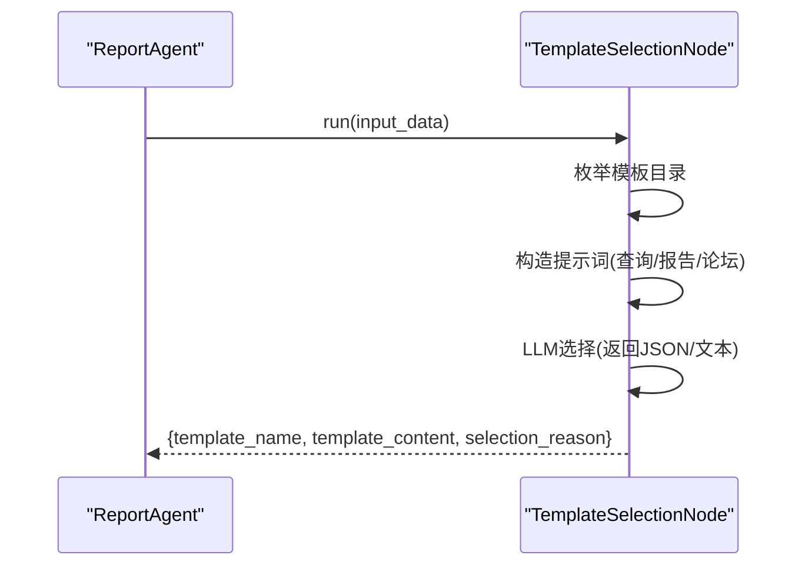

图表来源
- [ReportEngine/nodes/template_selection_node.py](file://ReportEngine/nodes/template_selection_node.py#L43-L180)
- [ReportEngine/prompts/prompts.py](file://ReportEngine/prompts/prompts.py#L195-L231)

章节来源
- [ReportEngine/nodes/template_selection_node.py](file://ReportEngine/nodes/template_selection_node.py#L1-L180)
- [ReportEngine/prompts/prompts.py](file://ReportEngine/prompts/prompts.py#L195-L231)

### 布局设计节点：标题/目录/主题设计
- 输入：模板切片、模板原文、三引擎报告、论坛日志、查询、模板概览
- 输出：标题、副标题、标语、目录标题、Hero、主题令牌、目录计划、布局备注
- 机制
  - 统一提示词与Schema约束，鲁棒解析JSON
  - 清理目录计划中的描述文本，避免JSON片段污染

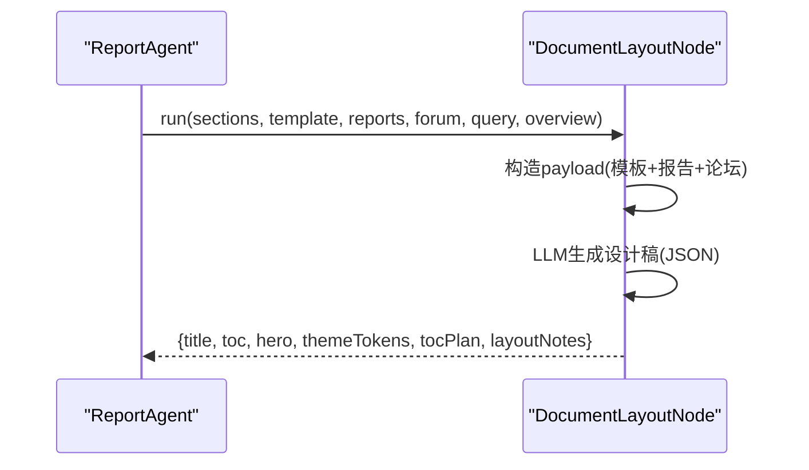

图表来源
- [ReportEngine/nodes/document_layout_node.py](file://ReportEngine/nodes/document_layout_node.py#L38-L120)
- [ReportEngine/prompts/prompts.py](file://ReportEngine/prompts/prompts.py#L365-L406)

章节来源
- [ReportEngine/nodes/document_layout_node.py](file://ReportEngine/nodes/document_layout_node.py#L1-L120)
- [ReportEngine/prompts/prompts.py](file://ReportEngine/prompts/prompts.py#L365-L406)

### 篇幅规划节点：章节字数与重点
- 输入：章节列表、设计稿、三引擎报告、论坛日志、查询、模板概览
- 输出：总字数、全局指导、章节预算（含小节预算与强调点）
- 机制
  - 统一提示词与Schema约束，鲁棒解析JSON
  - 校验关键字段类型，缺失时回退默认值

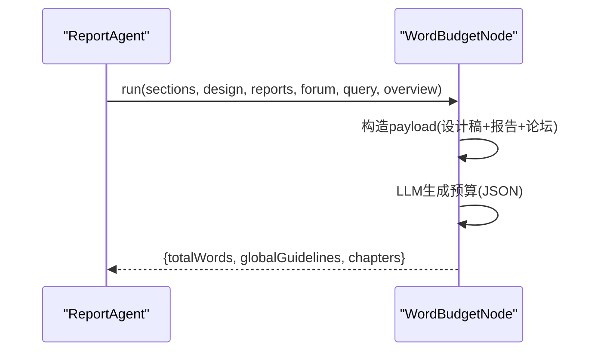

图表来源
- [ReportEngine/nodes/word_budget_node.py](file://ReportEngine/nodes/word_budget_node.py#L38-L120)
- [ReportEngine/prompts/prompts.py](file://ReportEngine/prompts/prompts.py#L407-L434)

章节来源
- [ReportEngine/nodes/word_budget_node.py](file://ReportEngine/nodes/word_budget_node.py#L1-L120)
- [ReportEngine/prompts/prompts.py](file://ReportEngine/prompts/prompts.py#L407-L434)

### 章节生成节点：章节IR的生产者
- 输入：TemplateSection、全局上下文（查询、模板名、主题令牌、布局、模板概览、数据包、约束、章节计划、篇幅规划）
- 输出：章节IR（通过IR校验）
- 机制
  - 流式调用LLM，实时写入Raw文件并透传delta
  - 解析LLM输出，支持多种修复策略（语法修复、跨引擎修复、占位兜底）
  - 校验IR结构，必要时进行结构性修复
  - 内容密度不足时触发重试或占位

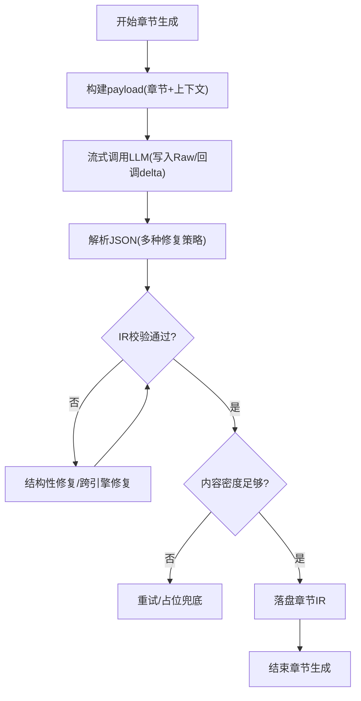

图表来源
- [ReportEngine/nodes/chapter_generation_node.py](file://ReportEngine/nodes/chapter_generation_node.py#L154-L273)
- [ReportEngine/nodes/chapter_generation_node.py](file://ReportEngine/nodes/chapter_generation_node.py#L274-L520)
- [ReportEngine/prompts/prompts.py](file://ReportEngine/prompts/prompts.py#L297-L364)

章节来源
- [ReportEngine/nodes/chapter_generation_node.py](file://ReportEngine/nodes/chapter_generation_node.py#L1-L273)
- [ReportEngine/nodes/chapter_generation_node.py](file://ReportEngine/nodes/chapter_generation_node.py#L274-L520)
- [ReportEngine/prompts/prompts.py](file://ReportEngine/prompts/prompts.py#L297-L364)

### IR装订器：Document IR的组装
- 输入：report_id、metadata、chapters
- 输出：Document IR（注入IR版本、生成时间、主题令牌、章节、资产）
- 机制
  - 按order排序章节，补充默认chapterId
  - 防止anchor重复，生成全局唯一锚点
  - 从metadata.toc.customEntries构建chapterId到anchor映射

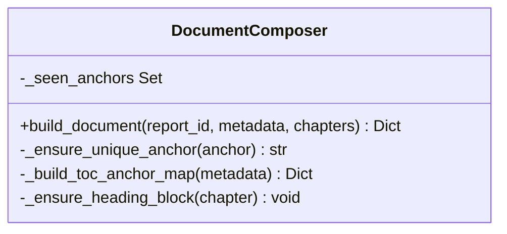

图表来源
- [ReportEngine/core/stitcher.py](file://ReportEngine/core/stitcher.py#L15-L80)

章节来源
- [ReportEngine/core/stitcher.py](file://ReportEngine/core/stitcher.py#L1-L80)

### HTML渲染器：章节IR到HTML
- 输入：Document IR
- 输出：完整HTML（含主题CSS、图表脚本、交互逻辑）
- 机制
  - 加载本地库并提供CDN回退
  - 渲染头部、英雄区、目录、章节与水化脚本
  - 图表验证与修复，数学公式渲染

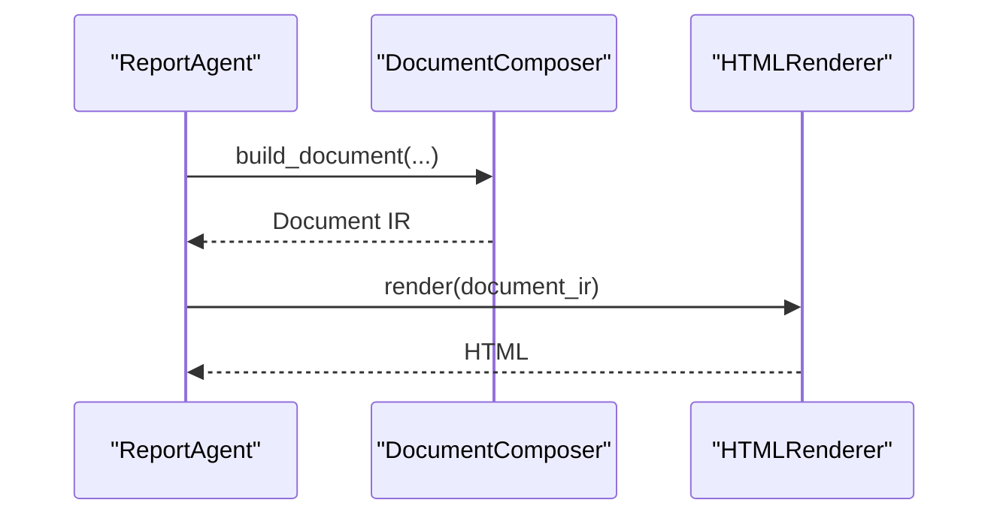

图表来源
- [ReportEngine/core/stitcher.py](file://ReportEngine/core/stitcher.py#L29-L80)
- [ReportEngine/renderers/html_renderer.py](file://ReportEngine/renderers/html_renderer.py#L232-L282)

章节来源
- [ReportEngine/renderers/html_renderer.py](file://ReportEngine/renderers/html_renderer.py#L1-L282)

### PDF渲染器：WeasyPrint高质量导出
- 输入：Document IR（经HTML渲染器）
- 输出：PDF
- 机制
  - 图表预处理与修复，数学公式SVG转换
  - 词云图片生成与注入
  - SVG注入HTML并隐藏fallback，确保PDF一致性

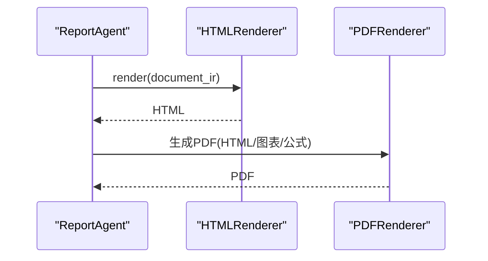

图表来源
- [ReportEngine/renderers/pdf_renderer.py](file://ReportEngine/renderers/pdf_renderer.py#L1-L120)
- [ReportEngine/renderers/html_renderer.py](file://ReportEngine/renderers/html_renderer.py#L232-L282)

章节来源
- [ReportEngine/renderers/pdf_renderer.py](file://ReportEngine/renderers/pdf_renderer.py#L1-L120)

### 模板解析器：Markdown到TemplateSection
- 输入：Markdown模板全文
- 输出：TemplateSection列表（含标题、slug、序号、层级、章节编号、章节ID、提纲）
- 机制
  - 兼容“# 标题”“- **1.0 标题**”“列表提纲”等写法
  - 生成稳定slug与chapter_id，确保锚点一致

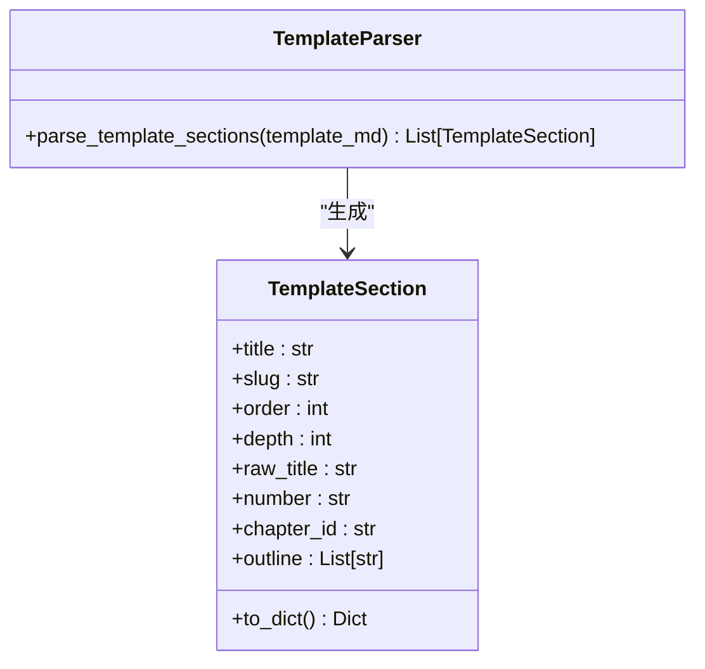

图表来源
- [ReportEngine/core/template_parser.py](file://ReportEngine/core/template_parser.py#L19-L52)
- [ReportEngine/core/template_parser.py](file://ReportEngine/core/template_parser.py#L87-L142)

章节来源
- [ReportEngine/core/template_parser.py](file://ReportEngine/core/template_parser.py#L1-L142)

### 报告模板与变量替换机制
- 模板结构规范
  - 以Markdown标题/编号组织章节，支持“# 标题”与“- **1.0 标题**”等写法
  - 自动生成稳定slug与chapter_id，确保锚点一致
  - 目录计划（tocPlan）可由布局设计节点提供，用于定制目录标题与描述
- 变量替换
  - 模板选择节点会读取模板文件内容与描述，用于LLM理解模板定位
  - 布局设计节点输出的themeTokens、tocPlan、hero等元数据注入到Document IR，最终由HTML/PDF渲染器消费
- 示例：突发事件与危机公关舆情报告模板
  - 模板包含报告摘要、事件溯源、舆情传播分析、舆论焦点、风险研判、应对策略等章节
  - Agent在生成时会按模板切片顺序逐章调用LLM，确保结构与锚点一致

章节来源
- [ReportEngine/core/template_parser.py](file://ReportEngine/core/template_parser.py#L87-L142)
- [ReportEngine/nodes/document_layout_node.py](file://ReportEngine/nodes/document_layout_node.py#L118-L145)
- [ReportEngine/report_template/突发事件与危机公关舆情报告模板.md](file://ReportEngine/report_template/突发事件与危机公关舆情报告模板.md#L1-L27)

### Flask接口：Web API与SSE
- 能力
  - 初始化ReportAgent并挂载日志流转发
  - 任务排队、进度查询、SSE事件流、日志下载
  - 模板列表、输入文件检查等周边能力
- 接口
  - GET /api/report/status：引擎就绪与当前任务
  - POST /api/report/generate：开始生成任务，返回SSE地址
  - GET /api/report/progress/<task_id>：查询进度
  - GET /api/report/stream/<task_id>：SSE事件流
- 事件流
  - 任务状态、阶段事件、章节增量、进度、完成/错误、日志等

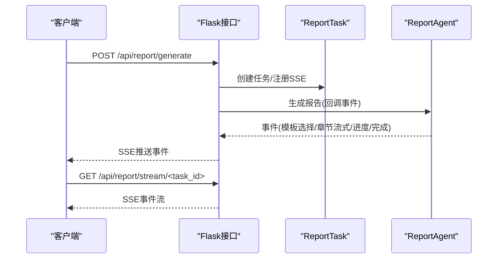

图表来源
- [ReportEngine/flask_interface.py](file://ReportEngine/flask_interface.py#L555-L700)
- [ReportEngine/flask_interface.py](file://ReportEngine/flask_interface.py#L700-L800)

章节来源
- [ReportEngine/flask_interface.py](file://ReportEngine/flask_interface.py#L1-L800)

## 依赖关系分析
- Agent对Nodes的依赖：模板选择→布局设计→篇幅规划→章节生成
- Nodes对Prompts的依赖：统一的系统提示词与Schema约束
- Nodes对Core的依赖：模板切片、章节存储、IR装订
- Renderers对Core的依赖：Document IR作为输入
- Flask对Agent的依赖：任务创建、事件回调、状态查询

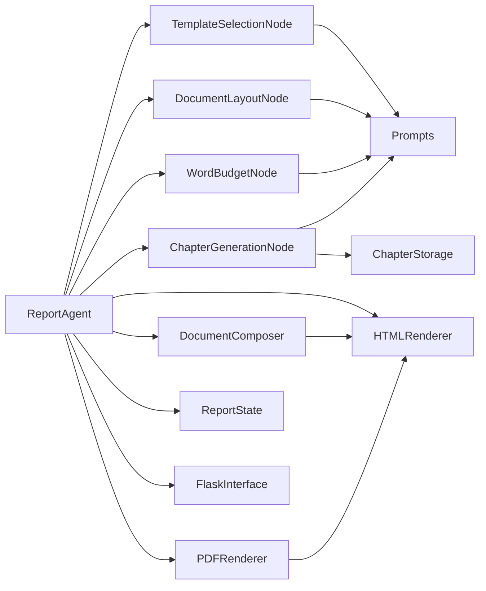

图表来源
- [ReportEngine/agent.py](file://ReportEngine/agent.py#L357-L377)
- [ReportEngine/nodes/template_selection_node.py](file://ReportEngine/nodes/template_selection_node.py#L26-L42)
- [ReportEngine/nodes/document_layout_node.py](file://ReportEngine/nodes/document_layout_node.py#L21-L37)
- [ReportEngine/nodes/word_budget_node.py](file://ReportEngine/nodes/word_budget_node.py#L21-L37)
- [ReportEngine/nodes/chapter_generation_node.py](file://ReportEngine/nodes/chapter_generation_node.py#L118-L148)
- [ReportEngine/core/stitcher.py](file://ReportEngine/core/stitcher.py#L15-L28)
- [ReportEngine/renderers/html_renderer.py](file://ReportEngine/renderers/html_renderer.py#L1-L120)
- [ReportEngine/renderers/pdf_renderer.py](file://ReportEngine/renderers/pdf_renderer.py#L1-L120)
- [ReportEngine/flask_interface.py](file://ReportEngine/flask_interface.py#L1-L120)
- [ReportEngine/state/state.py](file://ReportEngine/state/state.py#L1-L80)
- [ReportEngine/prompts/prompts.py](file://ReportEngine/prompts/prompts.py#L1-L120)

章节来源
- [ReportEngine/agent.py](file://ReportEngine/agent.py#L357-L377)
- [ReportEngine/prompts/prompts.py](file://ReportEngine/prompts/prompts.py#L1-L120)

## 性能考量
- 流式生成与增量渲染：章节生成采用流式回调，前端可实时预览，降低等待时间
- 事件压缩与心跳：SSE提供心跳与断线重连，避免长时间无事件导致连接中断
- 依赖检测与降级：WeasyPrint依赖检测与CDN回退，确保在不同环境下可用
- 章节重试与兜底：内容稀疏与JSON解析失败具备重试与占位策略，提高成功率
- 字体与图表优化：PDF导出使用子集字体与SVG注入，减少体积与渲染开销

[本节为通用指导，无需引用具体文件]

## 故障排查指南
- 模板选择失败
  - 现象：LLM返回空或解析失败
  - 处理：回退到空模板，或检查模板目录与文件读取权限
- 章节JSON解析失败
  - 现象：ChapterJsonParseError
  - 处理：启用跨引擎修复通道，或降级为占位章节并记录错误日志
- 内容安全限制
  - 现象：触发内容过滤错误
  - 处理：重试或调整提示词，必要时更换更强的LLM
- PDF导出依赖缺失
  - 现象：WeasyPrint加载失败或Pango依赖缺失
  - 处理：安装系统依赖或使用Docker镜像，查看依赖检测日志
- SSE连接中断
  - 现象：断线重连后事件丢失
  - 处理：使用Last-Event-ID补发历史事件，确认心跳与终端状态

章节来源
- [ReportEngine/nodes/chapter_generation_node.py](file://ReportEngine/nodes/chapter_generation_node.py#L1-L120)
- [ReportEngine/renderers/pdf_renderer.py](file://ReportEngine/renderers/pdf_renderer.py#L1-L120)
- [ReportEngine/flask_interface.py](file://ReportEngine/flask_interface.py#L700-L800)

## 结论
ReportEngine 通过“模板驱动+LLM节点+章节IR”的架构，实现了高一致性、强扩展性的报告生成体系。Agent作为中枢，串联模板选择、布局设计、篇幅规划、章节生成、IR装订与渲染，配合Flask接口与SSE事件流，为前端提供实时预览与导出能力。模板解析器与渲染器进一步保障了结构与视觉的一致性，适合在多源数据与复杂模板场景下稳定落地。

[本节为总结性内容，无需引用具体文件]

## 附录
- 模板示例：突发事件与危机公关舆情报告模板
  - 章节结构：报告摘要、事件溯源、舆情传播分析、舆论焦点、风险研判、应对策略
  - 生成时按模板切片顺序逐章调用LLM，确保锚点与编号一致

章节来源
- [ReportEngine/report_template/突发事件与危机公关舆情报告模板.md](file://ReportEngine/report_template/突发事件与危机公关舆情报告模板.md#L1-L27)