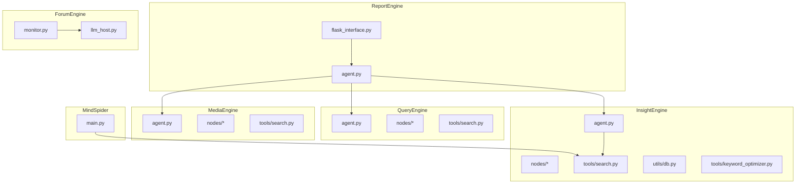
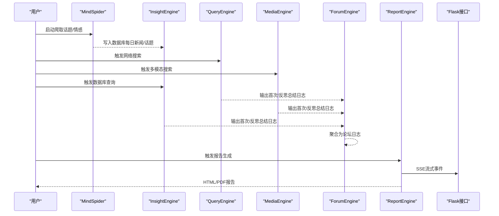
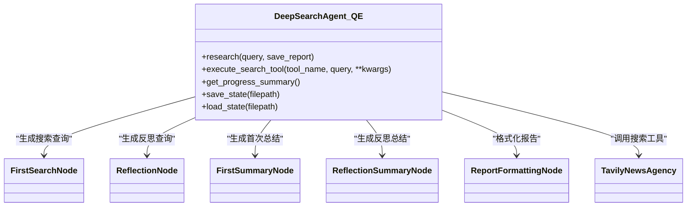
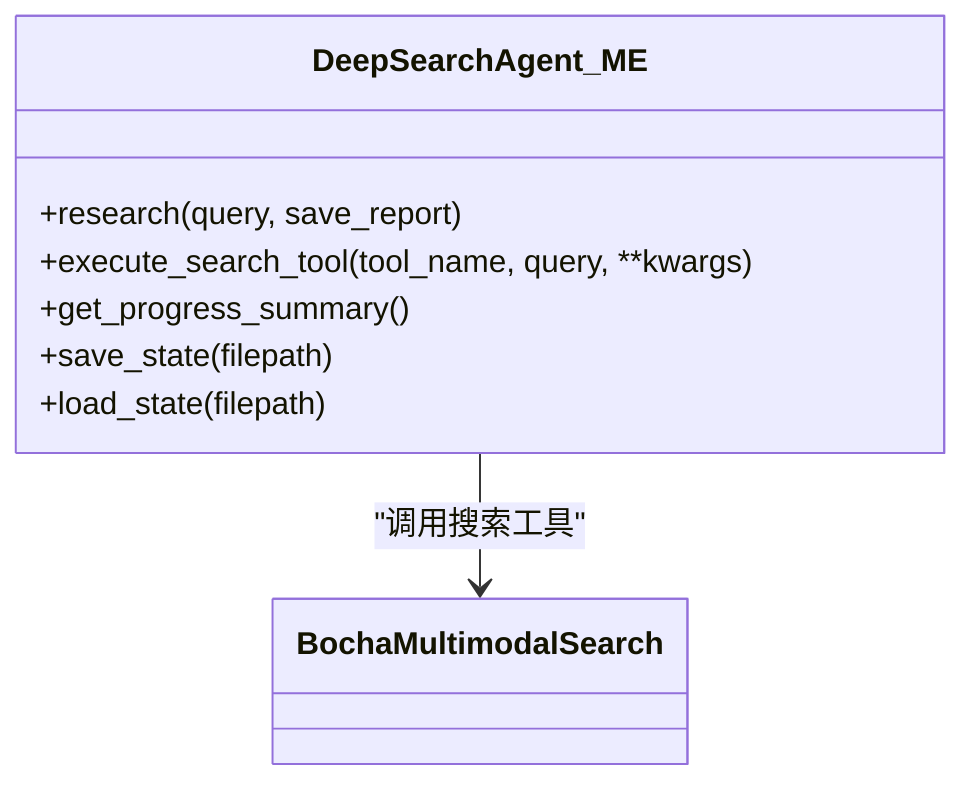
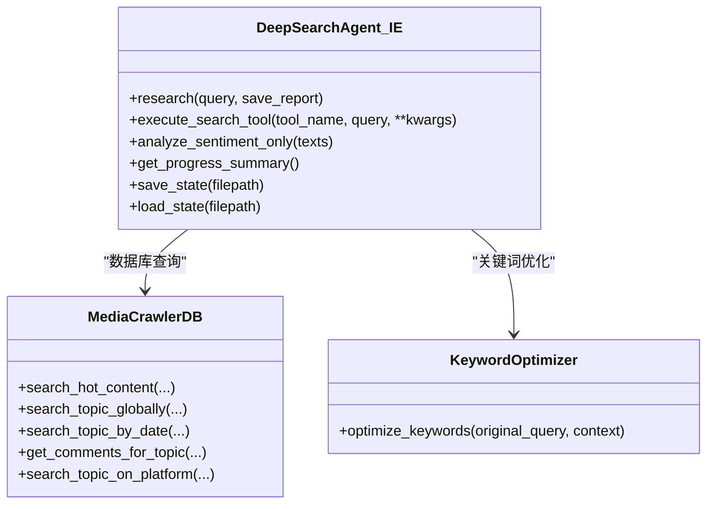
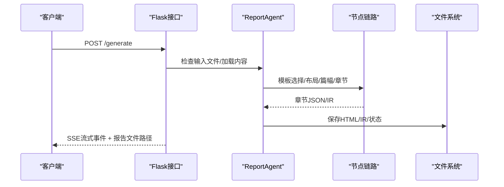
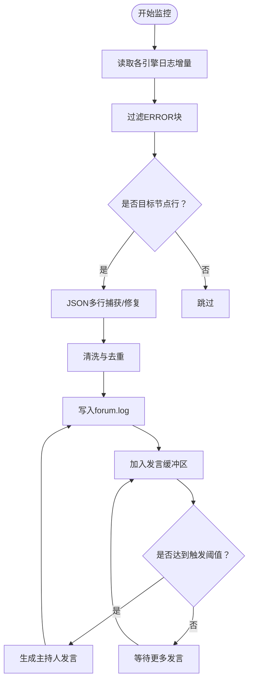
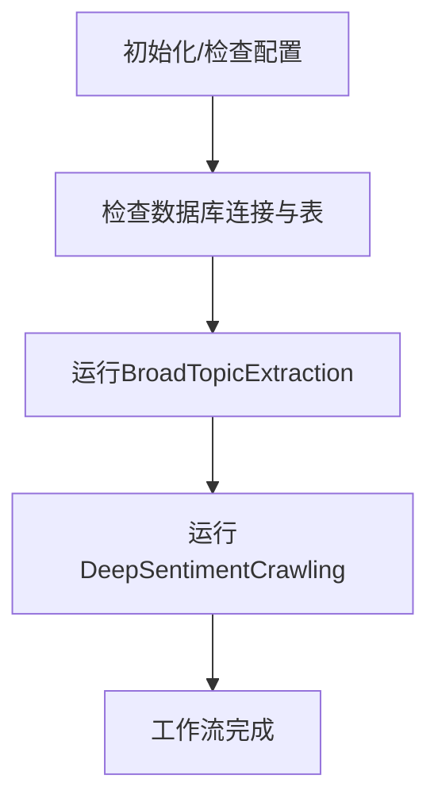
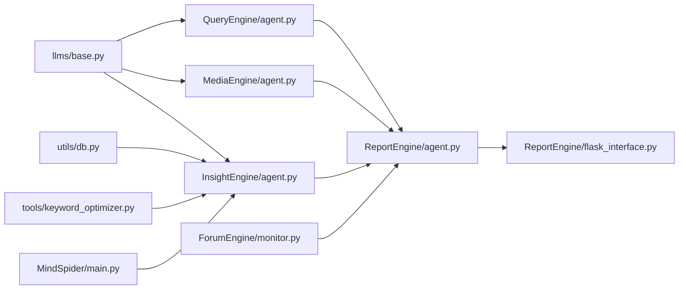

# 核心模块

<cite>
**本文引用的文件**
- [QueryEngine/agent.py](file://QueryEngine/agent.py)
- [QueryEngine/nodes/__init__.py](file://QueryEngine/nodes/__init__.py)
- [QueryEngine/nodes/base_node.py](file://QueryEngine/nodes/base_node.py)
- [QueryEngine/tools/search.py](file://QueryEngine/tools/search.py)
- [MediaEngine/agent.py](file://MediaEngine/agent.py)
- [MediaEngine/nodes/__init__.py](file://MediaEngine/nodes/__init__.py)
- [MediaEngine/tools/search.py](file://MediaEngine/tools/search.py)
- [InsightEngine/agent.py](file://InsightEngine/agent.py)
- [InsightEngine/nodes/__init__.py](file://InsightEngine/nodes/__init__.py)
- [InsightEngine/tools/keyword_optimizer.py](file://InsightEngine/tools/keyword_optimizer.py)
- [InsightEngine/tools/search.py](file://InsightEngine/tools/search.py)
- [InsightEngine/utils/db.py](file://InsightEngine/utils/db.py)
- [ReportEngine/agent.py](file://ReportEngine/agent.py)
- [ReportEngine/flask_interface.py](file://ReportEngine/flask_interface.py)
- [ForumEngine/monitor.py](file://ForumEngine/monitor.py)
- [ForumEngine/llm_host.py](file://ForumEngine/llm_host.py)
- [MindSpider/main.py](file://MindSpider/main.py)
</cite>

## 目录
1. [简介](#简介)
2. [项目结构](#项目结构)
3. [核心组件](#核心组件)
4. [架构总览](#架构总览)
5. [详细组件分析](#详细组件分析)
6. [依赖关系分析](#依赖关系分析)
7. [性能考量](#性能考量)
8. [故障排查指南](#故障排查指南)
9. [结论](#结论)
10. [附录](#附录)

## 简介
本文件为 BettaFish 的核心功能模块提供系统化文档，覆盖 QueryEngine、MediaEngine、InsightEngine、ReportEngine、ForumEngine、MindSpider 六大模块。每个模块均包含：核心目的、主要功能、内部结构（agent.py 作为主逻辑入口，nodes/ 处理节点，tools/ 工具集）、与其它模块的协同方式（如 InsightEngine 如何利用 MindSpider 爬取的数据进行分析）。文档旨在帮助读者快速理解各模块职责与协作关系，并为深入阅读各模块源码提供导航。

## 项目结构
BettaFish 采用按功能域划分的模块化组织方式，每个核心模块位于独立目录下，包含：
- agent.py：模块主控制器，编排节点与工具，驱动完整工作流
- nodes/：节点集合，负责具体阶段的处理（如报告结构生成、首次搜索、反思循环、总结、格式化）
- tools/：对外部搜索/数据库/分析工具的封装
- utils/：通用工具（如文本处理、配置、数据库访问等）
- llms/：LLM 客户端封装
- state/：状态管理
- prompts/：提示词模板
- 其它入口文件（如 ReportEngine 的 Flask 接口）

图表来源
- [QueryEngine/agent.py](file://QueryEngine/agent.py#L1-L474)
- [MediaEngine/agent.py](file://MediaEngine/agent.py#L1-L452)
- [InsightEngine/agent.py](file://InsightEngine/agent.py#L1-L784)
- [ReportEngine/agent.py](file://ReportEngine/agent.py#L1-L800)
- [ReportEngine/flask_interface.py](file://ReportEngine/flask_interface.py#L1-L800)
- [ForumEngine/monitor.py](file://ForumEngine/monitor.py#L1-L800)
- [ForumEngine/llm_host.py](file://ForumEngine/llm_host.py#L1-L263)
- [MindSpider/main.py](file://MindSpider/main.py#L1-L447)

章节来源
- [QueryEngine/agent.py](file://QueryEngine/agent.py#L1-L474)
- [MediaEngine/agent.py](file://MediaEngine/agent.py#L1-L452)
- [InsightEngine/agent.py](file://InsightEngine/agent.py#L1-L784)
- [ReportEngine/agent.py](file://ReportEngine/agent.py#L1-L800)
- [ReportEngine/flask_interface.py](file://ReportEngine/flask_interface.py#L1-L800)
- [ForumEngine/monitor.py](file://ForumEngine/monitor.py#L1-L800)
- [ForumEngine/llm_host.py](file://ForumEngine/llm_host.py#L1-L263)
- [MindSpider/main.py](file://MindSpider/main.py#L1-L447)

## 核心组件
- QueryEngine：负责国内外新闻广度搜索与报告生成，使用 Tavily 新闻搜索工具，支持多轮反思与总结，最终输出结构化报告。
- MediaEngine：负责多模态内容分析（网页、图片、模态卡等），使用 Bocha 多模态搜索工具，支持时效性检索与结构化数据查询。
- InsightEngine：负责私有舆情数据库的深度挖掘与分析，使用 MediaCrawlerDB 查询工具，内置关键词优化中间件与情感分析器，支持热点内容、话题搜索、评论提取与平台定向搜索。
- ReportEngine：负责将 Query/Media/Insight 三引擎输出与论坛日志整合，通过模板选择、布局设计、篇幅规划、章节生成、IR 装订与渲染，输出 HTML/PDF 报告。
- ForumEngine：实时监控三个引擎的日志，提取各引擎“首次/反思总结”节点输出，清洗并聚合为论坛日志；可选地由 LLM 主持人生成引导性发言。
- MindSpider：社交媒体爬虫系统，集成 BroadTopicExtraction（话题提取）与 DeepSentimentCrawling（情感爬取），负责将爬取数据入库，供 InsightEngine 查询使用。

章节来源
- [QueryEngine/agent.py](file://QueryEngine/agent.py#L1-L474)
- [MediaEngine/agent.py](file://MediaEngine/agent.py#L1-L452)
- [InsightEngine/agent.py](file://InsightEngine/agent.py#L1-L784)
- [ReportEngine/agent.py](file://ReportEngine/agent.py#L1-L800)
- [ForumEngine/monitor.py](file://ForumEngine/monitor.py#L1-L800)
- [MindSpider/main.py](file://MindSpider/main.py#L1-L447)

## 架构总览
整体架构采用“多引擎并行采集 + 统一报告装配”的模式。MindSpider 作为数据采集层，InsightEngine 作为本地数据库分析层，Query/Media 作为网络/多模态搜索层，ForumEngine 实时汇聚各引擎输出，ReportEngine 将多源信息整合为最终报告。

图表来源
- [MindSpider/main.py](file://MindSpider/main.py#L1-L447)
- [InsightEngine/agent.py](file://InsightEngine/agent.py#L1-L784)
- [QueryEngine/agent.py](file://QueryEngine/agent.py#L1-L474)
- [MediaEngine/agent.py](file://MediaEngine/agent.py#L1-L452)
- [ForumEngine/monitor.py](file://ForumEngine/monitor.py#L1-L800)
- [ReportEngine/flask_interface.py](file://ReportEngine/flask_interface.py#L1-L800)

## 详细组件分析

### QueryEngine 分析
- 核心目的：基于 Tavily 新闻搜索工具，执行国内外新闻广度搜索，通过“报告结构生成 → 初始搜索与总结 → 反思循环 → 最终报告格式化”的迭代流程，输出结构化报告。
- 主要功能：
  - 报告结构生成：根据查询生成报告段落数与标题
  - 搜索工具选择：支持基础新闻、深度分析、24小时/周、图片、按日期范围搜索
  - 反思循环：基于上一轮总结生成新的搜索查询，迭代提升覆盖面与准确性
  - 报告格式化：将各段落总结整合为最终报告并保存
- 内部结构：
  - agent.py：主控制器，编排节点与工具，管理状态与输出
  - nodes：包含报告结构节点、首次/反思搜索节点、首次/反思总结节点、报告格式化节点
  - tools：TavilyNewsAgency 封装多种新闻搜索工具
  - state：状态容器，记录段落、搜索历史、最终报告等
  - llms：LLM 客户端封装
  - utils：文本处理与配置加载
- 协作关系：与 ReportEngine 协作，后者消费 QueryEngine 的输出作为输入之一。

图表来源
- [QueryEngine/agent.py](file://QueryEngine/agent.py#L1-L474)
- [QueryEngine/nodes/__init__.py](file://QueryEngine/nodes/__init__.py#L1-L21)
- [QueryEngine/tools/search.py](file://QueryEngine/tools/search.py#L1-L251)

章节来源
- [QueryEngine/agent.py](file://QueryEngine/agent.py#L1-L474)
- [QueryEngine/nodes/base_node.py](file://QueryEngine/nodes/base_node.py#L1-L95)
- [QueryEngine/tools/search.py](file://QueryEngine/tools/search.py#L1-L251)

### MediaEngine 分析
- 核心目的：基于 Bocha 多模态搜索工具，执行网页、图片、模态卡等多模态信息检索，支持时效性搜索与结构化数据查询。
- 主要功能：
  - 全面综合搜索、纯网页搜索、结构化数据查询、24小时/周时效性搜索
  - 返回网页、图片、AI总结、追问建议与模态卡
- 内部结构：
  - agent.py：主控制器，编排节点与工具，管理状态与输出
  - nodes：与 QueryEngine 类似的节点体系
  - tools：BochaMultimodalSearch 封装多模态搜索工具
  - state：状态容器
  - llms：LLM 客户端封装
  - utils：文本处理与配置加载

图表来源
- [MediaEngine/agent.py](file://MediaEngine/agent.py#L1-L452)
- [MediaEngine/tools/search.py](file://MediaEngine/tools/search.py#L1-L390)

章节来源
- [MediaEngine/agent.py](file://MediaEngine/agent.py#L1-L452)
- [MediaEngine/tools/search.py](file://MediaEngine/tools/search.py#L1-L390)

### InsightEngine 分析
- 核心目的：基于本地 MySQL/PostgreSQL 数据库，执行热点内容、话题搜索、评论提取与平台定向搜索，支持关键词优化中间件与情感分析。
- 主要功能：
  - 热点内容搜索（24h/周/年）
  - 全局话题搜索（跨表、跨字段）
  - 按日期范围搜索
  - 评论提取与平台定向搜索（B站/微博/抖音/快手/小红书/知乎/贴吧）
  - 关键词优化中间件（将 Agent 生成的查询优化为更贴近网民语言的关键词）
  - 情感分析（WeiboMultilingualSentiment）
- 内部结构：
  - agent.py：主控制器，编排节点与工具，管理状态与输出
  - nodes：与 QueryEngine 类似的节点体系
  - tools：MediaCrawlerDB（数据库查询工具集）、keyword_optimizer（关键词优化）、情感分析器
  - utils：数据库访问封装（异步引擎）
  - state：状态容器
  - llms：LLM 客户端封装
  - prompts：提示词模板
  - utils/text_processing：文本处理

图表来源
- [InsightEngine/agent.py](file://InsightEngine/agent.py#L1-L784)
- [InsightEngine/tools/search.py](file://InsightEngine/tools/search.py#L1-L463)
- [InsightEngine/tools/keyword_optimizer.py](file://InsightEngine/tools/keyword_optimizer.py#L1-L298)
- [InsightEngine/utils/db.py](file://InsightEngine/utils/db.py#L1-L73)

章节来源
- [InsightEngine/agent.py](file://InsightEngine/agent.py#L1-L784)
- [InsightEngine/tools/search.py](file://InsightEngine/tools/search.py#L1-L463)
- [InsightEngine/tools/keyword_optimizer.py](file://InsightEngine/tools/keyword_optimizer.py#L1-L298)
- [InsightEngine/utils/db.py](file://InsightEngine/utils/db.py#L1-L73)

### ReportEngine 分析
- 核心目的：将 Query/Media/Insight 三引擎输出与论坛日志整合，通过模板选择、布局设计、篇幅规划、章节生成、IR 装订与渲染，输出 HTML/PDF 报告。
- 主要功能：
  - 模板选择与切片
  - 文档布局与标题/目录设计
  - 篇幅规划（章节字数与重点）
  - 章节生成（支持流式事件与 JSON 解析兜底）
  - IR 装订与 HTML/PDF 渲染
  - Flask 接口（SSE 事件流、任务排队、进度查询、日志转发）
- 内部结构：
  - agent.py：主控制器，串联模板选择、布局、篇幅、章节、IR、渲染等节点
  - nodes：模板选择、文档布局、篇幅规划、章节生成等节点
  - core：章节存储、文档组装、模板解析等核心组件
  - ir：IR 校验与装订
  - renderers：HTML/PDF 渲染器
  - state：报告状态管理
  - utils：依赖检查、JSON 解析、图表校验等
  - flask_interface.py：Flask 接口，提供 /status、/generate、/stream 等端点

图表来源
- [ReportEngine/agent.py](file://ReportEngine/agent.py#L1-L800)
- [ReportEngine/flask_interface.py](file://ReportEngine/flask_interface.py#L1-L800)

章节来源
- [ReportEngine/agent.py](file://ReportEngine/agent.py#L1-L800)
- [ReportEngine/flask_interface.py](file://ReportEngine/flask_interface.py#L1-L800)

### ForumEngine 分析
- 核心目的：实时监控 Insight/Media/Query 三个引擎的日志，提取“首次/反思总结”节点输出，清洗并聚合为论坛日志；可选地由 LLM 主持人生成引导性发言。
- 主要功能：
  - 多文件并发监控与增量读取
  - JSON 多行捕获与修复
  - ERROR 块过滤与内容清洗
  - 主持人发言生成（基于 Qwen3）
- 内部结构：
  - monitor.py：LogMonitor，负责日志监控、JSON 捕获、内容清洗、主持人触发
  - llm_host.py：ForumHost，负责生成主持人发言

图表来源
- [ForumEngine/monitor.py](file://ForumEngine/monitor.py#L1-L800)
- [ForumEngine/llm_host.py](file://ForumEngine/llm_host.py#L1-L263)

章节来源
- [ForumEngine/monitor.py](file://ForumEngine/monitor.py#L1-L800)
- [ForumEngine/llm_host.py](file://ForumEngine/llm_host.py#L1-L263)

### MindSpider 分析
- 核心目的：社交媒体爬虫系统，集成 BroadTopicExtraction（话题提取）与 DeepSentimentCrawling（情感爬取），负责将爬取数据入库，供 InsightEngine 查询使用。
- 主要功能：
  - 配置检查、数据库连接与表检查
  - 话题提取模块执行
  - 情感爬取模块执行（支持平台、日期、数量等参数）
  - 完整工作流编排（先话题提取，再情感爬取）
- 内部结构：
  - main.py：MindSpider 主程序，负责模块编排、依赖检查、数据库初始化与工作流执行

图表来源
- [MindSpider/main.py](file://MindSpider/main.py#L1-L447)

章节来源
- [MindSpider/main.py](file://MindSpider/main.py#L1-L447)

## 依赖关系分析
- QueryEngine/MediaEngine/InsightEngine 共同依赖 LLM 客户端封装（llms/base.py），并通过各自的 agent.py 进行编排。
- InsightEngine 依赖数据库访问工具（utils/db.py）与关键词优化中间件（tools/keyword_optimizer.py）。
- ReportEngine 依赖三个引擎的输出（insight/media/query 的报告目录）与论坛日志（logs/forum.log），并通过 Flask 接口提供流式事件。
- ForumEngine 依赖 Insight/Media/Query 的日志输出，通过 LogMonitor 实时抓取并清洗。
- MindSpider 依赖数据库初始化脚本与配置，负责将爬取数据写入数据库，供 InsightEngine 查询。

图表来源
- [QueryEngine/agent.py](file://QueryEngine/agent.py#L1-L474)
- [MediaEngine/agent.py](file://MediaEngine/agent.py#L1-L452)
- [InsightEngine/agent.py](file://InsightEngine/agent.py#L1-L784)
- [InsightEngine/utils/db.py](file://InsightEngine/utils/db.py#L1-L73)
- [InsightEngine/tools/keyword_optimizer.py](file://InsightEngine/tools/keyword_optimizer.py#L1-L298)
- [ReportEngine/agent.py](file://ReportEngine/agent.py#L1-L800)
- [ReportEngine/flask_interface.py](file://ReportEngine/flask_interface.py#L1-L800)
- [ForumEngine/monitor.py](file://ForumEngine/monitor.py#L1-L800)
- [MindSpider/main.py](file://MindSpider/main.py#L1-L447)

章节来源
- [QueryEngine/agent.py](file://QueryEngine/agent.py#L1-L474)
- [MediaEngine/agent.py](file://MediaEngine/agent.py#L1-L452)
- [InsightEngine/agent.py](file://InsightEngine/agent.py#L1-L784)
- [ReportEngine/agent.py](file://ReportEngine/agent.py#L1-L800)
- [ReportEngine/flask_interface.py](file://ReportEngine/flask_interface.py#L1-L800)
- [ForumEngine/monitor.py](file://ForumEngine/monitor.py#L1-L800)
- [MindSpider/main.py](file://MindSpider/main.py#L1-L447)

## 性能考量
- 搜索工具重试与降级：各工具集普遍采用带优雅重试的装饰器，降低网络波动带来的失败率。
- 数据库查询异步化：InsightEngine 使用 SQLAlchemy 异步引擎，减少 IO 阻塞。
- 报告生成的 JSON 解析兜底：ReportEngine 在章节生成阶段对 JSON 解析失败进行重试与内容稀疏兜底，提升稳定性。
- 日志流式推送：ReportEngine 通过 SSE 实时推送事件，前端可及时感知进度与错误。
- 关键词优化与情感分析：InsightEngine 的关键词优化与情感分析具备降级与回退策略，避免因外部服务异常导致整体失败。

## 故障排查指南
- ReportEngine 任务失败：
  - 检查 /status 端点确认三引擎报告与论坛日志是否就绪
  - 查看 /generate 返回的任务ID对应的 SSE 流，定位阶段与错误
  - 关注 ChapterJsonParseError 与内容稀疏错误，必要时更换更强算力的 LLM
- InsightEngine 数据库连接失败：
  - 检查 DB_DIALECT、DB_HOST、DB_PORT、DB_USER、DB_PASSWORD、DB_NAME 等配置
  - 确认数据库表存在（daily_news、daily_topics）
- MindSpider 爬取失败：
  - 检查配置项（DB_*、MINDSPIDER_*）与依赖（pymysql、requests、playwright）
  - 使用 --setup/--init-db 进行初始化与表检查
- ForumEngine 未生成主持人发言：
  - 确认 logs/forum.log 是否存在且有 INSIGHT/MEDIA/QUERY 的首次/反思总结输出
  - 检查 FORUM_HOST_* 配置与 API 可用性

章节来源
- [ReportEngine/flask_interface.py](file://ReportEngine/flask_interface.py#L1-L800)
- [InsightEngine/utils/db.py](file://InsightEngine/utils/db.py#L1-L73)
- [MindSpider/main.py](file://MindSpider/main.py#L1-L447)
- [ForumEngine/monitor.py](file://ForumEngine/monitor.py#L1-L800)
- [ForumEngine/llm_host.py](file://ForumEngine/llm_host.py#L1-L263)

## 结论
BettaFish 通过六大模块的协同，实现了从社交媒体爬取、本地数据库分析、网络/多模态搜索，到论坛日志汇聚与报告装配的完整闭环。QueryEngine/MediaEngine/InsightEngine 负责数据采集与分析，MindSpider 保障数据来源，ForumEngine 实时汇聚各引擎观点，ReportEngine 将多源信息整合为高质量报告。模块间通过清晰的接口与事件流实现松耦合协作，具备良好的扩展性与稳定性。

## 附录
- 模块间协同示例：InsightEngine 在执行数据库查询时，会先通过关键词优化中间件将 Agent 的查询优化为更贴近网民语言的关键词，再对多个表进行联合查询，并可选地对结果进行情感分析，最终将结果与反思循环结合，提升分析深度与覆盖面。