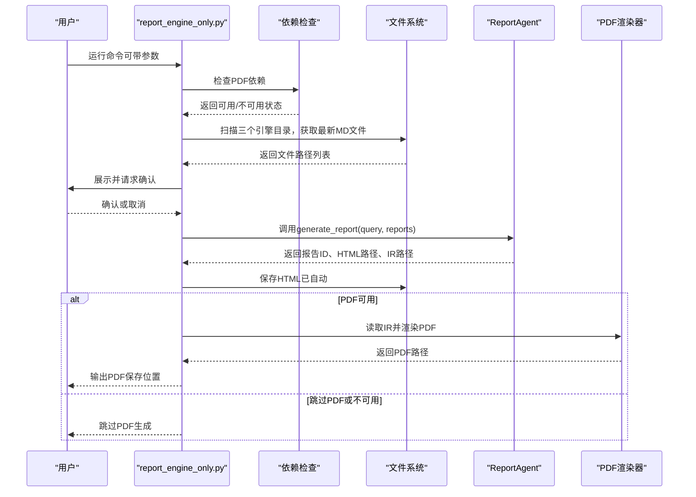

# 命令行报告生成工具

<cite>
**本文引用的文件**
- [report_engine_only.py](file://report_engine_only.py)
- [dependency_check.py](file://ReportEngine/utils/dependency_check.py)
- [agent.py](file://ReportEngine/agent.py)
- [pdf_renderer.py](file://ReportEngine/renderers/pdf_renderer.py)
- [README.md](file://README.md)
- [README-EN.md](file://README-EN.md)
- [README.md（PDF导出说明）](file://static/Partial README for PDF Exporting/README.md)
- [README-EN.md（PDF导出说明）](file://static/Partial README for PDF Exporting/README-EN.md)
- [export_pdf.py](file://export_pdf.py)
</cite>

## 目录
1. [简介](#简介)
2. [项目结构](#项目结构)
3. [核心组件](#核心组件)
4. [架构总览](#架构总览)
5. [详细组件分析](#详细组件分析)
6. [依赖关系分析](#依赖关系分析)
7. [性能考量](#性能考量)
8. [故障排查指南](#故障排查指南)
9. [结论](#结论)
10. [附录](#附录)

## 简介
本指南围绕命令行工具 report_engine_only.py，提供从安装、使用到集成的最佳实践。该工具的核心价值在于：无需启动完整Web服务，即可自动化整合 Insight/Media/Query 三个分析引擎的最新Markdown报告，调用 ReportEngine 的Agent接口生成综合HTML报告，并在系统依赖满足时同步生成PDF文件。其典型使用场景包括：
- 快速生成综合报告，用于审阅与归档
- 在自动化脚本或CI/CD流水线中稳定产出报告资产
- 与现有分析流程解耦，降低部署与运维成本

## 项目结构
report_engine_only.py 位于仓库根目录，负责：
- 检查PDF生成依赖（Pango等）
- 扫描三个引擎的报告目录，获取最新Markdown文件
- 与用户交互确认文件选择
- 调用 ReportAgent 生成综合报告（HTML）
- 在依赖满足时生成PDF

图表来源
- [report_engine_only.py](file://report_engine_only.py#L1-L485)
- [dependency_check.py](file://ReportEngine/utils/dependency_check.py#L250-L339)
- [agent.py](file://ReportEngine/agent.py#L173-L200)
- [pdf_renderer.py](file://ReportEngine/renderers/pdf_renderer.py#L1-L39)

章节来源
- [report_engine_only.py](file://report_engine_only.py#L1-L120)
- [README.md](file://README.md#L91-L122)

## 核心组件
- 命令行参数解析与主流程控制：解析 --query、--skip-pdf、--verbose，组织整体执行流程
- 依赖检查：检测Pango/WeasyPrint等PDF导出依赖，决定是否生成PDF
- 报告扫描与确认：自动扫描三个引擎目录，选择最新Markdown文件并提示用户确认
- 报告生成：调用 ReportAgent 接口，生成HTML与IR
- PDF生成：读取IR文件，使用PDF渲染器生成PDF并保存到 final_reports/pdf/

章节来源
- [report_engine_only.py](file://report_engine_only.py#L361-L398)
- [report_engine_only.py](file://report_engine_only.py#L414-L474)
- [dependency_check.py](file://ReportEngine/utils/dependency_check.py#L250-L339)
- [agent.py](file://ReportEngine/agent.py#L173-L200)
- [pdf_renderer.py](file://ReportEngine/renderers/pdf_renderer.py#L1-L39)

## 架构总览
下面的序列图展示了从命令行到报告生成与PDF导出的关键调用链：

图表来源
- [report_engine_only.py](file://report_engine_only.py#L414-L474)
- [dependency_check.py](file://ReportEngine/utils/dependency_check.py#L250-L339)
- [agent.py](file://ReportEngine/agent.py#L173-L200)
- [pdf_renderer.py](file://ReportEngine/renderers/pdf_renderer.py#L1-L39)

## 详细组件分析

### 命令行参数与使用方式
- --query：指定报告主题；未指定时从文件名中提取主题
- --skip-pdf：跳过PDF生成，即使系统依赖满足
- --verbose：开启详细日志，便于调试
- --help：显示帮助与示例

使用示例
- 基本用法：python report_engine_only.py
- 指定主题：python report_engine_only.py --query "土木工程行业分析"
- 跳过PDF：python report_engine_only.py --skip-pdf --verbose

章节来源
- [report_engine_only.py](file://report_engine_only.py#L361-L398)

### 依赖检查与PDF生成条件
- 依赖检查通过：生成HTML与PDF
- 依赖检查失败：仅生成HTML，给出平台特定安装指引
- Windows/macOS/Linux分别提供安装与环境变量配置说明
- Docker部署无需手动安装系统依赖

章节来源
- [dependency_check.py](file://ReportEngine/utils/dependency_check.py#L250-L339)
- [README.md（PDF导出说明）](file://static/Partial README for PDF Exporting/README.md#L1-L95)
- [README-EN.md（PDF导出说明）](file://static/Partial README for PDF Exporting/README-EN.md#L56-L87)

### 报告扫描与确认
- 自动扫描三个引擎目录：insight_engine_streamlit_reports、media_engine_streamlit_reports、query_engine_streamlit_reports
- 选择最新修改时间的Markdown文件
- 展示文件名、路径与修改时间，提示用户确认
- 用户取消则终止流程

章节来源
- [report_engine_only.py](file://report_engine_only.py#L78-L126)
- [report_engine_only.py](file://report_engine_only.py#L129-L171)

### 报告生成（HTML）
- 调用 ReportAgent.generate_report，传入query与reports
- 支持流式事件回调，实时反馈模板选择、章节生成等阶段
- 自动生成并保存HTML报告，返回报告ID、HTML与IR路径

章节来源
- [report_engine_only.py](file://report_engine_only.py#L223-L299)
- [agent.py](file://ReportEngine/agent.py#L173-L200)

### PDF生成（可选）
- 读取IR文件，调用PDF渲染器生成PDF
- 输出到 final_reports/pdf/ 目录，文件名包含主题与时间戳
- 依赖WeasyPrint与Pango；如不可用则跳过

章节来源
- [report_engine_only.py](file://report_engine_only.py#L305-L359)
- [pdf_renderer.py](file://ReportEngine/renderers/pdf_renderer.py#L1-L39)

### 文件命名与主题提取
- 文件名格式通常为 report_主题_时间戳.md
- 未匹配到主题时，使用默认主题“综合分析报告”

章节来源
- [report_engine_only.py](file://report_engine_only.py#L197-L221)

## 依赖关系分析
- report_engine_only.py 依赖 ReportEngine.utils.dependency_check 检查PDF依赖
- report_engine_only.py 依赖 ReportEngine.agent.ReportAgent 生成报告
- PDF生成依赖 ReportEngine.renderers.pdf_renderer
- 三个引擎报告目录用于提供输入数据

图表来源
- [report_engine_only.py](file://report_engine_only.py#L1-L485)
- [dependency_check.py](file://ReportEngine/utils/dependency_check.py#L250-L339)
- [agent.py](file://ReportEngine/agent.py#L173-L200)
- [pdf_renderer.py](file://ReportEngine/renderers/pdf_renderer.py#L1-L39)

章节来源
- [report_engine_only.py](file://report_engine_only.py#L1-L120)
- [agent.py](file://ReportEngine/agent.py#L173-L200)

## 性能考量
- 报告生成耗时取决于输入报告数量与内容规模，以及LLM推理与渲染过程
- 跳过PDF可显著缩短生成时间，适合快速预览
- 在CI/CD中建议缓存依赖与报告产物，减少重复安装与扫描时间
- 大量并发生成时，建议控制并发度并监控系统资源

[本节为通用建议，不直接分析具体文件]

## 故障排查指南
- 依赖检查失败（Windows/macOS/Linux）
  - 按平台说明安装系统依赖与环境变量
  - 重新打开终端，确保环境变量生效
  - 使用依赖检查脚本验证
- WeasyPrint未安装
  - 安装WeasyPrint后重试
- PDF生成失败
  - 确认IR文件存在且可读
  - 检查渲染器初始化与权限
- 报告未生成或为空
  - 确认三个引擎目录存在且包含最新MD文件
  - 使用 --verbose 查看详细日志
- CI/CD中路径问题
  - 使用绝对路径或在容器中预置依赖
  - 确保final_reports目录可写

章节来源
- [dependency_check.py](file://ReportEngine/utils/dependency_check.py#L250-L339)
- [README.md（PDF导出说明）](file://static/Partial README for PDF Exporting/README.md#L1-L95)
- [README-EN.md（PDF导出说明）](file://static/Partial README for PDF Exporting/README-EN.md#L56-L87)
- [report_engine_only.py](file://report_engine_only.py#L414-L474)

## 结论
report_engine_only.py 提供了无需Web服务的完整报告生成链路，结合依赖检查与可选PDF导出，能够高效地将多源分析结果整合为结构化报告。通过合理使用参数与遵循最佳实践，可在本地与CI/CD环境中稳定复现并规模化产出报告资产。

[本节为总结性内容，不直接分析具体文件]

## 附录

### 实际使用示例与最佳实践
- 本地快速预览
  - 直接运行：python report_engine_only.py
  - 指定主题：python report_engine_only.py --query "XXX"
- 跳过PDF以提速
  - python report_engine_only.py --skip-pdf
- 调试与排障
  - python report_engine_only.py --verbose
- CI/CD集成要点
  - 依赖安装：按平台说明安装系统依赖与WeasyPrint
  - 缓存：缓存Python依赖与final_reports目录
  - 并发：控制并发度，避免资源争用
  - 归档：将HTML/PDF产物上传为构建工件

章节来源
- [report_engine_only.py](file://report_engine_only.py#L361-L398)
- [README.md（PDF导出说明）](file://static/Partial README for PDF Exporting/README.md#L1-L95)
- [README-EN.md（PDF导出说明）](file://static/Partial README for PDF Exporting/README-EN.md#L56-L87)