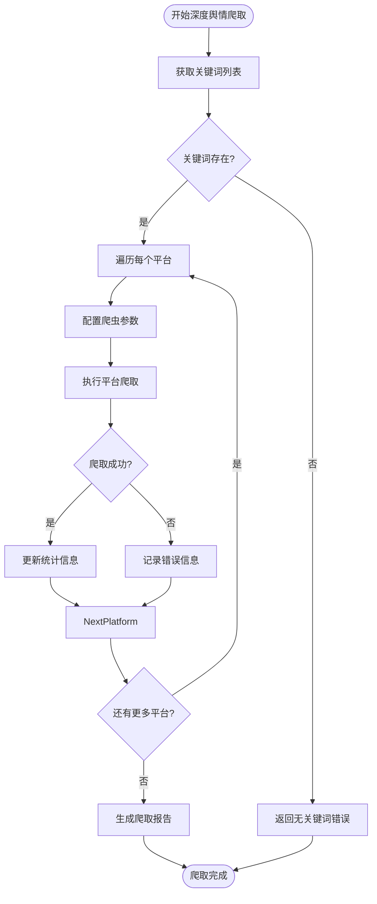

# 爬虫系统独立使用

<cite>
**本文档引用的文件**
- [main.py](file://MindSpider/main.py)
- [BroadTopicExtraction/main.py](file://MindSpider/BroadTopicExtraction/main.py)
- [DeepSentimentCrawling/main.py](file://MindSpider/DeepSentimentCrawling/main.py)
- [DeepSentimentCrawling/platform_crawler.py](file://MindSpider/DeepSentimentCrawling/platform_crawler.py)
- [config.py](file://MindSpider/config.py)
- [DeepSentimentCrawling/MediaCrawler/config/base_config.py](file://MindSpider/DeepSentimentCrawling/MediaCrawler/config/base_config.py)
- [DeepSentimentCrawling/MediaCrawler/config/db_config.py](file://MindSpider/DeepSentimentCrawling/MediaCrawler/config/db_config.py)
- [DeepSentimentCrawling/MediaCrawler/docs/代理使用.md](file://MindSpider/DeepSentimentCrawling/MediaCrawler/docs/代理使用.md)
- [DeepSentimentCrawling/MediaCrawler/docs/快代理使用文档.md](file://MindSpider/DeepSentimentCrawling/MediaCrawler/docs/快代理使用文档.md)
</cite>

## 目录
1. [系统初始化](#系统初始化)
2. [广度话题提取功能](#广度话题提取功能)
3. [深度舆情爬取功能](#深度舆情爬取功能)
4. [配置文件与代理设置](#配置文件与代理设置)
5. [常见问题解决方案](#常见问题解决方案)

## 系统初始化

在使用MindSpider爬虫系统之前，需要进行系统初始化设置。通过执行`python main.py --setup`命令，系统将完成数据库和配置文件的创建与初始化。

该命令会执行以下操作：
1. 检查基础配置，包括数据库连接信息和API密钥
2. 验证数据库连接是否正常
3. 检查必要的数据库表是否存在
4. 如果缺少必要的数据库表，则运行数据库初始化脚本创建表结构
5. 检查Python依赖环境是否完整

初始化过程中，系统会检查`config.py`文件中的配置项，确保包含`DB_HOST`、`DB_PORT`、`DB_USER`、`DB_PASSWORD`、`DB_NAME`等必要配置。如果配置缺失，系统会提示用户检查`.env`文件中的环境变量配置。

**图示来源**
- [main.py](file://MindSpider/main.py#L335-L358)

**本节来源**
- [main.py](file://MindSpider/main.py#L335-L358)

## 广度话题提取功能

广度话题提取功能通过`python main.py --broad-topic`命令启动，用于从各大平台获取当日热点话题。该功能由BroadTopicExtraction模块实现，其工作流程分为三个主要步骤。

首先，系统收集来自多个新闻源的热点新闻。支持的新闻源包括微博、知乎、百度贴吧等主流社交平台。系统会调用`NewsCollector`类的`collect_and_save_news`方法，从各平台API获取最新的热点内容，并将原始数据保存到数据库中。

其次，系统使用`TopicExtractor`类的`extract_keywords_and_summary`方法对收集到的新闻内容进行关键词提取和总结生成。该过程利用自然语言处理技术分析新闻文本，识别出最具代表性的关键词，并生成对当日热点的整体概述。

最后，系统将提取的关键词和总结保存到数据库中，供后续的深度舆情爬取使用。`DatabaseManager`类的`save_daily_topics`方法负责将分析结果持久化存储。

**图示来源**
- [main.py](file://MindSpider/main.py#L196-L223)
- [BroadTopicExtraction/main.py](file://MindSpider/BroadTopicExtraction/main.py#L59-L145)

**本节来源**
- [BroadTopicExtraction/main.py](file://MindSpider/BroadTopicExtraction/main.py#L59-L145)

## 深度舆情爬取功能

深度舆情爬取功能是MindSpider系统的核心功能之一，通过`python main.py --deep-sentiment --keywords 关键词`命令启动，由DeepSentimentCrawling模块实现。该功能支持对指定关键词在多个社交平台进行深度内容抓取。

系统首先通过`KeywordManager`获取需要爬取的关键词列表。然后，`PlatformCrawler`类负责协调各平台的爬取任务。对于每个支持的平台（如微博、小红书、知乎等），系统会配置相应的爬取参数，包括关键词、爬取类型、最大爬取数量等。

在执行爬取时，系统会调用MediaCrawler子系统的`main.py`脚本，传递必要的命令行参数。爬取过程支持多种登录方式，包括二维码登录、手机号登录和Cookie登录，以适应不同平台的认证机制。

爬取完成后，系统会统计爬取结果，包括成功爬取的内容数量、评论数量以及任何错误信息。这些数据会被汇总并返回给主程序，同时保存到数据库中供后续分析使用。

**图示来源**
- [main.py](file://MindSpider/main.py#L231-L277)
- [DeepSentimentCrawling/main.py](file://MindSpider/DeepSentimentCrawling/main.py#L30-L97)
- [DeepSentimentCrawling/platform_crawler.py](file://MindSpider/DeepSentimentCrawling/platform_crawler.py#L203-L294)

**本节来源**
- [DeepSentimentCrawling/main.py](file://MindSpider/DeepSentimentCrawling/main.py#L30-L97)
- [DeepSentimentCrawling/platform_crawler.py](file://MindSpider/DeepSentimentCrawling/platform_crawler.py#L203-L294)

## 配置文件与代理设置

MindSpider系统通过多个配置文件来管理其行为和设置。主要的配置文件包括`config.py`、`base_config.py`和`db_config.py`。

`config.py`文件位于项目根目录下，存储了数据库连接信息和API密钥等全局配置。该文件使用Pydantic Settings进行配置管理，支持从环境变量和`.env`文件中加载配置。关键配置项包括数据库类型（`DB_DIALECT`）、主机名（`DB_HOST`）、端口（`DB_PORT`）、用户名（`DB_USER`）、密码（`DB_PASSWORD`）和数据库名称（`DB_NAME`）。

`base_config.py`文件位于`DeepSentimentCrawling/MediaCrawler/config/`目录下，定义了爬虫的基础配置。重要配置项包括：
- `PLATFORM`: 指定爬取的平台，支持xhs（小红书）、dy（抖音）、ks（快手）、bili（B站）、wb（微博）、tieba（百度贴吧）、zhihu（知乎）
- `KEYWORDS`: 关键词搜索配置，以英文逗号分隔
- `LOGIN_TYPE`: 登录方式，支持qrcode（二维码）、phone（手机号）、cookie
- `ENABLE_IP_PROXY`: 是否启用IP代理
- `IP_PROXY_PROVIDER_NAME`: 代理提供商名称，支持kuaidaili（快代理）、wandouhttp（豌豆HTTP）

系统支持通过命令行参数覆盖配置文件中的设置，提供了灵活的控制方式。例如，可以通过`--platforms`参数指定要爬取的平台，通过`--max-notes`参数控制每个关键词的最大爬取数量。

**图示来源**
- [config.py](file://MindSpider/config.py#L16-L35)
- [DeepSentimentCrawling/MediaCrawler/config/base_config.py](file://MindSpider/DeepSentimentCrawling/MediaCrawler/config/base_config.py#L12-L117)

**本节来源**
- [config.py](file://MindSpider/config.py#L16-L35)
- [DeepSentimentCrawling/MediaCrawler/config/base_config.py](file://MindSpider/DeepSentimentCrawling/MediaCrawler/config/base_config.py#L12-L117)

## 常见问题解决方案

在使用MindSpider爬虫系统时，可能会遇到一些常见问题。以下是针对这些问题的解决方案：

**登录失败问题**：当出现登录失败时，首先检查`base_config.py`文件中的`LOGIN_TYPE`设置是否正确。建议首次使用时采用二维码登录方式。如果二维码登录不通过，可以尝试打开浏览器手动完成滑动验证码。对于抖音等平台，如果扫码登录后出现手机号验证，需要手动完成验证后再进行爬取。

**反爬虫应对策略**：为避免被目标平台识别为爬虫，系统提供了多种反检测机制。建议启用CDP模式（`ENABLE_CDP_MODE = True`），使用用户现有的Chrome/Edge浏览器进行爬取，这种方式使用真实的浏览器环境，包括用户的扩展、Cookie和设置，能大大降低被检测的风险。同时，合理设置`CRAWLER_MAX_SLEEP_SEC`参数，控制请求频率，避免对目标平台造成过大负担。

**数据存储路径问题**：系统默认将数据存储在配置的数据库中。通过`SAVE_DATA_OPTION`参数可以指定数据保存方式，支持csv、db、json、sqlite、postgresql等格式。建议使用数据库存储，因为数据库具有排重功能，能有效避免重复数据。如果使用PostgreSQL数据库，需要确保`DB_DIALECT`设置为"postgresql"，并正确配置PostgreSQL相关的连接参数。

**代理设置问题**：当需要使用代理IP时，首先在`base_config.py`中设置`ENABLE_IP_PROXY = True`，并指定`IP_PROXY_PROVIDER_NAME`为"kuaidaili"或"wandouhttp"。然后，根据所选代理提供商的文档，配置相应的认证信息。例如，使用快代理时，需要在环境变量中设置`kdl_secret_id`、`kdl_signature`、`kdl_user_name`和`kdl_user_pwd`等参数。

**图示来源**
- [DeepSentimentCrawling/MediaCrawler/config/base_config.py](file://MindSpider/DeepSentimentCrawling/MediaCrawler/config/base_config.py#L37-L61)
- [DeepSentimentCrawling/MediaCrawler/docs/代理使用.md](file://MindSpider/DeepSentimentCrawling/MediaCrawler/docs/代理使用.md#L1-L15)
- [DeepSentimentCrawling/MediaCrawler/docs/快代理使用文档.md](file://MindSpider/DeepSentimentCrawling/MediaCrawler/docs/快代理使用文档.md#L1-L42)

**本节来源**
- [DeepSentimentCrawling/MediaCrawler/config/base_config.py](file://MindSpider/DeepSentimentCrawling/MediaCrawler/config/base_config.py#L37-L61)
- [DeepSentimentCrawling/MediaCrawler/docs/代理使用.md](file://MindSpider/DeepSentimentCrawling/MediaCrawler/docs/代理使用.md#L1-L15)
- [DeepSentimentCrawling/MediaCrawler/docs/快代理使用文档.md](file://MindSpider/DeepSentimentCrawling/MediaCrawler/docs/快代理使用文档.md#L1-L42)