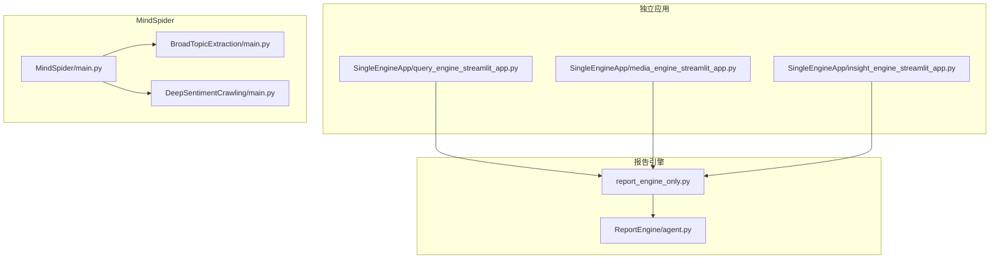
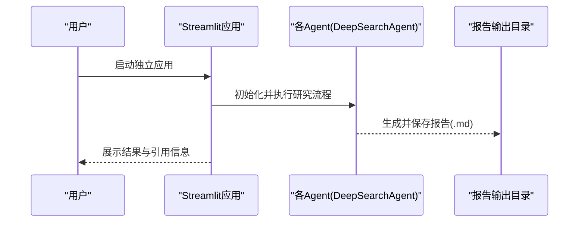
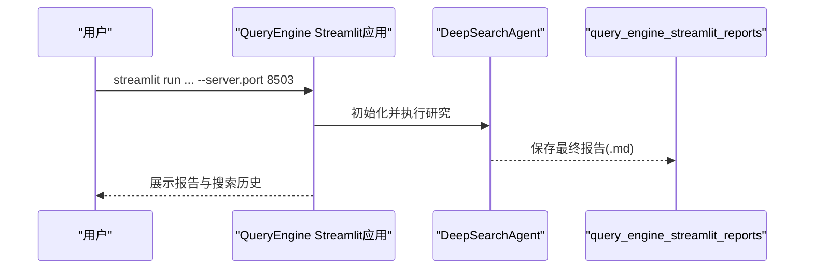
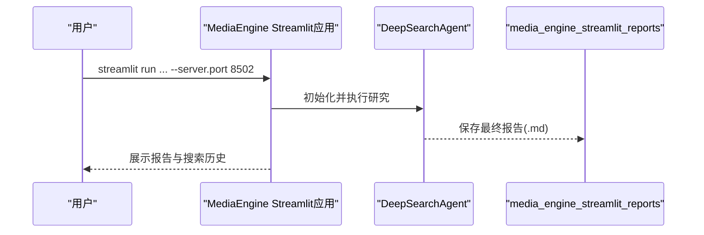
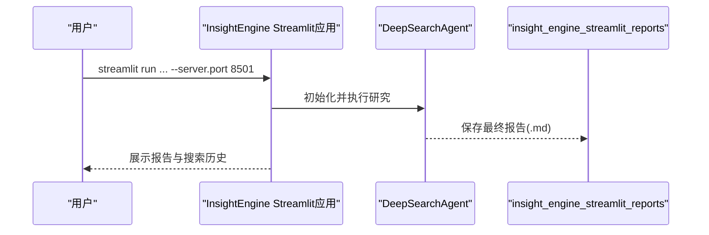
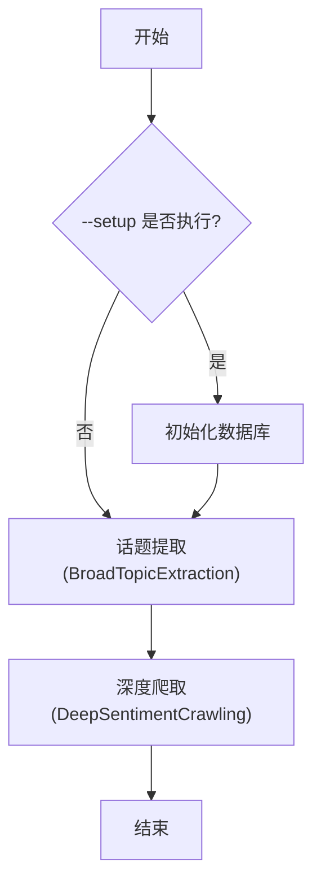
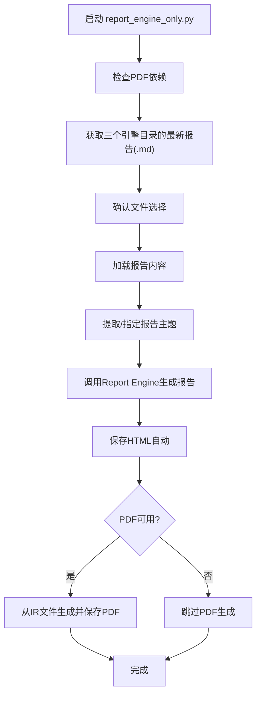

# 独立使用

<cite>
**本文引用的文件**
- [README.md](file://README.md)
- [MindSpider/main.py](file://MindSpider/main.py)
- [MindSpider/README.md](file://MindSpider/README.md)
- [SingleEngineApp/query_engine_streamlit_app.py](file://SingleEngineApp/query_engine_streamlit_app.py)
- [SingleEngineApp/media_engine_streamlit_app.py](file://SingleEngineApp/media_engine_streamlit_app.py)
- [SingleEngineApp/insight_engine_streamlit_app.py](file://SingleEngineApp/insight_engine_streamlit_app.py)
- [report_engine_only.py](file://report_engine_only.py)
</cite>

## 目录
1. [简介](#简介)
2. [项目结构](#项目结构)
3. [核心组件](#核心组件)
4. [架构总览](#架构总览)
5. [详细组件分析](#详细组件分析)
6. [依赖分析](#依赖分析)
7. [性能考虑](#性能考虑)
8. [故障排查指南](#故障排查指南)
9. [结论](#结论)
10. [附录](#附录)

## 简介
本指南聚焦于如何独立使用BettaFish的三大核心组件：QueryEngine、MediaEngine、InsightEngine的Streamlit应用，MindSpider爬虫系统的独立使用，以及命令行报告生成工具report_engine_only.py的使用方法。读者将学会：
- 如何独立启动某个Agent的Streamlit应用，便于调试与测试
- 如何独立运行MindSpider的“话题提取”和“深度舆情爬取”模块
- 如何使用report_engine_only.py从各引擎输出目录自动获取最新报告并生成综合HTML/PDF报告，以及--skip-pdf与--verbose等参数的作用

## 项目结构
围绕独立使用的目标，重点涉及以下目录与文件：
- SingleEngineApp：包含QueryEngine、MediaEngine、InsightEngine各自的Streamlit独立应用入口
- MindSpider：包含话题提取与深度爬取两大模块，以及数据库初始化与配置
- ReportEngine：报告生成引擎（report_engine_only.py直接调用其核心能力）

图表来源
- [SingleEngineApp/query_engine_streamlit_app.py](file://SingleEngineApp/query_engine_streamlit_app.py#L1-L228)
- [SingleEngineApp/media_engine_streamlit_app.py](file://SingleEngineApp/media_engine_streamlit_app.py#L1-L246)
- [SingleEngineApp/insight_engine_streamlit_app.py](file://SingleEngineApp/insight_engine_streamlit_app.py#L1-L237)
- [MindSpider/main.py](file://MindSpider/main.py#L360-L447)
- [report_engine_only.py](file://report_engine_only.py#L1-L485)

章节来源
- [README.md](file://README.md#L450-L513)

## 核心组件
- QueryEngine Streamlit应用：独立运行Query Agent，便于调试与测试
- MediaEngine Streamlit应用：独立运行Media Agent，便于调试与测试
- InsightEngine Streamlit应用：独立运行Insight Agent，便于调试与测试
- MindSpider：独立运行“话题提取”和“深度舆情爬取”模块
- Report Engine 命令行工具：从各引擎输出目录自动获取最新报告并生成综合HTML/PDF

章节来源
- [README.md](file://README.md#L450-L513)
- [MindSpider/README.md](file://MindSpider/README.md#L286-L312)

## 架构总览
独立使用时，各组件的调用关系如下：

图表来源
- [SingleEngineApp/query_engine_streamlit_app.py](file://SingleEngineApp/query_engine_streamlit_app.py#L120-L175)
- [SingleEngineApp/media_engine_streamlit_app.py](file://SingleEngineApp/media_engine_streamlit_app.py#L120-L179)
- [SingleEngineApp/insight_engine_streamlit_app.py](file://SingleEngineApp/insight_engine_streamlit_app.py#L120-L179)

## 详细组件分析

### QueryEngine独立应用
- 启动方式：使用Streamlit独立运行QueryEngine应用，便于调试与测试
- 端口：可通过--server.port指定端口
- 关键行为：自动读取配置，初始化Agent，生成报告结构，逐段处理与反思，最终保存报告并展示结果

图表来源
- [SingleEngineApp/query_engine_streamlit_app.py](file://SingleEngineApp/query_engine_streamlit_app.py#L120-L175)

章节来源
- [README.md](file://README.md#L450-L461)
- [SingleEngineApp/query_engine_streamlit_app.py](file://SingleEngineApp/query_engine_streamlit_app.py#L1-L228)

### MediaEngine独立应用
- 启动方式：使用Streamlit独立运行MediaEngine应用，便于调试与测试
- 端口：可通过--server.port指定端口
- 关键行为：自动读取配置，初始化Agent，生成报告结构，逐段处理与反思，最终保存报告并展示结果

图表来源
- [SingleEngineApp/media_engine_streamlit_app.py](file://SingleEngineApp/media_engine_streamlit_app.py#L120-L179)

章节来源
- [README.md](file://README.md#L450-L461)
- [SingleEngineApp/media_engine_streamlit_app.py](file://SingleEngineApp/media_engine_streamlit_app.py#L1-L246)

### InsightEngine独立应用
- 启动方式：使用Streamlit独立运行InsightEngine应用，便于调试与测试
- 端口：可通过--server.port指定端口
- 关键行为：自动读取配置（含数据库），初始化Agent，生成报告结构，逐段处理与反思，最终保存报告并展示结果

图表来源
- [SingleEngineApp/insight_engine_streamlit_app.py](file://SingleEngineApp/insight_engine_streamlit_app.py#L120-L179)

章节来源
- [README.md](file://README.md#L450-L461)
- [SingleEngineApp/insight_engine_streamlit_app.py](file://SingleEngineApp/insight_engine_streamlit_app.py#L1-L237)

### MindSpider独立使用
- 项目初始化：检查配置、依赖、数据库连接与表，必要时初始化数据库
- 话题提取：从多平台采集热点新闻，AI提取关键词与摘要，保存到数据库
- 深度舆情爬取：基于关键词在多平台爬取内容，解析并持久化
- 常用命令：
  - 初始化：python main.py --setup
  - 仅运行话题提取：python main.py --broad-topic
  - 仅运行深度爬取：python main.py --deep-sentiment --platforms xhs dy wb
  - 运行完整流程：python main.py --complete --date 2024-01-20

图表来源
- [MindSpider/main.py](file://MindSpider/main.py#L360-L447)
- [MindSpider/README.md](file://MindSpider/README.md#L286-L312)

章节来源
- [MindSpider/main.py](file://MindSpider/main.py#L1-L447)
- [MindSpider/README.md](file://MindSpider/README.md#L286-L312)

### 命令行报告生成工具 report_engine_only.py
- 自动检查PDF依赖（若缺失则仅生成HTML）
- 自动从三个引擎输出目录获取最新报告文件（insight/media/query）
- 直接调用Report Engine生成综合报告（跳过文件增加审核）
- 自动保存HTML与PDF（若有依赖）到final_reports/
- 关键参数：
  - --query：指定报告主题（默认从文件名提取）
  - --skip-pdf：跳过PDF生成（即使系统支持）
  - --verbose：显示详细日志
  - --help：显示帮助信息

图表来源
- [report_engine_only.py](file://report_engine_only.py#L1-L485)

章节来源
- [README.md](file://README.md#L493-L513)
- [report_engine_only.py](file://report_engine_only.py#L1-L485)

## 依赖分析
- 独立应用依赖：Streamlit、各Agent的配置与工具集
- MindSpider依赖：数据库连接、Playwright浏览器驱动、各平台登录状态
- 报告生成工具依赖：Report Engine核心、PDF渲染依赖（可选）

章节来源
- [README.md](file://README.md#L333-L449)
- [MindSpider/README.md](file://MindSpider/README.md#L198-L258)
- [report_engine_only.py](file://report_engine_only.py#L1-L120)

## 性能考虑
- 独立应用：Streamlit界面适合交互调试，建议在本地开发环境运行，避免高并发
- MindSpider：爬取过程涉及多平台登录与并发，建议先用测试模式验证，合理设置关键词与内容数量
- 报告生成：PDF生成需要额外系统依赖，建议在具备依赖的环境中运行

## 故障排查指南
- 独立应用
  - 端口占用：若Streamlit应用异常退出仍占用端口，需查找并释放端口
  - 配置缺失：检查各Agent的API密钥与基础配置
- MindSpider
  - 数据库连接失败：使用--status检查配置与连接
  - 平台登录失败：关闭无头模式，手动处理验证或重新登录
  - playwright安装失败：重新安装并执行playwright install
- 报告生成
  - PDF依赖缺失：根据提示安装所需系统依赖
  - 未找到引擎报告：确保至少一个引擎输出目录存在.md文件

章节来源
- [README.md](file://README.md#L444-L449)
- [MindSpider/README.md](file://MindSpider/README.md#L434-L459)
- [report_engine_only.py](file://report_engine_only.py#L414-L474)

## 结论
通过本指南，您可以：
- 独立启动任一Agent的Streamlit应用，快速调试与验证
- 独立运行MindSpider的“话题提取”和“深度舆情爬取”模块
- 使用report_engine_only.py从各引擎输出目录自动获取最新报告并生成综合HTML/PDF报告，灵活控制PDF生成与日志级别

## 附录
- 常用命令速查
  - QueryEngine独立应用：streamlit run SingleEngineApp/query_engine_streamlit_app.py --server.port 8503
  - MediaEngine独立应用：streamlit run SingleEngineApp/media_engine_streamlit_app.py --server.port 8502
  - InsightEngine独立应用：streamlit run SingleEngineApp/insight_engine_streamlit_app.py --server.port 8501
  - MindSpider初始化：python MindSpider/main.py --setup
  - MindSpider话题提取：python MindSpider/main.py --broad-topic
  - MindSpider深度爬取：python MindSpider/main.py --deep-sentiment --platforms xhs dy wb
  - MindSpider完整流程：python MindSpider/main.py --complete --date 2024-01-20
  - 报告生成（基本）：python report_engine_only.py
  - 报告生成（指定主题）：python report_engine_only.py --query "主题"
  - 报告生成（跳过PDF）：python report_engine_only.py --skip-pdf
  - 报告生成（详细日志）：python report_engine_only.py --verbose

章节来源
- [README.md](file://README.md#L450-L513)
- [MindSpider/README.md](file://MindSpider/README.md#L286-L312)
- [report_engine_only.py](file://report_engine_only.py#L361-L398)