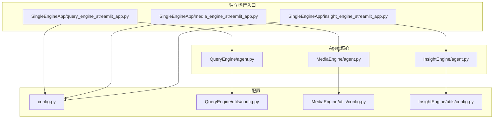
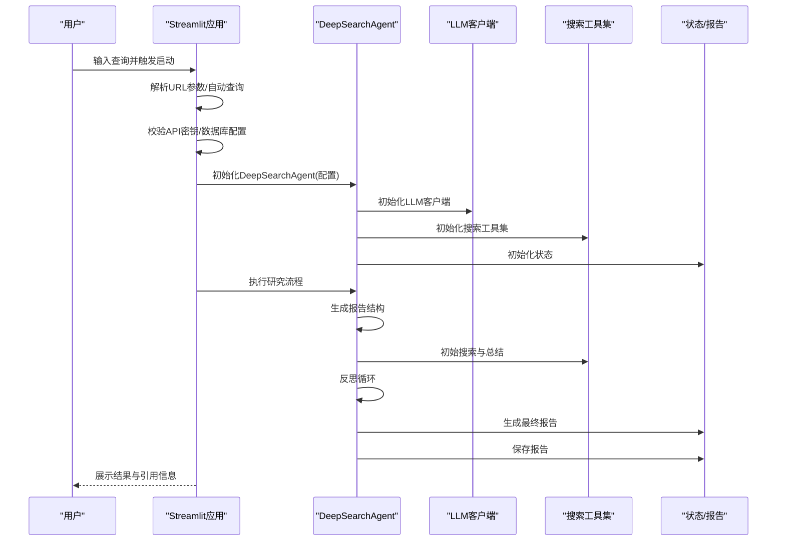
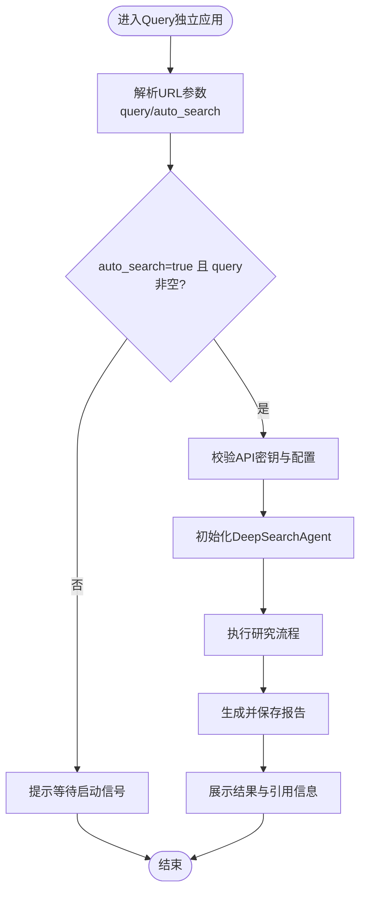
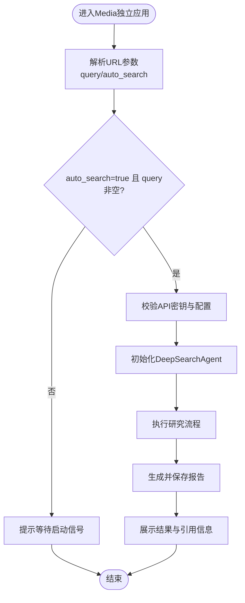
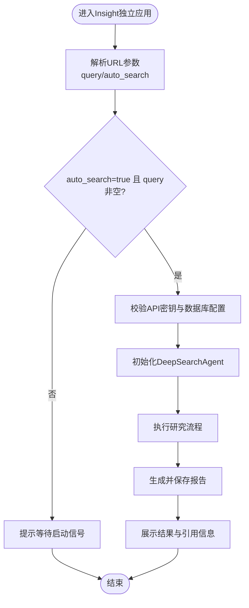
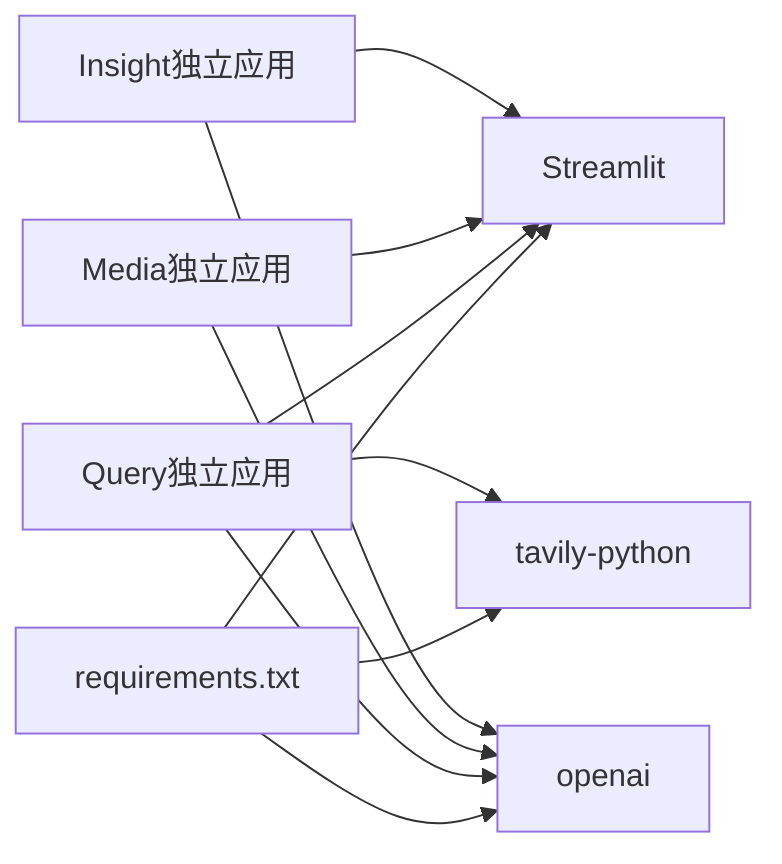

# 独立启动Agent

<cite>
**本文引用的文件**
- [README.md](file://README.md)
- [requirements.txt](file://requirements.txt)
- [config.py](file://config.py)
- [SingleEngineApp/query_engine_streamlit_app.py](file://SingleEngineApp/query_engine_streamlit_app.py)
- [SingleEngineApp/media_engine_streamlit_app.py](file://SingleEngineApp/media_engine_streamlit_app.py)
- [SingleEngineApp/insight_engine_streamlit_app.py](file://SingleEngineApp/insight_engine_streamlit_app.py)
- [QueryEngine/agent.py](file://QueryEngine/agent.py)
- [MediaEngine/agent.py](file://MediaEngine/agent.py)
- [InsightEngine/agent.py](file://InsightEngine/agent.py)
- [QueryEngine/utils/config.py](file://QueryEngine/utils/config.py)
- [MediaEngine/utils/config.py](file://MediaEngine/utils/config.py)
- [InsightEngine/utils/config.py](file://InsightEngine/utils/config.py)
</cite>

## 目录
1. [简介](#简介)
2. [项目结构](#项目结构)
3. [核心组件](#核心组件)
4. [架构总览](#架构总览)
5. [详细组件分析](#详细组件分析)
6. [依赖关系分析](#依赖关系分析)
7. [性能考虑](#性能考虑)
8. [故障排查指南](#故障排查指南)
9. [结论](#结论)

## 简介
本指南聚焦于如何在本地独立运行BettaFish中的三个分析Agent（QueryEngine、MediaEngine、InsightEngine）。每个Agent均提供独立的Streamlit应用入口，位于SingleEngineApp目录下，分别对应Query、Media、Insight三个应用。通过为每个应用指定不同的端口，可以在同一台机器上并行运行多个Agent，便于模块调试、功能测试与性能评估。

## 项目结构
- SingleEngineApp目录包含三个Streamlit应用入口，分别对应三个Agent的独立运行模式。
- 每个Agent的主逻辑位于各自目录下的agent.py文件，负责组织搜索、反思与报告生成流程。
- 配置管理采用pydantic-settings风格，支持从环境变量与.env文件加载，便于在独立运行时快速注入API密钥与模型参数。

图表来源
- [SingleEngineApp/query_engine_streamlit_app.py](file://SingleEngineApp/query_engine_streamlit_app.py#L1-L228)
- [SingleEngineApp/media_engine_streamlit_app.py](file://SingleEngineApp/media_engine_streamlit_app.py#L1-L246)
- [SingleEngineApp/insight_engine_streamlit_app.py](file://SingleEngineApp/insight_engine_streamlit_app.py#L1-L237)
- [QueryEngine/agent.py](file://QueryEngine/agent.py#L1-L474)
- [MediaEngine/agent.py](file://MediaEngine/agent.py#L1-L452)
- [InsightEngine/agent.py](file://InsightEngine/agent.py#L1-L784)
- [config.py](file://config.py#L1-L126)
- [QueryEngine/utils/config.py](file://QueryEngine/utils/config.py#L1-L80)
- [MediaEngine/utils/config.py](file://MediaEngine/utils/config.py#L1-L84)
- [InsightEngine/utils/config.py](file://InsightEngine/utils/config.py#L1-L45)

章节来源
- [README.md](file://README.md#L450-L461)
- [requirements.txt](file://requirements.txt#L1-L87)

## 核心组件
- QueryEngine独立应用：面向国内外新闻广度搜索，提供Web界面，支持自动查询参数与端口配置，验证API密钥后执行研究流程并生成报告。
- MediaEngine独立应用：面向多模态内容分析，支持多模态搜索工具集，提供自动查询参数与端口配置，验证API密钥后执行研究流程并生成报告。
- InsightEngine独立应用：面向私有数据库挖掘，支持关键词优化与情感分析，提供自动查询参数与端口配置，验证API密钥与数据库配置后执行研究流程并生成报告。

章节来源
- [SingleEngineApp/query_engine_streamlit_app.py](file://SingleEngineApp/query_engine_streamlit_app.py#L1-L228)
- [SingleEngineApp/media_engine_streamlit_app.py](file://SingleEngineApp/media_engine_streamlit_app.py#L1-L246)
- [SingleEngineApp/insight_engine_streamlit_app.py](file://SingleEngineApp/insight_engine_streamlit_app.py#L1-L237)

## 架构总览
三个独立应用均通过Streamlit提供Web界面，内部调用对应Agent的主类（DeepSearchAgent），Agent内部协调LLM客户端、搜索工具集、处理节点与状态管理，最终生成报告并保存到指定输出目录。

图表来源
- [SingleEngineApp/query_engine_streamlit_app.py](file://SingleEngineApp/query_engine_streamlit_app.py#L120-L175)
- [SingleEngineApp/media_engine_streamlit_app.py](file://SingleEngineApp/media_engine_streamlit_app.py#L120-L180)
- [SingleEngineApp/insight_engine_streamlit_app.py](file://SingleEngineApp/insight_engine_streamlit_app.py#L120-L180)
- [QueryEngine/agent.py](file://QueryEngine/agent.py#L141-L175)
- [MediaEngine/agent.py](file://MediaEngine/agent.py#L133-L167)
- [InsightEngine/agent.py](file://InsightEngine/agent.py#L372-L404)

## 详细组件分析

### QueryEngine独立应用
- 启动方式：通过Streamlit运行独立应用，并使用--server.port参数指定端口，便于并行运行。
- 输入参数与自动查询：支持通过URL参数接收查询与自动搜索标志，若满足条件则自动执行研究。
- 配置校验：强制使用DeepSeek模型，需设置QUERY_ENGINE_API_KEY与TAVILY_API_KEY。
- 界面功能：展示当前查询、进度条、结果标签页（研究小结、引用信息），并在引用信息中列出段落详情与搜索历史。
- 输出：生成并保存Markdown报告到独立输出目录。

图表来源
- [SingleEngineApp/query_engine_streamlit_app.py](file://SingleEngineApp/query_engine_streamlit_app.py#L47-L123)
- [SingleEngineApp/query_engine_streamlit_app.py](file://SingleEngineApp/query_engine_streamlit_app.py#L124-L175)
- [SingleEngineApp/query_engine_streamlit_app.py](file://SingleEngineApp/query_engine_streamlit_app.py#L187-L226)

章节来源
- [README.md](file://README.md#L450-L461)
- [SingleEngineApp/query_engine_streamlit_app.py](file://SingleEngineApp/query_engine_streamlit_app.py#L1-L228)
- [QueryEngine/agent.py](file://QueryEngine/agent.py#L141-L175)

### MediaEngine独立应用
- 启动方式：通过Streamlit运行独立应用，并使用--server.port参数指定端口，便于并行运行。
- 输入参数与自动查询：支持通过URL参数接收查询与自动搜索标志，若满足条件则自动执行研究。
- 配置校验：强制使用Gemini模型，需设置MEDIA_ENGINE_API_KEY与BOCHA_WEB_SEARCH_API_KEY。
- 界面功能：展示当前查询、进度条、结果标签页（研究小结、引用信息），并在引用信息中列出段落详情与搜索历史。
- 输出：生成并保存Markdown报告到独立输出目录。

图表来源
- [SingleEngineApp/media_engine_streamlit_app.py](file://SingleEngineApp/media_engine_streamlit_app.py#L48-L126)
- [SingleEngineApp/media_engine_streamlit_app.py](file://SingleEngineApp/media_engine_streamlit_app.py#L128-L180)
- [SingleEngineApp/media_engine_streamlit_app.py](file://SingleEngineApp/media_engine_streamlit_app.py#L193-L243)

章节来源
- [README.md](file://README.md#L450-L461)
- [SingleEngineApp/media_engine_streamlit_app.py](file://SingleEngineApp/media_engine_streamlit_app.py#L1-L246)
- [MediaEngine/agent.py](file://MediaEngine/agent.py#L133-L167)

### InsightEngine独立应用
- 启动方式：通过Streamlit运行独立应用，并使用--server.port参数指定端口，便于并行运行。
- 输入参数与自动查询：支持通过URL参数接收查询与自动搜索标志，若满足条件则自动执行研究。
- 配置校验：需设置INSIGHT_ENGINE_API_KEY，并加载数据库连接配置（DB_HOST/USER/PASSWORD/NAME/PORT/CHARSET/DIALECT）。
- 界面功能：展示当前查询、进度条、结果标签页（研究小结、引用信息），并在引用信息中列出段落详情与搜索历史。
- 输出：生成并保存Markdown报告到独立输出目录。

图表来源
- [SingleEngineApp/insight_engine_streamlit_app.py](file://SingleEngineApp/insight_engine_streamlit_app.py#L47-L131)
- [SingleEngineApp/insight_engine_streamlit_app.py](file://SingleEngineApp/insight_engine_streamlit_app.py#L133-L183)
- [SingleEngineApp/insight_engine_streamlit_app.py](file://SingleEngineApp/insight_engine_streamlit_app.py#L196-L235)

章节来源
- [README.md](file://README.md#L450-L461)
- [SingleEngineApp/insight_engine_streamlit_app.py](file://SingleEngineApp/insight_engine_streamlit_app.py#L1-L237)
- [InsightEngine/agent.py](file://InsightEngine/agent.py#L372-L404)

## 依赖关系分析
- Streamlit依赖：三个独立应用均依赖Streamlit提供Web界面。
- LLM与搜索API：QueryEngine依赖Tavily搜索；MediaEngine依赖Bocha多模态搜索；InsightEngine依赖内部数据库查询与情感分析工具。
- 配置加载：各Agent的配置模块支持从.env文件与环境变量加载，独立运行时可通过设置相应环境变量快速生效。

图表来源
- [requirements.txt](file://requirements.txt#L1-L87)
- [SingleEngineApp/query_engine_streamlit_app.py](file://SingleEngineApp/query_engine_streamlit_app.py#L1-L33)
- [SingleEngineApp/media_engine_streamlit_app.py](file://SingleEngineApp/media_engine_streamlit_app.py#L1-L33)
- [SingleEngineApp/insight_engine_streamlit_app.py](file://SingleEngineApp/insight_engine_streamlit_app.py#L1-L33)

章节来源
- [requirements.txt](file://requirements.txt#L1-L87)

## 性能考虑
- 端口并行：通过--server.port参数为每个应用分配不同端口，避免端口冲突，提升并行测试效率。
- 输出目录：各应用将报告保存到独立输出目录，便于隔离与归档。
- 反思轮次与结果数量：可通过配置文件调整MAX_REFLECTIONS与搜索结果数量，平衡性能与质量。
- 搜索超时与内容长度：合理设置SEARCH_TIMEOUT与MAX_CONTENT_LENGTH，避免长时间阻塞与LLM上下文溢出。

章节来源
- [README.md](file://README.md#L450-L461)
- [QueryEngine/utils/config.py](file://QueryEngine/utils/config.py#L37-L47)
- [MediaEngine/utils/config.py](file://MediaEngine/utils/config.py#L42-L53)
- [InsightEngine/utils/config.py](file://InsightEngine/utils/config.py#L27-L38)

## 故障排查指南
- 端口占用：若Streamlit应用异常退出导致端口占用，需手动查找并释放对应端口。
- API密钥缺失：独立应用会在启动前校验API密钥，若缺失会提示错误并终止执行。
- 数据库连接：InsightEngine独立应用需要正确的数据库连接配置，若配置错误会导致初始化失败。
- 错误展示：应用在执行过程中出现异常会生成错误信息并提供GitHub Issue链接，便于定位问题。

章节来源
- [README.md](file://README.md#L444-L449)
- [SingleEngineApp/query_engine_streamlit_app.py](file://SingleEngineApp/query_engine_streamlit_app.py#L92-L104)
- [SingleEngineApp/media_engine_streamlit_app.py](file://SingleEngineApp/media_engine_streamlit_app.py#L92-L108)
- [SingleEngineApp/insight_engine_streamlit_app.py](file://SingleEngineApp/insight_engine_streamlit_app.py#L92-L111)

## 结论
通过SingleEngineApp目录提供的三个独立Streamlit应用，开发者可以快速、灵活地在本地并行运行QueryEngine、MediaEngine与InsightEngine，分别进行模块调试、功能测试与性能评估。配合.env配置与端口参数，能够在同一台机器上高效隔离各Agent的运行环境，提升开发与优化效率。