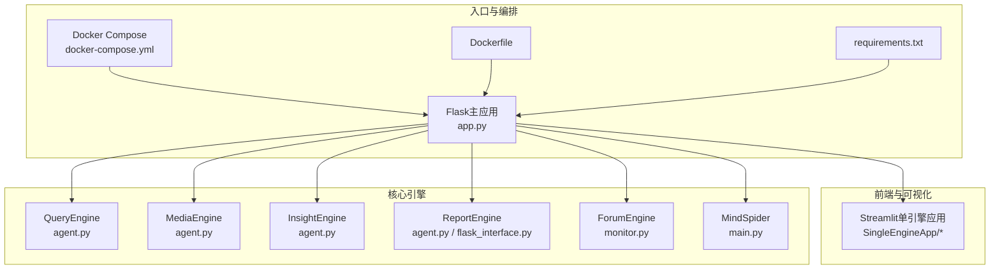
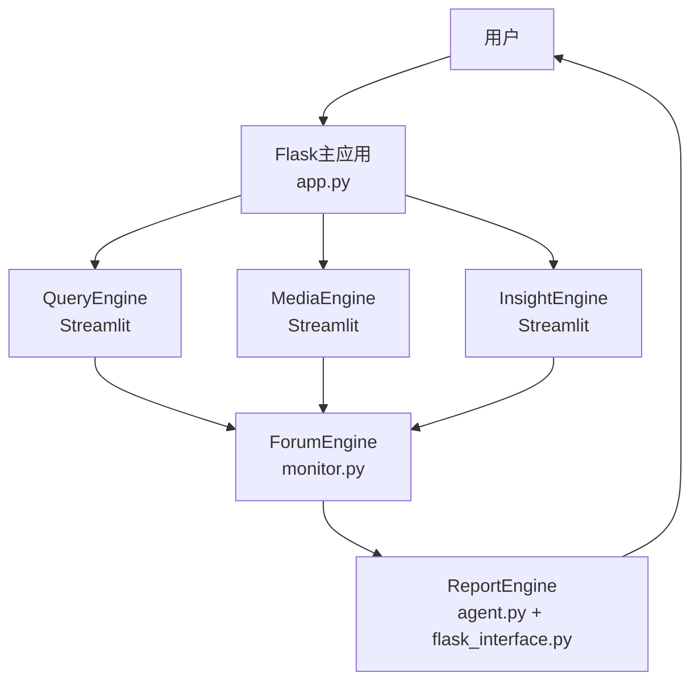
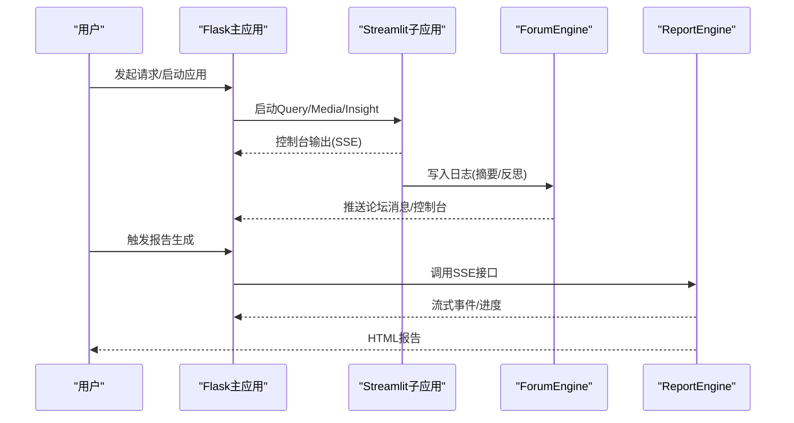
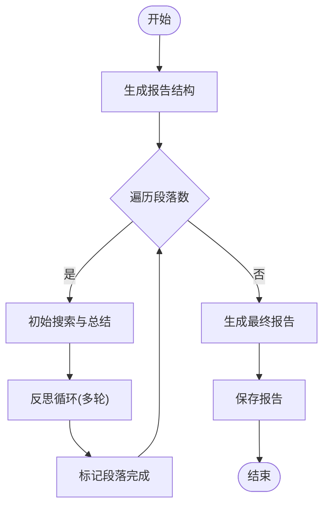
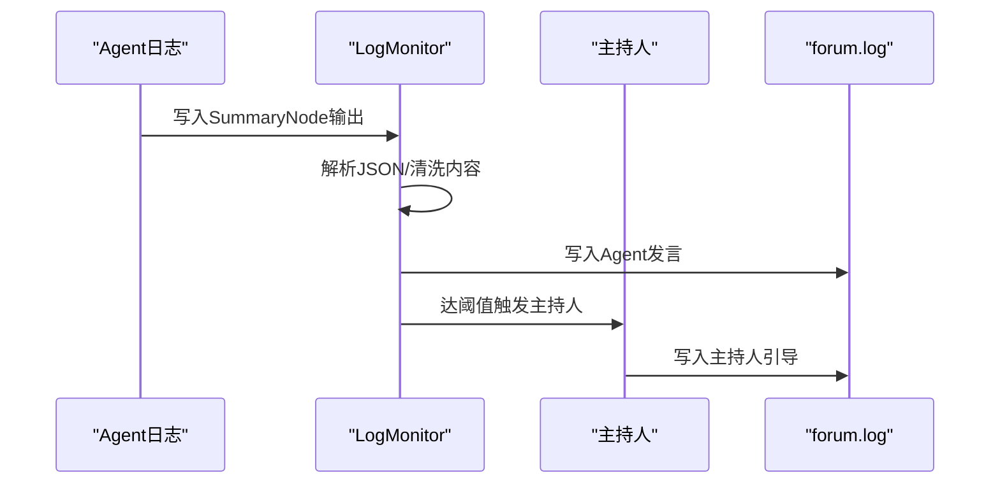
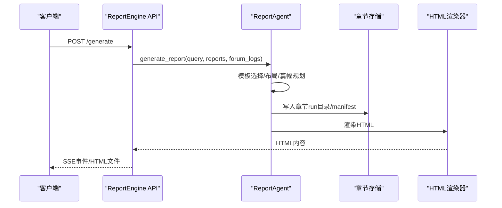
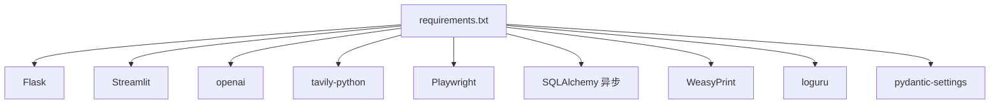

# 系统架构

<cite>
**本文引用的文件**
- [app.py](file://app.py)
- [README.md](file://README.md)
- [requirements.txt](file://requirements.txt)
- [docker-compose.yml](file://docker-compose.yml)
- [Dockerfile](file://Dockerfile)
- [config.py](file://config.py)
- [QueryEngine/agent.py](file://QueryEngine/agent.py)
- [MediaEngine/agent.py](file://MediaEngine/agent.py)
- [InsightEngine/agent.py](file://InsightEngine/agent.py)
- [ReportEngine/agent.py](file://ReportEngine/agent.py)
- [ReportEngine/flask_interface.py](file://ReportEngine/flask_interface.py)
- [ForumEngine/monitor.py](file://ForumEngine/monitor.py)
- [MindSpider/main.py](file://MindSpider/main.py)
- [SingleEngineApp/query_engine_streamlit_app.py](file://SingleEngineApp/query_engine_streamlit_app.py)
- [SingleEngineApp/media_engine_streamlit_app.py](file://SingleEngineApp/media_engine_streamlit_app.py)
- [SingleEngineApp/insight_engine_streamlit_app.py](file://SingleEngineApp/insight_engine_streamlit_app.py)
</cite>

## 目录
1. [简介](#简介)
2. [项目结构](#项目结构)
3. [核心组件](#核心组件)
4. [架构总览](#架构总览)
5. [详细组件分析](#详细组件分析)
6. [依赖关系分析](#依赖关系分析)
7. [性能考量](#性能考量)
8. [故障排查指南](#故障排查指南)
9. [结论](#结论)
10. [附录](#附录)

## 简介
本架构文档面向BettaFish（微舆）多智能体舆情分析系统，系统采用模块化微服务设计，围绕“多Agent并行 + 论坛协作 + 报告生成”的闭环展开。用户通过Flask主应用发起请求，三个独立的Streamlit应用（QueryEngine、MediaEngine、InsightEngine）并行工作，借助ForumEngine进行多轮协作与主持人引导，最终由ReportEngine基于中间表示（IR）生成可交互的HTML报告。系统技术栈包括Flask、Streamlit、SQLAlchemy异步引擎、Playwright等，并以OpenAI兼容的LLM接口标准统一各引擎的推理入口。

## 项目结构
系统采用按功能域划分的模块化组织方式：
- 核心引擎：QueryEngine（广度搜索）、MediaEngine（多模态理解）、InsightEngine（私有数据库挖掘）、ReportEngine（报告生成）、ForumEngine（论坛协作）、MindSpider（爬虫系统）
- 前端与入口：Flask主应用、Streamlit单引擎应用、Docker编排与依赖清单
- 工具与支撑：日志、配置、模板、渲染器、状态管理、工具集

图表来源
- [app.py](file://app.py#L1-L120)
- [docker-compose.yml](file://docker-compose.yml#L1-L40)
- [Dockerfile](file://Dockerfile#L1-L78)
- [requirements.txt](file://requirements.txt#L1-L87)
- [QueryEngine/agent.py](file://QueryEngine/agent.py#L1-L120)
- [MediaEngine/agent.py](file://MediaEngine/agent.py#L1-L120)
- [InsightEngine/agent.py](file://InsightEngine/agent.py#L1-L120)
- [ReportEngine/agent.py](file://ReportEngine/agent.py#L1-L120)
- [ReportEngine/flask_interface.py](file://ReportEngine/flask_interface.py#L1-L120)
- [ForumEngine/monitor.py](file://ForumEngine/monitor.py#L1-L120)
- [MindSpider/main.py](file://MindSpider/main.py#L1-L120)
- [SingleEngineApp/query_engine_streamlit_app.py](file://SingleEngineApp/query_engine_streamlit_app.py#L1-L120)
- [SingleEngineApp/media_engine_streamlit_app.py](file://SingleEngineApp/media_engine_streamlit_app.py#L1-L120)
- [SingleEngineApp/insight_engine_streamlit_app.py](file://SingleEngineApp/insight_engine_streamlit_app.py#L1-L120)

章节来源
- [README.md](file://README.md#L91-L122)
- [app.py](file://app.py#L1-L120)

## 核心组件
- QueryEngine：面向国内外新闻与网页的广度搜索Agent，支持多工具组合与反思迭代，输出标准化报告。
- MediaEngine：面向多模态内容（视频、图片、直播）的Agent，结合结构化信息卡片增强分析。
- InsightEngine：私有数据库挖掘Agent，集成关键词优化与情感分析中间件，支持平台定向与时间窗口搜索。
- ReportEngine：报告生成Agent，负责模板选择、布局设计、篇幅规划、章节生成、IR装订与HTML渲染，提供SSE流式事件。
- ForumEngine：论坛协作引擎，监控三个Agent的日志，抽取SummaryNode输出，触发主持人引导，形成多智能体辩论与融合。
- MindSpider：爬虫系统，负责话题提取与深度情感爬取，为InsightEngine提供数据基础。

章节来源
- [README.md](file://README.md#L91-L122)
- [QueryEngine/agent.py](file://QueryEngine/agent.py#L1-L120)
- [MediaEngine/agent.py](file://MediaEngine/agent.py#L1-L120)
- [InsightEngine/agent.py](file://InsightEngine/agent.py#L1-L120)
- [ReportEngine/agent.py](file://ReportEngine/agent.py#L1-L120)
- [ReportEngine/flask_interface.py](file://ReportEngine/flask_interface.py#L1-L120)
- [ForumEngine/monitor.py](file://ForumEngine/monitor.py#L1-L120)
- [MindSpider/main.py](file://MindSpider/main.py#L1-L120)

## 架构总览
系统采用“主应用编排 + 多Agent并行 + 论坛协作 + 报告生成”的流水线式架构。Flask主应用统一管理Streamlit子应用、启动/停止各引擎、监听论坛日志并通过SocketIO推送控制台输出；三个Agent并行执行各自领域的研究任务；ForumEngine通过监控日志，抽取有价值的摘要输出，触发主持人引导，促进Agent间的交流与融合；ReportEngine在收集三引擎报告与论坛日志后，基于模板与IR中间表示生成最终HTML报告。

图表来源
- [app.py](file://app.py#L1-L200)
- [ForumEngine/monitor.py](file://ForumEngine/monitor.py#L1-L120)
- [ReportEngine/flask_interface.py](file://ReportEngine/flask_interface.py#L1-L120)
- [ReportEngine/agent.py](file://ReportEngine/agent.py#L1-L120)

## 详细组件分析

### Flask主应用与系统编排
- 负责启动/停止三个Streamlit子应用，健康检查与状态上报
- 启动/停止ForumEngine监控，初始化forum.log
- 通过SocketIO实时推送各子应用控制台输出与论坛日志
- 提供配置读取/写入接口，支持动态更新.env

图表来源
- [app.py](file://app.py#L1-L200)
- [app.py](file://app.py#L257-L365)
- [app.py](file://app.py#L417-L486)
- [ReportEngine/flask_interface.py](file://ReportEngine/flask_interface.py#L528-L700)

章节来源
- [app.py](file://app.py#L1-L200)
- [app.py](file://app.py#L257-L365)
- [app.py](file://app.py#L417-L486)
- [ReportEngine/flask_interface.py](file://ReportEngine/flask_interface.py#L528-L700)

### QueryEngine（广度搜索Agent）
- 采用“报告结构生成 → 初始搜索与总结 → 反思循环 → 最终报告”的迭代流程
- 支持多种搜索工具（基础/深度/图片/按日期等），并进行反思与多轮搜索
- 输出标准化报告并保存至指定目录

图表来源
- [QueryEngine/agent.py](file://QueryEngine/agent.py#L141-L216)
- [QueryEngine/agent.py](file://QueryEngine/agent.py#L217-L397)

章节来源
- [QueryEngine/agent.py](file://QueryEngine/agent.py#L1-L200)
- [QueryEngine/agent.py](file://QueryEngine/agent.py#L200-L474)

### MediaEngine（多模态理解Agent）
- 面向多模态内容（视频、图片、直播）与结构化信息卡片
- 支持综合/网页/结构化数据/近期信息等工具集
- 与QueryEngine相似的迭代流程，但针对多模态数据进行适配

章节来源
- [MediaEngine/agent.py](file://MediaEngine/agent.py#L1-L120)
- [MediaEngine/agent.py](file://MediaEngine/agent.py#L120-L240)
- [MediaEngine/agent.py](file://MediaEngine/agent.py#L240-L452)

### InsightEngine（私有数据库挖掘Agent）
- 集成关键词优化中间件与情感分析工具
- 支持热点内容、话题搜索、按日期搜索、平台定向搜索、评论获取等
- 去重整合多关键词查询结果，自动进行情感分析并注入响应参数

章节来源
- [InsightEngine/agent.py](file://InsightEngine/agent.py#L1-L120)
- [InsightEngine/agent.py](file://InsightEngine/agent.py#L120-L248)
- [InsightEngine/agent.py](file://InsightEngine/agent.py#L248-L408)
- [InsightEngine/agent.py](file://InsightEngine/agent.py#L408-L784)

### ForumEngine（论坛协作引擎）
- 基于文件监控的智能日志采集器，识别SummaryNode输出
- 捕获多行JSON并清洗格式，写入forum.log
- 达到阈值后触发主持人引导，形成多智能体辩论与融合

图表来源
- [ForumEngine/monitor.py](file://ForumEngine/monitor.py#L1-L120)
- [ForumEngine/monitor.py](file://ForumEngine/monitor.py#L524-L560)
- [ForumEngine/monitor.py](file://ForumEngine/monitor.py#L628-L700)

章节来源
- [ForumEngine/monitor.py](file://ForumEngine/monitor.py#L1-L200)
- [ForumEngine/monitor.py](file://ForumEngine/monitor.py#L200-L400)
- [ForumEngine/monitor.py](file://ForumEngine/monitor.py#L400-L700)

### ReportEngine（报告生成）
- 模板选择 → 模板切片 → 文档布局 → 篇幅规划 → 章节生成 → IR装订 → HTML渲染
- 提供SSE流式事件，支持章节级增量渲染与错误兜底
- 通过蓝图注册到Flask，提供状态查询与流式订阅

图表来源
- [ReportEngine/flask_interface.py](file://ReportEngine/flask_interface.py#L555-L700)
- [ReportEngine/flask_interface.py](file://ReportEngine/flask_interface.py#L700-L800)
- [ReportEngine/agent.py](file://ReportEngine/agent.py#L378-L500)
- [ReportEngine/agent.py](file://ReportEngine/agent.py#L674-L700)

章节来源
- [ReportEngine/flask_interface.py](file://ReportEngine/flask_interface.py#L1-L200)
- [ReportEngine/flask_interface.py](file://ReportEngine/flask_interface.py#L200-L400)
- [ReportEngine/agent.py](file://ReportEngine/agent.py#L1-L200)
- [ReportEngine/agent.py](file://ReportEngine/agent.py#L200-L400)

### MindSpider（爬虫系统）
- 集成BroadTopicExtraction与DeepSentimentCrawling两大模块
- 提供数据库连接检查、表结构检查、初始化与完整工作流执行
- 通过子进程调用各模块主程序，支持按日期、平台、关键词数量等参数控制

章节来源
- [MindSpider/main.py](file://MindSpider/main.py#L1-L120)
- [MindSpider/main.py](file://MindSpider/main.py#L120-L240)
- [MindSpider/main.py](file://MindSpider/main.py#L240-L360)
- [MindSpider/main.py](file://MindSpider/main.py#L360-L447)

## 依赖关系分析
- 技术栈与选型
  - Web框架：Flask + Streamlit，前者负责统一编排与SSE，后者提供各Agent的独立可视化界面
  - 异步与HTTP：aiohttp、httpx、requests，满足异步I/O与HTTP请求
  - LLM接口：openai库，统一OpenAI兼容的LLM调用
  - 搜索API：tavily-python、Bocha（通过配置桥接）
  - 数据库：SQLAlchemy异步引擎（asyncpg/aiomysql/aiosqlite），支持PostgreSQL/MySQL
  - 爬虫：Playwright，支持Chromium浏览器自动化
  - 可视化与PDF：plotly、matplotlib、wordcloud、weasyprint
  - 工具库：loguru、pydantic/pydantic-settings、tenacity、python-socketio、eventlet

- 组件耦合与集成点
  - Flask主应用与各Agent通过子进程/端口暴露进行解耦
  - ForumEngine通过文件日志实现松耦合的跨进程协作
  - ReportEngine通过蓝图与SSE与前端/CLI对接，内部通过LLMClient统一推理入口

图表来源
- [requirements.txt](file://requirements.txt#L1-L87)

章节来源
- [requirements.txt](file://requirements.txt#L1-L87)
- [README.md](file://README.md#L326-L332)

## 性能考量
- 异步优先：使用aiohttp、SQLAlchemy异步引擎与异步数据库驱动，降低I/O阻塞
- 流式事件：ReportEngine通过SSE提供渐进式渲染，提升用户体验
- 日志与监控：LogMonitor采用文件监控与线程安全写入，避免阻塞主流程
- 重试与降级：ReportEngine在章节JSON解析失败时提供兜底策略与备用LLM通道
- 资源隔离：各Agent通过独立Streamlit进程运行，避免相互干扰

章节来源
- [ReportEngine/flask_interface.py](file://ReportEngine/flask_interface.py#L1-L120)
- [ReportEngine/agent.py](file://ReportEngine/agent.py#L1-L120)
- [ForumEngine/monitor.py](file://ForumEngine/monitor.py#L1-L120)

## 故障排查指南
- 启动与健康检查
  - 检查各Agent进程状态与端口健康，必要时清理残留端口占用
  - 使用健康检查URL确认Streamlit应用可用性
- 日志与输出
  - 查看logs目录下insight/media/query/forum日志，定位Agent输出与错误
  - 通过SocketIO实时查看控制台输出
- 报告生成
  - 确认三个引擎报告目录均有最新文件，且forum.log存在
  - 如章节JSON解析失败，考虑更换更强的LLM或调整提示词
- 爬虫与数据库
  - MindSpider提供数据库连接与表结构检查，初始化失败时按提示修复

章节来源
- [app.py](file://app.py#L785-L804)
- [app.py](file://app.py#L805-L864)
- [app.py](file://app.py#L865-L930)
- [ReportEngine/flask_interface.py](file://ReportEngine/flask_interface.py#L528-L654)
- [MindSpider/main.py](file://MindSpider/main.py#L120-L200)

## 结论
BettaFish系统通过模块化设计与OpenAI兼容的LLM接口，实现了多Agent并行、论坛协作与报告生成的完整闭环。Flask主应用提供统一编排与SSE流式事件，ForumEngine以日志为媒介促进Agent间的多轮辩论，ReportEngine基于IR中间表示实现高质量报告渲染。系统在异步I/O、错误兜底与资源隔离方面具备良好实践，适合在多样化业务场景中扩展与定制。

## 附录
- 中间表示（IR）在报告生成中的作用
  - ReportEngine将章节生成的JSON结构化内容装订为Document IR，统一元数据与章节锚点，随后由HTML渲染器生成可交互报告
- 异步优先的设计
  - 通过SQLAlchemy异步引擎与aiohttp提升I/O吞吐，配合SSE实现前端实时渲染
- OpenAI兼容的LLM接口标准
  - 各引擎统一使用LLMClient封装，确保模型切换与参数配置的一致性

章节来源
- [ReportEngine/agent.py](file://ReportEngine/agent.py#L674-L700)
- [ReportEngine/agent.py](file://ReportEngine/agent.py#L1-L120)
- [README.md](file://README.md#L326-L332)