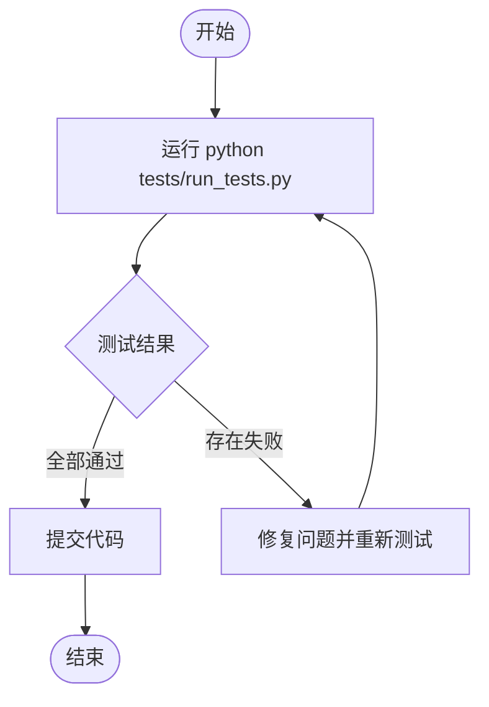

# 贡献指南

<cite>
**本文档引用的文件**  
- [CONTRIBUTING.md](file://CONTRIBUTING.md#L1-L55)
- [README.md](file://README.md#L699-L704)
- [tests/run_tests.py](file://tests/run_tests.py#L1-L62)
- [requirements.txt](file://requirements.txt#L80-L83)
- [MindSpider/DeepSentimentCrawling/MediaCrawler/pyproject.toml](file://MindSpider/DeepSentimentCrawling/MediaCrawler/pyproject.toml#L1-L40)
- [MindSpider/DeepSentimentCrawling/MediaCrawler/mypy.ini](file://MindSpider/DeepSentimentCrawling/MediaCrawler/mypy.ini#L1-L9)
- [CODE_OF_CONDUCT.md](file://CODE_OF_CONDUCT.md#L1-L129)
- [CONTRIBUTING-EN.md](file://CONTRIBUTING-EN.md#L1-L55)
</cite>

## 目录
1. [欢迎参与贡献](#欢迎参与贡献)
2. [提交 Pull Request 的完整流程](#提交-pull-request-的完整流程)
3. [代码风格与测试要求](#代码风格与测试要求)
4. [Pull Request 描述规范](#pull-request-描述规范)
5. [其他贡献形式](#其他贡献形式)
6. [行为准则](#行为准则)

## 欢迎参与贡献

我们热烈欢迎任何形式的贡献！无论你是提交代码、改进文档，还是报告问题，你的参与都将帮助“微舆”项目变得更好。本项目致力于构建一个开放、包容、创新的社区，每一位贡献者都是我们前进的动力。

“微舆”是一个创新型的多智能体舆情分析系统，旨在帮助用户破除信息茧房，还原舆情原貌。我们相信，通过社区的共同努力，可以不断优化系统功能，提升分析质量，为更多用户提供价值。

**Section sources**
- [README.md](file://README.md#L700-L704)

## 提交 Pull Request 的完整流程

为了保持代码质量和版本管理的清晰，请按照以下步骤提交你的修改。

### 1️⃣ Fork 仓库

将本仓库 Fork 到你的 GitHub 账户。

### 2️⃣ 克隆到本地

```bash
git clone https://github.com/<你的用户名>/<仓库名>.git
cd <仓库名>
```

### 3️⃣ 创建功能分支

```bash
git checkout -b feature/你的功能名
```

> 建议分支命名规范：`feature/xxx` 或 `fix/xxx`，便于识别功能或修复类型。

### 4️⃣ 开发与测试

* 进行代码修改，保持项目代码风格一致。
* 确保新增功能或修复通过测试。

### 5️⃣ 提交修改

```bash
git add .
git commit -m "类型: 简短描述"
```

> 推荐遵循 [Conventional Commits](https://www.conventionalcommits.org/zh-hans/)，保持提交记录清晰。

### 6️⃣ 推送到远程仓库

```bash
git push origin feature/你的功能名
```

### 7️⃣ 发起 Pull Request

1. 在 GitHub 上点击 **New Pull Request**。
2. **目标分支必须是本仓库的 `main` 分支**。
3. 填写 PR 描述：
   * 说明主要改动内容
   * 如有相关 issue，请在 PR 中关联

**Section sources**
- [CONTRIBUTING.md](file://CONTRIBUTING.md#L1-L55)

## 代码风格与测试要求

为了确保代码的可读性和可维护性，我们对代码风格和测试有明确要求。

### 代码风格一致性

项目遵循 PEP 8 代码规范。虽然项目中未提供 black 或 flake8 的配置文件，但建议在提交代码前使用这些工具进行格式化。MindSpider 子项目使用 pyproject.toml 进行依赖管理，并配置了 mypy 进行类型检查，建议在开发时启用类型检查以提高代码质量。

### 测试的重要性

项目包含单元测试和集成测试，位于 `tests/` 目录下。我们鼓励为新增功能编写测试用例，并确保所有测试通过。可以使用 `python tests/run_tests.py` 命令运行所有测试。



**Diagram sources**
- [tests/run_tests.py](file://tests/run_tests.py#L1-L62)
- [requirements.txt](file://requirements.txt#L80-L83)

**Section sources**
- [tests/run_tests.py](file://tests/run_tests.py#L1-L62)
- [requirements.txt](file://requirements.txt#L80-L83)
- [MindSpider/DeepSentimentCrawling/MediaCrawler/pyproject.toml](file://MindSpider/DeepSentimentCrawling/MediaCrawler/pyproject.toml#L1-L40)
- [MindSpider/DeepSentimentCrawling/MediaCrawler/mypy.ini](file://MindSpider/DeepSentimentCrawling/MediaCrawler/mypy.ini#L1-L9)

## Pull Request 描述规范

一个清晰、详细的 PR 描述对于代码审查至关重要。请在 PR 中包含以下信息：

* **改动目的**：简要说明为什么要进行这些修改。
* **主要改动**：列出关键的代码变更。
* **测试情况**：说明如何测试了这些改动。
* **相关 issue**：如果 PR 解决了某个 issue，请使用 `Fixes #issue_number` 格式关联。

这有助于审查者快速理解你的工作，并加快合并流程。

**Section sources**
- [CONTRIBUTING.md](file://CONTRIBUTING.md#L51-L54)

## 其他贡献形式

贡献不仅仅局限于代码。我们同样欢迎以下形式的贡献：

* **文档改进**：修正拼写错误，完善说明文档，添加使用示例。
* **问题报告**：发现并报告 bug，提出功能建议。
* **社区支持**：在讨论区帮助其他用户解决问题。

你的每一份努力，都是对项目宝贵的贡献。

**Section sources**
- [README.md](file://README.md#L700-L704)

## 行为准则

我们致力于维护一个尊重、友善的社区环境。所有贡献者都应遵守《[贡献者行为准则](file://CODE_OF_CONDUCT.md)》。该准则禁止任何形式的骚扰、歧视或不专业行为，确保每个人都能在一个安全的环境中参与贡献。

**Section sources**
- [CODE_OF_CONDUCT.md](file://CODE_OF_CONDUCT.md#L1-L129)