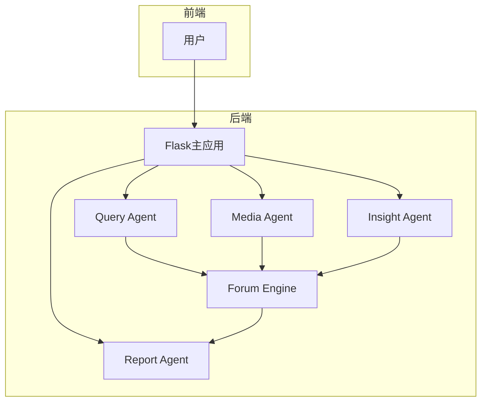

# 项目概述

<cite>
**本文档引用的文件**  
- [README.md](file://README.md)
- [app.py](file://app.py)
- [ReportEngine/flask_interface.py](file://ReportEngine/flask_interface.py)
- [ReportEngine/agent.py](file://ReportEngine/agent.py)
- [ForumEngine/monitor.py](file://ForumEngine/monitor.py)
- [QueryEngine/agent.py](file://QueryEngine/agent.py)
- [MediaEngine/agent.py](file://MediaEngine/agent.py)
- [InsightEngine/agent.py](file://InsightEngine/agent.py)
- [config.py](file://config.py)
</cite>

## 目录
1. [引言](#引言)
2. [核心优势](#核心优势)
3. [系统架构与工作流程](#系统架构与工作流程)
4. [核心组件分析](#核心组件分析)
5. [技术决策与设计权衡](#技术决策与设计权衡)
6. [结论](#结论)

## 引言

“微舆”（BettaFish）是一个从零实现的创新型多智能体舆情分析系统。其设计目标是帮助用户破除信息茧房，还原舆情原貌，预测未来走向，并为决策提供有力支持。用户只需像聊天一样提出分析需求，系统便能自动启动，对国内外30多个主流社交媒体平台上的数百万条大众评论进行全自动分析。

“微舆”之名，谐音“微鱼”，象征着BettaFish这种体型虽小但好斗且美丽的鱼，寓意系统“小而强大，不畏挑战”。该系统不仅仅体现在报告质量上，更拥有六大核心优势，使其在同类产品中脱颖而出。

**Section sources**
- [README.md](file://README.md#L29-L53)

## 核心优势

“微舆”系统通过其独特的架构和功能设计，提供了以下六大核心优势：

### AI驱动的全域监控
系统集成了名为“MindSpider”的AI爬虫集群，能够7x24小时不间断地作业。它全面覆盖了微博、小红书、抖音、快手等10余个国内外关键社交媒体平台。该系统不仅能实时捕获热点内容，更能深入挖掘海量的用户评论，确保用户能够听到最真实、最广泛的大众声音。

### 超越LLM的复合分析引擎
“微舆”不仅仅依赖于大型语言模型（LLM），而是构建了一个超越LLM的复合分析引擎。该引擎融合了5类专业智能体（Agent），并协同微调模型、统计模型等多种中间件。通过多模型的协同工作，系统确保了分析结果的深度、准确度以及多维度的视角，避免了单一模型可能带来的局限性。

### 强大的多模态能力
系统突破了传统图文分析的限制，具备强大的多模态解析能力。它能深度解析抖音、快手等平台的短视频内容，并精准提取现代搜索引擎中的天气、日历、股票等结构化多模态信息卡片，让用户能够全面掌握复杂的舆情动态。

### Agent“论坛”协作机制
“微舆”引入了创新的Agent“论坛”协作机制。系统为不同的智能体赋予了独特的工具集和思维模式，并引入了一个“论坛主持人”模型。通过这个“论坛”，各个智能体可以进行链式思维的碰撞与辩论。这种机制不仅避免了单一模型的思维局限和同质化交流，更催生了更高质量的集体智能，为决策支持提供了更丰富的洞见。

### 公私域数据无缝融合
平台不仅分析公开的舆情数据，还提供了高安全性的接口，支持用户将内部业务数据库与外部舆情数据进行无缝集成。这一功能打通了数据壁垒，为垂直业务场景提供了“外部趋势+内部洞察”的强大分析能力，使分析更具业务针对性。

### 轻量化与高扩展性框架
整个系统基于纯Python模块化设计，实现了轻量化和一键式部署。代码结构清晰，开发者可以轻松地集成自定义模型与业务逻辑，实现平台的快速扩展与深度定制。其目标是成为驱动一切业务场景的简洁通用的数据分析引擎。

**Section sources**
- [README.md](file://README.md#L41-L51)

## 系统架构与工作流程

“微舆”系统采用了一个以Flask为主应用的微服务架构，协调多个独立的智能体（Agent）协同工作，最终生成一份综合性的交互式报告。

### 系统架构图解读

根据项目文档中的架构图，系统主要由以下几个核心组件构成：
*   **Flask主应用**：作为系统的统一入口和调度中心，接收用户查询，并协调各个子应用的启动与状态监控。
*   **Query Agent**：负责精准信息搜索，具备国内外网页搜索能力。
*   **Media Agent**：负责多模态内容分析，能够处理视频、图片等非文本信息。
*   **Insight Agent**：负责私有数据库挖掘，对系统内部的舆情数据库进行深度分析。
*   **Report Agent**：负责智能报告生成，将各Agent的分析结果整合并生成最终报告。
*   **Forum Engine**：负责监控各Agent的分析过程，并通过“论坛”机制促进它们之间的协作。

**Diagram sources**
- [README.md](file://README.md#L91-L105)

### 系统工作流程

一次完整的分析流程遵循以下步骤：

1.  **用户提问**：用户在前端界面输入分析需求，Flask主应用接收该查询。
2.  **并行启动**：Flask主应用并行启动Query、Media和Insight三个Agent。
3.  **初步分析**：每个Agent根据其专属工具集（如网络搜索、数据库查询、多模态分析）进行初步的概览搜索。
4.  **策略制定**：各Agent基于初步结果，制定分块研究的详细策略。
5.  **循环阶段（核心）**：系统进入核心的循环协作阶段，此阶段会重复多次：
    *   **深度研究**：各Agent根据论坛主持人（Host）的引导，进行专项的深度搜索和分析。
    *   **论坛协作**：Forum Engine监控各Agent的发言，并生成主持人（Host）的引导性发言，促进Agent间的辩论与信息融合。
    *   **交流融合**：各Agent根据论坛中的讨论，调整自己的研究方向和策略。
6.  **结果整合**：当循环阶段结束，Report Agent收集所有Agent的分析结果以及论坛中的讨论内容。
7.  **IR中间表示**：Report Agent动态选择合适的报告模板，多轮生成元数据，并将其装订为一个结构化的中间表示（Intermediate Representation, IR）。
8.  **报告生成**：Report Agent将IR渲染成交互式的HTML报告，并可选择性地导出为PDF格式。

**Section sources**
- [README.md](file://README.md#L107-L121)

## 核心组件分析

### Flask主应用 (app.py)
Flask主应用是整个系统的控制中心。它通过`app.py`文件实现，主要职责包括：
*   **统一管理**：作为单一入口，统一管理三个基于Streamlit的子应用（Query、Media、Insight）。
*   **进程调度**：使用`subprocess`模块启动和监控各个Agent的进程，并通过`socketio`实现与前端的实时通信。
*   **状态管理**：提供API接口，用于查询各个子应用的运行状态和日志输出。
*   **集成Report Engine**：通过注册`ReportEngine`的Blueprint，将报告生成功能无缝集成到主应用中。

**Section sources**
- [app.py](file://app.py)

### Report Agent (ReportEngine/agent.py)
Report Agent是整个报告生成流程的总调度中心。其核心职责是协调模板选择、布局设计、章节生成、IR装订与HTML渲染等所有子流程。
*   **总调度**：它串联了从输入数据到最终报告的整个生成链路。
*   **状态管理**：通过`ReportState`类管理整个生成过程的状态、元数据和进度。
*   **节点驱动**：按顺序驱动`TemplateSelectionNode`、`DocumentLayoutNode`、`WordBudgetNode`和`ChapterGenerationNode`等推理节点。
*   **错误兜底**：具备强大的错误处理和重试机制，确保在LLM输出不稳定时仍能生成可用的报告。

**Section sources**
- [ReportEngine/agent.py](file://ReportEngine/agent.py)

### Forum Engine (ForumEngine/monitor.py)
Forum Engine是实现Agent“论坛”协作机制的核心。它通过监控日志文件来实现Agent间的通信。
*   **日志监控**：`LogMonitor`类实时监控`insight.log`、`media.log`和`query.log`三个文件。
*   **内容捕获**：识别并捕获来自各Agent的`SummaryNode`输出，这些输出代表了Agent的“发言”。
*   **论坛主持**：当捕获到一定数量的Agent发言后，会调用`llm_host.py`中的`generate_host_speech`函数，生成一个主持人（Host）的引导性发言。
*   **日志写入**：将Agent的发言和主持人的发言统一写入`forum.log`文件，形成一个完整的“论坛”记录。
*   **状态管理**：通过`is_searching`和`is_host_generating`等状态变量，精确控制论坛的启动、运行和结束。

**Section sources**
- [ForumEngine/monitor.py](file://ForumEngine/monitor.py)

### Query Agent (QueryEngine/agent.py)
Query Agent专注于从公开网络获取信息。
*   **搜索工具集**：集成了`TavilyNewsAgency`，支持基础搜索、深度分析、24小时新闻、本周新闻、图片搜索和按日期搜索等多种工具。
*   **反思循环**：采用“初始搜索 -> 总结 -> 反思 -> 再搜索”的循环模式，不断深化分析。
*   **状态管理**：使用`State`类来跟踪报告结构、段落内容、搜索历史和最终报告。

**Section sources**
- [QueryEngine/agent.py](file://QueryEngine/agent.py)

### Media Agent (MediaEngine/agent.py)
Media Agent专注于多模态信息的获取与分析。
*   **多模态搜索**：集成了`BochaMultimodalSearch`，支持全面的综合搜索、纯网页搜索、结构化数据查询等。
*   **与Query Agent的相似性**：其代码结构和工作流程与Query Agent高度相似，体现了系统模块化的设计思想。

**Section sources**
- [MediaEngine/agent.py](file://MediaEngine/agent.py)

### Insight Agent (InsightEngine/agent.py)
Insight Agent负责挖掘私有数据库中的深层洞察。
*   **数据库查询**：通过`MediaCrawlerDB`工具，对内部数据库执行热点内容、话题搜索、评论获取等操作。
*   **复合分析**：集成了关键词优化中间件（`keyword_optimizer`）和情感分析工具（`multilingual_sentiment_analyzer`），在查询阶段就进行数据增强和分析。
*   **配置驱动**：其行为（如搜索结果数量、反思次数）由`config.py`中的配置项严格控制。

**Section sources**
- [InsightEngine/agent.py](file://InsightEngine/agent.py)

## 技术决策与设计权衡

“微舆”系统在技术选型和架构设计上做出了多项关键决策，体现了其设计的深思熟虑。

### 模块化与微服务架构
系统将不同的分析功能（查询、媒体、洞察）拆分为独立的Agent，这带来了显著的优势：
*   **优势**：各Agent可以独立开发、测试和部署，技术栈可以灵活选择，降低了系统复杂性。
*   **权衡**：增加了进程间通信和状态同步的复杂性，需要Flask主应用进行协调。

### 基于日志的Agent通信
系统没有采用复杂的RPC或消息队列，而是选择通过读写日志文件来实现Agent间的通信。
*   **优势**：实现简单、可靠，易于调试和监控。`forum.log`文件本身就是一份完整的协作记录。
*   **权衡**：实时性不如消息队列，且需要处理文件I/O的性能问题。

### 复合分析引擎
系统没有将所有功能塞进一个巨大的LLM中，而是构建了一个由多个专业Agent和中间件组成的复合引擎。
*   **优势**：通过分工协作，每个组件都能发挥其专长，整体分析结果更深入、更准确。
*   **权衡**：系统架构更复杂，需要精心设计各组件间的接口和协作流程。

### 配置中心化
通过`pydantic-settings`和`.env`文件，系统实现了配置的集中化管理。
*   **优势**：便于环境切换（开发、测试、生产），提高了系统的可维护性和可移植性。
*   **权衡**：需要确保所有模块都能正确加载和使用全局配置。

**Section sources**
- [config.py](file://config.py)
- [app.py](file://app.py)
- [ForumEngine/monitor.py](file://ForumEngine/monitor.py)

## 结论

“微舆”（BettaFish）项目是一个设计精良、功能强大的多智能体舆情分析系统。它通过创新的“论坛”协作机制，将多个专业智能体的能力有机结合，实现了对复杂舆情的深度、多维度分析。其轻量化、模块化的设计使其不仅是一个开箱即用的工具，更是一个可扩展的通用数据分析引擎框架。对于需要从海量信息中提炼价值的用户和开发者而言，“微舆”提供了一个极具潜力的解决方案。