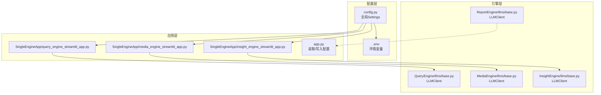
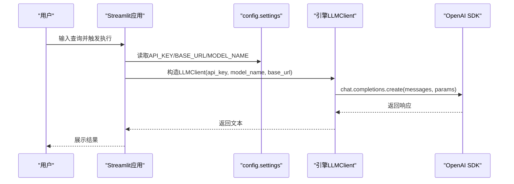
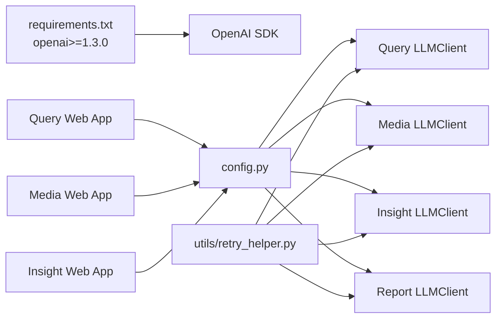

# 接入不同的LLM模型

<cite>
**本文引用的文件**
- [config.py](file://config.py)
- [app.py](file://app.py)
- [requirements.txt](file://requirements.txt)
- [QueryEngine/llms/base.py](file://QueryEngine/llms/base.py)
- [MediaEngine/llms/base.py](file://MediaEngine/llms/base.py)
- [InsightEngine/llms/base.py](file://InsightEngine/llms/base.py)
- [ReportEngine/llms/base.py](file://ReportEngine/llms/base.py)
- [SingleEngineApp/query_engine_streamlit_app.py](file://SingleEngineApp/query_engine_streamlit_app.py)
- [SingleEngineApp/media_engine_streamlit_app.py](file://SingleEngineApp/media_engine_streamlit_app.py)
- [SingleEngineApp/insight_engine_streamlit_app.py](file://SingleEngineApp/insight_engine_streamlit_app.py)
- [utils/retry_helper.py](file://utils/retry_helper.py)
- [README.md](file://README.md)
</cite>

## 目录
1. [简介](#简介)
2. [项目结构](#项目结构)
3. [核心组件](#核心组件)
4. [架构总览](#架构总览)
5. [详细组件分析](#详细组件分析)
6. [依赖关系分析](#依赖关系分析)
7. [性能考虑](#性能考虑)
8. [故障排查指南](#故障排查指南)
9. [结论](#结论)
10. [附录](#附录)

## 简介
本文件面向希望将BettaFish系统接入不同LLM提供商的用户，重点说明系统如何基于OpenAI API兼容性设计，支持任意提供OpenAI兼容接口的LLM服务（如Azure OpenAI、本地部署的Llama、通义千问API等）。文档将指导你在根目录的config.py或.env文件中配置LLM的BASE_URL、API_KEY和MODEL_NAME参数，并给出多个主流LLM服务的配置示例（如Anthropic、Groq、DeepSeek）。同时，说明这些配置如何被QueryEngine、MediaEngine、InsightEngine和ReportEngine等模块通过各自的utils/config.py继承和使用，以及常见配置错误与解决方案。

## 项目结构
- 配置中心：config.py定义了全局Settings，支持从环境变量和.env文件自动加载，包含各引擎的API_KEY、BASE_URL、MODEL_NAME等LLM相关配置。
- 引擎模块：QueryEngine、MediaEngine、InsightEngine、ReportEngine各自提供OpenAI兼容的LLM客户端封装，负责调用底层OpenAI SDK。
- Web入口：SingleEngineApp下的Streamlit应用读取config.settings，将配置注入到各引擎的Settings对象中，驱动Agent执行。
- 重试机制：utils/retry_helper提供统一的重试装饰器，增强LLM调用稳定性。
- 依赖：requirements.txt明确openai>=1.3.0，确保OpenAI兼容接口可用。

图表来源
- [config.py](file://config.py#L1-L126)
- [QueryEngine/llms/base.py](file://QueryEngine/llms/base.py#L1-L168)
- [MediaEngine/llms/base.py](file://MediaEngine/llms/base.py#L1-L171)
- [InsightEngine/llms/base.py](file://InsightEngine/llms/base.py#L1-L168)
- [ReportEngine/llms/base.py](file://ReportEngine/llms/base.py#L1-L180)
- [SingleEngineApp/query_engine_streamlit_app.py](file://SingleEngineApp/query_engine_streamlit_app.py#L1-L228)
- [SingleEngineApp/media_engine_streamlit_app.py](file://SingleEngineApp/media_engine_streamlit_app.py#L1-L246)
- [SingleEngineApp/insight_engine_streamlit_app.py](file://SingleEngineApp/insight_engine_streamlit_app.py#L1-L237)
- [app.py](file://app.py#L83-L115)

章节来源
- [config.py](file://config.py#L1-L126)
- [requirements.txt](file://requirements.txt#L1-L87)

## 核心组件
- 全局配置（config.py）
  - 定义了INSIGHT_ENGINE、MEDIA_ENGINE、QUERY_ENGINE、REPORT_ENGINE等引擎的API_KEY、BASE_URL、MODEL_NAME字段，支持从.env和环境变量自动加载。
  - 提供reload_settings()用于运行时重新加载配置。
- 引擎LLM客户端（各引擎llms/base.py）
  - 统一封装OpenAI兼容接口，构造OpenAI客户端并调用chat.completions.create，支持非流式与流式两种调用方式。
  - 支持超时、采样参数透传、响应校验与模型信息查询。
- Web应用（SingleEngineApp/*.py）
  - 从config.settings读取配置，构建各引擎的Settings对象，驱动Agent执行。
- 重试机制（utils/retry_helper.py）
  - 提供with_retry装饰器，支持指数退避、最大重试次数、异常类型过滤等，提升网络不稳定场景下的稳定性。

章节来源
- [config.py](file://config.py#L23-L105)
- [QueryEngine/llms/base.py](file://QueryEngine/llms/base.py#L30-L168)
- [MediaEngine/llms/base.py](file://MediaEngine/llms/base.py#L31-L171)
- [InsightEngine/llms/base.py](file://InsightEngine/llms/base.py#L30-L168)
- [ReportEngine/llms/base.py](file://ReportEngine/llms/base.py#L33-L180)
- [utils/retry_helper.py](file://utils/retry_helper.py#L1-L248)

## 架构总览
系统通过config.py集中管理LLM配置，各引擎的LLMClient基于OpenAI SDK发起请求；Web应用将配置注入到引擎Settings中，驱动Agent执行任务。ReportEngine还提供回退链路，当主引擎配置缺失时，可依次尝试论坛、洞察、媒体引擎的LLM客户端。

图表来源
- [SingleEngineApp/query_engine_streamlit_app.py](file://SingleEngineApp/query_engine_streamlit_app.py#L92-L122)
- [QueryEngine/llms/base.py](file://QueryEngine/llms/base.py#L57-L107)
- [MediaEngine/llms/base.py](file://MediaEngine/llms/base.py#L60-L118)
- [InsightEngine/llms/base.py](file://InsightEngine/llms/base.py#L57-L116)
- [ReportEngine/llms/base.py](file://ReportEngine/llms/base.py#L68-L139)

## 详细组件分析

### 配置中心：config.py
- 功能要点
  - 使用pydantic-settings自动从.env和环境变量加载配置，字段覆盖Insight、Media、Query、Report等引擎的API_KEY、BASE_URL、MODEL_NAME。
  - 提供reload_settings()在运行时重新加载配置，便于前端动态更新后生效。
- 关键字段（节选）
  - INSIGHT_ENGINE_*：洞察引擎LLM配置
  - MEDIA_ENGINE_*：媒体引擎LLM配置
  - QUERY_ENGINE_*：查询引擎LLM配置
  - REPORT_ENGINE_*：报告引擎LLM配置
  - MINDSPIDER_*：MindSpider引擎LLM配置
  - FORUM_HOST_*：论坛Host引擎LLM配置
  - KEYWORD_OPTIMIZER_*：关键词优化器LLM配置
- 环境变量优先级
  - 优先使用当前工作目录下的.env，若不存在则回退到项目根目录的.env。

章节来源
- [config.py](file://config.py#L23-L105)
- [config.py](file://config.py#L108-L126)

### 引擎LLM客户端：各引擎llms/base.py
- 设计模式
  - 统一的LLMClient封装，构造OpenAI客户端并调用chat.completions.create。
  - 支持非流式invoke与流式stream_invoke/stream_invoke_to_string。
  - 支持超时、温度、top_p、惩罚等参数透传。
- 关键行为
  - 初始化时校验API_KEY与MODEL_NAME必填。
  - 自动从环境变量读取LLM_REQUEST_TIMEOUT或对应引擎的超时变量。
  - 流式调用中逐块yield delta.content，最后以字节安全方式拼接为完整字符串。
  - 提供get_model_info()返回provider/model/api_base信息。
- 报告引擎特例
  - ReportEngine/llms/base.py还提供回退链路初始化逻辑，当主引擎配置缺失时，可依次尝试论坛、洞察、媒体引擎的LLM客户端。

章节来源
- [QueryEngine/llms/base.py](file://QueryEngine/llms/base.py#L30-L168)
- [MediaEngine/llms/base.py](file://MediaEngine/llms/base.py#L31-L171)
- [InsightEngine/llms/base.py](file://InsightEngine/llms/base.py#L30-L168)
- [ReportEngine/llms/base.py](file://ReportEngine/llms/base.py#L33-L180)

### Web应用：SingleEngineApp/*.py
- Query Engine
  - 从config.settings读取QUERY_ENGINE_*配置，构建Settings并初始化DeepSearchAgent。
  - 对API_KEY/TAVILY_API_KEY进行必要性校验。
- Media Engine
  - 从config.settings读取MEDIA_ENGINE_*配置，构建Settings并初始化DeepSearchAgent。
  - 对API_KEY/BOCHA_WEB_SEARCH_API_KEY进行必要性校验。
- Insight Engine
  - 从config.settings读取INSIGHT_ENGINE_*配置，同时读取DB_*数据库配置，构建Settings并初始化DeepSearchAgent。
- 通用流程
  - 读取URL参数auto_query/auto_search，自动触发研究流程。
  - 逐步执行生成报告结构、初始搜索与总结、反思循环、生成最终报告、保存报告。

章节来源
- [SingleEngineApp/query_engine_streamlit_app.py](file://SingleEngineApp/query_engine_streamlit_app.py#L92-L122)
- [SingleEngineApp/media_engine_streamlit_app.py](file://SingleEngineApp/media_engine_streamlit_app.py#L99-L123)
- [SingleEngineApp/insight_engine_streamlit_app.py](file://SingleEngineApp/insight_engine_streamlit_app.py#L98-L127)

### 重试机制：utils/retry_helper.py
- 提供with_retry装饰器，支持：
  - 最大重试次数、初始延迟、退避因子、最大延迟
  - 指定需要重试的异常类型
  - LLM_RETRY_CONFIG预设，适合LLM调用场景
- 作用范围
  - 各引擎LLMClient的方法通过with_retry装饰器包装，提升网络波动下的成功率。

章节来源
- [utils/retry_helper.py](file://utils/retry_helper.py#L1-L248)

## 依赖关系分析
- 配置依赖
  - 各引擎LLMClient依赖config.settings中的API_KEY、BASE_URL、MODEL_NAME。
  - Web应用依赖config.settings读取配置并注入到引擎Settings。
- 运行时依赖
  - openai>=1.3.0，确保OpenAI兼容接口可用。
  - python-dotenv>=1.0.0，支持.env文件加载。
- 重试依赖
  - 各引擎LLMClient方法通过with_retry装饰器增强稳定性。

图表来源
- [requirements.txt](file://requirements.txt#L1-L87)
- [config.py](file://config.py#L23-L105)
- [QueryEngine/llms/base.py](file://QueryEngine/llms/base.py#L57-L107)
- [MediaEngine/llms/base.py](file://MediaEngine/llms/base.py#L60-L118)
- [InsightEngine/llms/base.py](file://InsightEngine/llms/base.py#L57-L116)
- [ReportEngine/llms/base.py](file://ReportEngine/llms/base.py#L68-L139)
- [utils/retry_helper.py](file://utils/retry_helper.py#L1-L248)

章节来源
- [requirements.txt](file://requirements.txt#L1-L87)
- [config.py](file://config.py#L23-L105)

## 性能考虑
- 超时设置
  - 各引擎LLMClient默认从环境变量读取LLM_REQUEST_TIMEOUT或对应引擎的超时变量，若未设置则使用默认值（ReportEngine默认较长，其他引擎默认适中）。
- 流式输出
  - 流式调用可降低首屏延迟，适合长文本生成；字节安全拼接避免UTF-8多字节截断。
- 重试策略
  - LLM_RETRY_CONFIG提供指数退避与最大重试次数，适合网络抖动场景；可根据实际网络状况调整。
- 并发与资源
  - 多引擎并发调用时注意控制并发度与超时，避免资源争用导致整体延迟上升。

章节来源
- [QueryEngine/llms/base.py](file://QueryEngine/llms/base.py#L42-L56)
- [MediaEngine/llms/base.py](file://MediaEngine/llms/base.py#L46-L58)
- [InsightEngine/llms/base.py](file://InsightEngine/llms/base.py#L43-L55)
- [ReportEngine/llms/base.py](file://ReportEngine/llms/base.py#L54-L66)
- [utils/retry_helper.py](file://utils/retry_helper.py#L228-L241)

## 故障排查指南
- URL格式错误
  - 症状：请求失败、连接超时或返回非预期错误。
  - 排查：确认BASE_URL以https开头且末尾不带斜杠；确保域名可达且支持OpenAI兼容路径。
  - 参考：各引擎LLMClient初始化时会将base_url传入OpenAI客户端。
- API密钥权限不足
  - 症状：401/403或认证失败。
  - 排查：确认API_KEY正确无误；检查提供商侧权限范围（如是否允许chat.completions）；核对MODEL_NAME是否在该提供商处可用。
  - 参考：各引擎LLMClient初始化时对API_KEY进行必填校验。
- MODEL_NAME不匹配
  - 症状：模型不存在或调用报错。
  - 排查：确保MODEL_NAME与提供商实际模型ID一致；不同提供商的模型命名差异较大。
- 超时设置不当
  - 症状：长时间无响应或频繁超时。
  - 排查：设置LLM_REQUEST_TIMEOUT或对应引擎的超时变量；根据网络状况适当增大。
- 环境变量未生效
  - 症状：前端读取配置为空或旧值。
  - 排查：确认.env文件位于当前工作目录或项目根目录；调用reload_settings()后重启应用使变更生效。
- 流式输出乱码
  - 症状：中文显示异常或部分字符丢失。
  - 排查：使用stream_invoke_to_string进行字节安全拼接，避免截断。

章节来源
- [QueryEngine/llms/base.py](file://QueryEngine/llms/base.py#L36-L41)
- [MediaEngine/llms/base.py](file://MediaEngine/llms/base.py#L37-L41)
- [InsightEngine/llms/base.py](file://InsightEngine/llms/base.py#L34-L38)
- [ReportEngine/llms/base.py](file://ReportEngine/llms/base.py#L45-L49)
- [app.py](file://app.py#L132-L149)

## 结论
BettaFish通过config.py集中管理LLM配置，结合各引擎的OpenAI兼容封装，实现了对多家LLM提供商的无缝接入。用户只需在config.py或.env中正确填写API_KEY、BASE_URL、MODEL_NAME，即可快速切换不同服务。配合Web应用与重试机制，系统在稳定性与易用性方面均有良好表现。遇到常见问题时，可依据本文的排障清单逐一排查。

## 附录

### 如何配置LLM提供商（示例）
- 通用步骤
  - 在根目录创建或编辑.env文件，设置以下键值：
    - ENGINE_API_KEY：对应引擎的API密钥
    - ENGINE_BASE_URL：提供商的OpenAI兼容接口地址
    - ENGINE_MODEL_NAME：提供商的模型ID
  - 将.env放置于当前工作目录或项目根目录，系统会自动加载。
- 示例（概念性说明）
  - Anthropic（Claude系列）
    - BASE_URL：https://api.anthropic.com/v1
    - MODEL_NAME：claude-3-haiku-20240307
    - API_KEY：your_anthropic_key
  - Groq（Llama系列）
    - BASE_URL：https://api.groq.com/openai/v1
    - MODEL_NAME：llama3-70b-8192
    - API_KEY：your_groq_key
  - DeepSeek（DeepSeek系列）
    - BASE_URL：https://api.deepseek.com
    - MODEL_NAME：deepseek-chat
    - API_KEY：your_deepseek_key
  - 通义千问（Qwen系列）
    - BASE_URL：https://dashscope.aliyuncs.com/compatible-api/v1
    - MODEL_NAME：qwen-plus
    - API_KEY：your_dashscope_key
- 注意事项
  - 确认提供商支持OpenAI兼容接口；
  - 某些提供商可能需要额外头部或认证方式，请参考其官方SDK文档；
  - 若使用代理或中转服务，确保BASE_URL指向正确的中转地址。

章节来源
- [README.md](file://README.md#L570-L591)
- [config.py](file://config.py#L41-L78)

### 配置字段一览（节选）
- Insight Engine
  - INSIGHT_ENGINE_API_KEY
  - INSIGHT_ENGINE_BASE_URL
  - INSIGHT_ENGINE_MODEL_NAME
- Media Engine
  - MEDIA_ENGINE_API_KEY
  - MEDIA_ENGINE_BASE_URL
  - MEDIA_ENGINE_MODEL_NAME
- Query Engine
  - QUERY_ENGINE_API_KEY
  - QUERY_ENGINE_BASE_URL
  - QUERY_ENGINE_MODEL_NAME
- Report Engine
  - REPORT_ENGINE_API_KEY
  - REPORT_ENGINE_BASE_URL
  - REPORT_ENGINE_MODEL_NAME

章节来源
- [config.py](file://config.py#L41-L78)

### 代码片段路径（用于定位实现）
- 配置读取与写入
  - [读取配置](file://app.py#L132-L149)
  - [写入配置到.env](file://app.py#L168-L219)
- 引擎LLM客户端
  - [QueryEngine LLMClient](file://QueryEngine/llms/base.py#L30-L168)
  - [MediaEngine LLMClient](file://MediaEngine/llms/base.py#L31-L171)
  - [InsightEngine LLMClient](file://InsightEngine/llms/base.py#L30-L168)
  - [ReportEngine LLMClient](file://ReportEngine/llms/base.py#L33-L180)
- Web应用注入配置
  - [Query Engine应用](file://SingleEngineApp/query_engine_streamlit_app.py#L92-L122)
  - [Media Engine应用](file://SingleEngineApp/media_engine_streamlit_app.py#L99-L123)
  - [Insight Engine应用](file://SingleEngineApp/insight_engine_streamlit_app.py#L98-L127)
- 重试机制
  - [with_retry装饰器](file://utils/retry_helper.py#L57-L113)
  - [LLM_RETRY_CONFIG](file://utils/retry_helper.py#L228-L241)