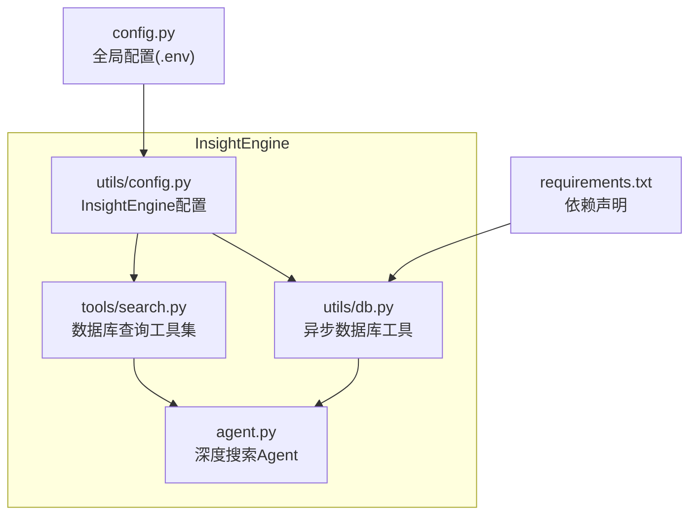
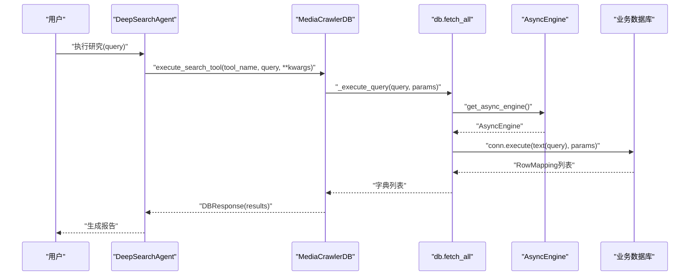
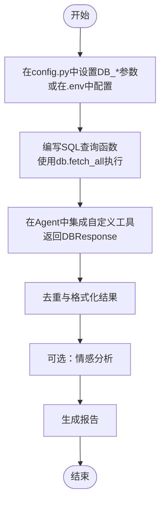
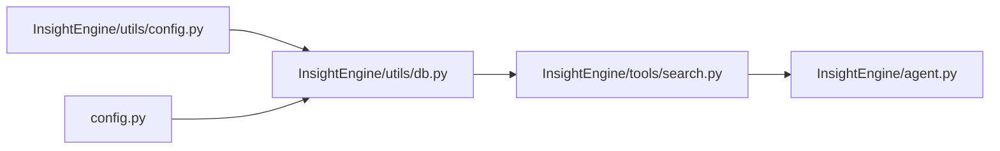

# 接入自定义业务数据库

<cite>
**本文引用的文件**
- [config.py](file://config.py)
- [InsightEngine/utils/db.py](file://InsightEngine/utils/db.py)
- [InsightEngine/utils/config.py](file://InsightEngine/utils/config.py)
- [InsightEngine/tools/search.py](file://InsightEngine/tools/search.py)
- [InsightEngine/agent.py](file://InsightEngine/agent.py)
- [requirements.txt](file://requirements.txt)
</cite>

## 目录
1. [简介](#简介)
2. [项目结构](#项目结构)
3. [核心组件](#核心组件)
4. [架构总览](#架构总览)
5. [详细组件分析](#详细组件分析)
6. [依赖分析](#依赖分析)
7. [性能考虑](#性能考虑)
8. [故障排查指南](#故障排查指南)
9. [结论](#结论)
10. [附录](#附录)

## 简介
本指南面向希望将BettaFish InsightEngine模块接入自有业务数据库的开发者。内容涵盖：
- 在根目录配置文件中设置数据库连接参数（包括环境变量与.env文件）
- 在InsightEngine/utils/db.py中定义数据访问函数或ORM模型
- 以“客户反馈”为例，演示如何编写查询函数并集成到InsightEngine分析流程
- 数据安全与连接池最佳实践
- 数据库方言（dialect）兼容性问题与解决方案

## 项目结构
InsightEngine模块采用“配置-工具-分析流程”的分层组织方式：
- 配置层：InsightEngine/utils/config.py（InsightEngine专用）与根目录config.py（全局配置）
- 数据访问层：InsightEngine/utils/db.py（异步数据库工具）
- 工具层：InsightEngine/tools/search.py（媒体舆情数据库查询工具集）
- 分析流程：InsightEngine/agent.py（深度搜索Agent，调度工具与LLM）

图表来源
- [InsightEngine/utils/config.py](file://InsightEngine/utils/config.py#L1-L45)
- [InsightEngine/utils/db.py](file://InsightEngine/utils/db.py#L1-L73)
- [InsightEngine/tools/search.py](file://InsightEngine/tools/search.py#L1-L120)
- [InsightEngine/agent.py](file://InsightEngine/agent.py#L1-L120)
- [config.py](file://config.py#L1-L126)
- [requirements.txt](file://requirements.txt#L34-L41)

章节来源
- [InsightEngine/utils/config.py](file://InsightEngine/utils/config.py#L1-L45)
- [InsightEngine/utils/db.py](file://InsightEngine/utils/db.py#L1-L73)
- [InsightEngine/tools/search.py](file://InsightEngine/tools/search.py#L1-L120)
- [InsightEngine/agent.py](file://InsightEngine/agent.py#L1-L120)
- [config.py](file://config.py#L1-L126)
- [requirements.txt](file://requirements.txt#L34-L41)

## 核心组件
- 全局配置（根目录config.py）：提供DB_DIALECT、DB_HOST、DB_PORT、DB_USER、DB_PASSWORD、DB_NAME、DB_CHARSET等字段，支持从.env文件与环境变量自动加载。
- InsightEngine配置（InsightEngine/utils/config.py）：提供InsightEngine专用的DB_*字段与默认值，供InsightEngine内部工具使用。
- 异步数据库工具（InsightEngine/utils/db.py）：基于SQLAlchemy 2.x异步引擎，支持MySQL与PostgreSQL，内置连接池与预检机制。
- 数据库查询工具集（InsightEngine/tools/search.py）：封装热点内容、话题搜索、按日期搜索、评论提取、平台定向搜索等工具，统一返回结构化结果。
- 深度搜索Agent（InsightEngine/agent.py）：编排LLM与数据库工具，将查询结果转化为报告。

章节来源
- [config.py](file://config.py#L23-L40)
- [InsightEngine/utils/config.py](file://InsightEngine/utils/config.py#L13-L44)
- [InsightEngine/utils/db.py](file://InsightEngine/utils/db.py#L28-L73)
- [InsightEngine/tools/search.py](file://InsightEngine/tools/search.py#L63-L120)
- [InsightEngine/agent.py](file://InsightEngine/agent.py#L28-L79)

## 架构总览
InsightEngine通过统一的配置与异步数据库工具，将业务数据库无缝接入分析流程。Agent在执行搜索工具时，工具内部调用异步查询函数，返回结构化结果，再由Agent进行去重、情感分析与报告生成。

图表来源
- [InsightEngine/agent.py](file://InsightEngine/agent.py#L105-L170)
- [InsightEngine/tools/search.py](file://InsightEngine/tools/search.py#L78-L120)
- [InsightEngine/utils/db.py](file://InsightEngine/utils/db.py#L49-L73)

## 详细组件分析

### 1. 配置与连接参数设置
- 在根目录config.py中，DB_DIALECT、DB_HOST、DB_PORT、DB_USER、DB_PASSWORD、DB_NAME、DB_CHARSET等字段定义了数据库连接参数。InsightEngine内部也有一套InsightEngine/utils/config.py的配置，两者可并存。
- InsightEngine/utils/db.py会优先读取InsightEngine/utils/config.py中的settings，若未设置，则回退到根目录config.py的settings（通过app.py的读取逻辑）。
- 若需直接使用完整连接串，可设置环境变量DATABASE_URL，db.py会直接采用该URL。

最佳实践
- 使用.env文件存放敏感信息，避免硬编码
- 明确DB_DIALECT（mysql或postgresql），确保驱动与方言匹配
- 如需自定义业务数据库，可在根目录config.py中新增BUSINESS_DB_*字段，并在应用侧读取

章节来源
- [config.py](file://config.py#L23-L40)
- [InsightEngine/utils/config.py](file://InsightEngine/utils/config.py#L13-L28)
- [InsightEngine/utils/db.py](file://InsightEngine/utils/db.py#L28-L47)
- [app.py](file://app.py#L83-L115)

### 2. 数据访问函数与ORM模型定义
- InsightEngine/utils/db.py提供异步数据库工具：
  - get_async_engine：创建并缓存AsyncEngine，开启pool_pre_ping与pool_recycle
  - fetch_all：执行只读查询并返回字典列表
- 该模块不定义数据模型，适合直接执行SQL或配合ORM使用
- 如需自定义业务模型，建议在业务侧单独定义ORM模型文件，避免与InsightEngine内部模型耦合

章节来源
- [InsightEngine/utils/db.py](file://InsightEngine/utils/db.py#L49-L73)

### 3. 示例：接入“客户反馈”业务表
假设你有一个名为customer_feedback的MySQL表，包含字段：id、product_id、content、created_at、rating等。目标是：
- 在InsightEngine中编写查询函数，按产品ID检索客户反馈
- 将查询结果集成到InsightEngine的分析流程中

步骤
- 在业务侧新增数据访问函数（例如在InsightEngine/tools目录下新增custom_db_tool.py），使用db.fetch_all执行SQL查询
- 在InsightEngine/agent.py中扩展工具调用，将自定义查询结果纳入DBResponse结构
- 在Agent的搜索流程中，调用自定义工具并参与去重与情感分析

图表来源
- [InsightEngine/utils/db.py](file://InsightEngine/utils/db.py#L61-L73)
- [InsightEngine/tools/search.py](file://InsightEngine/tools/search.py#L38-L77)
- [InsightEngine/agent.py](file://InsightEngine/agent.py#L105-L170)

章节来源
- [InsightEngine/utils/db.py](file://InsightEngine/utils/db.py#L61-L73)
- [InsightEngine/tools/search.py](file://InsightEngine/tools/search.py#L38-L77)
- [InsightEngine/agent.py](file://InsightEngine/agent.py#L105-L170)

### 4. 数据库方言（dialect）兼容性
- InsightEngine/utils/db.py根据DB_DIALECT选择驱动：
  - mysql+aiomysql（默认）
  - postgresql+asyncpg（当DB_DIALECT为postgresql或postgres时）
- 工具层（InsightEngine/tools/search.py）在拼接SQL时，会根据DB_DIALECT对字段名使用反引号或双引号进行包装，避免语法差异导致的错误
- 若使用其他方言（如sqlite），需自行在业务侧补充对应驱动与连接逻辑

章节来源
- [InsightEngine/utils/db.py](file://InsightEngine/utils/db.py#L28-L47)
- [InsightEngine/tools/search.py](file://InsightEngine/tools/search.py#L187-L192)

### 5. 数据安全与连接池最佳实践
- 连接池配置
  - pool_pre_ping：连接前校验，提升连接稳定性
  - pool_recycle：连接回收周期，避免长时间占用导致的连接失效
- 密码转义
  - db.py会对密码进行URL转义，降低特殊字符带来的连接风险
- 环境变量优先
  - 可通过DATABASE_URL直接注入完整连接串，便于在不同环境灵活切换
- 依赖声明
  - requirements.txt中包含SQLAlchemy 2.x、asyncpg、aiomysql等关键依赖，确保异步驱动可用

章节来源
- [InsightEngine/utils/db.py](file://InsightEngine/utils/db.py#L49-L58)
- [InsightEngine/utils/db.py](file://InsightEngine/utils/db.py#L36-L40)
- [requirements.txt](file://requirements.txt#L34-L41)

## 依赖分析
- InsightEngine/tools/search.py依赖InsightEngine/utils/db.py的fetch_all进行异步查询
- InsightEngine/agent.py依赖MediaCrawlerDB工具集，间接依赖数据库工具
- 根目录config.py与InsightEngine/utils/config.py分别提供全局与引擎专属配置，db.py会优先读取InsightEngine配置

图表来源
- [InsightEngine/utils/config.py](file://InsightEngine/utils/config.py#L13-L44)
- [InsightEngine/utils/db.py](file://InsightEngine/utils/db.py#L15-L23)
- [InsightEngine/tools/search.py](file://InsightEngine/tools/search.py#L30-L36)
- [InsightEngine/agent.py](file://InsightEngine/agent.py#L23-L31)

章节来源
- [InsightEngine/utils/config.py](file://InsightEngine/utils/config.py#L13-L44)
- [InsightEngine/utils/db.py](file://InsightEngine/utils/db.py#L15-L23)
- [InsightEngine/tools/search.py](file://InsightEngine/tools/search.py#L30-L36)
- [InsightEngine/agent.py](file://InsightEngine/agent.py#L23-L31)

## 性能考虑
- 异步查询：使用SQLAlchemy 2.x异步引擎，避免阻塞，提升并发能力
- 连接池：合理设置pool_pre_ping与pool_recycle，减少连接失效与重建成本
- 查询优化：在业务侧尽量使用索引字段进行过滤，避免全表扫描
- 结果限制：在工具层与Agent层均有限制参数，避免一次性返回过多数据

## 故障排查指南
常见问题与解决思路
- 连接失败
  - 检查DB_DIALECT与驱动是否匹配（mysql+aiomysql或postgresql+asyncpg）
  - 确认DB_HOST、DB_PORT、DB_USER、DB_PASSWORD、DB_NAME正确
  - 若使用DATABASE_URL，确认URL格式与转义正确
- 字段名报错
  - 确认DB_DIALECT设置正确，工具层会根据方言对字段名进行包装
- 性能问题
  - 检查pool_pre_ping与pool_recycle配置
  - 适当增加LIMIT参数，减少结果集规模
- 依赖缺失
  - 确认requirements.txt中SQLAlchemy、asyncpg、aiomysql等依赖已安装

章节来源
- [InsightEngine/utils/db.py](file://InsightEngine/utils/db.py#L28-L47)
- [InsightEngine/tools/search.py](file://InsightEngine/tools/search.py#L187-L192)
- [requirements.txt](file://requirements.txt#L34-L41)

## 结论
通过在根目录config.py中设置数据库连接参数，在InsightEngine/utils/db.py中使用异步查询工具，并在InsightEngine/tools/search.py与InsightEngine/agent.py中进行集成，即可将自有业务数据库无缝接入BettaFish InsightEngine分析流程。遵循连接池与安全最佳实践，结合方言兼容性处理，可获得稳定高效的数据库访问体验。

## 附录
- 参考实现路径
  - [InsightEngine/utils/db.py](file://InsightEngine/utils/db.py#L49-L73)
  - [InsightEngine/tools/search.py](file://InsightEngine/tools/search.py#L78-L120)
  - [InsightEngine/agent.py](file://InsightEngine/agent.py#L105-L170)
  - [config.py](file://config.py#L23-L40)
  - [requirements.txt](file://requirements.txt#L34-L41)