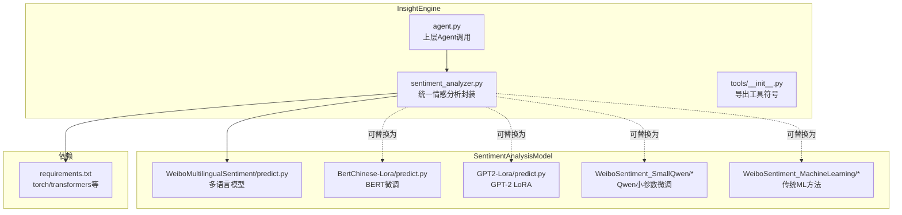
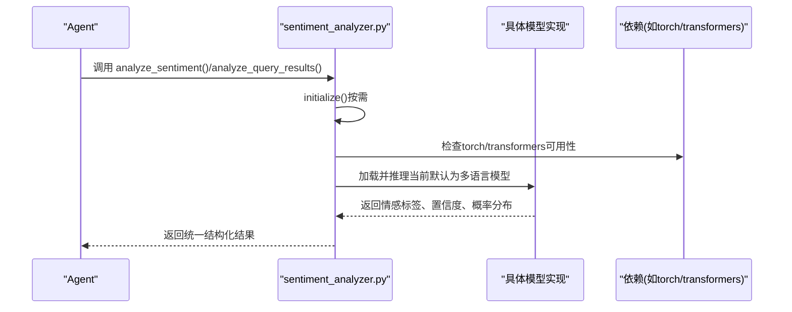
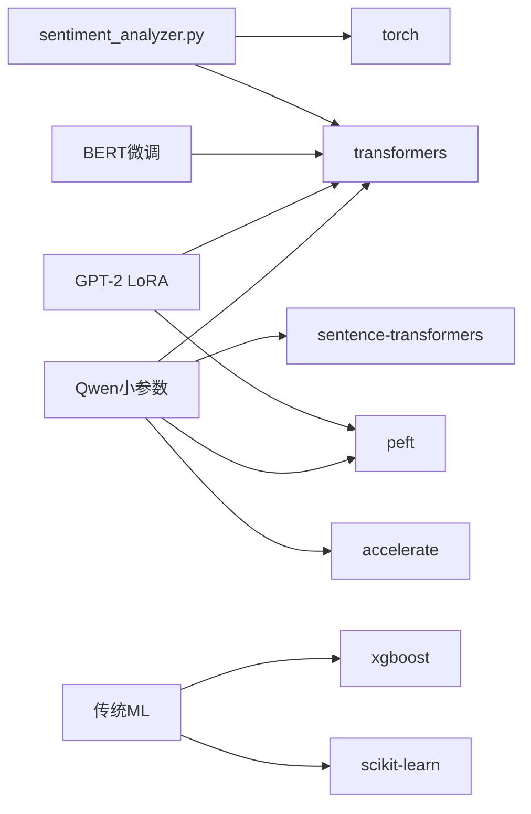

# 更改情感分析模型

<cite>
**本文引用的文件**
- [InsightEngine/tools/sentiment_analyzer.py](file://InsightEngine/tools/sentiment_analyzer.py)
- [InsightEngine/agent.py](file://InsightEngine/agent.py)
- [InsightEngine/tools/__init__.py](file://InsightEngine/tools/__init__.py)
- [requirements.txt](file://requirements.txt)
- [SentimentAnalysisModel/WeiboMultilingualSentiment/predict.py](file://SentimentAnalysisModel/WeiboMultilingualSentiment/predict.py)
- [SentimentAnalysisModel/WeiboSentiment_Finetuned/BertChinese-Lora/predict.py](file://SentimentAnalysisModel/WeiboSentiment_Finetuned/BertChinese-Lora/predict.py)
- [SentimentAnalysisModel/WeiboSentiment_Finetuned/GPT2-Lora/predict.py](file://SentimentAnalysisModel/WeiboSentiment_Finetuned/GPT2-Lora/predict.py)
- [SentimentAnalysisModel/WeiboSentiment_SmallQwen/readme.md](file://SentimentAnalysisModel/WeiboSentiment_SmallQwen/readme.md)
- [SentimentAnalysisModel/WeiboSentiment_SmallQwen/requirements.txt](file://SentimentAnalysisModel/WeiboSentiment_SmallQwen/requirements.txt)
- [SentimentAnalysisModel/WeiboSentiment_Finetuned/GPT2-Lora/requirements.txt](file://SentimentAnalysisModel/WeiboSentiment_Finetuned/GPT2-Lora/requirements.txt)
- [SentimentAnalysisModel/WeiboSentiment_MachineLearning/requirements.txt](file://SentimentAnalysisModel/WeiboSentiment_MachineLearning/requirements.txt)
- [README.md](file://README.md)
</cite>

## 目录
1. [简介](#简介)
2. [项目结构](#项目结构)
3. [核心组件](#核心组件)
4. [架构总览](#架构总览)
5. [详细组件分析](#详细组件分析)
6. [依赖关系分析](#依赖关系分析)
7. [性能考虑](#性能考虑)
8. [故障排查指南](#故障排查指南)
9. [结论](#结论)
10. [附录](#附录)

## 简介
本指南面向开发者，帮助你在 BettaFish 系统中切换与配置不同的情感分析模型。重点围绕 InsightEngine 的情感分析工具，解析其当前默认模型（多语言情感分析）以及可替换的模型族系（BERT 微调、GPT-2 LoRA、Qwen 小参数微调、传统机器学习方法）。文档将说明：
- 如何在不改变上层 Agent 逻辑的前提下更换底层模型；
- 每种模型的适用场景、性能特点与资源需求；
- 修改默认模型类型的步骤与注意事项；
- 如何确保新模型所需依赖已正确安装；
- 模型预测接口的统一性保障。

## 项目结构
与情感分析相关的关键位置如下：
- InsightEngine/tools/sentiment_analyzer.py：统一的情感分析入口与封装，当前默认使用多语言情感分析模型；
- InsightEngine/agent.py：上层 Agent 在搜索与总结流程中调用情感分析；
- InsightEngine/tools/__init__.py：导出情感分析相关符号；
- SentimentAnalysisModel/*：多套可选模型实现（多语言、BERT 微调、GPT-2 LoRA、Qwen 小参数、ML 方法）；
- requirements.txt：项目整体依赖（包含 PyTorch、Transformers 等）。

图表来源
- [InsightEngine/tools/sentiment_analyzer.py](file://InsightEngine/tools/sentiment_analyzer.py#L1-L120)
- [InsightEngine/agent.py](file://InsightEngine/agent.py#L1-L120)
- [requirements.txt](file://requirements.txt#L60-L67)

章节来源
- [InsightEngine/tools/sentiment_analyzer.py](file://InsightEngine/tools/sentiment_analyzer.py#L1-L120)
- [InsightEngine/agent.py](file://InsightEngine/agent.py#L1-L120)
- [requirements.txt](file://requirements.txt#L60-L67)

## 核心组件
- WeiboMultilingualSentimentAnalyzer：当前默认的情感分析器，封装了多语言情感分析模型，负责初始化、设备选择、单条/批量/查询结果分析、结果结构化输出等。
- analyze_sentiment/enable/disable 辅助函数：对外暴露的便捷接口。
- Agent 的情感分析集成点：在搜索工具链中自动触发情感分析，或通过独立工具调用。

章节来源
- [InsightEngine/tools/sentiment_analyzer.py](file://InsightEngine/tools/sentiment_analyzer.py#L592-L637)
- [InsightEngine/agent.py](file://InsightEngine/agent.py#L120-L180)
- [InsightEngine/tools/__init__.py](file://InsightEngine/tools/__init__.py#L1-L39)

## 架构总览
下图展示了从 Agent 到情感分析器再到具体模型的调用链路，以及可替换的模型族系。

图表来源
- [InsightEngine/agent.py](file://InsightEngine/agent.py#L266-L310)
- [InsightEngine/tools/sentiment_analyzer.py](file://InsightEngine/tools/sentiment_analyzer.py#L158-L241)

## 详细组件分析

### 当前默认模型：多语言情感分析
- 模型来源与加载：默认使用多语言情感分析模型，支持从本地缓存或在线下载；初始化后自动选择 CUDA/MPS/CPU 设备。
- 推理流程：文本预处理 -> 分词编码 -> 移动到设备 -> 前向推理 -> softmax -> 构造结果。
- 结果结构：单条/批量/查询结果分析均返回统一的数据类，便于上层 Agent 无差别消费。
- 适用场景：多语言文本、通用情感二分类或多级分类（5级）；对跨语言场景友好。
- 性能与资源：依赖 Transformers 和 Torch；GPU 优先；首次加载会下载并缓存模型。

章节来源
- [InsightEngine/tools/sentiment_analyzer.py](file://InsightEngine/tools/sentiment_analyzer.py#L158-L241)
- [SentimentAnalysisModel/WeiboMultilingualSentiment/predict.py](file://SentimentAnalysisModel/WeiboMultilingualSentiment/predict.py#L1-L120)

### 可替换模型族系

#### 1) BERT 微调（中文场景）
- 实现位置：SentimentAnalysisModel/WeiboSentiment_Finetuned/BertChinese-Lora/predict.py
- 特点：针对中文微博场景的微调模型，二分类（正/负）。
- 依赖：Transformers、Torch；Tokenizer 与基础模型分离。
- 适用场景：中文社交媒体文本、微博风格强的评论/帖子。
- 资源需求：与多语言模型类似，需 GPU 加速更佳。

章节来源
- [SentimentAnalysisModel/WeiboSentiment_Finetuned/BertChinese-Lora/predict.py](file://SentimentAnalysisModel/WeiboSentiment_Finetuned/BertChinese-Lora/predict.py#L1-L90)

#### 2) GPT-2 LoRA 微调（中文场景）
- 实现位置：SentimentAnalysisModel/WeiboSentiment_Finetuned/GPT2-Lora/predict.py
- 特点：基于 GPT2 的 LoRA 微调，二分类；需要加载基础模型与 LoRA 权重。
- 依赖：Transformers、PEFT、Torch；显存要求较高。
- 适用场景：中文长文本、上下文敏感的复杂情感表达。
- 资源需求：显存要求高于 Embedding 分类头方案；适合有 GPU 的环境。

章节来源
- [SentimentAnalysisModel/WeiboSentiment_Finetuned/GPT2-Lora/predict.py](file://SentimentAnalysisModel/WeiboSentiment_Finetuned/GPT2-Lora/predict.py#L1-L107)
- [SentimentAnalysisModel/WeiboSentiment_Finetuned/GPT2-Lora/requirements.txt](file://SentimentAnalysisModel/WeiboSentiment_Finetuned/GPT2-Lora/requirements.txt#L1-L10)

#### 3) Qwen 小参数微调（多尺寸）
- 实现位置：SentimentAnalysisModel/WeiboSentiment_SmallQwen/*
- 特点：提供 Embedding + 分类头 与 LoRA 微调两种路径；支持 0.6B/4B/8B 尺寸；README 对两者优劣进行了对比。
- 依赖：Transformers、PEFT、Datasets、Accelerate、Sentence-Transformers、BitsAndBytes 等。
- 适用场景：资源受限但希望获得较好效果的场景；LoRA 微调通常性能更优。
- 资源需求：0.6B 显存需求最低，8B 需要更大显存；LoRA 微调推理速度较慢但效果更好。

章节来源
- [SentimentAnalysisModel/WeiboSentiment_SmallQwen/readme.md](file://SentimentAnalysisModel/WeiboSentiment_SmallQwen/readme.md#L1-L98)
- [SentimentAnalysisModel/WeiboSentiment_SmallQwen/requirements.txt](file://SentimentAnalysisModel/WeiboSentiment_SmallQwen/requirements.txt#L1-L11)

#### 4) 传统机器学习方法（多算法）
- 实现位置：SentimentAnalysisModel/WeiboSentiment_MachineLearning/*
- 特点：支持朴素贝叶斯、SVM、XGBoost、LSTM、BERT（自定义）等；可通过命令行选择模型类型。
- 适用场景：轻量部署、快速验证、规则/特征主导的场景。
- 资源需求：相对较低，CPU 即可运行；训练阶段需要一定算力。

章节来源
- [SentimentAnalysisModel/WeiboSentiment_MachineLearning/requirements.txt](file://SentimentAnalysisModel/WeiboSentiment_MachineLearning/requirements.txt#L1-L9)

### 模型切换与配置要点
- 当前默认模型类型：在 WeiboMultilingualSentimentAnalyzer 中硬编码为多语言模型（参见初始化逻辑）。
- 切换思路：
  - 方案A（推荐）：新增一个可插拔的工厂/适配器，将“模型类型”参数化，使上层仅依赖抽象接口，底层可自由切换。
  - 方案B（快速替换）：直接修改默认模型加载路径与初始化逻辑，但需同步更新依赖与设备选择策略。
- 关键接口统一性：
  - 单条分析：analyze_single_text
  - 批量分析：analyze_batch
  - 查询结果分析：analyze_query_results
  - 全局便捷函数：analyze_sentiment
- 上层 Agent 无感知切换：
  - Agent 通过统一接口调用情感分析，无需关心底层模型细节；
  - 若采用工厂/适配器模式，只需替换注入的实现即可。

章节来源
- [InsightEngine/tools/sentiment_analyzer.py](file://InsightEngine/tools/sentiment_analyzer.py#L261-L429)
- [InsightEngine/agent.py](file://InsightEngine/agent.py#L266-L310)

## 依赖关系分析
- 运行时依赖：PyTorch、Transformers（requirements.txt 中已声明）。
- 模型依赖：不同模型族系可能引入额外依赖（如 PEFT、Accelerate、Sentence-Transformers 等），需按需安装。
- 设备选择：自动检测 CUDA/MPS/CPU，优先 GPU。

图表来源
- [requirements.txt](file://requirements.txt#L60-L67)
- [SentimentAnalysisModel/WeiboSentiment_SmallQwen/requirements.txt](file://SentimentAnalysisModel/WeiboSentiment_SmallQwen/requirements.txt#L1-L11)
- [SentimentAnalysisModel/WeiboSentiment_Finetuned/GPT2-Lora/requirements.txt](file://SentimentAnalysisModel/WeiboSentiment_Finetuned/GPT2-Lora/requirements.txt#L1-L10)
- [SentimentAnalysisModel/WeiboSentiment_MachineLearning/requirements.txt](file://SentimentAnalysisModel/WeiboSentiment_MachineLearning/requirements.txt#L1-L9)

章节来源
- [requirements.txt](file://requirements.txt#L60-L67)
- [SentimentAnalysisModel/WeiboSentiment_SmallQwen/requirements.txt](file://SentimentAnalysisModel/WeiboSentiment_SmallQwen/requirements.txt#L1-L11)
- [SentimentAnalysisModel/WeiboSentiment_Finetuned/GPT2-Lora/requirements.txt](file://SentimentAnalysisModel/WeiboSentiment_Finetuned/GPT2-Lora/requirements.txt#L1-L10)
- [SentimentAnalysisModel/WeiboSentiment_MachineLearning/requirements.txt](file://SentimentAnalysisModel/WeiboSentiment_MachineLearning/requirements.txt#L1-L9)

## 性能考虑
- 设备选择：优先使用 GPU（CUDA/MPS），无 GPU 时回退 CPU；GPU 可显著提升推理速度。
- 模型规模：多语言模型体积较大，首次加载耗时；BERT/GPT-2 LoRA/Qwen 小参数模型在显存与推理速度上有不同权衡。
- 批处理：批量分析可减少设备切换开销；注意内存峰值。
- 依赖安装：仅安装实际使用的模型族系依赖，避免冗余占用。

[本节为通用建议，不直接分析具体文件]

## 故障排查指南
- 依赖缺失：当 torch 或 transformers 未安装时，情感分析器会被禁用；检查 requirements.txt 并重新安装。
- 设备不可用：若未检测到可用设备，初始化会失败；确认驱动与 CUDA/MPS 可用。
- 模型下载失败：多语言模型首次加载需联网下载；检查网络或代理设置。
- 上层调用异常：Agent 在情感分析失败时会返回透传结果，检查 error_message 字段定位问题。

章节来源
- [InsightEngine/tools/sentiment_analyzer.py](file://InsightEngine/tools/sentiment_analyzer.py#L103-L141)
- [InsightEngine/tools/sentiment_analyzer.py](file://InsightEngine/tools/sentiment_analyzer.py#L158-L241)
- [InsightEngine/agent.py](file://InsightEngine/agent.py#L266-L310)

## 结论
- InsightEngine 的情感分析当前默认使用多语言模型，具备良好的跨语言能力与统一接口。
- 通过新增工厂/适配器模式，可将“模型类型”参数化，从而在不改动上层 Agent 的前提下灵活切换至 BERT 微调、GPT-2 LoRA、Qwen 小参数微调或传统 ML 方法。
- 切换时需关注依赖差异与资源开销，并确保依赖正确安装与设备可用。

[本节为总结，不直接分析具体文件]

## 附录

### 如何修改默认模型类型（步骤指引）
- 方案A（推荐）：新增一个可插拔的工厂/适配器，将“模型类型”参数化，使上层仅依赖抽象接口，底层可自由切换。
- 方案B（快速替换）：直接修改默认模型加载路径与初始化逻辑（参考当前多语言模型的初始化流程），并同步更新依赖与设备选择策略。
- 依赖安装：根据目标模型族系，补充安装对应 requirements.txt 中的依赖项。

章节来源
- [InsightEngine/tools/sentiment_analyzer.py](file://InsightEngine/tools/sentiment_analyzer.py#L158-L241)
- [README.md](file://README.md#L593-L632)

### 模型族系与适用场景对照
- 多语言情感分析：跨语言、通用场景，适合多语种文本。
- BERT 微调（中文）：中文社交媒体文本，强调中文语义理解。
- GPT-2 LoRA（中文）：中文长文本、上下文敏感场景，性能更优但显存更高。
- Qwen 小参数微调：资源受限但追求效果，LoRA 微调通常更优。
- 传统机器学习：轻量部署、快速验证、特征主导场景。

章节来源
- [SentimentAnalysisModel/WeiboMultilingualSentiment/predict.py](file://SentimentAnalysisModel/WeiboMultilingualSentiment/predict.py#L1-L120)
- [SentimentAnalysisModel/WeiboSentiment_Finetuned/BertChinese-Lora/predict.py](file://SentimentAnalysisModel/WeiboSentiment_Finetuned/BertChinese-Lora/predict.py#L1-L90)
- [SentimentAnalysisModel/WeiboSentiment_Finetuned/GPT2-Lora/predict.py](file://SentimentAnalysisModel/WeiboSentiment_Finetuned/GPT2-Lora/predict.py#L1-L107)
- [SentimentAnalysisModel/WeiboSentiment_SmallQwen/readme.md](file://SentimentAnalysisModel/WeiboSentiment_SmallQwen/readme.md#L1-L98)
- [SentimentAnalysisModel/WeiboSentiment_MachineLearning/requirements.txt](file://SentimentAnalysisModel/WeiboSentiment_MachineLearning/requirements.txt#L1-L9)