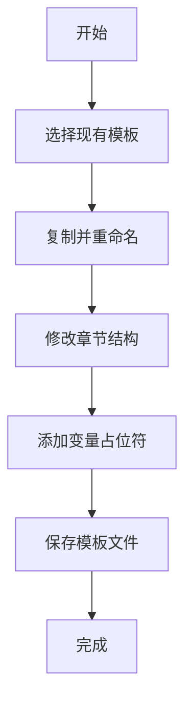
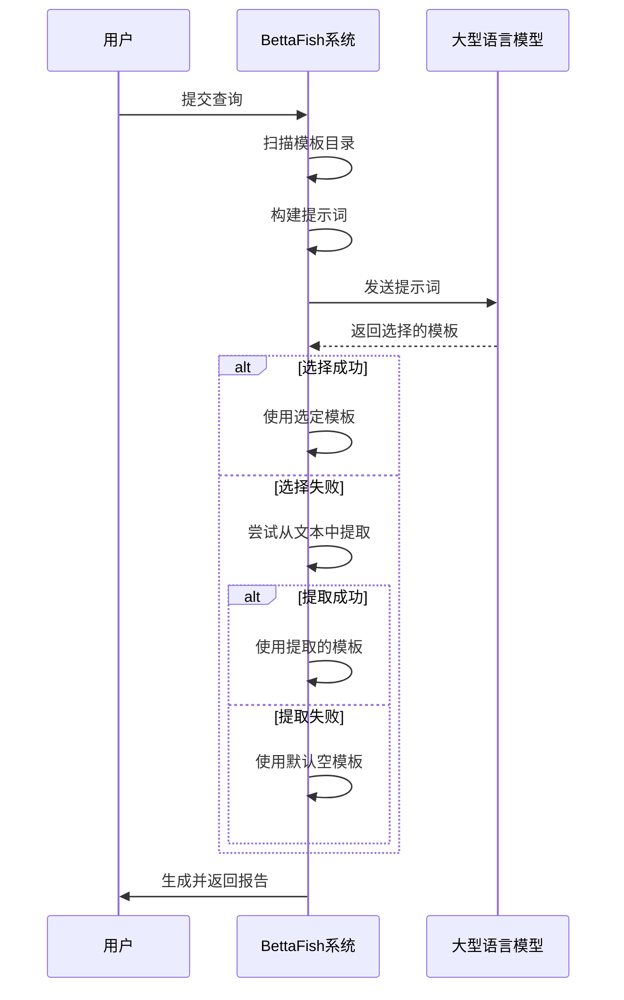

# 自定义报告模板

<cite>
**本文档引用的文件**   
- [ReportEngine/report_template/日常或定期舆情监测报告模板.md](file://ReportEngine/report_template/日常或定期舆情监测报告模板.md)
- [ReportEngine/report_template/企业品牌声誉分析报告模板.md](file://ReportEngine/report_template/企业品牌声誉分析报告模板.md)
- [ReportEngine/report_template/特定政策或行业动态舆情分析报告模板.md](file://ReportEngine/report_template/特定政策或行业动态舆情分析报告模板.md)
- [ReportEngine/report_template/社会公共热点事件分析报告模板.md](file://ReportEngine/report_template/社会公共热点事件分析报告模板.md)
- [ReportEngine/report_template/突发事件与危机公关舆情报告模板.md](file://ReportEngine/report_template/突发事件与危机公关舆情报告模板.md)
- [ReportEngine/nodes/template_selection_node.py](file://ReportEngine/nodes/template_selection_node.py)
- [ReportEngine/core/template_parser.py](file://ReportEngine/core/template_parser.py)
- [ReportEngine/flask_interface.py](file://ReportEngine/flask_interface.py)
- [ReportEngine/prompts/prompts.py](file://ReportEngine/prompts/prompts.py)
</cite>

## 目录
1. [引言](#引言)
2. [报告模板目录的作用](#报告模板目录的作用)
3. [创建自定义报告模板](#创建自定义报告模板)
4. [模板中的变量占位符与Markdown语法](#模板中的变量占位符与markdown语法)
5. [创建新产品上市舆情分析报告模板示例](#创建新产品上市舆情分析报告模板示例)
6. [模板的自动选择机制](#模板的自动选择机制)

## 引言
BettaFish系统提供了一套强大的自定义报告模板功能，允许用户根据特定需求创建和使用个性化的报告结构。本说明文档将详细介绍如何在`ReportEngine/report_template/`目录下创建和管理自定义报告模板，包括模板的命名、结构设计、变量使用以及系统如何在运行时自动选择最匹配的模板。

## 报告模板目录的作用

`ReportEngine/report_template/`目录是BettaFish系统中所有报告模板的集中存放地。该目录下的每一个`.md`文件都代表一种特定类型的报告模板，其文件名即为该模板的名称。系统通过读取此目录下的文件来提供模板选择和内容生成的基础。

该目录的设计遵循以下原则：
- **文件格式**：所有模板均以Markdown（`.md`）格式存储，便于编写和维护。
- **文件命名**：文件名直接作为模板名称，应清晰描述报告类型，例如“日常或定期舆情监测报告模板.md”。
- **结构解析**：系统通过`template_parser.py`模块解析模板文件，将其转换为结构化的章节列表，供后续的报告生成流程使用。

**Section sources**
- [ReportEngine/nodes/template_selection_node.py](file://ReportEngine/nodes/template_selection_node.py#L26)
- [ReportEngine/core/template_parser.py](file://ReportEngine/core/template_parser.py#L87)

## 创建自定义报告模板

创建自定义报告模板是一个简单而灵活的过程。用户可以复制一个现有的模板文件，然后根据需要修改其章节结构、提示词（prompts）和格式要求。

### 步骤一：选择并复制现有模板
首先，从`ReportEngine/report_template/`目录中选择一个与您需求最接近的现有模板。例如，如果您需要创建一个关于新产品上市的报告，可以选择“日常或定期舆情监测报告模板.md”作为起点。

### 步骤二：重命名模板文件
将复制的文件重命名为新的模板名称。例如，将其重命名为“新产品上市舆情分析报告模板.md”。这个新文件名将成为您自定义模板的名称。

### 步骤三：修改模板内容
打开新创建的模板文件，根据您的具体需求修改其内容。您可以添加、删除或重新组织章节，以适应新产品上市的特定分析需求。



**Diagram sources**
- [ReportEngine/report_template/日常或定期舆情监测报告模板.md](file://ReportEngine/report_template/日常或定期舆情监测报告模板.md)

**Section sources**
- [ReportEngine/report_template/日常或定期舆情监测报告模板.md](file://ReportEngine/report_template/日常或定期舆情监测报告模板.md)

## 模板中的变量占位符与Markdown语法

### 变量占位符
在模板中，可以使用变量占位符来动态插入内容。这些占位符在报告生成时会被实际的数据替换。常见的变量占位符包括：
- `{{topic}}`：表示报告的主题或核心话题。
- `{{summary}}`：表示报告的摘要或核心发现。
- `{{date}}`：表示报告生成的日期。

这些变量占位符使得模板更加灵活，能够适应不同的报告需求。

### Markdown语法
模板文件支持标准的Markdown语法，包括但不限于：
- **标题**：使用`#`、`##`等符号创建不同级别的标题。
- **列表**：使用`-`或`*`创建无序列表，使用数字加`.`创建有序列表。
- **加粗和斜体**：使用`**`或`__`创建加粗文本，使用`*`或`_`创建斜体文本。
- **链接和图片**：使用`[文本](URL)`创建链接，使用``插入图片。

通过结合变量占位符和Markdown语法，用户可以创建既美观又功能强大的报告模板。

**Section sources**
- [ReportEngine/core/template_parser.py](file://ReportEngine/core/template_parser.py#L56)
- [ReportEngine/core/template_parser.py](file://ReportEngine/core/template_parser.py#L64)

## 创建新产品上市舆情分析报告模板示例

以下是一个创建“新产品上市舆情分析报告模板”的完整示例。

### 步骤一：复制现有模板
从`ReportEngine/report_template/`目录中复制“日常或定期舆情监测报告模板.md”文件。

### 步骤二：重命名文件
将复制的文件重命名为“新产品上市舆情分析报告模板.md”。

### 步骤三：编辑模板内容
打开新文件，修改其内容如下：

```markdown
### **新产品上市舆情分析报告模板**

- **1.0 产品上市概览**
  - 1.1 上市时间与地点
  - 1.2 核心卖点与市场定位
  - 1.3 预期目标与KPI
- **2.0 市场预热与宣传分析**
  - 2.1 预热活动回顾
  - 2.2 宣传渠道表现
  - 2.3 关键信息传播效果
- **3.0 上市初期舆情动态**
  - 3.1 媒体报道汇总
  - 3.2 社交媒体讨论热度
  - 3.3 用户反馈与评价
- **4.0 竞品对比与市场反应**
  - 4.1 主要竞品动态
  - 4.2 市场份额变化
  - 4.3 消费者偏好分析
- **5.0 风险与机遇评估**
  - 5.1 潜在风险点
  - 5.2 市场机遇
  - 5.3 应对策略建议
- **6.0 总结与后续计划**
  - 6.1 核心结论
  - 6.2 后续市场推广计划
  - 6.3 长期发展建议
```

### 步骤四：保存并测试
保存文件后，您可以在BettaFish系统中选择此模板进行测试，确保其能够正确生成所需的报告。

**Section sources**
- [ReportEngine/report_template/日常或定期舆情监测报告模板.md](file://ReportEngine/report_template/日常或定期舆情监测报告模板.md)

## 模板的自动选择机制

BettaFish系统在运行时会根据用户的查询内容自动选择最匹配的报告模板。这一过程由`template_selection_node.py`中的`TemplateSelectionNode`类负责。

### 选择逻辑
1. **获取可用模板**：系统首先扫描`ReportEngine/report_template/`目录，获取所有可用的模板文件。
2. **构建提示词**：根据用户的查询内容、分析引擎的报告以及论坛日志，构建一个详细的提示词。
3. **调用LLM进行选择**：使用大型语言模型（LLM）分析提示词，并从可用模板中选择最合适的模板。
4. **返回结果**：将选择的模板信息（包括名称、内容和选择理由）返回给报告生成流程。

### 降级策略
如果LLM未能成功选择模板，系统会尝试从文本响应中提取模板名称。如果仍然失败，则会使用一个默认的空模板，让LLM自行设计报告结构。



**Diagram sources**
- [ReportEngine/nodes/template_selection_node.py](file://ReportEngine/nodes/template_selection_node.py#L70)
- [ReportEngine/nodes/template_selection_node.py](file://ReportEngine/nodes/template_selection_node.py#L146)

**Section sources**
- [ReportEngine/nodes/template_selection_node.py](file://ReportEngine/nodes/template_selection_node.py#L63)
- [ReportEngine/nodes/template_selection_node.py](file://ReportEngine/nodes/template_selection_node.py#L71)